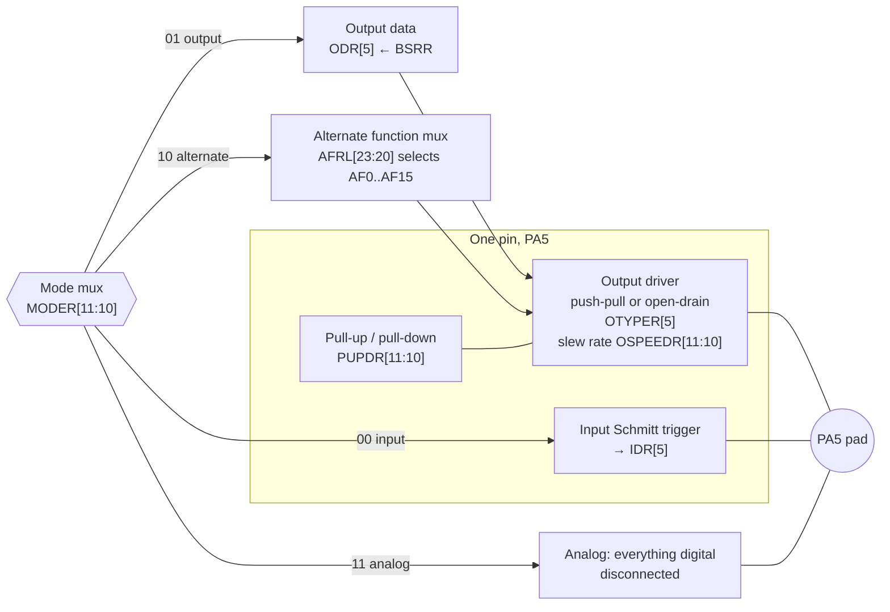

# A GPIO Driver from Scratch

The blink program drove one pin with two `#define`s and it was the right amount of code for one pin. The second pin costs another two, the first alternate-function pin costs four, and by the tenth you have shift arithmetic scattered across the codebase with the pin number written out by hand in each place. The fix is not a HAL. It is about eighty lines that name what the hardware already does.

The mental model: **a GPIO pin is a small stack of independent switches, and each register holds one switch for every pin.** There is a mux choosing what drives the pin, a switch choosing push-pull or open-drain, a slew-rate control, a pair of weak pull resistors, and a mux choosing which peripheral gets it in alternate-function mode. The registers are organised *by property*, not by pin — `MODER` holds the mode of all sixteen pins, `PUPDR` the pull of all sixteen — which is why every operation is a shift by the pin number and why a driver that hides that shift is worth writing.



:::info[Prerequisites]
[How a GPIO Pin Really Behaves](../01-hardware-foundations/gpio-electrical-behaviour.md) owns the electrical half — drive strength, input thresholds, what open-drain means on a wire, and why a pull resistor is measured in tens of kilohms. This page is the register half and assumes it. [Register-Level Programming](./register-level-programming.md) supplies the field idioms, and [Your First Bare-Metal Blink](./your-first-bare-metal-blink.md) is the one-pin version of everything here.
:::

## The register set

Ten registers, `0x400` apart per port, base `0x4002 0000` for GPIOA (RM0383 Rev 4 §8.4).

| Offset | Register | Width per pin | What it decides |
|---|---|---|---|
| `0x00` | `MODER` | 2 bits | Input, output, alternate function, or analog |
| `0x04` | `OTYPER` | 1 bit | Push-pull or open-drain (output and AF modes) |
| `0x08` | `OSPEEDR` | 2 bits | Slew rate of the output driver |
| `0x0C` | `PUPDR` | 2 bits | Internal pull-up, pull-down, or neither |
| `0x10` | `IDR` | 1 bit | **Read-only.** The level the input buffer sees |
| `0x14` | `ODR` | 1 bit | The level the output driver is asked to produce |
| `0x18` | `BSRR` | 2 bits (set + reset) | **Write-only.** Atomic set and clear of `ODR` bits |
| `0x1C` | `LCKR` | 1 bit + key | Freezes a pin's configuration until the next reset |
| `0x20`, `0x24` | `AFRL`, `AFRH` | 4 bits | Which of AF0–AF15 owns the pin |

### Mode encodings

These four tables are the whole configuration vocabulary.

| `MODERy[1:0]` | Mode | Effect |
|---|---|---|
| `00` | Input | Schmitt trigger on, readable in `IDR`, output driver off. |
| `01` | General purpose output | Driven from `ODR`. `IDR` still reads the actual pin level. |
| `10` | Alternate function | Owned by the peripheral selected in `AFRL`/`AFRH`. |
| `11` | Analog | Schmitt trigger and output driver both disconnected. Lowest leakage, and required for ADC/DAC pins. |

| `OTYPERy` | Output type | Effect |
|---|---|---|
| `0` | Push-pull | Drives both high and low. The default for an LED, a chip select, a reset line. |
| `1` | Open-drain | Drives low only; high is left to a pull resistor. Required for I²C, and for any line several devices may pull low. |

| `OSPEEDRy[1:0]` | Speed | Notes |
|---|---|---|
| `00` | Low | Slowest edges, least ringing, least EMI. **Correct for LEDs, buttons, chip selects, resets.** |
| `01` | Medium | |
| `10` | Fast | |
| `11` | High | Fastest edges. Needed for fast SPI, SDIO, external memory. Also the setting that turns a long trace into a transmission line — see [Signal Integrity and Noise](../01-hardware-foundations/signal-integrity-and-noise.md). |

| `PUPDRy[1:0]` | Pull | Notes |
|---|---|---|
| `00` | None | Floating in input mode — never leave an unused input here. |
| `01` | Pull-up | Weak, roughly 40 kΩ on this family; check the datasheet for the specified range. |
| `10` | Pull-down | Same order of magnitude. |
| `11` | Reserved | Do not write. |

The speed field deserves one sentence of emphasis because it is set wrongly so often: it controls *slew rate*, not "how fast you can toggle the pin". Selecting `High` on a slow signal does not make anything faster; it makes the edges sharper, which increases overshoot, crosstalk and radiated emissions for no benefit at all. Default to `Low` and raise it only when a timing budget says you must.

### `BSRR` — the atomic one

```wavedrom title="GPIOx_BSRR — write-only; a 1 in the low half sets a pin, a 1 in the high half clears it" alt="Bit-field strip of the 32-bit GPIO bit set/reset register showing BS0 to BS15 in the low half and BR0 to BR15 in the high half, with BS5 and BR5 highlighted"
{ reg: [
    { bits: 1, name: "BS0", type: 4 },
    { bits: 4, name: "BS1-4", type: 4 },
    { bits: 1, name: "BS5", type: 2 },
    { bits: 10, name: "BS6-15", type: 4 },
    { bits: 1, name: "BR0", type: 5 },
    { bits: 4, name: "BR1-4", type: 5 },
    { bits: 1, name: "BR5", type: 3 },
    { bits: 10, name: "BR6-15", type: 5 }
  ],
  config: { hspace: 1000, bits: 32, lanes: 2 }
}
```

| Bits | Field | Access | Reset | Meaning |
|---|---|---|---|---|
| 15:0 | `BS0`…`BS15` | **w** | `0` | Writing `1` to `BSy` sets `ODRy`. Writing `0` has no effect. |
| 31:16 | `BR0`…`BR15` | **w** | `0` | Writing `1` to `BRy` clears `ODRy`. Writing `0` has no effect. |

Read the register and you get `0x0000 0000` regardless of pin state — it is write-only, and `ODR`, not `BSRR`, holds the current output value. If both `BSy` and `BRy` are set in the same write, **`BSy` wins** (RM0383 Rev 4 §8.4.7).

The property that matters: **one store changes exactly the pins whose bits you set, and nothing else.** No read, no modify, no window. Compare the two ways to turn on `PA5`:

```armasm
@ GPIOA->ODR |= (1u << 5);           -- read-modify-write, 3 accesses
        ldr     r3, [r2, #20]        @ load ODR    ← an interrupt here...
        orr     r3, r3, #32
        str     r3, [r2, #20]        @ store ODR   ← ...is lost

@ GPIOA->BSRR = (1u << 5);           -- one access
        mov     r3, #32
        str     r3, [r2, #24]        @ done
```

This is the hardware answer to the read-modify-write race in [What `volatile` Does and Does Not Do](./volatile-and-the-compiler.md). It costs nothing — the `BSRR` form is *smaller* — and it is why a driver should never expose an `ODR`-based write.

One honest limitation: there is no atomic **toggle**. `BSRR` can set and clear, not invert, so a toggle must read `ODR` first and that read-then-write pair is not atomic. The code below shows the standard construction and the comment says so plainly.

## The driver

Two files. No dynamic allocation, no handles, no state — the hardware already holds the state, and duplicating it in RAM is the design mistake that turns a driver into a framework.

```c title="gpio.h"
#ifndef GPIO_H
#define GPIO_H

#include <stdbool.h>
#include <stdint.h>
#include "stm32f4xx.h"

typedef enum {
    GPIO_MODE_INPUT  = 0u,
    GPIO_MODE_OUTPUT = 1u,
    GPIO_MODE_AF     = 2u,
    GPIO_MODE_ANALOG = 3u,
} gpio_mode_t;

typedef enum { GPIO_PUSH_PULL = 0u, GPIO_OPEN_DRAIN = 1u } gpio_otype_t;

typedef enum {
    GPIO_SPEED_LOW = 0u, GPIO_SPEED_MEDIUM = 1u,
    GPIO_SPEED_FAST = 2u, GPIO_SPEED_HIGH = 3u,
} gpio_speed_t;

typedef enum { GPIO_PULL_NONE = 0u, GPIO_PULL_UP = 1u, GPIO_PULL_DOWN = 2u } gpio_pull_t;

typedef struct {
    gpio_mode_t  mode;
    gpio_otype_t otype;   /* ignored unless mode is OUTPUT or AF */
    gpio_speed_t speed;   /* ignored unless mode is OUTPUT or AF */
    gpio_pull_t  pull;
    uint8_t      af;      /* 0..15; ignored unless mode is AF     */
} gpio_config_t;

void gpio_port_enable(const GPIO_TypeDef *port);
void gpio_configure(GPIO_TypeDef *port, uint8_t pin, const gpio_config_t *cfg);

/* Every accessor is a single register access. Header-inline so the call
   disappears entirely at -O1 and above. */

static inline void gpio_set(GPIO_TypeDef *port, uint8_t pin)
{
    port->BSRR = 1u << pin;
}

static inline void gpio_clear(GPIO_TypeDef *port, uint8_t pin)
{
    port->BSRR = 1u << (pin + 16u);
}

static inline void gpio_write(GPIO_TypeDef *port, uint8_t pin, bool level)
{
    port->BSRR = 1u << (level ? pin : pin + 16u);
}

/* Read the PIN, not the ODR. On an open-drain or contended line these differ,
   and the pin is the truth. */
static inline bool gpio_read(const GPIO_TypeDef *port, uint8_t pin)
{
    return ((port->IDR >> pin) & 1u) != 0u;
}

/* NOT atomic: the hardware has no toggle. The BSRR write is a single store,
   but the ODR read before it is a separate access, so two contexts toggling
   the same pin can still interleave. If both an ISR and main toggle a pin,
   give each its own pins or use gpio_set/gpio_clear from a known state. */
static inline void gpio_toggle(GPIO_TypeDef *port, uint8_t pin)
{
    uint32_t odr = port->ODR;
    port->BSRR = ((odr & (1u << pin)) << 16u) | (~odr & (1u << pin));
}

#endif /* GPIO_H */
```

```c title="gpio.c"
#include "gpio.h"

/* Ports are 0x400 apart starting at GPIOA, and bit n of RCC_AHB1ENR enables
   port n. RM0383 Rev 4, Table 1 and section 6.3.9. */
void gpio_port_enable(const GPIO_TypeDef *port)
{
    uint32_t index = ((uint32_t)port - GPIOA_BASE) / 0x400u;

    RCC->AHB1ENR |= 1u << index;
    (void)RCC->AHB1ENR;   /* read-back: the enable takes a cycle to propagate */
}

/* Replace one 2-bit field. Clear then set -- never |=. */
static inline void write_field2(volatile uint32_t *reg, uint8_t pin, uint32_t value)
{
    uint32_t shift = (uint32_t)pin * 2u;
    *reg = (*reg & ~(3u << shift)) | ((value & 3u) << shift);
}

void gpio_configure(GPIO_TypeDef *port, uint8_t pin, const gpio_config_t *cfg)
{
    /* ORDER MATTERS. Everything describing HOW the pin behaves is written
       before MODER hands the pad to the output driver or to a peripheral.
       Set MODER first and the pin drives with the previous pull, type and
       slew settings for as long as the next few instructions take -- a real,
       measurable glitch on a chip select or a reset line. */

    write_field2(&port->PUPDR,   pin, (uint32_t)cfg->pull);
    write_field2(&port->OSPEEDR, pin, (uint32_t)cfg->speed);

    port->OTYPER = (port->OTYPER & ~(1u << pin))
                 | ((uint32_t)cfg->otype << pin);

    if (cfg->mode == GPIO_MODE_AF) {
        /* AFRL covers pins 0-7, AFRH pins 8-15; 4 bits each. AFR[0] and
           AFR[1] in the device header are exactly those two registers. */
        volatile uint32_t *afr = &port->AFR[pin >> 3];
        uint32_t shift = (uint32_t)(pin & 7u) * 4u;
        *afr = (*afr & ~(0xFu << shift))
             | (((uint32_t)cfg->af & 0xFu) << shift);
    }

    write_field2(&port->MODER, pin, (uint32_t)cfg->mode);   /* last */
}
```

Using it:

```c
#define LD2_PORT  GPIOA
#define LD2_PIN   5u

static const gpio_config_t led_cfg = {
    .mode  = GPIO_MODE_OUTPUT,
    .otype = GPIO_PUSH_PULL,
    .speed = GPIO_SPEED_LOW,      /* an LED does not need sharp edges */
    .pull  = GPIO_PULL_NONE,
};

static const gpio_config_t button_cfg = {
    .mode = GPIO_MODE_INPUT,
    .pull = GPIO_PULL_UP,         /* B1 on the Nucleo is a pull-to-ground button */
};

int main(void)
{
    gpio_port_enable(GPIOA);
    gpio_port_enable(GPIOC);
    gpio_configure(LD2_PORT, LD2_PIN, &led_cfg);
    gpio_configure(GPIOC, 13u, &button_cfg);   /* B1 = PC13, UM1724 section 6.5 */

    for (;;) {
        gpio_write(LD2_PORT, LD2_PIN, !gpio_read(GPIOC, 13u));
    }
}
```

Both config structs are `const`, so they live in flash and cost no RAM. Designated initialisers mean an omitted field is zero — which is `GPIO_MODE_INPUT`, `GPIO_PUSH_PULL`, `GPIO_SPEED_LOW`, `GPIO_PULL_NONE`, all safe defaults. That is not an accident; it is worth choosing enum values so the all-zeros struct is the harmless one.

## Alternate functions

Alternate-function mode is where the pin stops being yours and belongs to a peripheral. Two registers have to agree: `MODER` says `10`, and the matching four bits of `AFRL`/`AFRH` say *which* peripheral.

The mapping is fixed in silicon and is not uniform — `PA5` can be `SPI1_SCK` on AF5 or `TIM2_CH1` on AF1, and no other peripheral can reach that pad at all. A representative slice of the F411 mapping (RM0383 Rev 4, Table 9 "Alternate function mapping"):

| AF | Typical peripherals | Example on the Nucleo |
|---|---|---|
| AF0 | `SYS` — MCO, SWD/JTAG | `PA13` = `SWDIO` at reset |
| AF1 | TIM1, TIM2 | `PA5` = `TIM2_CH1` |
| AF2 | TIM3, TIM4, TIM5 | |
| AF4 | I²C1, I²C2, I²C3 | `PB8`/`PB9` = `I2C1_SCL`/`SDA` |
| AF5 | SPI1, SPI2, I²S | `PA5` = `SPI1_SCK` |
| AF7 | USART1, USART2 | `PA2`/`PA3` = `USART2_TX`/`RX`, wired to the ST-LINK virtual COM port |
| AF10 | USB OTG FS | |
| AF15 | `EVENTOUT` | |

```c
static const gpio_config_t spi1_sck_cfg = {
    .mode  = GPIO_MODE_AF,
    .af    = 5u,                  /* AF5 = SPI1 */
    .otype = GPIO_PUSH_PULL,
    .speed = GPIO_SPEED_HIGH,     /* a clock line: sharp edges are the point */
    .pull  = GPIO_PULL_NONE,
};

gpio_configure(GPIOA, 5u, &spi1_sck_cfg);
```

Note that `AFRL`/`AFRH` retain whatever you wrote even while `MODER` says the pin is a plain output — the AF mux is simply not selected. This is why the driver writes `AFR` *before* `MODER`, and it is also why the "which AF number" question is answered by the alternate-function table for your exact package and nowhere else. Guessing costs a board spin; the datasheet's pinout table is package-specific and is the authority when it and the reference manual appear to disagree.

## Locking a configuration

`LCKR` freezes `MODER`, `OTYPER`, `OSPEEDR`, `PUPDR`, `AFRL` and `AFRH` for the selected pins until the next reset, via a specific write sequence: write `LCKK` (bit 16) with the pin mask, write it again with `LCKK` clear, write it again with `LCKK` set, then read it back. Worth knowing exists for a safety-relevant output — a motor enable, a relay — where a wild pointer reconfiguring the pin is a hazard rather than an inconvenience. Not worth using routinely: it is irreversible until reset, which makes field diagnostics harder.

:::warning[Two contexts toggling the same port, and one of them keeps losing]
The bug looks like a flaky pin and is actually a lost write. It is worth understanding in the `ODR` form even if you never write `ODR`, because the same shape reappears wherever a read-modify-write is shared.

`main` toggles a heartbeat LED on `PA5`. An interrupt handler pulses a scope trigger on `PA8`. Both, written naturally, do:

```c
GPIOA->ODR ^= (1u << 5);    /* in main */
GPIOA->ODR ^= (1u << 8);    /* in the ISR */
```

Each expands to load `ODR`, XOR, store `ODR`. If the interrupt lands between `main`'s load and its store, the handler's change to bit 8 is written and then immediately overwritten by `main`'s store of a value read before it happened. `PA8` misses a pulse. Not every time — only when the interrupt lands inside a two-instruction window — so the failure rate scales with interrupt frequency, which is exactly the condition under which you are least likely to be watching.

What makes it expensive is that the pin that misbehaves is **not the pin whose code is wrong**. `main`'s heartbeat is fine. The scope trigger, whose handler is three lines long and obviously correct, is the one dropping pulses. Every instinct sends you to inspect the handler.

The fix is to make each write a single store:

```c
GPIOA->BSRR = 1u << 8;         /* in the ISR: set PA8   */
GPIOA->BSRR = 1u << (8 + 16);  /* in the ISR: clear PA8 */
```

A `str` cannot be interrupted part-way through, and it touches only the bits named. The race is gone — not mitigated, gone — and the code is one instruction shorter.

Three relatives worth recognising, because `BSRR` does not cover all of them:

- **`gpio_toggle` is still not safe**, for the reason its comment states: it reads `ODR` first. Two contexts toggling the *same* pin still race. Either give each context its own pins, or drive from a known state with `gpio_set`/`gpio_clear`.
- **Configuration registers have no `BSRR`.** `MODER`, `PUPDR` and `AFR` are read-modify-write with no atomic alternative. Configure pins once, at startup, before interrupts are enabled — and if you genuinely must reconfigure a pin at runtime while an ISR touches the same port, that needs a critical section.
- **Other peripherals have the same trick under other names.** Many have paired set/clear registers precisely so drivers can avoid this. When one exists, use it; when it does not, that peripheral's registers need the same care as `MODER`.
:::

## See also

- [Your First Bare-Metal Blink](./your-first-bare-metal-blink.md) — the one-pin version, and where `BSRR` first appears.
- [What `volatile` Does and Does Not Do](./volatile-and-the-compiler.md) — the read-modify-write race in general form, and the barriers and atomics for cases `BSRR` cannot solve.
- [Register-Level Programming](./register-level-programming.md) — the field idioms `write_field2` implements, and the two-bit-field bug it prevents.
- [How a GPIO Pin Really Behaves](../01-hardware-foundations/gpio-electrical-behaviour.md) — open-drain, pull resistor values, input thresholds and drive current.
- [CMSIS and Vendor HALs](./cmsis-and-vendor-hals.md) — what ST's LL and HAL layers do with the same registers, for comparison.

## References

- STMicroelectronics — [**RM0383**, *STM32F411xC/E advanced Arm-based 32-bit MCUs reference manual*](https://www.st.com/resource/en/reference_manual/rm0383-stm32f411xce-advanced-armbased-32bit-mcus-stmicroelectronics.pdf), consulted at **Rev 4** (May 2025). §8.3 "GPIO functional description" for the pin structure in the diagram above and the reset states; §8.4.1–§8.4.11 for every register in the table, the `MODER`/`OTYPER`/`OSPEEDR`/`PUPDR` encodings, and §8.4.7 for `BSRR` including the write-only access, the "writing 0 has no effect" rule and `BSy` taking priority over `BRy`; §8.4.8 for the `LCKR` key sequence; Table 9 "Alternate function mapping" for the AF numbers.
- STMicroelectronics — [**DS10314**, *STM32F411xC/STM32F411xE datasheet*](https://www.st.com/resource/en/datasheet/stm32f411re.pdf). The package-specific pinout and alternate-function tables — the authority when the reference manual and the pinout appear to disagree — plus the electrical characteristics for the internal pull-up/pull-down resistance and the output drive current the `OSPEEDR` setting trades against.
- STMicroelectronics — [**UM1724**, *STM32 Nucleo-64 boards (MB1136)*](https://www.st.com/resource/en/user_manual/um1724-stm32-nucleo64-boards-mb1136-stmicroelectronics.pdf), consulted at **Rev 14** (2020). §6.4 for LD2 on `PA5`, §6.5 for the B1 user button on `PC13`, and the ST-LINK virtual COM port on `PA2`/`PA3` used in the alternate-function table.
- Arm — [**Armv7-M Architecture Reference Manual**](https://developer.arm.com/documentation/ddi0403/latest/). §A3.4 for single-copy atomicity of an aligned word store — the architectural property that makes one `str` to `BSRR` uninterruptible, and therefore makes the fix in the warning above actually a fix.
