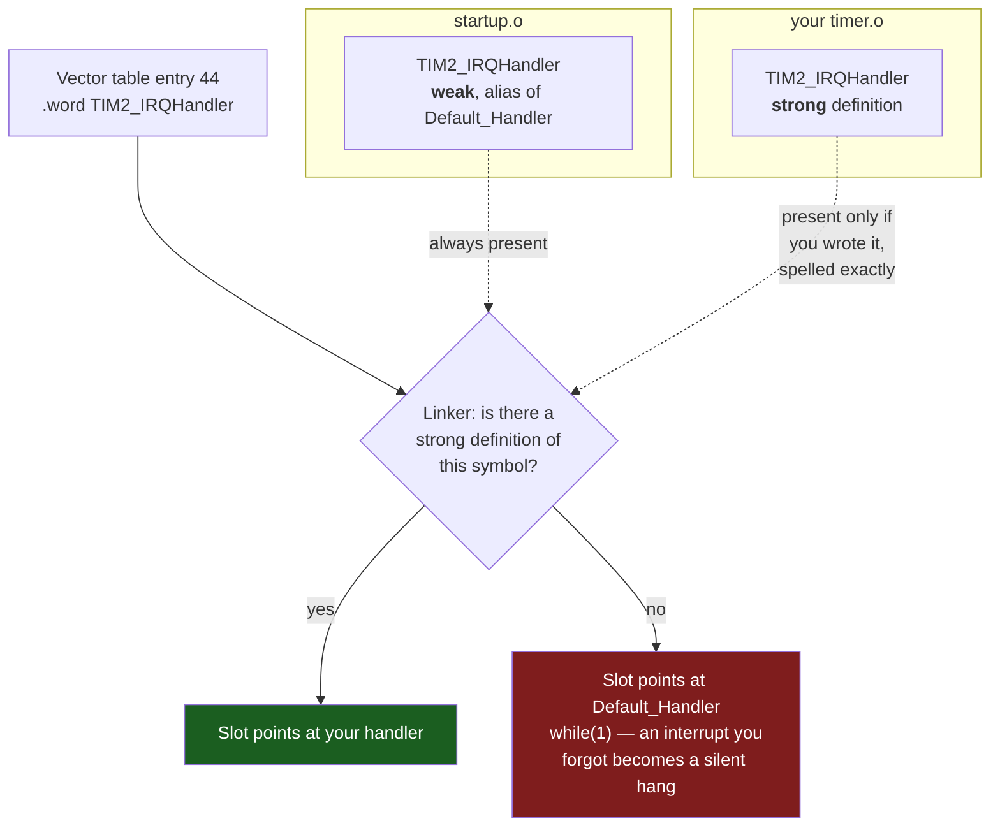

# Writing Interrupt Handlers in C

An interrupt handler is the only function in your program that nothing calls. You write it, you never reference it, and yet it runs — sometimes millions of times a second, at a moment you did not choose, on top of whatever the main program happened to be doing. That inversion is the whole difficulty. Every rule below follows from it: you cannot pass arguments to something nobody calls, you cannot return a value to nobody, and you cannot assume anything about the state of the code you interrupted.

The mental model: **a handler is a function whose caller is the hardware, whose linkage is a table entry, and whose contract is "finish quickly and leave the machine as you found it."** On Cortex-M the hardware does more of that work for you than on almost any other architecture — it stacks the caller-saved registers itself, so a plain C function with no arguments and no return value is already a legal handler. What the hardware does not do is remember which handler you meant. That connection is made once, at link time, by a name.

:::info[Prerequisites]
[Exceptions and the Vector Table](../02-processor-architecture/exceptions-and-the-vector-table.md) covers what the hardware does on entry and exit — the stack frame it pushes, `EXC_RETURN`, and the table itself. [The NVIC](../02-processor-architecture/the-nvic.md) covers enabling, priority, pending state, and tail-chaining. [Startup Code](../03-toolchain-and-build/startup-code.md) owns the vector table array and the weak-alias declarations this page relies on. [What `volatile` Does and Does Not Do](./volatile-and-the-compiler.md) is the sharing half.
:::

## The name is the linkage

There is no registration call, no `attachInterrupt`, no table you fill in at runtime. The vector table is an array of function pointers in flash, built by the startup file, and slot *n* holds whatever the symbol `X_IRQHandler` resolved to at link time. Define a function with that exact name anywhere in the project and it lands in the slot. Define nothing and the slot keeps the placeholder.

The mechanism is the `weak` attribute plus `alias`, described in full on the [Startup Code](../03-toolchain-and-build/startup-code.md) page. What matters here is how the linker resolves it:



The consequence worth internalising: **a misspelled handler name is not an error.** It is a strong definition of a symbol nothing references — the linker keeps it, or discards it under `--gc-sections`, and the weak alias stays in the slot. Nothing warns you. The build is clean, the image is fine, and the interrupt goes to the trap loop.

That is why the correct `Default_Handler` is an infinite loop and not an empty function that returns. A `while(1)` at least stops the machine somewhere a debugger can find, with the faulting `IPSR` still telling you which exception number arrived. An empty handler returns, the peripheral flag is still set, the NVIC re-pends immediately, and the program becomes an interrupt storm with no visible cause.

:::tip
`arm-none-eabi-nm -C build/blink.elf | grep IRQHandler` lists every handler symbol with its address. Every unimplemented one shares the address of `Default_Handler`. If the handler you just wrote is at that shared address, the name is wrong — check it against the vendor startup file, not against memory.
:::

## The signature, and why it needs no attribute

```c
void TIM2_IRQHandler(void)
{
    /* ... */
}
```

That is the whole convention: `void`, no arguments, external linkage, exact name. On many architectures you would need `__attribute__((interrupt))` so the compiler emits a different prologue and a different return instruction. **On Cortex-M you must not.** Exception entry pushes `R0–R3`, `R12`, `LR`, `PC` and `xPSR` in hardware, which is precisely the set AAPCS says a function may clobber, so an ordinary C function is already safe to enter this way. Exception return is triggered by branching to the magic `EXC_RETURN` value the hardware left in `LR`, which an ordinary `bx lr` does. Adding the attribute on M-profile is at best redundant and at worst generates a frame the hardware is not expecting.

Two consequences of "the compiler thinks it is a normal function":

- **It can be inlined into nothing.** A `static` handler is a contradiction — it needs external linkage to be found by the vector table. Declare handlers non-`static` and never call them from C.
- **Floating point is not free.** If the handler executes an FPU instruction, the lazy-stacking mechanism (`FPCCR.LSPEN`, set by default) allocates space for 18 more words on entry and only actually saves `S0–S15` and `FPSCR` at the first FP instruction. Space is always reserved, so a handler that *might* touch float costs the stack whether or not it does. See [Floating Point and DSP](../02-processor-architecture/floating-point-and-dsp.md).

## Clear the flag, and clear the right one

A peripheral interrupt request is a level, not a pulse. The peripheral raises a status flag, the flag drives the NVIC line, and the line stays asserted until *you* clear the flag. Return without clearing it and exception return is immediately followed by exception entry — the same handler, forever, with `main` never running again. The board looks hung; a debugger halt lands you inside the handler every single time, which is at least an honest clue.

Clearing is not uniform. STM32 peripherals use three different conventions and mixing them up is a genuine afternoon:

| Peripheral | Register | How to clear | The trap |
|---|---|---|---|
| EXTI (external line) | `EXTI->PR` | Write **1** to the bit | Writing `PR &= ~bit` writes zeros to every *other* pending bit — harmless here, since 0 means "no effect", but the idiom trains the wrong reflex |
| TIM (update event) | `TIM2->SR` | Write **0** to the bit, `SR &= ~TIM_SR_UIF` | Read-modify-write on a status register: any flag that the hardware sets between the read and the write is silently overwritten with 0 and lost. Assign, do not `&=`: `TIM2->SR = ~TIM_SR_UIF` |
| USART (F4 series) | `USART1->SR`, then `DR` | Read `SR`, then read or write `DR` | Reading `SR` in a debugger watch window clears flags behind your back. The overrun flag `ORE` clears the same way and is easy to clear accidentally without handling |
| ADC, DMA | `ADC->SR`, `DMA_LIFCR`/`HIFCR` | Write 1 to a dedicated clear register | The clear register is a different address from the status register; writing the status register does nothing |

The general rule, and the reason `register-level-programming.md` insists on it: **status registers are never read-modify-written.** Write a constructed value, or write to the dedicated clear register if the peripheral has one.

There is one more hazard, and it is specific to write-buffered memory. The store that clears the flag can still be sitting in the write buffer when the handler returns, so the NVIC samples the line before the clear lands and re-pends the interrupt. You get one spurious re-entry, on some runs, at some optimisation levels. Arm's guidance is a `DSB` (or an equivalent read-back) after the clearing write when the clear is the last thing the handler does:

```c
void EXTI0_IRQHandler(void)
{
    if (EXTI->PR & EXTI_PR_PR0) {
        EXTI->PR = EXTI_PR_PR0;   /* write-1-to-clear */
        (void)EXTI->PR;           /* read-back: forces the write to complete */
        button_pressed = true;
    }
}
```

In practice you rarely see it, because most handlers do work *after* clearing and that work drains the buffer. The read-back costs a few cycles and removes the class of bug entirely; on a handler where the clear is genuinely last, it is worth the cycles.

## Short handlers, and what "short" means

The usual advice is "keep ISRs short". The useful version is quantitative: **the handler's execution time is added to the worst-case latency of every interrupt at the same or lower priority.** If a 200 µs handler runs at priority 5, nothing at priority 5 or worse can start for up to 200 µs longer than it otherwise would. Whether that matters depends entirely on what else is in the system — a 200 µs handler is catastrophic next to a UART at 921600 baud (a byte every 11 µs) and irrelevant in a program whose other interrupt is a 1 Hz tick.

The structural answer is the split-handler pattern: the ISR does only what must happen *now*, and the rest happens in the main loop.

```c
/* --- ISR: acknowledge, capture, signal. Nothing else. --- */
static volatile uint16_t adc_sample;
static volatile bool     adc_ready;

void ADC_IRQHandler(void)
{
    if (ADC1->SR & ADC_SR_EOC) {
        adc_sample = (uint16_t)ADC1->DR;   /* reading DR also clears EOC */
        adc_ready  = true;
    }
}

/* --- Main loop: the expensive part, interruptible, unhurried. --- */
for (;;) {
    if (adc_ready) {
        adc_ready = false;
        uint16_t s = adc_sample;
        filter_and_log(s);                 /* may take milliseconds. Fine. */
    }
}
```

What belongs in the handler: acknowledging the hardware, reading a data register that will be overwritten by the next byte or sample, capturing a timestamp, pushing into a queue. What does not: filtering, formatting, floating-point maths on an M0, flash writes, and anything whose duration you cannot state.

Things that must never appear in a handler at all:

- **`printf` and friends.** Hundreds of microseconds to milliseconds, non-reentrant in most C libraries, and in a semihosting build it halts the core waiting for the debugger. See [C Libraries for Embedded](../03-toolchain-and-build/c-libraries-for-embedded.md).
- **`malloc` / `free`.** Non-reentrant unless the library's lock hooks are implemented, and the next page explains why they should not be in the program at all.
- **A busy-wait for anything another interrupt must deliver.** If the handler spins until a flag that only a *lower*-priority handler sets, that handler can never run — you have deadlocked the machine with one `while`.
- **A blocking RTOS call.** Under an RTOS there is a separate, non-blocking API for ISR context (`...FromISR` in FreeRTOS); calling the ordinary one from a handler is undefined and usually asserts.

## Sharing data with `main`

Everything the handler and the main loop both touch needs two things: `volatile`, so the compiler reloads it, *and* a story about atomicity, which `volatile` does not provide. [What `volatile` Does and Does Not Do](./volatile-and-the-compiler.md) covers the guarantee in detail; the shapes that come up in handler code are these:

| Shape | Safe without disabling interrupts? | Why |
|---|---|---|
| ISR writes an aligned `volatile uint32_t`, main only reads it | Yes | Single-copy atomic on Armv7-M; one writer, so no read-modify-write race |
| ISR sets a `volatile bool` flag, main tests and clears it | Yes, with care | The clear must happen *before* using the data, as above — otherwise an interrupt between "use" and "clear" is lost |
| Either side does `flags \|= BIT` | **No** | Read-modify-write; the classic lost-update. Needs a critical section or an atomic |
| ISR writes a multi-field struct, main reads it | **No** | Main can read a half-updated struct. Needs a critical section, double-buffering, or a sequence counter |
| ISR produces into a ring buffer, main consumes | Yes, single-producer/single-consumer | Each index has exactly one writer. The buffer index arithmetic must not wrap through an invalid state — power-of-two sizes and a mask |
| `volatile uint64_t` counter incremented in the ISR, read in main | **No** | Two words on a 32-bit machine; main can read a torn value across the carry |

The 64-bit counter is worth dwelling on because it looks so innocent. A millisecond counter that ticks for 49 days needs more than 32 bits, and reading it in `main` while the tick handler increments it can return a value 4 294 967 296 ms wrong — once every 49 days, for one instruction window. Read it inside a critical section, or read-high, read-low, read-high-again and retry if the high word changed.

## Priority is a design decision, not a default

Every interrupt on a Cortex-M starts at priority 0 — the *highest* — after reset. A program that enables four interrupts and never sets a priority has four handlers that cannot pre-empt each other and are serviced in exception-number order when several arrive together. That is sometimes exactly right and sometimes a latency bug. [The NVIC](../02-processor-architecture/the-nvic.md) covers the priority byte, the implemented bits, and grouping; the design question here is which handler you would rather be late.

One rule that avoids a whole class of trouble under an RTOS and under `BASEPRI`-based critical sections: any handler that calls into a kernel or that must be maskable by a critical section has to sit at a priority number *numerically greater than or equal to* the masking threshold. A handler above the threshold keeps running during your critical section, which is either a valuable property (a motor-commutation ISR that must never be delayed) or a corruption source (it touches data the critical section is protecting), and you have to decide which on purpose. The next page is about exactly that mechanism.

:::warning[Your handler is spelled `TIM2_IRQhandler` and nothing anywhere will tell you]
This is the single most common way to lose an afternoon to interrupts, and every part of the toolchain conspires to hide it. The name in the vendor startup file is `TIM2_IRQHandler`. You wrote `TIM2_IRQhandler`, or `TIM2_Handler`, or the F411 name when you were reading F407 documentation, or `USART2_IRQHandler` on a chip where the peripheral is `USART6`. Then:

- The **compiler** is happy: it is a perfectly good function definition.
- The **linker** is happy: an unreferenced function is not an error, and with `-ffunction-sections -Wl,--gc-sections` it is quietly deleted.
- The **NVIC** is happy: the interrupt fires, on time, at the right priority.
- The vector slot still contains the weak alias, so control lands in `Default_Handler`'s `while(1)` and the board appears to hang — *or*, if someone "fixed" `Default_Handler` to return, the flag is never cleared, the interrupt re-pends immediately, and the machine live-locks with `main` frozen mid-statement.

The symptom people report is "my timer interrupt doesn't fire", which sends them to the clock enable, the NVIC enable bit, the ARR value, and the priority — all of which are correct. Three checks find it in under a minute:

1. `arm-none-eabi-nm build/app.elf | grep -i irqhandler` — your handler must not share `Default_Handler`'s address.
2. Put a breakpoint on `Default_Handler`. If it hits, read `IPSR` (`p $xpsr` in GDB, low 9 bits): it holds the exception number that arrived, which names the handler you failed to define.
3. Declare it yourself in a header and let the compiler check the spelling once: `void TIM2_IRQHandler(void);` in a file that also defines it means a typo becomes "defined but not declared" under `-Wmissing-prototypes`, which is a warning you can actually see.

Enabling `-Wmissing-prototypes` project-wide is the durable fix, because it converts an invisible link-time non-event into a compile-time warning on every handler in the codebase.
:::

## See also

- [Exceptions and the Vector Table](../02-processor-architecture/exceptions-and-the-vector-table.md) — the stack frame, `EXC_RETURN`, and what the hardware does before your first C statement runs.
- [The NVIC](../02-processor-architecture/the-nvic.md) — enabling, pending, priority and pre-emption, and the tail-chaining that makes back-to-back handlers cheap.
- [Startup Code](../03-toolchain-and-build/startup-code.md) — the vector table array and the `weak, alias("Default_Handler")` declarations the diagram above resolves.
- [What `volatile` Does and Does Not Do](./volatile-and-the-compiler.md) — the qualifier every shared variable needs, and the atomicity it does not give you.
- [I/O and Interrupts](../../computer-science/buses-and-io/io-and-interrupts.md) — the general interrupt concept, polling versus interrupt-driven I/O, and DMA, independent of any particular CPU.

## References

- STMicroelectronics — [**PM0214**, *STM32 Cortex-M4 MCUs and MPUs programming manual*](https://www.st.com/resource/en/programming_manual/pm0214-stm32-cortexm4-mcus-and-mpus-programming-manual-stmicroelectronics.pdf), Rev 10. §2.3 for the exception model and the stack frame the hardware pushes; §2.3.7 for exception entry and return, including the `EXC_RETURN` values that make a plain `bx lr` a legal handler return; §4.2 for the NVIC registers and the priority encoding referred to above.
- Arm — [**Cortex-M4 Devices Generic User Guide**](https://developer.arm.com/documentation/dui0553/latest/) (DUI0553). §2.3.2 for the write buffer and the recommendation to use a `DSB` or read-back when a peripheral flag clear is the last action in a handler; §4.3 for the FPU lazy-stacking behaviour and `FPCCR.LSPEN`.
- Arm — [**CMSIS-Core (Cortex-M) documentation**](https://arm-software.github.io/CMSIS_6/latest/Core/index.html). The device startup convention: handler naming (`<Device_Interrupt>_IRQHandler`), the weak `Default_Handler` alias pattern, and the `IRQn_Type` enumeration that ties an exception number to a name.
- Free Software Foundation — [**GCC manual, "ARM Function Attributes"**](https://gcc.gnu.org/onlinedocs/gcc/ARM-Function-Attributes.html). The `interrupt` attribute and its documented scope — it exists for A- and R-profile exception modes and is not the mechanism M-profile handlers use.
- STMicroelectronics — [**RM0383**, *STM32F411xC/E reference manual*](https://www.st.com/resource/en/reference_manual/rm0383-stm32f411xce-advanced-armbased-32bit-mcus-stmicroelectronics.pdf), Rev 4. §10.3.6 for `EXTI_PR` write-1-to-clear; §13.4.5 for `TIM_SR` and its clear-by-writing-zero convention; §19.6.1 for the USART status register and the read-`SR`-then-`DR` clearing sequence in the table above.
