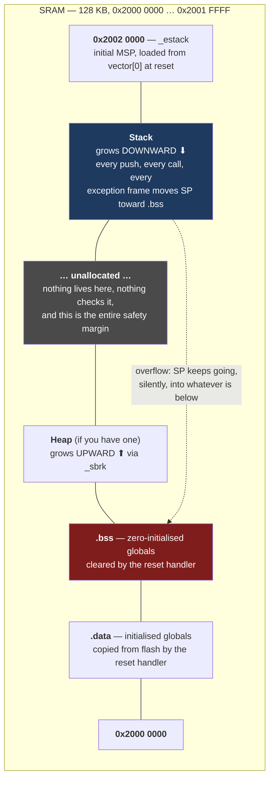

# Stack Usage and Overflow

Stack overflow on a hosted operating system is an event. A guard page is hit, the process receives a signal, the debugger stops on the offending frame, and you have a stack trace pointing at the recursion you forgot to bound. Stack overflow on a bare-metal Cortex-M is not an event. It is a silent write to a variable that belongs to something else, discovered later, in code that is innocent.

The mental model: **there is no boundary.** The stack pointer is a register, `push` subtracts from it, and nothing anywhere checks the result. The linker chose a number for where the stack starts; that number is a comment, not an enforcement. When the stack grows past its intended extent it simply keeps going into `.bss`, and the first symptom is a global variable that has the wrong value for no reason at all.

Everything on this page is about converting that non-event into an event — either by computing the depth ahead of time, measuring it at runtime, or making the hardware fault at the boundary.

:::info[Prerequisites]
[Memory Sections](../03-toolchain-and-build/memory-sections.md) covers `.data`, `.bss` and how the linker script places them. [The Linker Script](../03-toolchain-and-build/the-linker-script.md) is where `_estack` and the stack reservation are defined. [Exceptions and the Vector Table](../02-processor-architecture/exceptions-and-the-vector-table.md) covers the frame the hardware pushes on every interrupt — a cost that is easy to leave out of a depth calculation. [The MPU](../02-processor-architecture/the-mpu.md) is the mechanism the last section of this page relies on.
:::

## Where the stack lives

On an STM32F411RE there is one contiguous 128 KB SRAM at `0x2000 0000`. The conventional bare-metal layout puts your statically allocated data at the bottom and the stack at the top, growing down toward it:



Three properties of this picture do the damage:

- **The gap is not a barrier.** It is the *absence* of an allocation. `sub sp, #64` crosses it in one instruction with no more ceremony than any other subtraction.
- **`.bss` is at the bottom, so it is what gets hit first.** Your global state — driver structures, buffers, calibration data, the flag that says whether the motor is enabled — is exactly what an overflow lands on.
- **The corruption is a *write*, not a fault.** SRAM is writable everywhere. The processor is doing precisely what it was told.

If you have both a heap and a stack, they grow toward each other and the gap belongs to both of them. Whichever one gets there first wins, and neither one knows. [Static Memory and Why `malloc` Is Banned](./static-memory-and-no-malloc.md) is the other half of that collision.

## Computing the worst case

Worst-case stack depth is the deepest path through the call graph, plus everything interrupts add on top of it. The three terms:

**1. The deepest call chain in `main`'s context.** Sum the frame of every function on the longest path. GCC will tell you each frame with `-fstack-usage`, which writes a `.su` file next to every object file:

```bash
arm-none-eabi-gcc -Os -mcpu=cortex-m4 -mthumb -mfpu=fpv4-sp-d16 \
                  -mfloat-abi=hard -fstack-usage -c app.c -o app.o
cat app.su
```

```text
app.c:20:6:control_task	32	static
app.c:29:6:parse_command	72	static
app.c:37:6:ADC_IRQHandler	40	static
app.c:44:5:main	40	static
```

The three columns are location, bytes, and a qualifier: `static` means the compiler knows the exact size, `dynamic` means the frame depends on a runtime value (a VLA or `alloca`), and `bounded` means dynamic but with a limit the compiler could prove. **A `dynamic` entry is an unbounded stack**, which is why VLAs and `alloca` are banned in every embedded coding standard that has an opinion.

The same file compiled at `-O0` produces a different — and much more informative — picture:

```text
app.c:10:14:dot	32	static
app.c:12:14:filter	88	static
app.c:20:6:control_task	72	static
app.c:29:6:parse_command	80	static
app.c:37:6:ADC_IRQHandler	40	static
app.c:44:5:main	40	static
```

`dot` and `filter` have appeared, and `control_task` has grown from 32 to 72 bytes. Nothing about the source changed. At `-Os` both helpers were inlined into `control_task`, so their frames merged into its and their names vanished from the report. Two consequences worth being explicit about:

- **`.su` files describe the build, not the program.** Change the optimisation level, the compiler version, or add `-flto`, and the numbers move. Re-measure per configuration; a budget computed at `-O2` says nothing about the `-O0` debug build, which is almost always *larger*.
- **Inlining makes chains shallower but frames fatter.** Summing frames along a call graph derived from the source, rather than from the actual binary, double-counts inlined callees or misses merged ones. Use a tool that reads the ELF.

**2. The library.** `-fstack-usage` covers code you compile. It says nothing about `libc`, and the worst offender is the one everyone calls. Measured on the same toolchain by disassembling the linked image, newlib-nano's integer `printf` path reserves **116 bytes** in `_vfiprintf_r` alone; enable float formatting with `-u _printf_float` and the chain adds `_printf_float` (68), `__cvt` (32), `_dtoa_r` (100) and `__multiply` (20) — **over 336 bytes of local frames**, before counting saved registers at each level. One `printf("%f")` in a deeply nested error path is a plausible way to blow a 1 KB stack.

**3. Interrupts.** This is the term people forget, and it is the one that turns a comfortable margin into an overflow. On every exception entry the hardware pushes a frame *before* your handler's first instruction:

| Contribution | Cost | Notes |
|---|---|---|
| Basic exception frame | **32 bytes** | `R0–R3`, `R12`, `LR`, `PC`, `xPSR` |
| Stack alignment padding | 0 or **4 bytes** | `CCR.STKALIGN` forces 8-byte alignment on entry; it is set by default on Armv7-M |
| Extended (FP) frame | **+72 bytes** | `S0–S15` + `FPSCR` + reserved word, if lazy stacking is used or the handler touches FP. **Space is reserved even if the handler never executes an FP instruction** |
| Your handler's own frame | from its `.su` line | Plus everything it calls |
| **Nesting** | × depth | Each pre-empting interrupt repeats the whole thing |

A Cortex-M4F with the FPU enabled and three priority levels of nesting can therefore add `3 × (104 + handler frame)` on top of whatever `main` was using — well over 500 bytes before any handler does anything. And the worst case is not "the deepest handler"; it is **the deepest `main` path, interrupted at its deepest point, by the deepest nesting chain.** Those events are independent, so they will eventually coincide.

The arithmetic, then:

```text
worst case  =  max_depth(main call graph, including libc)
            +  Σ over each nesting level: (exception frame + that handler's depth)
            +  margin
```

For a program with a 400-byte `main` path, two nesting levels of handlers using 150 bytes each including their frames, the total is 400 + 2×(104+150) = 908 bytes. A 1 KB stack reservation is *not* comfortable. That is the kind of conclusion this arithmetic exists to produce, and it is worth ten minutes.

:::tip
Two tools do the whole-binary version properly. GCC's `-fcallgraph-info=su,da` emits per-function call-graph data that can be walked automatically; and the open-source [`puncover`](https://github.com/HBehrens/puncover) reads an ELF plus its `.su` files and produces a browsable per-function stack and size report. `-Wstack-usage=<n>` turns a single function exceeding a budget into a compile-time warning, which is the cheapest of all — put it in `CFLAGS` at the number you decided on and let the build tell you when someone adds a 512-byte local.
:::

## Measuring it: paint the stack

Static analysis gives you a bound. Painting gives you the truth about the paths your device actually takes, including the ones nobody predicted.

Fill the whole stack with a recognisable pattern at startup, then look later for how far the pattern has been destroyed. Everything above the highest surviving pattern word has been used at least once.

```c
extern uint32_t _sstack, _estack;      /* from the linker script */
#define STACK_PAINT 0xC0DEFACEu

/* Called from the reset handler, BEFORE main and before any deep call.
   Must not use a large frame of its own -- it is painting the memory it stands on. */
__attribute__((naked)) void stack_paint(void)
{
    __asm volatile (
        "  ldr   r0, =_sstack     \n"
        "  ldr   r1, =0xC0DEFACE  \n"
        "  mov   r2, sp           \n"
        "  sub   r2, r2, #64      \n"   /* leave our own frame alone */
        "1: cmp   r0, r2          \n"
        "  bcs   2f               \n"
        "  str   r1, [r0], #4     \n"
        "  b     1b               \n"
        "2: bx    lr              \n"
    );
}

/* Call any time later -- from a diagnostics command, or once a second. */
uint32_t stack_high_water_bytes(void)
{
    const uint32_t *p = &_sstack;
    while (p < &_estack && *p == STACK_PAINT) { p++; }
    return (uint32_t)((uintptr_t)&_estack - (uintptr_t)p);
}
```

What this gives you and what it does not:

- **It is a high-water mark, not a bound.** It reports the deepest the stack has been *so far*. A path never taken contributes nothing, so a low number after a short test proves nothing about a long one. Run the device through its genuinely worst case — every error path, the loudest interrupt load, the longest input — before believing the figure.
- **A single deep excursion is enough to record itself.** Unlike a sampled measurement, painting cannot miss a transient, because the evidence is destructive and permanent.
- **Report it, do not just compute it.** Print it at boot from the previous run (if you have retained RAM), or expose it over your debug interface. A high-water figure nobody reads is a measurement that was not taken.
- **Aim for headroom, not zero.** A device that peaks at 95 percent of its stack in the lab has no margin for the one path the lab did not exercise. Under 50 percent is comfortable; over 75 percent is a finding.

Most RTOSes provide this for their task stacks — FreeRTOS's `uxTaskGetStackHighWaterMark()` is exactly this technique with the painting done by the kernel. On bare metal you write the twenty lines above.

## Making it fault: the MPU guard region

Analysis and measurement both tell you about overflows that have *not* happened yet. Neither one catches the overflow in the field, in the path nobody predicted, at 3 a.m. For that you need the hardware to object, and on a Cortex-M the hardware that can object is the MPU.

The idea is one region and one linker symbol: place a small no-access region immediately *below* the stack's lowest legal address. The instant `push` or `sub sp` crosses into it, the access is denied and you get a **MemManage fault at the offending instruction** — not a corrupted global discovered ten minutes later.

```text
/* linker script: reserve a guard between .bss and the stack */
. = ALIGN(32);
_stack_guard = .;
. += 32;
```

```c
extern uint32_t _stack_guard;

MPU->RNR  = 7;
MPU->RBAR = (uint32_t)&_stack_guard;                    /* must be size-aligned */
MPU->RASR = (0u << MPU_RASR_AP_Pos)                     /* AP = 000: no access at all */
          | (4u << MPU_RASR_SIZE_Pos)                   /* 32 bytes */
          | MPU_RASR_ENABLE_Msk;
```

[The MPU](../02-processor-architecture/the-mpu.md) covers this configuration in full — the region registers, the mandatory size-alignment rule, the `PRIVDEFENA` setting that keeps the rest of the map usable, and the `DSB`/`ISB` pair the enable needs. It also has the part that matters when the fault arrives: **`MMFSR.MSTKERR` set, `MMARVALID` set, and `MMFAR` pointing inside your guard region is a stack overflow, stated as precisely as hardware can state anything.** `MSTKERR` specifically means the fault happened while the hardware was pushing an exception frame — the classic guard hit, because an interrupt arriving at maximum stack depth is exactly when the overflow occurs.

It is about fifteen lines of configuration, and it converts the worst failure mode on this page into a diagnosable fault with an address. If you write only one MPU region in a project, write this one.

Two limits to be honest about:

- **The guard must be at least 32 bytes** on an Armv7-M MPU, whose smallest region is 32 bytes and must be aligned to its size. A single very large stack frame — `char buf[4096]` — can move `SP` *past* the guard in one subtraction without ever touching it, and then write below it undetected. Guards catch incremental growth, which is the overwhelmingly common case, not one enormous leap. Keeping large buffers static rather than automatic closes that gap.
- **The MPU does not see DMA.** A DMA controller is a separate bus master and never consults it, so a rogue descriptor writes through the guard silently.

Armv8-M parts have a dedicated, cheaper answer that costs no MPU region at all: the `MSPLIM` and `PSPLIM` stack-limit registers fault directly on any `SP` update below the programmed limit. If your target has them, use them and keep the MPU region for something else.

## Reducing usage when the budget does not close

In rough order of value:

- **Move large locals to `static`.** A 512-byte `char buf[512]` inside a function is 512 bytes of stack every time that function is on the path. As a file-scope `static` it is 512 bytes of `.bss`, counted once, visible in the map file, and it stops contributing to the interrupt-nesting multiplier. The cost is that the function stops being reentrant — state that explicitly.
- **Delete recursion.** Any recursion whose depth is not a small compile-time constant is an unbounded stack. Most embedded recursion is a tree or list walk and converts to an explicit loop with a fixed-size index array.
- **Ban VLAs and `alloca`.** They are exactly the `dynamic` rows in the `.su` output — a stack allocation whose size is user input. MISRA C:2012 Rule 18.8 prohibits VLAs for this reason.
- **Keep `printf` off deep paths**, or out of the image. See the 336-byte measurement above.
- **Flatten deep chains in ISRs**, since their frames are multiplied by nesting depth.
- **Pass pointers, not structs.** Passing a large struct by value copies it onto the stack at every level of the chain.

:::warning[The global variable that changes when nothing writes to it]
This is the single most disorienting bug in bare-metal firmware, and it is what an unguarded stack overflow always looks like.

A `bool motor_enabled` in `.bss` becomes `true` on its own. You grep the entire codebase: it is written in exactly two places, both of them guarded, neither of them reached. You set a data watchpoint on it in GDB — and the watchpoint fires inside `memset`, or inside an interrupt handler's prologue, or in a function that has never heard of the motor. The write is real. It is just not a write to `motor_enabled`; it is a write to a stack slot that happens to be at the same address, because the stack overflowed into `.bss` and the two now overlap.

The tells, in order of how quickly they resolve it:

1. **A data watchpoint that fires in an unrelated function.** This is nearly conclusive on its own. Nothing else produces it.
2. **The symptom moves when you add an unrelated variable.** Adding a global shifts the `.bss` layout, so a different variable is now under the stack and a different subsystem misbehaves. "It went away when I added a debug counter" is a stack overflow reporting itself in the only language it has.
3. **It correlates with interrupt load, not with the corrupted subsystem.** Overflow happens at maximum depth, which is `main` at its deepest interrupted by a nesting chain — so the trigger is traffic, not the feature that breaks.
4. **`-O0` builds fail and `-Os` builds do not** (or the reverse). Frames are larger without optimisation; a marginal budget flips.

The diagnosis is two minutes once you suspect it: read `SP` at the moment of failure and compare it against `_sstack` from the map file, or check whether the paint pattern survives. The *fix* is the MPU guard region, because it converts every future instance of this into a MemManage fault with `MMFAR` naming the address — and you never spend an afternoon on this class of bug again.
:::

## See also

- [The MPU](../02-processor-architecture/the-mpu.md) — the guard region configuration in full, the fault-status bits that identify a stack overflow, and the alignment rules the region must obey.
- [Static Memory and Why `malloc` Is Banned](./static-memory-and-no-malloc.md) — the heap growing up toward the stack growing down, and the collision neither one detects.
- [Memory Sections](../03-toolchain-and-build/memory-sections.md) — `.data`, `.bss`, and the `_sstack`/`_estack` symbols the painting code uses.
- [Exceptions and the Vector Table](../02-processor-architecture/exceptions-and-the-vector-table.md) — the 32-byte frame the hardware pushes, and the extended frame when the FPU is in use.
- [ELF, Map Files and Size](../03-toolchain-and-build/elf-map-files-and-size.md) — reading the actual `.bss` extent and stack reservation out of the map file.

## References

- Free Software Foundation — [**GCC manual, "Options for Debugging Your Program"**](https://gcc.gnu.org/onlinedocs/gcc/Debugging-Options.html) and [**"Options That Control Optimization"**](https://gcc.gnu.org/onlinedocs/gcc/Optimize-Options.html). `-fstack-usage` and the exact meaning of the `static` / `dynamic` / `bounded` qualifiers in the `.su` file; `-fcallgraph-info` for the machine-readable call graph; `-Wstack-usage=<n>` for the compile-time budget check.
- Arm — [**Armv7-M Architecture Reference Manual**](https://developer.arm.com/documentation/ddi0403/latest/) (DDI 0403). §B1.5.6 for exception entry and the stack frame layout including `CCR.STKALIGN` padding; §B1.5.7 for the extended floating-point frame and lazy stacking; §B3.5 for the MPU region registers used by the guard above.
- STMicroelectronics — [**PM0214**, *STM32 Cortex-M4 MCUs and MPUs programming manual*](https://www.st.com/resource/en/programming_manual/pm0214-stm32-cortexm4-mcus-and-mpus-programming-manual-stmicroelectronics.pdf), Rev 10. §2.3.7 for the exception stack frame; §4.4.10 for `MMFSR` and the `MSTKERR` / `MMARVALID` bits that identify a guard-region hit; §4.2 for the MPU registers.
- Jack Ganssle — [**"The Embedded Muse"** archive](http://www.ganssle.com/tem-back.htm), in particular the recurring articles on stack sizing and the paint-and-measure technique. Ganssle's position — that no one can compute the number reliably and everyone must measure it — is the reason both halves of this page exist rather than only the first.
- MISRA — [***MISRA C:2012***](https://misra.org.uk/product/misra-c2012-third-edition-first-revision/), third edition, first revision. **Rule 17.2** (functions shall not call themselves, directly or indirectly) and **Rule 18.8** (variable-length array types shall not be used) — the two rules that exist specifically to keep worst-case stack depth computable.
- Heiko Behrens — [**`puncover`**](https://github.com/HBehrens/puncover). An open-source tool that parses an ELF and its `.su` files into a browsable per-function stack-depth and code-size report, including the maximum call-graph depth the arithmetic above asks for.
