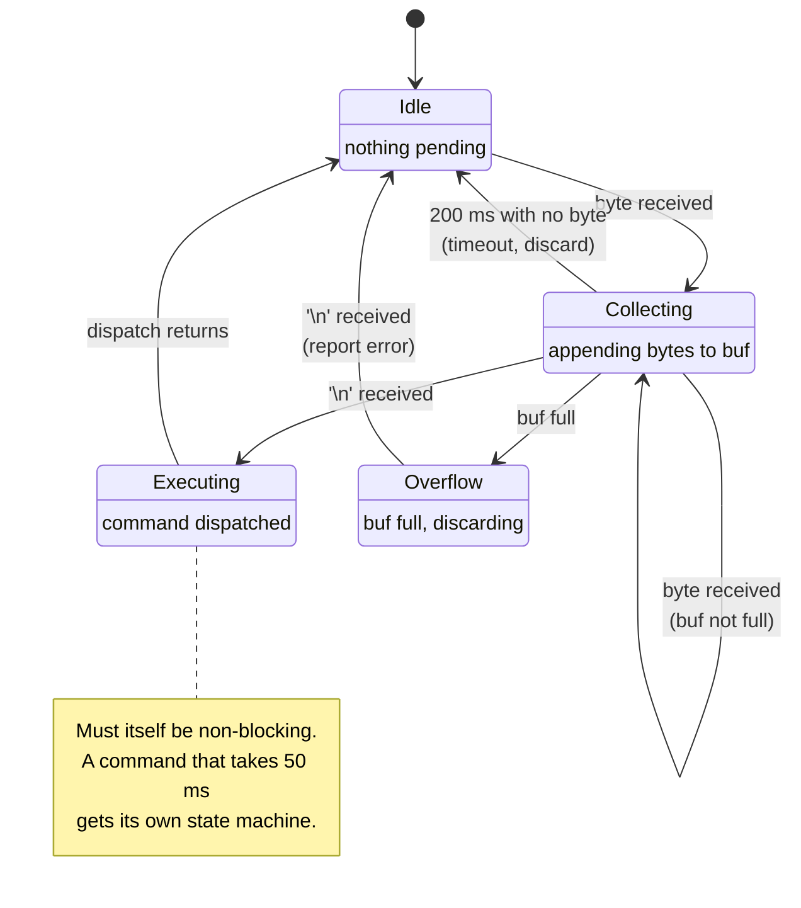

# The Superloop and Cooperative Scheduling

Every embedded program is an infinite loop. The interesting question is what is inside it. A `while(1)` that calls three functions in order is the simplest architecture that can run a device, it ships in an enormous number of products, and it is entirely capable of being the right answer for the lifetime of a project. It is also the architecture that fails most quietly when it stops being the right answer, because nothing breaks — the loop just gets slower, and one day a button press is dropped.

The mental model: **the superloop is a scheduler in which the scheduling decision is "whatever runs next in the source", and the time slice is however long that function chooses to take.** There is no pre-emption, no priority, and no way for one task to take the CPU from another. That is a genuine feature — no locks, no stack per task, no context switch, and a call stack you can read top to bottom. It is also the entire limitation, and it has exactly one rule: **no function in the loop may block.**

:::info[Prerequisites]
[Bare Metal vs RTOS vs Linux](../00-overview/bare-metal-vs-rtos-vs-linux.md) frames the choice this page is one half of. [Interrupt Handlers in C](./interrupt-handlers-in-c.md) supplies the split-handler pattern the loop consumes from. [SysTick and the Core Peripherals](../02-processor-architecture/systick-and-core-peripherals.md) is where the millisecond tick every scheduler here depends on comes from. [Scheduling](../../computer-science/operating-systems/scheduling.md) owns the general theory of scheduling policies; this page is the degenerate single-priority case, done properly.
:::

## What blocking looks like, and why it is the whole problem

Here is the loop everyone writes first:

```c
for (;;) {
    if (button_pressed()) {
        led_on();
        delay_ms(500);      /* ← nothing else in the system runs for half a second */
        led_off();
    }
    read_sensor();
    update_display();
}
```

`delay_ms` is not slow. It is *exclusive*. For 500 ms the sensor is not read, the display is not updated, and every event that arrives is either queued by an interrupt handler or lost. Add a second feature that also wants to wait — a debounce, a sensor settling time, a UART timeout — and the two waits serialise: the loop takes as long as the sum of everything blocking in it, and each feature makes every other feature worse.

The fix is not a faster delay. It is to stop waiting. A function that would block becomes a function that **checks whether it is time yet and returns immediately either way**:

```c
static uint32_t led_off_at;
static bool     led_lit;

void led_task(void)
{
    if (!led_lit && button_pressed()) {
        led_on();
        led_lit    = true;
        led_off_at = millis() + 500;
    }
    if (led_lit && time_after(millis(), led_off_at)) {
        led_off();
        led_lit = false;
    }
}
```

Nothing in `led_task` takes more than a few microseconds. The loop now runs thousands of times a second and every other task runs with it. The half-second still happens — it is just that the *program* is not the thing waiting for it.

This is the entire technique, and everything below is a way of organising it once you have more than two of them.

## State machines are what non-blocking code turns into

Once a task remembers "what I am in the middle of" across loop iterations, it has state, and writing that state down explicitly is what keeps the code readable. A UART command parser is the canonical example — it cannot wait for a whole line, so it consumes whatever bytes have arrived and remembers where it was.



```c
typedef enum { CMD_IDLE, CMD_COLLECT, CMD_OVERFLOW } cmd_state_t;

void command_task(void)
{
    static cmd_state_t state = CMD_IDLE;
    static char        buf[64];
    static uint8_t     len;
    static uint32_t    last_byte_at;

    uint8_t byte;
    while (uart_rx_pop(&byte)) {              /* drains what the ISR queued */
        last_byte_at = millis();
        switch (state) {
        case CMD_IDLE:
            len = 0;
            state = CMD_COLLECT;
            /* fall through */
        case CMD_COLLECT:
            if (byte == '\n')        { buf[len] = '\0'; dispatch(buf); state = CMD_IDLE; }
            else if (len < sizeof buf - 1) { buf[len++] = (char)byte; }
            else                     { state = CMD_OVERFLOW; }
            break;
        case CMD_OVERFLOW:
            if (byte == '\n') { report_error(); state = CMD_IDLE; }
            break;
        }
    }

    if (state != CMD_IDLE && time_after(millis(), last_byte_at + 200)) {
        state = CMD_IDLE;                     /* partial line, sender went away */
    }
}
```

Three things about this shape are worth naming, because they generalise to every non-blocking task:

- **`static` locals hold the state between calls.** The task is a coroutine written by hand; the `static`s are its stack frame. (This is also why these functions are not reentrant and must not be called from an ISR.)
- **The timeout is a state transition, not a `while` with a counter.** Every state that can be entered must have a way out that does not depend on the outside world behaving. A parser with no timeout hangs in `CMD_COLLECT` forever the moment a cable is unplugged mid-line.
- **It drains, it does not sample.** `while (uart_rx_pop(...))` handles every byte that arrived since last time. An `if` would handle one byte per loop iteration, which silently caps your throughput at the loop rate.

## A scheduler in forty lines

Once you have five or six of these, "call them all every iteration" starts wasting time — the display does not need updating 8000 times a second. A table of tasks with periods costs almost nothing and makes the timing budget explicit:

```c
typedef struct {
    void     (*run)(void);
    uint32_t period_ms;     /* 0 = run every iteration */
    uint32_t next_due;
} task_t;

static task_t tasks[] = {
    { command_task,  0,    0 },   /* every pass: latency matters */
    { led_task,      0,    0 },
    { sensor_task,   10,   0 },   /* 100 Hz */
    { control_task,  10,   0 },
    { display_task,  100,  0 },   /* 10 Hz is plenty for a human */
    { log_task,      1000, 0 },
};

void scheduler_run(void)
{
    for (;;) {
        uint32_t now = millis();
        for (size_t i = 0; i < sizeof tasks / sizeof tasks[0]; i++) {
            if (tasks[i].period_ms == 0 || time_after_eq(now, tasks[i].next_due)) {
                tasks[i].next_due = now + tasks[i].period_ms;
                tasks[i].run();
            }
        }
        __WFI();   /* sleep until the next interrupt — usually the 1 ms tick */
    }
}
```

That is a cooperative scheduler. It has a run queue, a period per task, and an idle behaviour. What it does not have is pre-emption: a task that takes 40 ms delays every other task by 40 ms, and no amount of declaring `control_task` important will change that.

Two details that are easy to get wrong:

- **`next_due = now + period` versus `next_due += period`.** The first drifts — each period is measured from when the task actually ran, so a late run makes the next one later still. The second holds a fixed rate but will "catch up" by running back-to-back if the task was ever badly delayed. For a control loop you want the second plus a clamp; for a UI refresh the first is fine and simpler. Pick deliberately.
- **`time_after(a, b)` must be written as `(int32_t)(a - b) > 0`, not `a > b`.** A `uint32_t` millisecond counter wraps after 49.7 days. Direct comparison breaks at the wrap and produces a task that stops running, or runs continuously, six weeks after the device shipped. The subtraction form is correct across the wrap and is worth copying verbatim from the Linux kernel's `time_after` macro, where it has been right for thirty years.

`__WFI()` at the bottom is close to free and worth having from day one: the core sleeps until the next interrupt, which on a 1 ms tick means it idles most of the time. This is the entry point to the whole low-power story, which has its own folder later in the section.

## The timing budget

The superloop's one number is the **worst-case loop period**: the sum of the worst-case execution time of every task that can run in the same pass, plus the interrupt time stolen from it. That number is the latency floor for anything the loop must respond to.

The numbers below are an illustration of the method, not measurements from any particular board — yours come from a GPIO toggle and a scope, and from the timing tables in your part's datasheet. What transfers is the shape of the table, not the figures in it.

| Task | Typical | Worst case | When the worst case happens |
|---|---|---|---|
| `command_task` | 5 µs | 400 µs | A full 64-byte line arrives at once and `dispatch()` runs |
| `sensor_task` | 30 µs | 30 µs | Fixed — reads a register the ISR already filled |
| `control_task` | 80 µs | 80 µs | Fixed-point PID, no branches on data |
| `display_task` | 0 µs | 12 ms | Full-screen SPI refresh at 100 Hz frame rate |
| `log_task` | 0 µs | ~400 ms | A flash **sector** erase, which stalls the flash bus |
| **Loop worst case** | | **≈ 412 ms** | All of them in one pass, which is rare but not impossible |

The `log_task` row is the one that ruins the budget, and it is worth being precise about why it is so large. The smallest erasable unit on an STM32F411 is a 16 KB **sector**, not a page — the part has no page erase at all — and sector erase times on the STM32F4 family are measured in *hundreds of milliseconds*, rising with sector size and falling supply voltage. The exact figures are in the flash memory characteristics table of the device datasheet (DS10314 for the F411xC/E), not in the reference manual, and they vary enough between sector sizes and voltage ranges that the only correct thing to do is look up the row for your part. The `~400 ms` above is a round stand-in of the right order of magnitude, not a datasheet value.

The typical column is irrelevant to correctness. If a button must be acknowledged within 20 ms and the loop can take 412 ms, the design is wrong even though it will pass every test you run by hand, because the slow task rarely runs. This is the value of writing the table down: the failure is arithmetic, and it is visible before it is a bug.

The remedies, in the order to try them:

1. **Break the long task into states.** A full-screen SPI refresh becomes "send one row per pass" — 12 ms of work spread over 30 passes, none of them longer than 400 µs. This is by far the most common fix and it is the same technique as the parser above.
2. **Move it to DMA.** The display refresh becomes "start the transfer, return; next pass, check whether it finished." The 12 ms still elapses but the CPU is not in it.
3. **Move it to an interrupt.** Anything with a genuine deadline shorter than the loop period does not belong in the loop at all. The loop's floor does not apply to interrupt handlers.
4. **Only then, an RTOS.** Pre-emption is the general solution and it costs a stack per task, a context switch, and the whole synchronisation problem coming back.

## The symptoms of having outgrown it

There is no threshold in task count or line count. The signals are behavioural, and they are specific:

- **You cannot state the worst-case loop period any more**, because some task's duration depends on data you do not control.
- **A hard deadline exists that is shorter than the loop period**, and moving the work into an ISR would make the ISR too long — so it needs to run at a priority, in a context that can be pre-empted by something more urgent. That is the definition of a task in an RTOS.
- **Two independent features must both wait.** One state machine per waiting thing is fine. Five state machines that each encode "waiting for the radio, then waiting for the flash, then waiting for the ack" is a sequential process manually flattened into states, and a thread would express it in ten lines.
- **You have started adding priorities by hand** — calling `control_task()` twice in the loop, or from inside another task, to make it run more often. That is an unstructured, undocumented scheduler.
- **A third-party stack demands blocking calls.** Most TCP/IP, USB host, and filesystem libraries are written against a threaded model. Bending them into a superloop is possible and is usually more work than adopting the scheduler they expect.

Equally worth stating: none of the following is a reason to leave. Task count on its own, an interrupt-driven design, needing a millisecond tick, or having twenty state machines. Plenty of shipped, certified, decade-lived firmware is a superloop with a well-written timing table, and it is far easier to reason about than the same product with a kernel underneath it.

:::warning[The feature that worked, added to the loop, that broke a feature nobody touched]
The characteristic superloop bug is a regression in code you did not modify.

You add logging. `log_task` writes to flash, and eventually it has to erase — and on an STM32F411 the smallest erasable unit is a 16 KB sector, which takes *hundreds of milliseconds*. Worse, an erase or program operation stalls accesses to the flash, so *code fetch* stalls too and the CPU is not merely busy, it is stopped (RM0383 Rev 4 §3.5 "Erase and program operations", §3.5.3 "Erase"; the timings themselves are in the DS10314 datasheet's flash characteristics table). The loop period goes from 500 µs to several hundred milliseconds in the passes where an erase happens. Meanwhile the encoder task, which was written months ago and has not been edited, counts pulses by polling a pin. It was sampling at 2 kHz and needed 1 kHz. Now it samples once in that entire window and loses counts. The position drifts, slowly, only while logging is enabled.

Nothing in the diff touched the encoder. The blame lands on the encoder code, because that is where the wrong number appears, and the person debugging it goes looking for a hardware problem in a subsystem that is fine.

Three habits that prevent this outright:

- **Measure the loop period, always.** Toggle a spare GPIO at the top of the loop and put a scope on it — the pulse train *is* your loop period, live, and a new task's cost is immediately visible as a widening gap. Costs one pin and two instructions. [Lab Equipment](../01-hardware-foundations/lab-equipment.md) covers the scope side.
- **Keep a maximum in software too.** `if (dt > worst) worst = dt;` on the loop period, printed by `log_task`, catches the rare coincidence a scope session will never happen to observe.
- **Never poll anything with a real deadline.** The encoder should have been on an input-capture peripheral or an EXTI interrupt from the start. Polling works right up until someone else's feature makes the loop slower, and then it fails in a way that does not point at itself.
:::

## See also

- [Interrupt Handlers in C](./interrupt-handlers-in-c.md) — the split-handler pattern: the ISR captures, the loop processes.
- [Critical Sections and Atomicity](./critical-sections-and-atomicity.md) — the sharing rules for the queues the loop drains and the ISR fills.
- [SysTick and the Core Peripherals](../02-processor-architecture/systick-and-core-peripherals.md) — the millisecond tick behind `millis()`.
- [Bare Metal vs RTOS vs Linux](../00-overview/bare-metal-vs-rtos-vs-linux.md) — the decision this page is the "bare metal" branch of.
- [Scheduling](../../computer-science/operating-systems/scheduling.md) — the general theory: pre-emption, priorities, and the policies a real kernel implements.

## References

- Elecia White — [***Making Embedded Systems***](https://www.oreilly.com/library/view/making-embedded-systems/9781098151539/), 2nd edition (O'Reilly, 2024). Chapter 5, "Task Management", is the standard treatment of the superloop, cooperative scheduling and the state-machine-per-task discipline; chapter 10 covers the timing-budget reasoning used above. The best single source for the architecture-level judgement this page describes.
- Miro Samek — [***Practical UML Statecharts in C/C++***](https://www.state-machine.com/psicc2), 2nd edition, and the free [**"Modern Embedded Systems Programming"** video course](https://www.state-machine.com/video-course). Lessons 39–41 build a non-blocking event loop and the run-to-completion model directly; the book's chapters 2–3 cover the state-machine implementation techniques (nested switch, state tables, state pointers) the parser above uses the simplest of.
- Jack Ganssle — [**"A Guide to Debouncing"**](http://www.ganssle.com/debouncing.htm) and the [**Embedded Muse**](http://www.ganssle.com/tem-back.htm) archive. The debounce paper is a worked non-blocking-state-machine example with real measurements of switch bounce durations, which is where the periods in a task table should come from.
- Linux kernel — [**`include/linux/jiffies.h`**](https://git.kernel.org/pub/scm/linux/kernel/git/torvalds/linux.git/tree/include/linux/jiffies.h). The `time_after`/`time_before` macros and their `(long)(a) - (long)(b) < 0` formulation — the wrap-safe comparison the scheduler above depends on, with the kernel's own comment explaining why the naive form is wrong.
- STMicroelectronics — [**RM0383**, *STM32F411xC/E reference manual*](https://www.st.com/resource/en/reference_manual/rm0383-stm32f411xce-advanced-armbased-32bit-mcus-stmicroelectronics.pdf), Rev 4. §3.5 "Erase and program operations" and §3.5.3 "Erase" for the sector-erase model — the STM32F411 has no page erase, only 16 KB, 64 KB and 128 KB sectors — and for the fact that flash accesses stall while an erase or program is in progress, which is the bus-stall claim in the warning above. Note that RM0383 does **not** give erase *timings*; those are in STMicroelectronics — [**DS10314**, *STM32F411xC/E datasheet*](https://www.st.com/resource/en/datasheet/stm32f411re.pdf), "Flash memory characteristics", where sector erase times are given per sector size and supply-voltage range.
