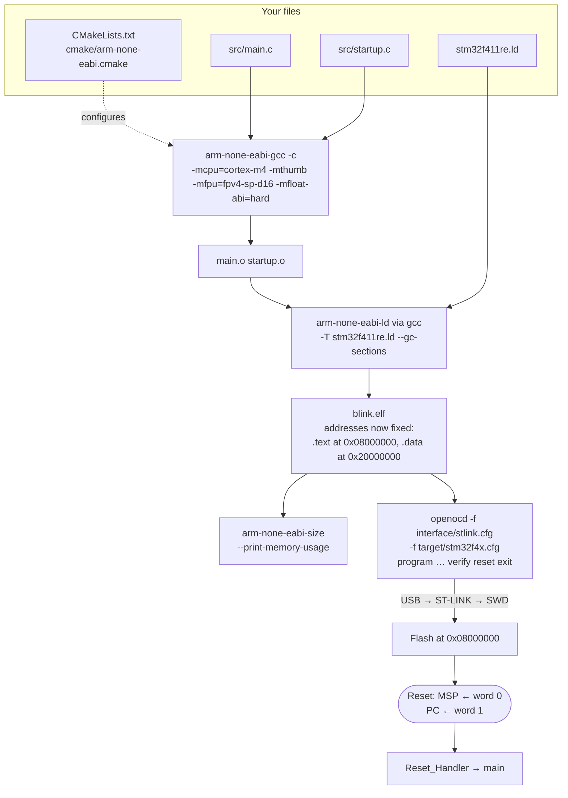

# Your First Bare-Metal Blink

Blinking an LED from an Arduino sketch takes two lines and teaches nothing about the machine. Blinking one with no HAL, no IDE and no library takes about ninety lines spread over five files, and by the end you know where every byte of the image came from, what the processor did before your first instruction, and which two writes in the whole program actually made the light change.

The mental model to carry through this page: **there is no magic layer.** The board runs exactly the bytes you produced, starting at the address you chose, using a stack pointer you supplied. Four things have to be true before an LED can blink, and each one is a file:

1. Something has to tell the linker where flash and RAM are — the **linker script**.
2. Something has to give `main` a working C environment — the **startup file**.
3. Something has to turn the peripheral on and drive the pin — **`main.c`**.
4. Something has to compile, link and load it — **CMake and OpenOCD**.

Everything else on this page is detail underneath those four.

:::info[Prerequisites]
This page assembles files that other pages derive. [The Linker Script](../03-toolchain-and-build/the-linker-script.md) builds `stm32f411re.ld` line by line; [Startup Code: Reset to `main`](../03-toolchain-and-build/startup-code.md) builds `startup.c`; [CMake for Embedded](../03-toolchain-and-build/cmake-for-embedded.md) builds the toolchain file; [Flashing and Programming](../03-toolchain-and-build/flashing-and-programming.md) explains the OpenOCD line. You do **not** have to read them first — the complete files are reproduced below and this page works standalone — but every "why is that line there" question is answered on one of them.

Hardware: a **NUCLEO-F411RE** and a USB cable. Software: the Arm GNU Toolchain (`arm-none-eabi-gcc`), CMake ≥ 3.21, Ninja, and OpenOCD. [What Hardware to Buy](../01-hardware-foundations/what-hardware-to-buy.md) covers the board; [Choosing a Toolchain](../03-toolchain-and-build/toolchains-and-compilers.md) covers the compiler.
:::

## What "blink the LED" means on this board

Three facts from the documentation fix everything the program has to do.

**The LED is on `PA5`.** UM1724 Rev 14 §6.4 "LEDs": the user LED **LD2** is a green LED "connected to Arduino signal D13 corresponding to STM32 I/O `PA5`". It is wired so that driving the pin high lights it — no inversion to reason about. `PA5` is also `SPI1_SCK` on the Arduino header, which does not matter here but will the day you add an SPI device.

**Peripherals start switched off.** RM0383 Rev 4 §6.3.9: every bit in `RCC_AHB1ENR` resets to `0`, and a `0` means the peripheral's clock is gated. A gated peripheral is not merely idle — it is electrically absent. Writes to its registers go nowhere and reads return zero. This is the single most common reason a first bare-metal program does nothing at all, and it has its own warning at the bottom of this page.

**`PA5` resets as a digital input.** RM0383 Rev 4 §8.4.1: `GPIOA_MODER` resets to `0xA800 0000`. The high bits are non-zero because `PA13`, `PA14` and `PA15` come out of reset in alternate-function mode for the SWD debug port — which is why you can attach a debugger to a chip with no firmware. Every other pin, `PA5` included, is `00`: input mode. To drive it you must write `01`.

So the program is: enable the GPIOA clock, set `MODER5` to `01`, then toggle the pin forever.

## The build, end to end



Two boundaries in that diagram are worth naming. The **linker** is where addresses stop being symbolic and become the physical addresses the CPU will use forever — after it runs, nothing can move. And **reset** is where the hardware, not any code of yours, reads the first two words of flash. That is why the vector table has to be first and why `.isr_vector` gets a `KEEP` in the script.

## The project

```text
blink/
├── CMakeLists.txt
├── CMakePresets.json
├── cmake/
│   └── arm-none-eabi.cmake
├── stm32f411re.ld
└── src/
    ├── main.c
    └── startup.c
```

Five files, no submodules, no vendor package, no downloaded SDK. Create the directories and work through the sections below in order.

### `main.c` — the part that is actually about the LED

```c title="src/main.c"
#include <stdint.h>

/* --- Peripheral addresses. RM0383 Rev 4, Table 1 "STM32F411xC/E register
       boundary addresses" and the per-peripheral register maps. --- */
#define RCC_BASE        0x40023800u
#define GPIOA_BASE      0x40020000u

#define RCC_AHB1ENR     (*(volatile uint32_t *)(RCC_BASE   + 0x30u))
#define GPIOA_MODER     (*(volatile uint32_t *)(GPIOA_BASE + 0x00u))
#define GPIOA_BSRR      (*(volatile uint32_t *)(GPIOA_BASE + 0x18u))

#define RCC_AHB1ENR_GPIOAEN   (1u << 0)

#define LD2_PIN         5u                       /* PA5 — UM1724 §6.4 */
#define LD2_MODER_MASK  (3u << (LD2_PIN * 2))    /* MODER5 = bits 11:10 */
#define LD2_MODER_OUT   (1u << (LD2_PIN * 2))    /* 01 = general purpose output */

/* Calibration knob, not a computed delay. `volatile` on the parameter is what
   stops the compiler deleting the loop; see the volatile page. At the 16 MHz
   reset clock this is a few hundred milliseconds. Tune it until it looks right;
   a real program uses SysTick or a hardware timer instead. */
static void crude_delay(volatile uint32_t iterations)
{
    while (iterations--) {
    }
}

int main(void)
{
    /* 1. Ungate the GPIOA clock. Nothing below this line would have any
          effect without it — writes to a clock-gated peripheral are discarded. */
    RCC_AHB1ENR |= RCC_AHB1ENR_GPIOAEN;
    (void)RCC_AHB1ENR;   /* read-back; see the note under this listing */

    /* 2. PA5 = general purpose output. Clear the two-bit field, then set it.
          A bare |= would leave a mode of 11 (analog) on any pin that did not
          reset to 00 — see Register-Level Programming. */
    GPIOA_MODER = (GPIOA_MODER & ~LD2_MODER_MASK) | LD2_MODER_OUT;

    /* 3. Toggle forever, using BSRR so neither write is a read-modify-write. */
    for (;;) {
        GPIOA_BSRR = 1u << LD2_PIN;          /* BS5: set   → LED on  */
        crude_delay(400000u);
        GPIOA_BSRR = 1u << (LD2_PIN + 16u);  /* BR5: reset → LED off */
        crude_delay(400000u);
    }
}
```

**The read-back after the clock enable is not superstition.** RM0383 Rev 4 notes, against the AHB peripheral clock enable registers, that "a delay between an RCC peripheral clock enable and the effective peripheral enabling should be taken into account in order to manage the peripheral read/write to registers". The clock enable crosses a bus boundary and takes effect a cycle or two later. Reading the register back forces the write to complete before the next instruction issues. At `-O0` you would probably get away without it; at `-Os`, with the `MODER` write scheduled immediately after, occasionally you do not, and the resulting bug appears and disappears when you change unrelated code.

**Why `BSRR` and not `GPIOA_ODR ^= …`.** `BSRR` is a write-only register in which writing a `1` to bit *n* sets output *n*, and writing a `1` to bit *n+16* clears it; zeros are ignored (RM0383 Rev 4 §8.4.7). One store changes exactly the pins you named and leaves every other pin alone — no read, no modify, no window in which an interrupt can act on stale data. [A GPIO Driver from Scratch](./gpio-driver-from-scratch.md) is the page that takes this apart.

### `stm32f411re.ld` — where things go

This is the file from [The Linker Script](../03-toolchain-and-build/the-linker-script.md), unchanged. It declares 512 KB of flash at `0x0800_0000` and 128 KB of SRAM at `0x2000_0000` (RM0383 Rev 4 §3.3), and exports the symbols the startup file consumes.

<details>
<summary><strong>stm32f411re.ld</strong> — the complete script</summary>

```text title="stm32f411re.ld"
/* Linker script for STM32F411RE (NUCLEO-F411RE).
   512 KB flash @ 0x08000000, 128 KB SRAM @ 0x20000000.  RM0383 Rev 4, section 3.3. */

ENTRY(Reset_Handler)

_Min_Heap_Size  = 0x200;   /*  512 bytes */
_Min_Stack_Size = 0x400;   /* 1024 bytes */

MEMORY
{
  FLASH (rx)  : ORIGIN = 0x08000000, LENGTH = 512K
  RAM   (xrw) : ORIGIN = 0x20000000, LENGTH = 128K
}

_estack = ORIGIN(RAM) + LENGTH(RAM);

SECTIONS
{
  .isr_vector :
  {
    . = ALIGN(4);
    KEEP(*(.isr_vector))
    . = ALIGN(4);
  } >FLASH

  .text :
  {
    . = ALIGN(4);
    *(.text)
    *(.text*)
    KEEP(*(.init))
    KEEP(*(.fini))
    . = ALIGN(4);
    _etext = .;
  } >FLASH

  .rodata :
  {
    . = ALIGN(4);
    *(.rodata)
    *(.rodata*)
    . = ALIGN(4);
  } >FLASH

  .ARM.extab :
  {
    *(.ARM.extab* .gnu.linkonce.armextab.*)
  } >FLASH

  .ARM.exidx :
  {
    __exidx_start = .;
    *(.ARM.exidx*)
    __exidx_end = .;
  } >FLASH

  .preinit_array :
  {
    PROVIDE_HIDDEN(__preinit_array_start = .);
    KEEP(*(.preinit_array*))
    PROVIDE_HIDDEN(__preinit_array_end = .);
  } >FLASH

  .init_array :
  {
    PROVIDE_HIDDEN(__init_array_start = .);
    KEEP(*(SORT(.init_array.*)))
    KEEP(*(.init_array*))
    PROVIDE_HIDDEN(__init_array_end = .);
  } >FLASH

  .fini_array :
  {
    PROVIDE_HIDDEN(__fini_array_start = .);
    KEEP(*(SORT(.fini_array.*)))
    KEEP(*(.fini_array*))
    PROVIDE_HIDDEN(__fini_array_end = .);
  } >FLASH

  _sidata = LOADADDR(.data);

  .data :
  {
    . = ALIGN(4);
    _sdata = .;
    *(.data)
    *(.data*)
    . = ALIGN(4);
    _edata = .;
  } >RAM AT> FLASH

  .bss (NOLOAD) :
  {
    . = ALIGN(4);
    _sbss = .;
    __bss_start__ = _sbss;
    *(.bss)
    *(.bss*)
    *(COMMON)
    . = ALIGN(4);
    _ebss = .;
    __bss_end__ = _ebss;
  } >RAM

  ._user_heap_stack (NOLOAD) :
  {
    . = ALIGN(8);
    PROVIDE(end = .);
    PROVIDE(_end = .);
    . = . + _Min_Heap_Size;
    . = . + _Min_Stack_Size;
    . = ALIGN(8);
  } >RAM

  .ARM.attributes 0 : { *(.ARM.attributes) }
}
```

</details>

### `startup.c` — reset to `main`

The vector table plus the reset handler, following [Startup Code: Reset to `main`](../03-toolchain-and-build/startup-code.md). It copies `.data` from flash to RAM, zeroes `.bss`, runs the constructor tables, and calls `main`. The device IRQ entries are truncated here — a blink uses no interrupts, and the table only has to be long enough to cover the vectors that can actually fire.

<details>
<summary><strong>src/startup.c</strong> — the complete file</summary>

```c title="src/startup.c"
#include <stdint.h>

/* Linker-defined symbols. These have a location and no storage:
   always take the ADDRESS, never the value. */
extern uint32_t _estack;
extern uint32_t _sidata, _sdata, _edata, _sbss, _ebss;

extern void __libc_init_array(void);
extern int  main(void);

void Reset_Handler(void);
void Default_Handler(void);

#define WEAK_ALIAS __attribute__((weak, alias("Default_Handler")))

void NMI_Handler(void)          WEAK_ALIAS;
void HardFault_Handler(void)    WEAK_ALIAS;
void MemManage_Handler(void)    WEAK_ALIAS;
void BusFault_Handler(void)     WEAK_ALIAS;
void UsageFault_Handler(void)   WEAK_ALIAS;
void SVC_Handler(void)          WEAK_ALIAS;
void DebugMon_Handler(void)     WEAK_ALIAS;
void PendSV_Handler(void)       WEAK_ALIAS;
void SysTick_Handler(void)      WEAK_ALIAS;

typedef void (*vector_t)(void);

__attribute__((section(".isr_vector"), used))
const vector_t vector_table[] = {
    (vector_t)(&_estack),   /* 0x00: initial MSP */
    Reset_Handler,          /* 0x04: reset vector */
    NMI_Handler,
    HardFault_Handler,
    MemManage_Handler,
    BusFault_Handler,
    UsageFault_Handler,
    0, 0, 0, 0,             /* reserved */
    SVC_Handler,
    DebugMon_Handler,
    0,                      /* reserved */
    PendSV_Handler,
    SysTick_Handler,
    /* Device IRQ0 onward: RM0383 Rev 4, Table 38. Not needed for a blink. */
};

/* Unhandled exceptions land here. An infinite loop, never an empty function:
   you want the debugger to stop somewhere you can see. */
void Default_Handler(void)
{
    for (;;) {
    }
}

/* Weak no-op so this file links standalone. The clock-tree page replaces it. */
__attribute__((weak)) void SystemInit(void) { }

__attribute__((noreturn))
void Reset_Handler(void)
{
    const uint32_t *src = &_sidata;
    uint32_t *dst = &_sdata;
    while (dst < &_edata) {
        *dst++ = *src++;
    }
    for (dst = &_sbss; dst < &_ebss; ) {
        *dst++ = 0u;
    }
    /* --- globals are valid from here on --- */

    SystemInit();
    __libc_init_array();
    (void)main();

    for (;;) {   /* main must never return; if it does, stop here. */
    }
}
```

</details>

:::note[One compile flag this file needs]
GCC's loop-idiom recognition rewrites the `.data` copy loop into a call to `memcpy` and the `.bss` loop into a call to `memset` at `-O2` and above. Usually harmless, occasionally catastrophic. The `CMakeLists.txt` below compiles `startup.c` with `-fno-tree-loop-distribute-patterns` for that reason; [Startup Code](../03-toolchain-and-build/startup-code.md) has the full account of when it bites.
:::

### The build files

```cmake title="cmake/arm-none-eabi.cmake"
set(CMAKE_SYSTEM_NAME       Generic)
set(CMAKE_SYSTEM_PROCESSOR  arm)

# Without this, CMake's compiler check tries to LINK an executable against
# newlib and fails with "not able to compile a simple test program".
set(CMAKE_TRY_COMPILE_TARGET_TYPE STATIC_LIBRARY)

set(TOOLCHAIN_PREFIX arm-none-eabi- CACHE STRING "cross toolchain prefix")

set(CMAKE_C_COMPILER   ${TOOLCHAIN_PREFIX}gcc)
set(CMAKE_ASM_COMPILER ${TOOLCHAIN_PREFIX}gcc)
set(CMAKE_OBJCOPY      ${TOOLCHAIN_PREFIX}objcopy CACHE FILEPATH "")
set(CMAKE_SIZE         ${TOOLCHAIN_PREFIX}size    CACHE FILEPATH "")

set(MCU_FLAGS "-mcpu=cortex-m4 -mthumb -mfpu=fpv4-sp-d16 -mfloat-abi=hard")
set(CMAKE_C_FLAGS_INIT   "${MCU_FLAGS}")
set(CMAKE_ASM_FLAGS_INIT "${MCU_FLAGS}")

set(CMAKE_FIND_ROOT_PATH_MODE_PROGRAM BOTH)
set(CMAKE_FIND_ROOT_PATH_MODE_LIBRARY ONLY)
set(CMAKE_FIND_ROOT_PATH_MODE_INCLUDE ONLY)
set(CMAKE_FIND_ROOT_PATH_MODE_PACKAGE ONLY)

set(CMAKE_EXECUTABLE_SUFFIX   ".elf")
set(CMAKE_EXECUTABLE_SUFFIX_C ".elf")
```

```cmake title="CMakeLists.txt"
cmake_minimum_required(VERSION 3.21)
project(blink LANGUAGES C)

set(LINKER_SCRIPT ${CMAKE_SOURCE_DIR}/stm32f411re.ld)

add_executable(blink src/main.c src/startup.c)

target_compile_options(blink PRIVATE
    -Wall -Wextra
    -ffunction-sections -fdata-sections
    $<$<CONFIG:Debug>:-Og -g3>
    $<$<CONFIG:Release>:-Os -g>
)

# The startup copy loops must not become calls to memcpy/memset.
set_source_files_properties(src/startup.c PROPERTIES
    COMPILE_OPTIONS -fno-tree-loop-distribute-patterns)

target_link_options(blink PRIVATE
    -T${LINKER_SCRIPT}
    --specs=nano.specs
    --specs=nosys.specs
    -Wl,--gc-sections
    -Wl,-Map=$<TARGET_FILE_DIR:blink>/blink.map,--cref
    -Wl,--print-memory-usage
)

# Without this, editing the linker script does not trigger a relink.
set_target_properties(blink PROPERTIES LINK_DEPENDS ${LINKER_SCRIPT})

add_custom_command(TARGET blink POST_BUILD
    COMMAND ${CMAKE_SIZE} $<TARGET_FILE:blink>
    COMMAND ${CMAKE_OBJCOPY} -O binary $<TARGET_FILE:blink> $<TARGET_FILE_DIR:blink>/blink.bin
    COMMENT "Size and .bin"
)

find_program(OPENOCD_EXECUTABLE openocd)
if(OPENOCD_EXECUTABLE)
    add_custom_target(flash
        COMMAND ${OPENOCD_EXECUTABLE}
                -f interface/stlink.cfg -f target/stm32f4x.cfg
                -c "program $<TARGET_FILE:blink> verify reset exit"
        DEPENDS blink
        USES_TERMINAL
        COMMENT "Flashing over ST-LINK"
    )
endif()
```

```json title="CMakePresets.json"
{
  "version": 3,
  "configurePresets": [
    {
      "name": "stm32f411re",
      "generator": "Ninja",
      "binaryDir": "${sourceDir}/build/${presetName}",
      "toolchainFile": "${sourceDir}/cmake/arm-none-eabi.cmake",
      "cacheVariables": { "CMAKE_BUILD_TYPE": "Release" }
    }
  ]
}
```

The preset exists so that nobody ever configures without the toolchain file. A forgotten `-DCMAKE_TOOLCHAIN_FILE` produces an x86 build that compiles cleanly, links, and is completely useless.

## Build, flash, blink

```bash
cmake --preset stm32f411re
cmake --build build/stm32f411re
```

```text
Memory region         Used Size  Region Size  %age Used
           FLASH:        1096 B       512 KB      0.21%
             RAM:        1600 B       128 KB      1.22%
[100%] Built target blink
```

Roughly a kilobyte of flash, and the RAM figure is almost entirely the `_Min_Heap_Size` + `_Min_Stack_Size` reservation rather than anything the program uses. Your exact numbers will differ slightly with toolchain version.

Plug the board into USB — the ST-LINK is on the same connector, there is no separate probe — and:

```bash
cmake --build build/stm32f411re --target flash
```

which runs, verbatim:

```bash
openocd -f interface/stlink.cfg -f target/stm32f4x.cfg \
        -c "program build/stm32f411re/blink.elf verify reset exit"
```

```text
Info : STLINK V2J37M26 (API v2) VID:PID 0483:374B
Info : Target voltage: 3.244884
Info : [stm32f4x.cpu] Cortex-M4 r0p1 processor detected
** Programming Started **
Info : device id = 0x10006431
Info : flash size = 512 KiB
** Programming Finished **
** Verify Started **
** Verified OK **
** Resetting Target **
```

LD2 blinks. If it does not, work the chain in the diagram backwards: did the build succeed, did OpenOCD say `Verified OK`, and does the debugger see the core halted somewhere sensible? [Flashing and Programming](../03-toolchain-and-build/flashing-and-programming.md) covers the failures in the OpenOCD half.

## The two registers this program writes

### `RCC_AHB1ENR` — the clock gate

```wavedrom title="RCC_AHB1ENR — AHB1 peripheral clock enable, offset 0x30 from 0x40023800" alt="Bit-field strip of RCC_AHB1ENR showing GPIOAEN in bit 0 through GPIOHEN, CRCEN, DMA1EN and DMA2EN"
{ reg: [
    { bits: 1, name: "GPIOAEN", type: 2 },
    { bits: 1, name: "GPIOBEN", type: 4 },
    { bits: 1, name: "GPIOCEN", type: 4 },
    { bits: 2, name: "D..E", type: 4 },
    { bits: 2, type: 1 },
    { bits: 1, name: "GPIOHEN", type: 4 },
    { bits: 4, type: 1 },
    { bits: 1, name: "CRCEN", type: 4 },
    { bits: 8, type: 1 },
    { bits: 1, name: "DMA1EN", type: 4 },
    { bits: 1, name: "DMA2EN", type: 4 },
    { bits: 9, type: 1 }
  ],
  config: { hspace: 1000, bits: 32, lanes: 2 }
}
```

| Bits | Field | Reset | Meaning |
|---|---|---|---|
| 0 | `GPIOAEN` | `0` | **The bit this program sets.** `1` = the GPIOA clock is running and its registers are reachable. |
| 4:1 | `GPIOBEN`…`GPIOEEN` | `0` | Same for ports B–E. |
| 7 | `GPIOHEN` | `0` | Port H — only `PH0`/`PH1`, the external oscillator pins, on this package. |
| 12 | `CRCEN` | `0` | CRC calculation unit. |
| 22:21 | `DMA1EN`, `DMA2EN` | `0` | The two DMA controllers. |
| — | reserved | `0` | Unlisted bits are reserved; keep them at their reset value. |

Whole-register reset value: `0x0000 0000` (RM0383 Rev 4 §6.3.9). Nothing is on until you turn it on.

### `GPIOA_MODER` — the pin's direction

Sixteen two-bit fields, one per pin. Only the low half is shown; `MODER5` is the one this program writes.

```wavedrom title="GPIOA_MODER bits 15:0 — one 2-bit mode field per pin, PA0 to PA7" alt="Bit-field strip of the low half of GPIOA_MODER showing eight 2-bit MODER fields with MODER5 highlighted"
{ reg: [
    { bits: 2, name: "MODER0", type: 4 },
    { bits: 2, name: "MODER1", type: 4 },
    { bits: 2, name: "MODER2", type: 4 },
    { bits: 2, name: "MODER3", type: 4 },
    { bits: 2, name: "MODER4", type: 4 },
    { bits: 2, name: "MODER5", type: 2 },
    { bits: 2, name: "MODER6", type: 4 },
    { bits: 2, name: "MODER7", type: 4 }
  ],
  config: { hspace: 1000, bits: 16 }
}
```

| `MODERy[1:0]` | Mode | What the pin becomes |
|---|---|---|
| `00` | Input | Digital input; the level is readable in `GPIOx_IDR`. Reset state for `PA5`. |
| `01` | **General purpose output** | Driven by `ODR`/`BSRR`. **What this program selects.** |
| `10` | Alternate function | Owned by a peripheral, selected in `AFRL`/`AFRH`. Reset state for `PA13`–`PA15` (SWD). |
| `11` | Analog | Digital circuitry disconnected; for the ADC, DAC, or lowest-leakage sleep. |

Reset value of the whole register on **port A** is `0xA800 0000`; on **port B** it is `0x0000 0280`; on every other port it is `0x0000 0000` (RM0383 Rev 4 §8.4.1). The non-zero values are the debug pins, and they are the reason the clear-then-set idiom in `main` matters: on a pin whose field resets to `10`, a plain `|= 01` produces `11` — analog mode — and the pin goes quiet in a way that looks like a wiring fault.

:::warning[The peripheral is not broken, its clock is off — and it reads back as zeros]
Delete the `RCC_AHB1ENR |= RCC_AHB1ENR_GPIOAEN;` line and the program still builds, still links, still flashes, still runs, and does absolutely nothing. This is the single most common failure in a first bare-metal program, and it costs people an afternoon because every diagnostic they reach for agrees that the code is fine.

The mechanism: a gated peripheral is disconnected from the bus. Your `MODER` write is accepted by the bus matrix and dropped. Your `BSRR` write is dropped. There is no fault, no error flag, and no warning — RM0383 Rev 4 §6.3.9 simply defines the enable bits, and the AHB behaviour is that a disabled peripheral is not there.

What makes it expensive is the debugger. Halt the core, open a register view, and `GPIOA_MODER` reads `0x00000000`. Not `0xA8000000` — its documented reset value — but zero, because the *read* is also being dropped. So the evidence in front of you says the register exists and contains zero, which is consistent with "my write did not happen for some reason" and sends you off inspecting your pointer arithmetic, your linker script, and your optimisation flags. The one hypothesis the evidence does not suggest is the correct one.

**The tell, and it is reliable:** a register that reads back as `0x00000000` when the reference manual gives it a non-zero reset value is a clock-gated peripheral, every time. Check the matching `RCC_*ENR` bit before you check anything else.

Two relatives of the same bug:

- **The clock is on but the write happens too soon.** Hence the read-back after the enable. Without it, at `-Os`, the `MODER` write can issue before the clock enable has propagated — and the resulting failure is intermittent and moves when you edit unrelated code, which is far worse than failing consistently.
- **The wrong bus.** GPIO ports are on AHB1 on the F4; timers, UARTs and I²C are on APB1 or APB2, in `RCC_APB1ENR` and `RCC_APB2ENR`. Enabling a bit in the wrong register is a silent no-op with exactly the same symptom.
:::

## Where to go from here

The program has three obvious deficiencies, and each is the subject of the next few pages. The delay loop is calibrated by eye rather than computed, and depends on the optimisation level — [Configuring the Clock Tree](./clock-tree-configuration.md) gives you a known clock frequency to compute from. The register accesses are raw casts — [Register-Level Programming](./register-level-programming.md) turns them into something you would maintain. And the `volatile` on the delay parameter is doing load-bearing work whose rules are worth knowing exactly, which is [What `volatile` Does and Does Not Do](./volatile-and-the-compiler.md).

## See also

- [Register-Level Programming](./register-level-programming.md) — the pointer idioms behind the `#define`s above, and the two-bit-field bug in full.
- [A GPIO Driver from Scratch](./gpio-driver-from-scratch.md) — `BSRR`, alternate functions, and wrapping all of this in a small typed API.
- [The Linker Script](../03-toolchain-and-build/the-linker-script.md) — every line of `stm32f411re.ld` explained.
- [Startup Code: Reset to `main`](../03-toolchain-and-build/startup-code.md) — the vector table, the `.data` copy, and what runs before `main`.
- [Flashing and Programming](../03-toolchain-and-build/flashing-and-programming.md) — the OpenOCD command line, SWD, and what to do when the board will not take an image.

## References

- STMicroelectronics — [**RM0383**, *STM32F411xC/E advanced Arm-based 32-bit MCUs reference manual*](https://www.st.com/resource/en/reference_manual/rm0383-stm32f411xce-advanced-armbased-32bit-mcus-stmicroelectronics.pdf), consulted at **Rev 4** (May 2025). §3.3 "Memory map" and Table 1 for the `0x4002 0000` GPIOA and `0x4002 3800` RCC base addresses; §6.3.9 "RCC AHB1 peripheral clock enable register" for `GPIOAEN`, its zero reset value and the clock-enable delay note; §8.4.1 "GPIO port mode register" for the `MODER` encodings and the `0xA800 0000` port-A reset value; §8.4.7 "GPIO port bit set/reset register" for `BSRR`.
- STMicroelectronics — [**UM1724**, *STM32 Nucleo-64 boards (MB1136)*](https://www.st.com/resource/en/user_manual/um1724-stm32-nucleo64-boards-mb1136-stmicroelectronics.pdf), consulted at **Rev 14** (2020). §6.4 "LEDs" for LD2 on `PA5` and its active-high wiring, and §6.2 for the on-board ST-LINK that flashing uses.
- Arm — [**Arm GNU Toolchain**](https://developer.arm.com/Tools%20and%20Software/GNU%20Toolchain), release **14.2.Rel1**. The compiler, assembler, linker and `objcopy`/`size` used above; the four `-mcpu`/`-mthumb`/`-mfpu`/`-mfloat-abi` flags are documented in the GCC [ARM options](https://gcc.gnu.org/onlinedocs/gcc/ARM-Options.html) reference.
- OpenOCD Project — [**OpenOCD User's Guide**](https://openocd.org/doc/html/index.html), [Flash Commands](https://openocd.org/doc/html/Flash-Commands.html). The `program … verify reset exit` form used by the `flash` target, and the `stm32f2x` flash driver that also serves F4 parts.
- Kitware — [**CMake: Cross Compiling**](https://cmake.org/cmake/help/latest/manual/cmake-toolchains.7.html#cross-compiling-for-a-microcontroller). The documented source of `CMAKE_SYSTEM_NAME Generic` and `CMAKE_TRY_COMPILE_TARGET_TYPE STATIC_LIBRARY` for a bare-metal target.
