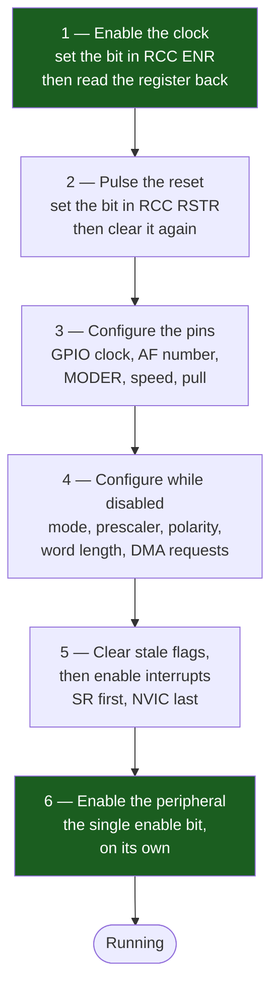

# The Anatomy of a Peripheral

An STM32F411RE has a UART, three SPIs, three I²C controllers, eight timers, an ADC, a USB controller, an RTC, two watchdogs and two DMA engines. The reference manual gives each of them thirty to eighty pages, and read front to back they look like thirteen unrelated pieces of hardware. They are not. They are thirteen instances of one design, drawn by the same team, wired onto the same two buses, and configured by the same six steps in the same order every time.

The mental model: **a peripheral is a small state machine with a power switch, a reset line, a settings block, a mailbox, and a bell.** The power switch is a bit in an RCC register. The reset line is a bit in another RCC register. The settings block is a handful of control registers that the state machine samples once, when you start it. The mailbox is a data register. The bell is a status register whose flags you either poll or route into the NVIC. Once you have that shape in your head, a peripheral chapter you have never read becomes a lookup — *where is the enable bit, where is the prescaler, which flag means "done"* — instead of eighty pages of new material.

The rest of this folder assumes this page. Every peripheral chapter that follows opens with "bring the peripheral up as described in [The Anatomy of a Peripheral]" and then goes straight to what is *different* about that block, because the part that is the same is here.

:::info[Prerequisites]
[Register-Level Programming](../04-bare-metal-programming/register-level-programming.md) supplies the memory-mapped I/O model and the clear-then-set field idiom every example below uses. [Configuring the Clock Tree](../04-bare-metal-programming/clock-tree-configuration.md) is where the bus clocks that feed these peripherals come from, and it is the page that explains why APB1 and APB2 have different limits. [A GPIO Driver from Scratch](../04-bare-metal-programming/gpio-driver-from-scratch.md) is the smallest complete instance of the pattern on this page.
:::

## Where a peripheral is attached, and why it matters

Every peripheral hangs off exactly one bus, and which bus decides three things you cannot change later: its address, which `RCC` register holds its clock-enable bit, and what frequency it sees.

| Bus | Peripherals on the F411 | Max frequency | Enable register | Reset register |
|---|---|---|---|---|
| **AHB1** | GPIOA–GPIOH, CRC, DMA1, DMA2 | `HCLK`, ≤ 100 MHz | `RCC_AHB1ENR` | `RCC_AHB1RSTR` |
| **AHB2** | USB OTG FS | `HCLK`, ≤ 100 MHz | `RCC_AHB2ENR` | `RCC_AHB2RSTR` |
| **APB1** | TIM2–TIM5, WWDG, SPI2/3, USART2, I2C1–3, PWR | `PCLK1`, ≤ 50 MHz | `RCC_APB1ENR` | `RCC_APB1RSTR` |
| **APB2** | TIM1, TIM9–11, USART1/6, SPI1/4/5, ADC1, SDIO, SYSCFG | `PCLK2`, ≤ 100 MHz | `RCC_APB2ENR` | `RCC_APB2RSTR` |

Buses matter for a fourth reason that catches people writing their second driver: **on the F411, SPI1 and SPI2 are the same hardware block on different buses.** Their register maps are identical, so a driver written against `SPI_TypeDef` works on both — but the baud-rate prescaler divides a different clock, so the same `BR` field produces 50 MHz on SPI1 and 25 MHz on SPI2. Bus membership is a driver input, not an implementation detail.

The addresses follow from the bus too. Peripherals are laid out contiguously per bus starting at `0x4000 0000` (RM0383 Rev 4, Table 1 "STM32F411xC/E register boundary addresses"), and the ordering within a bus is the ordering of the bits in that bus's enable register. `GPIOA` is at `0x4002 0000` and is bit 0 of `RCC_AHB1ENR`; `GPIOB` is `0x400` further along and is bit 1. That regularity is what makes the `((uint32_t)port - GPIOA_BASE) / 0x400u` trick in the GPIO driver work, and it is worth knowing so you can sanity-check a base address you have typed by hand.

## The six registers every peripheral has

Names differ by block and by vendor; the roles do not.

| Role | Where it lives on STM32 | What it does | The trap |
|---|---|---|---|
| **Clock gate** | one bit in `RCC_<bus>ENR` | Connects the peripheral to its bus clock. Off at reset. | Missing it makes every other register read as zero. This is the single most common bring-up failure. |
| **Reset** | one bit in `RCC_<bus>RSTR`, same bit position | Forces the block back to its documented reset state. | It is a level, not a pulse — you must clear it again. |
| **Low-power gate** | one bit in `RCC_<bus>LPENR`, same bit position | Whether the clock keeps running in Sleep mode. On at reset. | A peripheral that must wake the core needs this *left* on; one that must not waste current needs it cleared. |
| **Control / configuration** | `CR1`, `CR2`, `CCMR1`, `SMCR`, `CFGR`… | Mode, polarity, word length, prescaler, DMA and interrupt enables. | Most fields are sampled when the block is enabled and are documented as "must not be changed while enabled". |
| **Status** | `SR` or `ISR` | One flag per event: data ready, transfer complete, error. | Clearing is per-flag and inconsistent — see below. |
| **Data** | `DR`, `TDR`/`RDR` | The mailbox. Reading or writing it is often what clears a status flag. | An accidental read of `DR` in a debugger watch window consumes a byte. |

Two more that are not universal but are common enough to look for: a **baud/period register** (`BRR`, `PSC`+`ARR`, `TIMINGR`) whose value is always derived from the bus clock, and an **interrupt-enable set** that is separate from the status flags. Those two being separate is the point: **a flag being set and an interrupt firing are different events.** A polled driver watches flags with all interrupt enables clear; an interrupt-driven driver sets the enable bits and never polls. Setting an interrupt enable while an old flag is still set fires the handler immediately, which is a fine way to lose a first byte.

### The enable register, as bits

```wavedrom title="RCC_APB1ENR — one bit per APB1 peripheral; all zero at reset" alt="Bit-field strip of the 32-bit RCC APB1 peripheral clock enable register showing TIM2EN through TIM5EN in bits 0 to 3, WWDGEN at bit 11, SPI2EN and SPI3EN at bits 14 and 15, USART2EN at 17, I2C1EN to I2C3EN at 21 to 23, and PWREN at bit 28"
{ reg: [
    { bits: 1, name: "TIM2EN", type: 2 },
    { bits: 1, name: "TIM3EN", type: 2 },
    { bits: 1, name: "TIM4EN", type: 2 },
    { bits: 1, name: "TIM5EN", type: 2 },
    { bits: 7, name: "reserved", type: 1 },
    { bits: 1, name: "WWDGEN", type: 4 },
    { bits: 2, name: "reserved", type: 1 },
    { bits: 1, name: "SPI2EN", type: 4 },
    { bits: 1, name: "SPI3EN", type: 4 },
    { bits: 1, name: "res", type: 1 },
    { bits: 1, name: "USART2EN", type: 5 },
    { bits: 3, name: "reserved", type: 1 },
    { bits: 1, name: "I2C1EN", type: 5 },
    { bits: 1, name: "I2C2EN", type: 5 },
    { bits: 1, name: "I2C3EN", type: 5 },
    { bits: 4, name: "reserved", type: 1 },
    { bits: 1, name: "PWREN", type: 3 },
    { bits: 3, name: "reserved", type: 1 }
  ],
  config: { hspace: 1000, bits: 32, lanes: 2 }
}
```

| Bits | Field | Access | Reset | Meaning |
|---|---|---|---|---|
| 0–3 | `TIM2EN`…`TIM5EN` | rw | `0` | Clock to the four APB1 general-purpose timers. |
| 11 | `WWDGEN` | rw | `0` | Clock to the window watchdog. |
| 14, 15 | `SPI2EN`, `SPI3EN` | rw | `0` | Clock to SPI2 and SPI3. |
| 17 | `USART2EN` | rw | `0` | Clock to USART2 — the one wired to the ST-LINK virtual COM port on a Nucleo. |
| 21–23 | `I2C1EN`…`I2C3EN` | rw | `0` | Clock to the three I²C controllers. |
| 28 | `PWREN` | rw | `0` | Clock to the power controller. Needed before *any* `PWR->CR` access, including voltage scaling. |
| others | reserved | r | `0` | Read as zero, must be kept at reset value. |

`RCC_APB1RSTR` has the identical layout with the same bit positions (RM0383 Rev 4 §6.3.5–§6.3.12 covers all four reset registers and all four enable registers). That parallelism is deliberate and is worth exploiting in a driver: one bit number serves both operations.

## The universal bring-up sequence

This is the sequence the rest of the folder cites. Six steps, always in this order.



Each step exists because skipping it produces a specific, recognisable failure:

1. **Clock first.** With the gate closed the peripheral's registers are not merely unconfigured, they are *not decoded*. Writes are discarded and reads return zero. Nothing else on this list can work.
2. **Reset, because you are not the first code to run.** A bootloader, a previous firmware image that a warm reset did not clear, or your own re-initialisation on a retry all leave configuration bits set. Pulsing the reset bit means step 4 starts from the reset values printed in the manual instead of from an unknown state. Note that the *system* reset does this for you at power-on but not after a soft reset of your own code, which is exactly when it matters.
3. **Pins before the peripheral, not after.** A peripheral driving a pin that is still in input mode transmits into a disconnected mux; the block reports success and the wire is silent. Pin configuration is its own bring-up — the GPIO port needs its own clock enable in `RCC_AHB1ENR` first.
4. **Configure while disabled.** Most control fields are documented as "must not be changed when the peripheral is enabled". Some are latched at enable time and simply ignored afterwards; a few produce genuinely undefined behaviour. Writing the prescaler after the enable bit is the classic version and gives you a peripheral running at the wrong speed with every register reading back exactly what you intended.
5. **Clear flags before enabling interrupts.** Status flags survive reconfiguration. Enabling an interrupt whose flag is already set calls the handler before you have returned from `init()`, into a driver whose state variables are half-written.
6. **Enable last, on its own line.** The enable bit is the start button. Setting it in the same write as the configuration is not wrong on every block, but it makes the "configure while disabled" rule impossible to check by reading the code.

### In code

```c title="periph_bringup.c"
#include "stm32f4xx.h"

/* Steps 1 and 2, for any APB1 peripheral, given its bit mask. */
static void apb1_clock_enable_and_reset(uint32_t mask)
{
    RCC->APB1ENR |= mask;
    (void)RCC->APB1ENR;          /* step 1: read-back. See the warning below. */

    RCC->APB1RSTR |=  mask;      /* step 2: assert ... */
    RCC->APB1RSTR &= ~mask;      /*         ... and release. It is a level. */
}

void spi2_init(void)
{
    apb1_clock_enable_and_reset(RCC_APB1ENR_SPI2EN);

    /* Step 3: pins. SPI2 is AF5 on PB13/PB14/PB15 (RM0383 Table 9). */
    RCC->AHB1ENR |= RCC_AHB1ENR_GPIOBEN;
    (void)RCC->AHB1ENR;
    /* ... gpio_configure() calls, see the GPIO driver page ... */

    /* Step 4: configure while CR1.SPE is still 0. */
    SPI2->CR1 = SPI_CR1_MSTR                 /* master                       */
              | (2u << SPI_CR1_BR_Pos)       /* PCLK1 / 8 = 6.25 MHz @ 50 MHz */
              | SPI_CR1_SSM | SPI_CR1_SSI;   /* software slave management    */
    SPI2->CR2 = 0u;

    /* Step 5: no stale flags, then the NVIC. */
    (void)SPI2->DR;                          /* drains RXNE if it was set    */
    (void)SPI2->SR;
    NVIC_SetPriority(SPI2_IRQn, 6u);
    NVIC_EnableIRQ(SPI2_IRQn);

    /* Step 6. */
    SPI2->CR1 |= SPI_CR1_SPE;
}
```

The helper is worth having exactly once per bus. Four functions — `ahb1_`, `ahb2_`, `apb1_`, `apb2_` — remove every hand-written read-back from the rest of the codebase, which is the only reliable way to stop one being forgotten.

<Tabs>
<TabItem value="cmsis" label="CMSIS register level" default>

```c
RCC->APB1ENR |= RCC_APB1ENR_TIM3EN;
(void)RCC->APB1ENR;                  /* the guard, written by hand */
```

</TabItem>
<TabItem value="hal" label="ST HAL macro">

```c
/* stm32f4xx_hal_rcc.h — ST's own definition, verbatim in shape: */
#define __HAL_RCC_TIM3_CLK_ENABLE() do { \
      __IO uint32_t tmpreg = 0x00U; \
      SET_BIT(RCC->APB1ENR, RCC_APB1ENR_TIM3EN); \
      /* Delay after an RCC peripheral clock enabling */ \
      tmpreg = READ_BIT(RCC->APB1ENR, RCC_APB1ENR_TIM3EN); \
      UNUSED(tmpreg); \
    } while(0U)

__HAL_RCC_TIM3_CLK_ENABLE();          /* the guard is inside */
```

</TabItem>
</Tabs>

That `tmpreg` read is not defensive style. It is the read-back guard, shipped by ST in every one of these macros with a comment naming exactly why — and it is the strongest available evidence that the delay is real, because a vendor does not put a dead load in a hot macro for decoration.

## Status flags: the three ways to clear one

There is no single convention, and getting it wrong gives you either a handler that fires forever or a flag you never see. The three families, all of which appear on this part:

- **Write 1 to clear.** `TIMx_SR` on the timers, `DMA_LIFCR`/`HIFCR` on the DMA controller. Write a mask with a 1 in the bit you want cleared. **Never `|=`** — a read-modify-write clears every flag that happened to be set at read time, including ones another context had not handled yet. `TIM3->SR = ~TIM_SR_UIF;` (write zeros to the ones you are keeping) is the correct idiom on the timers.
- **Cleared by a sequence of accesses.** The F4 USART is the notorious one: `RXNE` clears when you read `USART_DR`, and `ORE` clears only when you read `USART_SR` *and then* read `USART_DR`. A debugger that displays `USART2->SR` in a watch window performs the first half of that sequence on every single-step.
- **Cleared by writing the data register.** `TXE` on SPI and USART goes away when you put the next word in. There is no explicit clear at all.

Which family a flag belongs to is in the register description, in the access column, and it is worth reading rather than guessing — the cost of guessing is a handler that re-enters immediately and a system that looks hung.

## What "the peripheral does nothing" actually means

The symptom is always the same and it is always undramatic. `init()` returns. No fault, no error flag, no hang. The pin does not move, the flag never sets, and every register you inspect in the debugger reads `0x0000 0000` — including the ones you just wrote a non-zero value to.

That last detail is the whole diagnosis. **A register that reads back as zero immediately after you wrote it is a clock-gate problem, not a configuration problem.** The bus never decoded the access. Check the one bit in `RCC_AHB1ENR` or `RCC_APB1ENR` before you check anything else, and check it for *every* block involved — a UART needs its own clock and the GPIO port's clock, and forgetting the second one gives you a peripheral that reports transmit-complete into a pin that is still an input.

:::warning[The clock enable that had not taken effect yet, and the reset that never released]
Two failures with the same shape: the code is correct, the sequence is correct, and the peripheral still does not run.

**The write that landed one cycle too late.** Enabling a peripheral clock is a write to an RCC register on the AHB, and the peripheral's registers are on APB1 or APB2 behind a bridge. The write is posted; the core does not wait for it. If the very next instruction accesses the peripheral, the access can reach the bridge before the clock gate has actually opened, and it is silently dropped — one write lost, out of a sequence of twenty, with no flag and no fault. The symptom is a peripheral that works when you build at `-O0` and stops working at `-O2`, because the optimiser removed the two instructions that were accidentally providing the delay. It also comes and goes when you add a `printf` to debug it, which is how it eats a day.

The fix is one line: **read the enable register back before touching the peripheral.** `(void)RCC->APB1ENR;` forces the core to wait for the bridge to return data, by which point the gate is open. ST documents the delay as a note against the RCC enable registers (RM0383 Rev 4 §6.3.9–§6.3.12) and as an erratum, "Delay after an RCC peripheral clock enabling", in the STM32F411 errata sheet; the workaround they publish is exactly this read-back, and it is why every `__HAL_RCC_*_CLK_ENABLE()` macro ends with a dummy read of the bit it just set. Do not replace it with a `__NOP()` count — the required delay depends on the AHB/APB prescaler ratio, and the read-back is correct at every ratio.

**The reset bit left asserted.** `RCC_APB1RSTR` is a level, not a strobe. Writing `RCC->APB1RSTR |= RCC_APB1RSTR_TIM3RST;` and forgetting the matching clear holds the timer in reset forever. Now every register reads zero *and* every write is discarded — indistinguishable, in the debugger, from a missing clock enable. Both bits are in RCC, one register apart, and the way to tell them apart in ten seconds is to read `RCC->APB1ENR` and `RCC->APB1RSTR` and check that the peripheral's bit is `1` in the first and `0` in the second.
:::

:::note[This is a family pattern, not a universal one]
The six-step sequence generalises to essentially every microcontroller; the register names do not. On an NXP LPC or a Kinetis the gates live in `SYSCON`/`SIM_SCGCx`, on an nRF52 most peripherals have no gate at all because the PPI/clock management is automatic, and on an ESP32 they are in `DPORT`. Even inside ST, the F4's `RCC_APB1ENR` becomes `RCC_APB1ENR1` on an L4 and `RCC_APBENR1` on a G0. Read your part's RCC-equivalent chapter once and the mapping is mechanical; assume the F4 names and you will not find the register.
:::

## See also

- [Timers and Counters](./timers-and-counters.md) — the first peripheral to bring up with the sequence above, and the one whose prescaler arithmetic depends most on which bus it sits on.
- [Writing a Driver Worth Reusing](./writing-a-portable-driver.md) — where this bring-up sequence belongs in a layered driver, and how to keep it out of application code.
- [A GPIO Driver from Scratch](../04-bare-metal-programming/gpio-driver-from-scratch.md) — the smallest complete worked instance: clock enable, read-back, configure, use.
- [Configuring the Clock Tree](../04-bare-metal-programming/clock-tree-configuration.md) — where `PCLK1` and `PCLK2` come from, and the APB1 ≤ 50 MHz limit that shapes the bus table above.
- [CMSIS and Vendor HALs](../04-bare-metal-programming/cmsis-and-vendor-hals.md) — the device header that defines `RCC_APB1ENR_SPI2EN` and friends, and what ST's HAL layer does with them.

## References

- STMicroelectronics — [**RM0383**, *STM32F411xC/E advanced Arm-based 32-bit MCUs reference manual*](https://www.st.com/resource/en/reference_manual/rm0383-stm32f411xce-advanced-armbased-32bit-mcus-stmicroelectronics.pdf), consulted at **Rev 4** (May 2025). §2.1 "System architecture" and Table 1 "Register boundary addresses" for which peripheral is on which bus and at what address; §6.3.5–§6.3.8 for the four `RCC_*RSTR` reset registers and §6.3.9–§6.3.12 for the four `RCC_*ENR` enable registers, including the note about the delay between enabling a clock and the peripheral responding; §6.3.13 onward for the `*LPENR` low-power gates.
- STMicroelectronics — [**ES0287**, *STM32F411xC/E device errata*](https://www.st.com/resource/en/errata_sheet/es0287-stm32f411xcstm32f411xe-device-errata-stmicroelectronics.pdf). "Delay after an RCC peripheral clock enabling" — the erratum behind the read-back guard, with ST's own two workarounds (a dummy read of the enable register, or an unrelated instruction sequence long enough to cover the delay).
- STMicroelectronics — [**STM32CubeF4 HAL/LL driver source**](https://github.com/STMicroelectronics/STM32CubeF4). `Drivers/STM32F4xx_HAL_Driver/Inc/stm32f4xx_hal_rcc.h` for the `__HAL_RCC_*_CLK_ENABLE()` macros quoted above, including the `tmpreg` read and the "Delay after an RCC peripheral clock enabling" comment.
- STMicroelectronics — [**UM1724**, *STM32 Nucleo-64 boards (MB1136)*](https://www.st.com/resource/en/user_manual/um1724-stm32-nucleo64-boards-mb1136-stmicroelectronics.pdf), consulted at **Rev 14** (2020). §6.8 for the ST-LINK virtual COM port on USART2, which is why `USART2EN` is the APB1 bit you will set first on this board.
- Elecia White — *Making Embedded Systems*, 2nd edition (O'Reilly, 2024). Chapter 4, "Outputs, Inputs, and Timers", frames the same clock/reset/configure/enable discipline vendor-independently and is the best short treatment of why peripheral initialisation order is a correctness property rather than a style choice. Purchase required.
