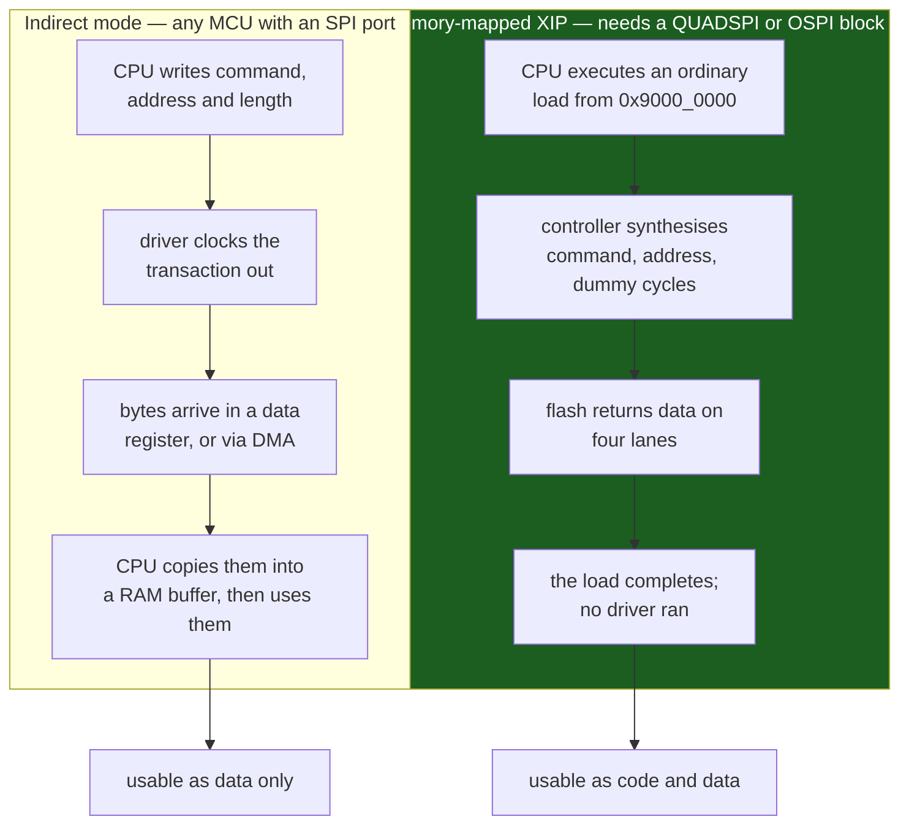

# External Memory and QSPI

The moment your data stops fitting on-chip, the interesting question is not *which memory* — it is **whether the processor has to execute from it, or merely read it**. Those two requirements lead to completely different hardware. Data you read into a buffer can live behind four wires and a software driver, and a plain SPI port is enough. Code the CPU fetches instructions from must appear in the address map, which means a controller that turns a bus read into a flash transaction with no software involved at all.

That distinction — **indirect access versus memory-mapped execute-in-place** — is what this page is about, because it is the only thing that changes the cost of external memory by two orders of magnitude.

And the honest starting point for this board: **the STM32F411 has neither a QUADSPI controller nor an FSMC/FMC external-memory controller.** RM0383 has no chapter for either, and the CMSIS device header defines no `QUADSPI`, `FSMC` or `FMC` base address — the blocks are absent from the die. On this part, "external memory" means a serial NOR flash on one of the three SPI ports, driven entirely in software, in indirect mode, always. Everything below about memory-mapped mode is the concept and the parts that have it, and it is worth knowing precisely because the absence is a reason to choose a different part.

## Two ways to reach an external chip



Indirect mode is a protocol conversation: you build a command, you send it, you collect a reply. It costs a driver call per access and a RAM buffer to land in, which is completely fine for a font table, a firmware image being staged for an update, or a log being appended.

Memory-mapped mode is the trick. The QUADSPI block on the parts that have it claims a region of the address map — `0x9000 0000` on STM32 — and converts every AHB read of that region into the corresponding read command on the serial bus, transparently. A `ldr r0, [r1]` against that region simply works. **Which means the linker can put code there**, and the CPU can execute it, and you have turned a 40-cent serial flash into program memory.

## Serial NOR in indirect mode, with real numbers

Take a common part — the Winbond **W25Q128JV**, 128 Mbit (16 MB), 3 V, in an 8-pin SOIC — and pin the arithmetic to its datasheet (Rev F, March 2018) rather than to intuition.

| Parameter | Value | Note |
|---|---|---|
| Capacity | 16 MB | 4096 sectors of 4 KB; 256 blocks of 64 KB |
| Max clock | 133 MHz | single, dual and quad |
| Program page | 256 bytes | writes wrap within the page — see below |
| Page program `tPP` | typ 0.4 ms, **max 3 ms** | |
| 4 KB sector erase `tSE` | typ 45 ms, **max 400 ms** | |
| 64 KB block erase `tBE2` | typ 150 ms, **max 2 s** | |
| Chip erase `tCE` | typ 40 s, **max 200 s** | |
| Endurance | **min 100 000 cycles** per sector | ten times the F411's internal flash |
| Retention | more than 20 years | |
| Power-down current | &lt; 1 µA typ | |

Two of those rows are the reason external serial flash exists as a category. **4 KB erase granularity** against the F411's 16-to-128 KB sectors, and **100 000 cycles** against the internal flash's guaranteed 10 000 (DS Table 47) — a 4 KB erase unit with ten times the endurance is a fundamentally better substrate for a log or a settings store than the MCU's own array. See [Internal Flash and EEPROM Emulation](./flash-and-eeprom-emulation.md) for the arithmetic on when the internal one runs out.

On this board the ceiling is the SPI port. SPI1 is on APB2 and its fastest prescaler setting gives `PCLK2 / 2` = 50 MHz, so:

```text
single-lane at 50 MHz  =  50 Mbit/s  =  6.25 MB/s
  reading the whole 16 MB chip       =  2.6 seconds
  a 4 KB sector                      =  655 us

fixed overhead of a 03h read command:
  8 command clocks + 24 address clocks = 32 clocks = 640 ns at 50 MHz
```

That 640 ns is the number that decides everything about how you use the chip. Amortised over a 4 KB sequential read it is nothing. Paid on every 4-byte random access it is a 160× overhead, which is why an external serial flash is a good streaming device and a terrible random-access one — and why you never put a data structure you intend to walk on it without a RAM cache in front.

The [SPI in Depth](./spi-in-depth.md) page covers the clock-polarity and chip-select mechanics; serial NOR parts accept both mode 0 and mode 3, and the two `/HOLD` and `/WP` pins matter more than they look. They double as IO2 and IO3 in quad mode, so a board that enables the quad-enable bit and leaves them tied low has just disabled the chip in a way that presents as intermittent read corruption.

## Memory-mapped XIP, and what the latency really costs

On a part with a QUADSPI controller, memory-mapped mode is configured once — command opcode, address size, dummy cycles, data lanes — and then forgotten. Every access from then on is a bus read.

The cost is a fixed preamble on every transaction the controller has to start. In quad mode with a fast-read-quad-IO command that is roughly:

```text
 8 clocks   command (single lane)
 6 clocks   24-bit address at 4 bits per clock
~6 clocks   mode bits and dummy cycles
--------
~20 clocks of overhead before the first data bit
```

At a 100 MHz QSPI clock that is **200 ns**, which is about 20 CPU cycles on a 100 MHz Cortex-M, added to every access that is not served from something faster. Fetching 32 bytes then takes 20 + 64 = 84 clocks, so the overhead is 24% of the transaction; fetching 512 bytes drops it to 3%.

Which is the whole design constraint of XIP in one line: **it is only viable when accesses are large and sequential, or when a cache makes them so.** That is not a coincidence — it is why every STM32 that supports serious XIP is a Cortex-M7 part with an instruction cache (the F7 and H7 series). The cache turns scattered instruction fetches into 32-byte line fills, and the line fill is exactly the size at which the preamble stops dominating. A hypothetical XIP part with no cache would stall 20 cycles on most branches, and the effective execution rate would be a fraction of the same code running from internal flash.

Two further properties of memory-mapped mode worth knowing before designing around it:

- **You cannot write through it.** The mapped region is read-only. Programming still requires indirect mode, which means dropping out of memory-mapped mode — and therefore not executing from the chip — for the duration.
- **The controller can usually be told to prefetch.** ST's QUADSPI has a prefetch buffer that continues reading sequentially past the requested bytes, which helps linear code and does nothing for a jump table.

## The driver, and where its seams go

A serial NOR driver is the clearest example in this folder of the layering [Writing a Driver Worth Reusing](./writing-a-portable-driver.md) argues for, because the three layers are physically obvious. The bottom layer is "clock these bytes out of an SPI port and clock those bytes back". The middle layer is the flash command set — read, page program, sector erase, read status — which is identical whether the bytes travel over SPI1, SPI2, a bit-banged port or a QUADSPI controller. The top layer is what the application wants: `read(offset, buf, len)` and `write(offset, buf, len)`, with no page boundaries or busy-waiting visible.

Only the bottom layer is chip-specific, and it is the layer you replace when the part changes.

```c title="w25q.c — the two operations everything else is built from"
/* Injected transport: the only thing that knows about SPI at all. */
struct nor_bus {
    void (*select)(bool asserted);
    void (*xfer)(const uint8_t *tx, uint8_t *rx, size_t n);
};

static uint8_t nor_read_status(const struct nor_bus *bus)
{
    const uint8_t cmd[2] = { 0x05u, 0xFFu };            /* Read Status Reg-1 */
    uint8_t rx[2];

    bus->select(true);
    bus->xfer(cmd, rx, sizeof cmd);
    bus->select(false);
    return rx[1];
}

/* Every program and erase ends here. The timeout comes from the datasheet
 * MAXIMUM for the operation, never the typical: 3 ms page program,
 * 400 ms 4 KB sector erase, 2 s 64 KB block erase (W25Q128JV, AC chars). */
static bool nor_wait_ready(const struct nor_bus *bus, uint32_t timeout_ms)
{
    uint32_t deadline = now_ms() + timeout_ms;

    while (nor_read_status(bus) & 0x01u) {              /* BUSY */
        if ((int32_t)(now_ms() - deadline) >= 0) { return false; }
    }
    return true;
}

/* Splitting at the 256-byte page boundary belongs HERE, once, not in
 * every caller. A program that crosses one wraps within the same page. */
bool nor_write(const struct nor_bus *bus, uint32_t addr,
               const uint8_t *data, size_t len)
{
    while (len > 0u) {
        size_t room  = 256u - (addr & 0xFFu);
        size_t chunk = (len < room) ? len : room;

        if (!nor_write_enable(bus)) { return false; }   /* 06h, EVERY time */
        if (!nor_page_program(bus, addr, data, chunk)) { return false; }
        if (!nor_wait_ready(bus, 3u)) { return false; } /* tPP max */

        addr += chunk;
        data += chunk;
        len  -= chunk;
    }
    return true;
}
```

The `struct nor_bus` indirection is what makes this testable on a host: substitute an `xfer` that runs against an in-memory model of the chip and the page-splitting, the write-enable discipline and the busy-polling are all exercised without hardware. It is also what lets the same middle layer sit on a QUADSPI controller later, since only `select` and `xfer` change.

## Parallel external memory: FSMC, FMC and SDRAM

The other family of external-memory controllers drives a parallel bus, and the trade is completely different: much higher bandwidth, and a large fraction of your pins.

| Controller | Found on | Drives | Notes |
|---|---|---|---|
| **FSMC** | STM32F405/407/415/417 | NOR flash, PSRAM, SRAM, NAND | The original; no SDRAM support |
| **FMC** | STM32F427/429/437/439, F446, F469/479, F7, H7 | the above plus **SDRAM** | SDRAM controller handles refresh in hardware |
| **QUADSPI** | STM32F412/F413, F446, F469/479, F7, H7, L4 | serial NOR (and some NAND) | 6 pins, memory-mapped XIP |
| — | **STM32F401, STM32F411** | nothing | no external-memory controller of any kind |

The pin cost is the deciding factor far more often than the bandwidth is. A 16-bit SDRAM interface needs address, data, bank-select, `RAS`, `CAS`, `WE`, `CKE`, `CLK` and byte masks — on the order of forty pins. That is more I/O than the LQFP64 package on a NUCLEO-F411RE *has in total*, which is a second, independent reason the F411 does not offer it. Parallel external memory is a decision you make at the package and part level, before the schematic, and it usually means moving to a 100- or 144-pin device.

SDRAM also brings requirements that are invisible in the datasheet's headline numbers: an initialisation sequence with precise timing, a refresh interval the controller must honour or the data evaporates, and a signal-integrity problem — thirty-odd traces switching simultaneously at 100 MHz — that is a real PCB design task rather than a routing exercise.

## When external memory is cheaper than a bigger MCU

The question is worth asking explicitly rather than defaulting either way.

| You need | External memory | Bigger MCU |
|---|---|---|
| More **code** space | Only with QUADSPI + XIP + an instruction cache; otherwise no | **Yes** — the straightforward answer |
| More **read-only data** (fonts, audio, tables, web assets) | **Yes** — a 16 MB serial flash costs well under a dollar and six pins | Rarely justified |
| More **working RAM** | Only with FMC + SDRAM, and 40 pins | **Yes**, usually |
| A high-endurance **log or settings store** | **Yes** — 100k cycles and 4 KB erase units | No; a bigger MCU has the same 10k-cycle flash |
| A **firmware image staging area** for OTA updates | **Yes** — the classic use, and it does not need XIP | Doubling internal flash for A/B images also works |

The rule of thumb that falls out: **external memory is a good answer for data and a poor answer for code.** Adding a serial flash to hold assets or stage an update is six pins, one part and a driver you write once. Adding one so the CPU can execute from it commits you to a QUADSPI part with a cache, an XIP-aware linker script, and a boot path that configures memory-mapped mode before it can jump — which is a system architecture decision, not a component choice.

:::warning[The write that vanished, and the loop that only wrote its first page]
Two serial-NOR failures that produce no error anywhere in the system, because the chip has no way to tell you.

**Not polling `BUSY` before the next command.** The W25Q128JV datasheet §7.1.1 states that while the `BUSY` bit is set the device "will ignore further instructions except for the Read Status Register and Erase/Program Suspend instruction". *Ignore* — not queue, not NACK, not error. A page program takes up to 3 ms and a 4 KB sector erase up to 400 ms, so a driver that issues a program immediately after an erase, or two programs back to back, sends its command into a chip that is not listening and the data is simply never written. The symptom is a file that is intermittently, partially correct: the bytes that happened to land after the chip went idle are right, the ones sent during the busy window are `0xFF`, and the boundary moves between runs because it depends on interrupt timing. The tell is that failures correlate with how *fast* the writing loop is — slowing it with a `printf` makes it work, which sends people looking for a race in their own code. Read the status register in a loop after every program, erase or status write, with a timeout sized against the datasheet **maximum** (3 ms, 400 ms, 2 s, 200 s) rather than the typical.

**One `Write Enable` for a multi-page write.** The `WEL` latch is cleared by hardware after every Page Program, Sector Erase, Block Erase, Chip Erase and Write Status Register instruction, and on power-up (datasheet §7.1.2). A loop that sends `06h` once and then programs sixteen 256-byte pages writes **the first page only**; the other fifteen are silently discarded because `WEL` was already 0. And because the first page is correct, a smoke test that checks the start of the buffer passes. Send `06h` before *every* program and every erase, without exception, and verify by reading back — a read-back comparison catches both of these failures in one step and is cheap next to a 3 ms program time. The related trap is the 256-byte page boundary: a program that crosses one does not continue into the next page, it **wraps to the start of the same page** and overwrites what you just wrote. Split writes at page boundaries in the driver, once, rather than trusting every caller to align.
:::

:::note[Naming across vendors and families]
"QSPI", "QUADSPI", "OCTOSPI" and "OSPI" are all the same idea at different widths, and ST's own naming shifted: the L4+ and H7 introduced OCTOSPI with eight lanes and a DDR mode, and the H7 adds a multiplexer so two chips share one controller. Other vendors call the equivalent block FlexSPI (NXP i.MX RT), QSPI (Nordic nRF52840), or SPIFI (NXP LPC). The serial NOR command set is largely common — `03h` read, `02h` page program, `20h` 4 KB sector erase, `06h` write enable, `05h` read status — because it descends from the same original SPI flash devices, and SFDP (JEDEC JESD216) lets a driver discover the rest at run time rather than hard-coding a part number.
:::

## See also

- [SPI in Depth](./spi-in-depth.md) — the bus every serial NOR part sits on: modes, chip-select timing, and the wiring limit that decides your real clock rate.
- [Internal Flash and EEPROM Emulation](./flash-and-eeprom-emulation.md) — the on-chip alternative, its 10 kcycle endurance and non-uniform sectors, and the point at which an external device becomes the right answer.
- [DMA](./dma.md) — how to move a 4 KB sector out of an SPI data register without spending 4096 interrupts on it.
- [The Linker Script](../03-toolchain-and-build/the-linker-script.md) — what would have to change to place a section in a memory-mapped external region, and why an XIP layout is a linker problem before it is a driver problem.
- [Reading a Datasheet](../01-hardware-foundations/reading-a-datasheet.md) — the skill this page leans on hardest: every number above came from a vendor table with stated conditions, and the typ/max distinction is the whole difference between the two warnings.

## References

- STMicroelectronics — [**RM0383**, *STM32F411xC/E advanced Arm-based 32-bit MCUs reference manual*](https://www.st.com/resource/en/reference_manual/rm0383-stm32f411xce-advanced-armbased-32bit-mcus-stmicroelectronics.pdf), consulted at Rev 2 (DocID026448). §2.3 "Memory map" and the chapter list are the citation for the negative claim on this page: there is no QUADSPI chapter and no FSMC/FMC chapter, and no external-memory region in the map. §20 covers the SPI blocks that are the F411's only route to an external memory device.
- Winbond — [**W25Q128JV** *3V 128M-bit serial flash memory with dual/quad SPI*](https://www.winbond.com/resource-files/w25q128jv%20revf%2003272018%20plus.pdf), Revision F (27 March 2018). §7.1.1 for the `BUSY` bit and the statement that the device ignores instructions while it is set; §7.1.2 for `WEL` and the complete list of instructions that clear it; the AC Characteristics table for `tPP`, `tSE`, `tBE1`, `tBE2` and `tCE` typ and max; the features list for the 100k-cycle endurance, 20-year retention and 133 MHz ceiling quoted above.
- STMicroelectronics — [**AN4760**, *Quad-SPI (QSPI) interface on STM32 microcontrollers*](https://www.st.com/resource/en/application_note/an4760-quadspi-interface-on-stm32-microcontrollers-stmicroelectronics.pdf). The controller this part does not have, described properly: indirect, status-polling and memory-mapped modes, the command/address/dummy-cycle configuration that produces the latency figures above, the prefetch buffer, and worked configurations for common serial NOR devices.
- STMicroelectronics — [**AN4031**, *Using the STM32F2, STM32F4 and STM32F7 Series DMA controller*](https://www.st.com/resource/en/application_note/an4031-using-the-stm32f2-stm32f4-and-stm32f7-series-dma-controller-stmicroelectronics.pdf). The bandwidth budgeting needed when a serial-flash stream and everything else contend for the bus matrix — relevant because a 6.25 MB/s SPI read sustained for seconds is a genuine load on this part.
- JEDEC — [**JESD216**, *Serial Flash Discoverable Parameters (SFDP)*](https://www.jedec.org/standards-documents/docs/jesd216b). The standard parameter table every modern serial NOR device carries, which lets a driver discover erase granularity, address width, dummy cycles and supported commands at run time instead of hard-coding a part number. Free registration required to download.
