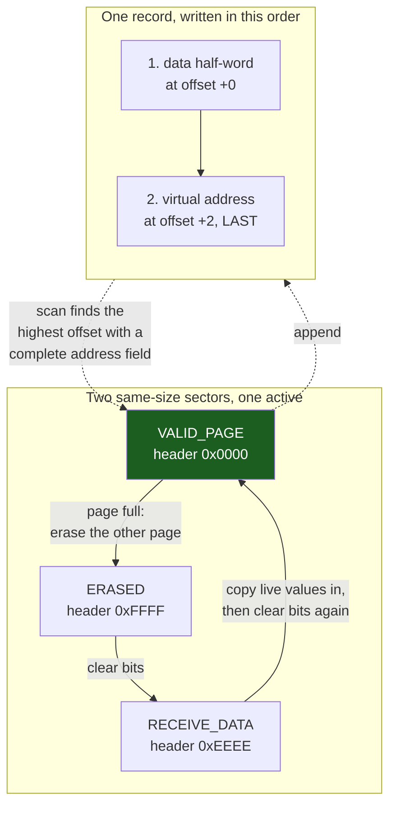

# Internal Flash and EEPROM Emulation

Flash is not memory that happens to be non-volatile. It is a **device with an asymmetric write model**, and every design decision about storing settings on an MCU comes out of that asymmetry: you can clear a bit at any time, cheaply, one word at a time — but you cannot set a bit back to 1 without erasing an entire sector, which takes up to two seconds, during which the processor cannot fetch instructions from the same flash it is executing from.

That is the whole problem in one sentence. A byte of RAM can be written 4 billion times a second, forever, in any order. A byte of flash can be written a few times before its sector must be erased, the erase costs a second of wall-clock time and a fraction of the sector's finite lifetime, and the CPU is *stalled* for the duration. Everything called "EEPROM emulation" is a scheme for hiding that mismatch behind an interface that looks like a variable.

:::info[Prerequisites]
[SSDs and NAND Flash](../../computer-science/storage/ssd-and-nand-flash.md) owns the physics — floating gates, tunnelling, why erase is block-granular, why endurance is finite and why retention and endurance trade against each other. This page assumes all of it and covers only what the STM32F4's embedded NOR flash does differently and what a driver must therefore do.
:::

## The sectors are not the same size, and that changes everything

The F411RE has 512 KB of flash starting at `0x0800 0000`, in **eight sectors of four different sizes** (RM0383 §3.3, Table 4):

| Sector | Address range | Size |
|---|---|---|
| 0 | `0x0800 0000` – `0x0800 3FFF` | 16 KB |
| 1 | `0x0800 4000` – `0x0800 7FFF` | 16 KB |
| 2 | `0x0800 8000` – `0x0800 BFFF` | 16 KB |
| 3 | `0x0800 C000` – `0x0800 FFFF` | 16 KB |
| 4 | `0x0801 0000` – `0x0801 FFFF` | **64 KB** |
| 5 | `0x0802 0000` – `0x0803 FFFF` | **128 KB** |
| 6 | `0x0804 0000` – `0x0805 FFFF` | 128 KB |
| 7 | `0x0806 0000` – `0x0807 FFFF` | 128 KB |

Erase granularity is **one sector, or the whole array** (RM0383 §3.5.3). There is no page erase, no smaller unit, no way to clear 256 bytes.

Read that table again with a storage scheme in mind and the consequence is immediate: **you cannot pick "two pages" arbitrarily.** Every EEPROM-emulation design in existence assumes two interchangeable regions of equal size that can be swapped. On this part that forces your hand — sectors 1 and 2 (16 KB each) work; sector 3 and sector 4 do not, because they are 16 KB and 64 KB and the transfer logic that copies one into the other has no valid definition. Nothing in the toolchain will stop you configuring the mismatched pair; the code will simply overrun or under-fill and behave unpredictably once the first page fills, months into deployment.

Sector 0 holds your vector table and reset handler, so it is unavailable. The smallest legitimate pair on this part is sectors 1 and 2, and it costs **32 KB — 6% of the device's flash — to store a handful of settings.**

## Times, endurance and retention, with conditions

Every number below is from the STM32F411xC/E datasheet (DS10314 / DocID026289 Rev 4), at TA = −40 to 105 °C unless stated.

| Operation | Typ | Max | Conditions | Source |
|---|---|---|---|---|
| Word program | 16 µs | **100 µs** | any PSIZE; max measured after 100k erases | Table 45 |
| Erase 16 KB sector | 250 ms | **500 ms** | PSIZE = x32 (2.7–3.6 V) | Table 45 |
| Erase 64 KB sector | 550 ms | 1100 ms | PSIZE = x32 | Table 45 |
| Erase 128 KB sector | **1 s** | **2 s** | PSIZE = x32 | Table 45 |
| Mass erase | 4 s | 8 s | PSIZE = x32 | Table 45 |
| Endurance | — | — | **10 kcycles min**, −40 to +85 °C or +105 °C | Table 47 |
| Retention | — | — | **30 years** at 1 kcycle, TA = 85 °C | Table 47 |
| Retention | — | — | 20 years at 10 kcycle, TA = 55 °C | Table 47 |
| Retention | — | — | 10 years at 1 kcycle, TA = 105 °C | Table 47 |

Two of those deserve to be said out loud. **Ten thousand erase cycles is the guaranteed minimum** — not a hundred thousand, and not per byte: per sector. And the retention rows show the trade explicitly: cycling a sector to its 10k limit drops guaranteed retention from 30 years to 20, and running hot drops it to 10. A design that erases a sector every few minutes has consumed its flash inside a year and will not be diagnosed as a flash-wear problem, because what it looks like is a settings file that intermittently reads back as garbage.

Note that the erase time also depends on `PSIZE`, which depends on your supply voltage. At 2.1–2.4 V you are restricted to x8 parallelism and a 128 KB sector erase takes typically 2 s and up to 4 s (RM0383 §3.5.2 Table 6; DS Table 45) — twice as long as the numbers above, on a battery-powered board that is precisely where you least want it.

## Executing from flash while writing to it

RM0383 §3.5 states the constraint without hedging:

> Any attempt to read the Flash memory on STM32F4xx while it is being written or erased causes the bus to stall. Read operations are processed correctly once the program operation has completed. This means that code or data fetches cannot be performed while a write/erase operation is ongoing.

There is one flash bank on this part, so there is no read-while-write. The practical consequences are severe and are usually discovered late:

- **Your worst-case interrupt latency during an erase is the erase time.** Not microseconds — up to 2 seconds. Every ISR, every DMA completion handler, every UART overrun check simply does not run. Any real-time behaviour the product has is suspended for the duration.
- **The watchdog does not get refreshed**, which is exactly the interaction described in [Watchdogs](./watchdogs.md): a 1 s IWDG and a 128 KB sector erase are mutually exclusive, and the resulting reset lands in the middle of the erase.
- **Constants, lookup tables and string literals are unavailable too.** It is not only code — a `const` array in flash cannot be read either.

The escape is to **relocate the erase routine into SRAM**. Mark the function `__attribute__((section(".ramfunc"), noinline))`, have the linker script copy that section to RAM at start-up, and the CPU fetches its instructions from SRAM while the flash controller works. An ISR whose handler and whose data are also in RAM then continues to run, which is enough to keep a watchdog refresh alive. It is fiddly — every function it calls and every constant it touches must also be in RAM — which is why the more common answer is the honest one: design so the system is allowed to be unresponsive for two seconds, and do the update at a moment when that is acceptable.

## The rules for writing

```c title="flash_write.c — unlock, set parallelism, program, check"
#include "stm32f4xx.h"

static void flash_unlock(void)
{
    if (FLASH->CR & FLASH_CR_LOCK) {
        FLASH->KEYR = 0x45670123u;           /* KEY1 */
        FLASH->KEYR = 0xCDEF89ABu;           /* KEY2 — wrong order locks     */
    }                                        /* until the next system reset  */
}

/* Program one 32-bit word. Caller guarantees the target reads 0xFFFFFFFF. */
static bool flash_program_word(uint32_t addr, uint32_t value)
{
    while (FLASH->SR & FLASH_SR_BSY) { }

    FLASH->SR = FLASH_SR_PGSERR | FLASH_SR_PGPERR
              | FLASH_SR_PGAERR | FLASH_SR_WRPERR;   /* clear stale errors  */

    FLASH->CR &= ~FLASH_CR_PSIZE;
    FLASH->CR |= FLASH_CR_PSIZE_1;           /* x32: requires VDD >= 2.7 V  */
    FLASH->CR |= FLASH_CR_PG;

    *(volatile uint32_t *)addr = value;      /* access width must match PSIZE */
    __DSB();
    while (FLASH->SR & FLASH_SR_BSY) { }

    FLASH->CR &= ~FLASH_CR_PG;

    return (FLASH->SR & (FLASH_SR_PGSERR | FLASH_SR_PGPERR |
                         FLASH_SR_PGAERR | FLASH_SR_WRPERR)) == 0u
        && *(volatile uint32_t *)addr == value;      /* verify: always */
}
```

The rules that make or break this, all from RM0383 §3.5:

- **Bits go 1 → 0 only.** "Successive write operations are possible without the need of an erase operation when changing bits from 1 to 0. Writing 1 requires a Flash memory erase operation." This is not a limitation to work around — it is the primitive that every power-loss-safe format below is built on.
- **The access width must match `PSIZE`.** A word write with `PSIZE` set to x16 is a program-parallelism error (`PGPERR`), not a helpful conversion.
- **No write may cross a 128-bit row boundary.** It is refused and sets `PGAERR` (§3.5.4). Align records to 4 or 8 bytes and this never arises; write a packed 6-byte struct at an arbitrary offset and it will, eventually, on one record in twenty.
- **`HCLK` must be at least 1 MHz** for any program or erase (§3.5).
- **A wrong unlock sequence locks `FLASH_CR` until the next reset** and returns a bus error (§3.5.1). There is no retry.
- **Always read back and compare.** The status flags do not catch a cell that failed to program.

## A power-loss-safe record format

The scheme in ST's **AN3969** is the reference design, and it is worth understanding as a state machine rather than as a code drop, because the reasoning transfers to any flash device.



Three properties give it its power-loss safety, and each one is a direct consequence of "bits only go 1 → 0":

1. **Every state transition is a bit-clearing operation.** `0xFFFF` → `0xEEEE` → `0x0000` requires no erase, so a page's header can be advanced through its life cycle at any moment, atomically as far as a reader is concerned. There is never a window in which the header holds a value that is not one of the three legal states.
2. **The address field is written last.** A record whose data half-word is programmed but whose address half-word is still `0xFFFF` is, by definition, an incomplete record — and the scan on the next boot ignores it. Power lost between the two writes therefore loses the *new* value and keeps the *old* one, which is the correct failure: a settings store that reverts to the previous setting is recoverable, one that returns garbage is not.
3. **Values are never overwritten, only appended.** Reading a variable means scanning the page backwards for the most recent record with that virtual address. This is what removes erases from the write path: a variable can be updated thousands of times before the page fills and a transfer is needed.

The transfer is where the second page earns its keep. When the active page is full: mark the spare `RECEIVE_DATA`, copy the *latest* value of every virtual address into it, mark it `VALID_PAGE`, then erase the old one. If power is lost anywhere in that sequence, the boot-time scan finds either one `VALID_PAGE` (normal), or a `VALID_PAGE` plus a `RECEIVE_DATA` (transfer interrupted — restart it), or a `RECEIVE_DATA` alone (the erase completed but the header write did not — promote it). **Two `VALID_PAGE`s must never exist**, and the ordering above is chosen so that they cannot.

### What it costs

Take the smallest legal pair on this part — sectors 1 and 2, 16 KB each — and 4-byte records:

```text
records per page      = 16384 / 4              = 4096   (minus one for the header)
erases per page       = 10 000                 (DS Table 47, guaranteed minimum)
writes per page life  = 4095 x 10 000          = 40.9 million
two pages alternating = 81.9 million writes    total, before the store wears out

  at 1 write per minute:   ~156 years
  at 1 write per second:   ~2.6 years
  at 10 writes per second: ~95 days
```

That arithmetic is the design review. A settings store touched when a user changes something is effectively immortal. A log counter incremented once a second wears the part out inside a warranty period, and an operating-hours counter written every 100 ms destroys it in weeks. If your write rate lands in the wrong column, the fix is not a cleverer flash scheme — it is to keep the value in RAM and commit it on a schedule, on a power-fail warning, or on a state change, which is a change to the application and not to the driver.

## Wear levelling, and when it is worth it

The two-page scheme spreads wear across two sectors, which is levelling of a very crude kind. Adding more pages to the rotation multiplies endurance linearly and costs flash you probably need for code. Before reaching for a general wear-levelling layer, note what the append-only record format already achieves: **it converts N variable updates into N/records-per-page erases**, a reduction of three orders of magnitude on a 16 KB page. That factor is far larger than anything wear levelling on top of it will contribute.

Where the calculation genuinely does not close — a data logger, a totaliser, anything with a sustained write rate — the answer is a different device: an external I²C or SPI EEPROM with 1 million cycles and byte-granular writes, an FRAM with effectively unlimited endurance and no erase at all, or an external serial NOR flash with 100k cycles and small 4 KB sectors. See [External Memory and QSPI](./external-memory-and-qspi.md) for the last of those.

:::warning[The write that read back correctly and was gone a month later, and the two valid pages]
Two flash failures whose symptom appears long after the mistake.

**`PSIZE` set wider than the supply allows.** RM0383 §3.5.2 carries a note that is unusually direct about the consequence: "Any program or erase operation started with inconsistent program parallelism/voltage range settings may lead to unpredicted results. **Even if a subsequent read operation indicates that the logical value was effectively written to the memory, this value may not be retained.**" So a board running from a 2.5 V rail — a lithium cell nearing the end of its discharge curve, a regulator with more drop than the schematic suggested — with `PSIZE` left at x32 programs a word, verifies it, logs success, and loses it weeks later. Every check you could reasonably write passes. Retention is what fails, and retention is not testable in the time available. The defence is to select `PSIZE` from a measured supply voltage rather than a constant: read VDDA via `VREFINT` (see [ADC and DAC Drivers](./adc-and-dac-drivers.md)), pick the parallelism from RM0383 Table 6, and refuse to write at all below the range your chosen `PSIZE` requires. Boards that will run down a battery must use x8 and accept the doubled erase time.

**Two pages both marked valid.** Write the new page's `VALID_PAGE` header *before* erasing the old one and there is a window — up to 500 ms wide for a 16 KB sector — in which power loss leaves two valid pages behind. The next boot picks one, and which one it picks depends on the scan direction, so the device silently reverts to a state from several thousand writes ago. It reproduces roughly once per few hundred power cuts, which means never in test and repeatedly across a fleet. The symptom that identifies it is settings reverting to *old but internally consistent* values, not to defaults, and it is easy to confirm: dump both sectors and look at the two header words. Fix the ordering — the old page must be erased, or at minimum have its header cleared to a non-valid state, before the new page's header becomes `VALID_PAGE` — and make the boot-time scan treat two valid pages as a recoverable fault with a defined winner rather than an impossible state.
:::

:::note[Sector layout is per part, not per family]
The non-uniform 16/64/128 KB arrangement is an STM32F2/F4/F7 characteristic and it varies with density even inside the F411 line: the 256 KB F411xC has six sectors, not eight. Other families are entirely different — the STM32L4 uses uniform 2 KB pages in two banks and supports read-while-write, and the G0 uses uniform 2 KB pages with a page-erase command. Any storage layer that hard-codes a sector table must derive it from the part, and the device's flash size is readable at run time from the electronic signature at `0x1FFF 7A22` (RM0383 §24.2).
:::

## See also

- [SSDs and NAND Flash](../../computer-science/storage/ssd-and-nand-flash.md) — the physics of floating gates, erase blocks, endurance and retention that this page builds on rather than repeats.
- [Watchdogs](./watchdogs.md) — the interaction that bricks field updates: a 2-second erase against a 1-second watchdog, and the three ways out.
- [External Memory and QSPI](./external-memory-and-qspi.md) — where to put data when the internal flash's endurance or capacity does not close the calculation.
- [ADC and DAC Drivers](./adc-and-dac-drivers.md) — measuring VDDA via `VREFINT`, which is how you choose `PSIZE` from the real supply instead of a compile-time guess.
- [The Linker Script](../03-toolchain-and-build/the-linker-script.md) — where sectors are carved out of the image, and how a `.ramfunc` section gets copied to SRAM so an erase routine can run from RAM.

## References

- STMicroelectronics — [**RM0383**, *STM32F411xC/E advanced Arm-based 32-bit MCUs reference manual*](https://www.st.com/resource/en/reference_manual/rm0383-stm32f411xce-advanced-armbased-32bit-mcus-stmicroelectronics.pdf), consulted at **Rev 4** (May 2025). §3.3 Table 4 for the non-uniform sector map; §3.4.1–§3.4.2 for wait states and the ART accelerator; §3.5 for the 1 MHz `HCLK` floor and the statement that reads stall during program/erase; §3.5.1 for the `0x45670123`/`0xCDEF89AB` unlock and the lock-until-reset penalty for getting it wrong; §3.5.2 Table 6 for `PSIZE` versus supply range and the retention warning quoted above; §3.5.3–§3.5.4 for the sector-erase and program sequences, the 1→0 rule and `PGAERR` on a 128-bit row crossing; §24.2 for the flash-size register.
- STMicroelectronics — [**STM32F411xC/E datasheet**](https://www.st.com/resource/en/datasheet/stm32f411re.pdf) (DS10314 / DocID026289), consulted at Rev 4. Table 45 "Flash memory programming" for word-program and per-sector erase times at each `PSIZE`, with the note that the maximum program time is measured after 100k erase operations; Table 47 "Flash memory endurance and data retention" for the 10 kcycle minimum and the three retention rows with their cycle counts and temperatures.
- STMicroelectronics — [**AN3969**, *EEPROM emulation in STM32F40x/STM32F41x microcontrollers*](https://www.st.com/resource/en/application_note/an3969-eeprom-emulation-in-stm32f40xstm32f41x-microcontrollers-stmicroelectronics.pdf). The reference two-page scheme this page describes: the `ERASED`/`RECEIVE_DATA`/`VALID_PAGE` header states, the virtual-address record layout, the page-transfer procedure and its interrupted-transfer recovery cases, plus the flash-usage and timing figures for the supplied driver.
- STMicroelectronics — [**AN4894**, *EEPROM emulation techniques and software for STM32 microcontrollers*](https://www.st.com/resource/en/application_note/an4894-eeprom-emulation-techniques-and-software-for-stm32-microcontrollers-stmicroelectronics.pdf). The later, family-wide treatment: comparison of single-page, two-page and multi-page schemes, the write-rate and wear calculations done generically, and guidance on choosing between internal emulation and an external device.
- JEDEC — [**JESD22-A117**, *Electrically Erasable Programmable ROM (EEPROM) Program/Erase Endurance and Data Retention Stress Test*](https://www.jedec.org/standards-documents/docs/jesd22-a117d). What "10 kcycles minimum" and "30 years retention at 85 °C" are actually measured by, the accelerated-ageing method behind them, and why endurance and retention trade against each other — the methodology the datasheet's Table 47 is reported against. Free registration required to download.
