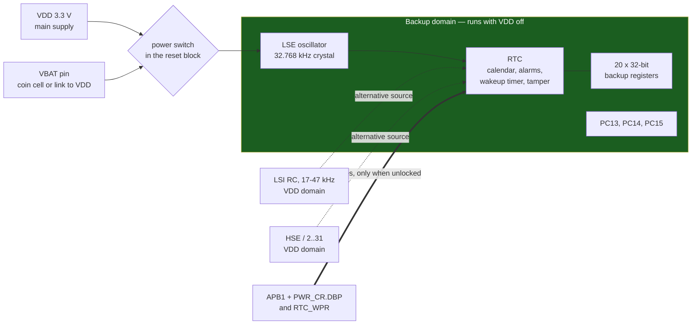

# RTC and Timekeeping

Every other peripheral in this folder lives in your power domain, stops when you stop, and forgets everything when the supply goes away. The RTC does not. It is a small independent machine in a **separate power domain** with its own oscillator, its own supply pin, and its own reset — and the only things it shares with the rest of the chip are a bus interface and a couple of locks that exist specifically to stop your code from disturbing it by accident.

That separation is the whole mental model. The RTC is not "a timer that counts seconds"; it is a device you talk to across a domain boundary. Everything awkward about programming it — the two-stage write unlock, the shadow registers, the initialisation mode, the fact that a system reset does not reset it — follows from the fact that it kept running while the processor that is now asking questions did not exist.

The consequence to internalise before writing a line of code: **if you skip the unlock, every write you perform is discarded and nothing tells you.** No fault, no error flag, no bus error. The register reads back its old value, your calendar stays at 1 January 2000, and the bug looks like a hardware failure.

## The backup domain



When `VDD` disappears, an analogue switch in the reset block connects the shaded block to `VBAT` instead (RM0383 §5.1.2). What `VBAT` powers is exactly three things: **the RTC, the LSE oscillator, and the pins PC13–PC15**. Everything else on the die is off.

Two board-level notes that follow from the diagram and cost real time:

- **If you have no battery, tie `VBAT` to `VDD`** with a 100 nF capacitor, as RM0383 §5.1.2 recommends. Leaving it floating gives an RTC that works on the bench and behaves erratically in production.
- **PC13–PC15 are backup-domain pins.** They are the RTC's tamper, timestamp and calibration outputs, they are weak drivers by design, and PC14/PC15 are the LSE crystal pins. Using PC13 as an ordinary GPIO is legal and common (it is the user button on a Nucleo); using it as a high-current output is not.

## The write-protection dance

This is the part that silently swallows writes, so it is worth spelling out as a sequence of locks with different lifetimes.

```c title="rtc_unlock.c — three separate gates, in this order"
#include "stm32f4xx.h"

void rtc_unlock(void)
{
    /* 1. The PWR peripheral has its own clock gate, and DBP lives inside PWR. */
    RCC->APB1ENR |= RCC_APB1ENR_PWREN;
    (void)RCC->APB1ENR;                       /* read-back guard */

    /* 2. DBP (PWR_CR bit 8): "disable backup domain write protection".
     *    Without it, RCC_BDCR and every RTC register ignore writes. */
    PWR->CR |= PWR_CR_DBP;
    while ((PWR->CR & PWR_CR_DBP) == 0u) { }  /* it does not take effect instantly */

    /* 3. The RTC's own key register. Any other value re-arms the protection. */
    RTC->WPR = 0xCAu;
    RTC->WPR = 0x53u;
}
```

The three gates behave differently, which is why they trip people separately:

| Gate | Where | Cleared by | Symptom when missing |
|---|---|---|---|
| `PWREN` | `RCC_APB1ENR` bit 28 | any system reset | `PWR->CR` reads and writes as zero — the classic missing-clock signature |
| `DBP` | `PWR_CR` bit 8 | system reset | Writes to `RCC_BDCR` **and** all RTC registers are discarded; reads still work |
| `RTC_WPR` key | RTC, backup domain | any write of a wrong value; **not** by system reset | Writes to most RTC registers are discarded; reads still work |

RM0383 §17.3.5 is explicit on the last row: the key sequence is `0xCA` then `0x53`, "writing a wrong key reactivates the write protection", and "the protection mechanism is not affected by system reset". Three registers are deliberately exempt and stay writable — `RTC_ISR[13:8]`, `RTC_TAFCR` and **`RTC_BKPxR`**, which is why the backup registers can be used as a scratchpad without touching the lock at all.

Because reads always work, the failure has no signature except "the value I wrote is not there". If you take one habit from this page, make it this: **after configuring the RTC, read one field back and compare.** A three-line assertion in `rtc_init()` converts a day of confusion into an immediate failure.

## Choosing the clock source

`RTCSEL[1:0]` in `RCC_BDCR` picks one of three, and the choice is permanent in practice — changing it requires a full backup-domain reset (`BDRST`), which wipes the calendar and the backup registers.

| Source | Frequency | Accuracy | Survives `VDD` loss | Use for |
|---|---|---|---|---|
| **LSE** | 32.768 kHz crystal | crystal spec, typically ±20 ppm | Yes | anything called a clock |
| **LSI** | **17 to 47 kHz** (DS Table 40, VDD = 3 V, −40 to +105 °C) | ±46% | No | nothing calendar-shaped |
| **HSE/2…31** | derived | crystal spec | No | rare; a board with no LSE crystal but a good HSE |

The LSI row is not a typo. The datasheet's guaranteed range for the low-speed internal RC is 17 kHz to 47 kHz — a clock that can be nearly half or nearly one-and-a-half times its nominal 32 kHz. It is perfectly good for a watchdog, where you design for the range; it cannot keep a calendar, because "1 second" would mean anything between 0.7 and 1.9 seconds. If you find an RTC running from LSI, the design intent was almost certainly a watchdog and someone mis-read the clock tree.

The prescalers turn the source into a 1 Hz calendar tick in two stages (RM0383 §17.3.1), and the two-stage arrangement is deliberate: the asynchronous prescaler runs first so that most of the divider toggles at a low rate, which is where the RTC's microamp current budget comes from. The reset values are the LSE case exactly:

```text
ck_spre = RTCCLK / ((PREDIV_A + 1) x (PREDIV_S + 1))
        = 32768   / ((127 + 1)    x (255 + 1))
        = 32768 / 32768 = 1 Hz
```

`RTC_PRER` must be written as **two separate accesses**, asynchronous first, even if only one field changed (RM0383 §17.3.5). A single 32-bit write configures one of them and silently drops the other.

## Initialisation, once and only once

Configuring the calendar means stopping it, which is why the sequence has its own mode. RM0383 §17.3.5 gives it in five steps, and the shape below is the whole of it:

```c title="rtc_init.c — only ever run this when the RTC has never been set"
#include "stm32f4xx.h"

#define RTC_MAGIC  0x32F4C10Cu                  /* "the calendar is ours"   */

bool rtc_init_if_cold(uint32_t unix_seconds)
{
    rtc_unlock();                               /* PWREN, DBP, 0xCA / 0x53  */

    if (RTC->BKP0R == RTC_MAGIC) {
        return false;                           /* already running: leave it */
    }

    /* Backup-domain reset clears the calendar, RTCSEL and the backup
     * registers. It is the only way to change the clock source. */
    RCC->BDCR |=  RCC_BDCR_BDRST;
    RCC->BDCR &= ~RCC_BDCR_BDRST;

    RCC->BDCR |= RCC_BDCR_LSEON;
    for (uint32_t t = 0u; (RCC->BDCR & RCC_BDCR_LSERDY) == 0u; t++) {
        if (t > 2000000u) { return false; }      /* no crystal fitted: bail  */
    }

    RCC->BDCR |= (1u << RCC_BDCR_RTCSEL_Pos);    /* 01 = LSE                 */
    RCC->BDCR |= RCC_BDCR_RTCEN;

    RTC->WPR = 0xCAu; RTC->WPR = 0x53u;          /* BDRST re-armed the lock  */

    RTC->ISR |= RTC_ISR_INIT;                    /* stop the counter         */
    while ((RTC->ISR & RTC_ISR_INITF) == 0u) { } /* 1-2 RTCCLK cycles        */

    RTC->PRER = (127u << RTC_PRER_PREDIV_A_Pos); /* async FIRST ...          */
    RTC->PRER |= 255u;                           /* ... then sync, separately */

    rtc_write_calendar(unix_seconds);            /* BCD into RTC_TR, RTC_DR  */

    RTC->ISR &= ~RTC_ISR_INIT;                   /* restart, 4 RTCCLK later  */
    RTC->BKP0R = RTC_MAGIC;                      /* not write-protected      */
    return true;
}
```

The `BKP0R` magic value is doing real work. **The calendar's own contents cannot tell you whether it has been set**, because its reset state — 1 January 2000, 00:00 — is a perfectly valid date that your code cannot distinguish from a device that genuinely has not been powered since then. Without an explicit marker, every reset re-initialises the RTC to whatever your default is, and the clock a user set is silently lost on the next reboot. Keep the marker in a backup register, which is exempt from `RTC_WPR` and survives everything except a backup-domain reset — the same event that would have wiped the calendar anyway.

Note the oscillator timeout. `LSERDY` on a board with no crystal never sets, and a bare `while` there is a hang before `main()` gets useful, with no output and nothing on the debug port unless you attach.

## Reading the calendar without reading a torn value

The calendar registers you read are not the counters. They are **shadow copies**, refreshed from the real counters every two RTCCLK cycles, and the whole point of them is to give you a coherent snapshot across `RTC_SSR`, `RTC_TR` and `RTC_DR` — three registers that would otherwise be sampled at three different instants, which is how you get 31 December 23:59:59 followed by 1 January of the *same* year.

RM0383 §17.3.6 defines the contract:

- **Reading `RTC_SSR` or `RTC_TR` locks the higher-order shadows until `RTC_DR` is read.** So the read order is fixed: sub-second and/or time first, date last, always. Reading `RTC_DR` alone, or reading date-then-time, defeats the mechanism.
- `RSF` in `RTC_ISR` is set each time the shadows are refreshed. **After a system reset, after initialisation, and after waking from Stop or Standby, software must clear `RSF` and wait for it to be set again** before trusting a read — the shadows hold reset values or stale values until the next copy.
- `fPCLK1` must be at least **seven times** `fRTCCLK` for the synchronisation to be safe; below that you must read `RTC_TR` twice and compare. (The datasheet states a hard floor of 4× for any RTC register access at all, DS Table 78.) At 32.768 kHz and any sane APB1 frequency this is satisfied automatically — it matters on a board that drops APB1 into the kilohertz in a low-power mode.

Setting `BYPSHAD` in `RTC_CR` bypasses the shadows entirely and reads the counters directly. That removes the `RSF` dance and is the right choice if you read the calendar rarely from a fast bus; it puts the tearing problem back in your hands, so you then read `RTC_TR` twice and compare.

The calendar itself is **BCD**, not binary. `RTC_TR` holds hours, minutes and seconds as packed BCD nibbles, and `0x59` means fifty-nine, not eighty-nine. Every conversion bug in RTC code is somebody treating a BCD field as an integer, and it hides beautifully because for values below 10 the two representations agree — so the code works until the tenth minute.

## Drift, and calibrating it out

A 32.768 kHz watch crystal is specified in parts per million, and the conversion to something a human cares about is worth memorising:

```text
1 ppm  =  2.59 seconds per 30-day month  =  31.5 seconds per year
```

So a ±20 ppm crystal — an ordinary, inexpensive part — drifts up to **52 seconds a month**. That is not a defect; it is the specification. On top of it sits the load-capacitance error (a crystal cut for 12.5 pF running with the wrong capacitors is easily another 20 ppm) and the temperature curve of a tuning-fork crystal, which is parabolic with its turnover near 25 °C and a coefficient of roughly −0.035 ppm/°C² — so about −22 ppm at both 0 °C and 50 °C, a clock that loses a further minute a month in a cold enclosure.

The RTC's **smooth digital calibration** corrects this by masking or inserting RTCCLK pulses over a repeating window (RM0383 §17.3.11):

| Property | Value |
|---|---|
| Resolution | **0.954 ppm** (≈ 2.5 s per month) |
| Range | −487.1 ppm to +488.5 ppm |
| Calibration cycle | 2²⁰ RTCCLK pulses = **32 s** at 32.768 kHz |
| Mechanism | `CALM[8:0]` masks up to 511 pulses per cycle; `CALP` adds 512 |

The adjustments are distributed through the window rather than applied in a lump, so the clock is correct even when observed over a few seconds — which matters if you also use the sub-second register for timestamping. To measure the error in the first place, enable the calibration output (`COE` in `RTC_CR`, RM0383 §17.3.14), which emits 512 Hz or 1 Hz on PC13; count it against a known reference for a few minutes and the ppm error falls out directly.

The older `RTC_CALIBR` coarse calibration (§17.3.10) has 4.069/−2.035 ppm steps and no reason to be used on this part; smooth calibration supersedes it.

## Keeping time across a reset

Three storage locations survive three different events, and confusing them is how "monotonic" time goes backwards:

| Storage | Survives system reset | Survives `VDD` loss with `VBAT` | Cleared by |
|---|---|---|---|
| SRAM | no | no | any reset |
| **`RTC_BKPxR`** (20 × 32 bits) | yes | yes | backup-domain reset (`BDRST`), tamper event |
| RTC calendar | yes | yes | backup-domain reset, `INIT` re-initialisation |

The backup registers are the mechanism for everything that has to outlive a reset without outliving the product: a boot-reason code written by a fault handler, a firmware-update flag, a "we were mid-transaction" marker. They are 80 bytes total, they are not write-protected by `RTC_WPR`, and they are **erased by a tamper event** (RM0383 §17.6.20) — which is the intended security behaviour and an unpleasant surprise if you enabled tamper detection on a floating pin.

The pattern for monotonic time is straightforward once the table above is clear: on boot, read the calendar; if the RTC has never been initialised (detected by a magic value you keep in `RTC_BKP0R`, not by inspecting the calendar, which has a plausible-looking reset value of 1 January 2000), set it from an external source and write the magic. Then keep a fast counter in SRAM for intervals and use the RTC only for wall-clock time. Mixing the two — deriving millisecond timing from the calendar — gives you a clock that jumps whenever it is corrected.

Alarms A and B (§17.3.3) and the periodic wakeup timer (§17.3.4) are the RTC's outputs into the rest of the system. Both can wake the processor from Stop or Standby through EXTI, which is what makes the RTC the timekeeping *and* the scheduling element in a battery-powered design: the wakeup timer runs from a divided RTCCLK or from the 1 Hz calendar tick, which spans sub-millisecond intervals up to about 36 hours, and while it counts, the entire VDD domain can be off.

:::warning[The RTC that ignored everything, and the date that went back a year at midnight]
Two failures with no error indication at all.

**Every write discarded.** Skip `PWREN`, or skip `DBP`, or write the wrong `RTC_WPR` key — or, most commonly, unlock correctly at start-up and then write `RTC_CR` from some later function after an intervening wrong-key write re-armed the lock — and the RTC ignores you. The registers read back their previous contents, `INITF` never sets, the calendar never advances past its reset value, and there is no fault, no flag and no bus error. The tell is that reads work perfectly, which is what convinces people the peripheral is alive and the problem is elsewhere. Diagnose in ten seconds: set `INIT` in `RTC_ISR` and poll `INITF`. If `INITF` never sets, you are locked out; check `PWR->CR & 0x100` in the debugger, and re-issue the `0xCA`/`0x53` pair immediately before every configuration write rather than once at boot.

**The date that steps backwards for one read in a million.** Read `RTC_DR` before `RTC_TR`, or read only one of them, and you defeat the shadow-lock rule in RM0383 §17.3.6. At 23:59:59 on 31 December the date register can be sampled before the rollover and the time register after it, so you log 1 January at 00:00:00 of the **old** year. Because it needs a rollover to occur between two adjacent instructions, it appears roughly once per boundary crossed and never on demand, so it survives every test and shows up as a corrupt log entry months later. The fix is free: read `RTC_SSR` or `RTC_TR` first and `RTC_DR` last, always, and clear `RSF` and wait for it after every reset and every wake from Stop or Standby.
:::

:::note[The 32.768 kHz crystal may not be fitted]
On the NUCLEO-64 boards the low-speed crystal footprint is **not populated in the standard build** — the pads are there and the solder-bridge configuration is documented in UM1724, but out of the box there is no LSE. Code that enables `LSEON` and waits for `LSERDY` therefore hangs forever on an unmodified board, which is a startup hang with no symptom other than "it never gets to `main`". Always time out an oscillator-ready poll and fall back explicitly, and remember that the fallback for a calendar is *not* LSI. Register names and the backup-domain layout also differ across STM32 families: the F4's `RCC_BDCR` becomes `RCC_BDCR` with different bit positions on L4 and G0, and some families gate the RTC clock separately again.
:::

## See also

- [Watchdogs](./watchdogs.md) — the other consumer of the LSI oscillator, where its 17–47 kHz spread is a design input rather than a disqualification, and the reset-reason flags that pair with the backup registers.
- [Timers and Counters](./timers-and-counters.md) — the right tool for intervals and deadlines, as opposed to wall-clock time; the RTC should never be in a control loop.
- [The Anatomy of a Peripheral](./anatomy-of-a-peripheral.md) — the bring-up sequence the RTC follows, plus the `PWREN` clock gate that must precede any `PWR_CR` access.
- [Configuring the Clock Tree](../04-bare-metal-programming/clock-tree-configuration.md) — where LSE, LSI and HSE come from and how `RCC_BDCR` fits into the rest of the tree.
- [Internal Flash and EEPROM Emulation](./flash-and-eeprom-emulation.md) — the alternative for state that must survive power loss when there is no battery on `VBAT`.

## References

- STMicroelectronics — [**RM0383**, *STM32F411xC/E advanced Arm-based 32-bit MCUs reference manual*](https://www.st.com/resource/en/reference_manual/rm0383-stm32f411xce-advanced-armbased-32bit-mcus-stmicroelectronics.pdf), consulted at **Rev 4** (May 2025). §5.1.2 for the backup domain, the `VBAT` switch and exactly which blocks it powers; §5.4.1 for `DBP` in `PWR_CR`; §6.3.17 for `RCC_BDCR`, `RTCSEL`, `RTCEN` and `BDRST`; §17.3.1 for the two prescalers; §17.3.5 for the `0xCA`/`0x53` key sequence, the registers exempt from it and the `INIT`/`INITF` procedure; §17.3.6 for the shadow registers, the `RSF` rules and the 7× `fPCLK1` requirement; §17.3.11 for smooth calibration's 0.954 ppm resolution and 32-second window; §17.6.20 for the twenty backup registers and their erasure on tamper.
- STMicroelectronics — [**STM32F411xC/E datasheet**](https://www.st.com/resource/en/datasheet/stm32f411re.pdf) (DS10314 / DocID026289), consulted at Rev 4. Table 40 "LSI oscillator characteristics" for the 17/32/47 kHz min-typ-max that rules LSI out as a calendar source, with its stated VDD = 3 V and −40 to +105 °C conditions; Table 78 "RTC characteristics" for the `fPCLK1`/`RTCCLK` ratio floor.
- STMicroelectronics — [**AN3371**, *Using the hardware real-time clock (RTC) in STM32 F0/F2/F3/F4/L1 series of MCUs*](https://www.st.com/resource/en/application_note/an3371-using-the-hardware-realtime-clock-rtc-in-stm32-f0f2f3f4l1-series-of-mcus-stmicroelectronics.pdf). The application-level companion: initialisation sequences as code, calibration procedure step by step, alarm and wakeup configuration, and the low-power current figures that justify the two-stage prescaler.
- STMicroelectronics — [**AN2867**, *Oscillator design guide for STM8, STM32 and legacy MCUs*](https://www.st.com/resource/en/application_note/an2867-oscillator-design-guide-for-stm8af-stm8al-stm8s-stm32-mcus-and-mpus-stmicroelectronics.pdf). Where the drift budget comes from before software ever sees it: load-capacitance selection for a 32.768 kHz tuning fork, drive level, and the gain-margin calculation that decides whether the LSE starts reliably at −40 °C.
- STMicroelectronics — [**UM1724**, *STM32 Nucleo-64 boards (MB1136)*](https://www.st.com/resource/en/user_manual/um1724-stm32-nucleo64-boards-mb1136-stmicroelectronics.pdf). The board-level clock supply section, covering the unpopulated low-speed crystal footprint and the solder-bridge changes required to fit one, plus the `VBAT` connection as shipped.
