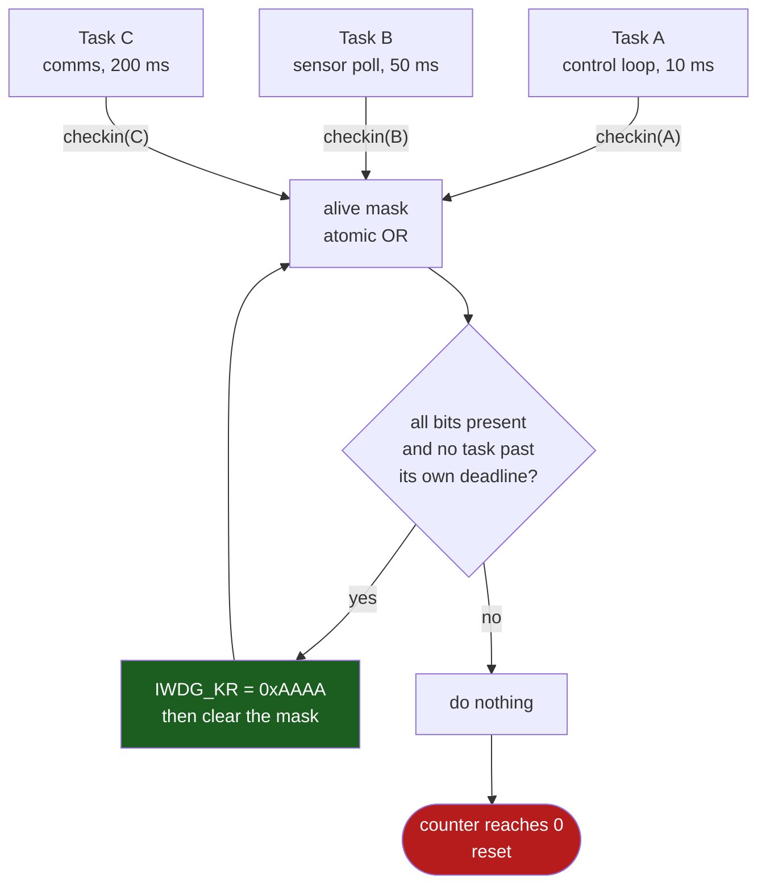

# Watchdogs

A watchdog does not detect that your software is wrong. It detects that **one specific piece of code stopped executing**, and it reboots the system when that happens. Everything about designing a watchdog into a product follows from taking that sentence literally: the watchdog proves exactly what you make it prove, and not one thing more.

Which is why the most common watchdog in the field is decorative. A refresh call in a timer interrupt proves the timer interrupt is running. It does not prove the control loop is running, or that the state machine is making progress, or that a task has not deadlocked against another — and all of those failures leave the timer interrupt running perfectly. The board hangs, the watchdog is kicked faithfully every millisecond, and the product sits there dead until someone unplugs it. The hardware worked; the design asked it the wrong question.

The useful mental model: **a watchdog is a distributed assertion with a deadline.** Its refresh should be reachable only when every part of the system that matters has demonstrated forward progress since the last refresh. Anything less is a timer that resets the board.

## The two watchdogs on this part, and what each is for

They are not two options for the same job. They answer different questions.

| | **IWDG** — independent | **WWDG** — window |
|---|---|---|
| Clock | **LSI**, 17–47 kHz (DS Table 40) | `PCLK1`, up to 50 MHz on this part |
| Counter | 12-bit down from `0xFFF` | 7-bit down, `T[6:0]` |
| Timeout range | **0.125 ms to 32.768 s** at 32 kHz (RM0383 Table 61) | 136.5 µs to 69.91 ms at 30 MHz (RM0383 Table 63) |
| Catches "too late" | yes | yes |
| Catches "too early" | no | **yes** — that is the window |
| Runs in Stop / Standby | **yes** | no |
| Survives a PLL or clock failure | **yes** — separate oscillator | no, it shares your clock |
| Warning before the reset | none — no interrupt exists | **EWI** at counter = `0x40` |
| Can be disabled after starting | no | no |

**The IWDG is the system watchdog.** Its whole reason to exist is that it does not depend on anything your firmware configures: not the PLL, not the HSE, not the bus clocks. If your clock-tree code writes a bad PLL configuration and the core drops to a crawl or stops, the IWDG still resets the board, because it is counting an RC oscillator in a different corner of the die. Note that on this part it has **no interrupt at all** — there is no `IWDG_IRQn` in the vector table. It resets; that is the entire interface.

**The WWDG is a deadline monitor for one fast path.** Its maximum timeout at full APB1 speed is short enough to be worth computing before you plan a design around it:

```text
t_WWDG = t_PCLK1 x 4096 x 2^WDGTB x (T[5:0] + 1)          (RM0383 section 16.4)

At PCLK1 = 50 MHz, WDGTB = 3, T[5:0] = 0x3F:
       = (1 / 50e6) x 4096 x 8 x 64  =  41.9 ms   (maximum)
At PCLK1 = 50 MHz, WDGTB = 0, T[5:0] = 0x00:
       = (1 / 50e6) x 4096 x 1 x 1   =  81.9 us   (minimum)
```

So the WWDG on a fully-clocked F411 cannot be told to wait longer than about 42 ms. It is not a supervisor for a whole application; it is an assertion that one particular loop is still turning at its design rate. Its window half — reset if refreshed *too soon* — catches the failure mode a plain watchdog cannot see at all: a control loop that has started free-running because an interrupt fires spuriously, or a state machine stuck in a tight retry that happens to include the refresh.

Using both is normal and is not redundant: WWDG on the fast loop, IWDG as the backstop that survives everything.

## Choosing a timeout when the clock is ±46%

The IWDG's period is a function of the LSI, and the LSI's datasheet range is **17 kHz to 47 kHz** (DS Table 40, VDD = 3 V, −40 to +105 °C). That is not a tolerance you can design past; it is a number you design *with*.

```text
t_IWDG = prescaler x (RLR + 1) / f_LSI          (RM0383 section 15.3)

PR = /32, RLR = 999   ->  32000 LSI counts

  at 32 kHz (typical):  1.000 s
  at 47 kHz (fastest):  0.681 s     <- the deadline you must actually meet
  at 17 kHz (slowest):  1.882 s     <- how long a wedged system stays wedged
```

Both ends matter, and they matter for different reasons. **The fast end is your refresh deadline**: if the worst-case path through your superloop can take longer than 681 ms, the board reboots in the field on a part that happens to have a fast LSI, and it is the one unit in fifty that does it. **The slow end is your recovery time**: a customer looking at a frozen device waits 1.9 seconds, not 1.0, and if something safety-relevant is being driven during that window you must size the timeout against 1.9 s, not 1.0 s.

The engineering rule that falls out: **pick a nominal timeout of at least 3× your worst-case refresh interval**, then check that the fast-LSI end of the range still clears it. Measuring the worst-case interval — not estimating it — is the actual work. Instrument the refresh point with a maximum-interval-so-far counter, run the system under its nastiest load, and read the number.

If you need the timeout to be accurate rather than merely bounded, the LSI can be measured at run time: TIM5 channel 4 has an internal connection to the LSI on this part (RM0383 §6.2.11, "Internal/external clock measurement using TIM5/TIM11"), so a few input captures against the known system clock give you the actual LSI frequency and let you compute `RLR` for a real target.

## Where to kick from, and why a timer ISR defeats the purpose

Put the refresh in `SysTick_Handler` and here is what happens when the application deadlocks: `SysTick` keeps firing, because a spin loop in thread mode does not stop interrupts. The refresh keeps executing. The watchdog is satisfied. **The system is dead and the watchdog has proved that the timer is alive** — which was never in doubt.

Every variant of this is the same mistake:

- Refreshing in a high-priority ISR — proves the NVIC works.
- Refreshing inside the HAL's `SysTick` callback — proves ST's code works.
- Refreshing in a low-priority idle task under an RTOS — closer, but it proves only that *some* task can run, so a single high-priority task spinning forever still gets caught while a mid-priority task that has deadlocked does not.
- Refreshing from two places "to be safe" — now no single path is required, and the assertion means the disjunction of them, which is weaker than either.

The refresh must be reachable **only** when the things you care about have made progress. In practice that means it lives in exactly one place, at the lowest-priority level that still runs often enough, and it is gated on evidence.

## The supervisor pattern

Give every participant a bit. Each one sets its bit when it completes a cycle. One supervisor refreshes the watchdog only when the whole set is present, and then clears it.



```c title="wdt_supervisor.c — the refresh is gated on every participant"
#include "stm32f4xx.h"

enum { WDT_TASK_CONTROL = 0, WDT_TASK_SENSOR, WDT_TASK_COMMS, WDT_TASK_COUNT };

#define WDT_ALL_ALIVE  ((1u << WDT_TASK_COUNT) - 1u)

static volatile uint32_t alive_mask;
/* Per-task allowance, in supervisor ticks, before a missing check-in is fatal.
 * A task that checks in rarely is legitimate; a task that stops is not. */
static const uint16_t deadline_ticks[WDT_TASK_COUNT] = { 5u, 25u, 100u };
static uint16_t missed_ticks[WDT_TASK_COUNT];

/* Called by each participant at the end of a successful cycle.
 * Atomic because participants run at different priorities. */
void wdt_checkin(unsigned task)
{
    __atomic_fetch_or(&alive_mask, 1u << task, __ATOMIC_RELAXED);
}

/* The ONLY caller of the refresh, at the lowest priority that runs often
 * enough. Called every 10 ms from the main loop or an idle hook. */
void wdt_supervisor_tick(void)
{
    uint32_t seen = __atomic_exchange_n(&alive_mask, 0u, __ATOMIC_RELAXED);

    for (unsigned t = 0u; t < WDT_TASK_COUNT; t++) {
        if (seen & (1u << t)) {
            missed_ticks[t] = 0u;
        } else if (missed_ticks[t] < deadline_ticks[t]) {
            missed_ticks[t]++;
        } else {
            return;              /* one task is overdue: refuse to refresh */
        }
    }

    IWDG->KR = 0xAAAAu;          /* reload. The only refresh in the program. */
}
```

Two properties are worth naming because they are what make this different from a refresh in a loop:

- **The `return` is the mechanism.** There is no `wdt_panic()` call, no error path, no logging that could itself hang. The supervisor simply stops refreshing, and the hardware does the rest. Code that reacts to a detected failure by trying to do something clever is code that can fail in the same way the system just did.
- **Each participant has its own allowance.** A comms task that runs every 200 ms is not late at 50 ms. Collapsing everything into "all bits set since the last tick" forces the watchdog interval down to the slowest participant's period and makes the fast ones effectively unmonitored. Per-task deadlines are what let one watchdog supervise components with two orders of magnitude between their rates.

Under an RTOS the same structure applies with tasks instead of functions; the check-in is still a bit, the supervisor is still the lowest-priority runnable thing, and the deadline table is still per task.

### Starting the IWDG

```c title="iwdg_init.c — 1 s nominal, 0.68 s worst case"
void iwdg_start(void)
{
    IWDG->KR  = 0x5555u;                     /* unlock PR and RLR           */
    IWDG->PR  = 3u;                          /* /32                          */
    IWDG->RLR = 999u;                        /* 32 x 1000 counts            */
    while (IWDG->SR != 0u) { }               /* wait for both updates       */
    IWDG->KR  = 0xAAAAu;                     /* load RLR into the counter   */
    IWDG->KR  = 0xCCCCu;                     /* start. No way back.         */
}
```

The `0x5555` unlock is armed only until the next key write, and RM0383 §15.3.2 notes that a reload (`0xAAAA`) also breaks the sequence — so `PR` and `RLR` must be written between the unlock and anything else. Polling `IWDG_SR` to zero before starting matters because the two registers are written across the LSI clock domain and take several LSI cycles to take effect; starting the counter before they land gives you the reset-value prescaler and a timeout eight times shorter than intended.

Note also the option-byte variant: if the `WDG_SW` user option bit is programmed for a *hardware* watchdog, the IWDG is enabled automatically at power-on before your code runs (RM0383 §15.3.1). That is the right choice for a product and a trap during development, because your first-stage bootloader now has a deadline too.

## Reading the reset reason afterwards

A watchdog that reboots the system silently has told you nothing. `RCC_CSR` holds why the last reset happened, and the flags are **sticky across resets** — they accumulate until software clears them (RM0383 §6.3.20).

| Bit | Flag | Set by |
|---|---|---|
| 31 | `LPWRRSTF` | low-power management reset (illegal Standby entry) |
| 30 | `WWDGRSTF` | window watchdog |
| 29 | `IWDGRSTF` | independent watchdog |
| 28 | `SFTRSTF` | software reset (`NVIC_SystemReset()`) |
| 27 | `PORRSTF` | power-on / power-down reset |
| 26 | `PINRSTF` | the NRST pin |
| 25 | `BORRSTF` | **POR/PDR *or* brown-out** — see below |
| 24 | `RMVF` | write 1 to clear all of the above |

```c title="reset_reason.c — read once, early, then clear"
uint32_t reset_reason_capture(void)
{
    uint32_t csr = RCC->CSR;                 /* read BEFORE clearing        */
    RCC->CSR |= RCC_CSR_RMVF;                /* arm for the next reset      */
    return csr >> 24;                        /* stash it for the log        */
}
```

Three things about this that catch people:

- **They are sticky, so you must clear them.** Skip `RMVF` and `PORRSTF` stays set forever, from the first power-up onward — so every subsequent watchdog reset reports "power-on *and* watchdog", and the code that checks power-on first blames the wrong cause for the life of the product. Clear on every boot, unconditionally, immediately after reading.
- **`BORRSTF` cannot be separated from power-on.** RM0383 §6.3.20 states it plainly: `BORRSTF` is "set by hardware when a POR/PDR **or** BOR reset occurs". So `BORRSTF` set with `PORRSTF` set is an ordinary power-up; there is no encoding that means "brown-out and definitely not power-on" on this part. Do not build a brown-out counter on it.
- **Read it before anything else can reset the chip**, and copy it somewhere that survives — a backup register is exactly right for this, since it also survives the *next* reset (see [RTC and Timekeeping](./rtc-and-timekeeping.md)). Writing the reason to flash from the reset path is a bad trade; writing it to `RTC_BKP0R` costs one store.

The WWDG's early-wakeup interrupt pairs with this. `EWI` fires when the counter reaches `0x40`, one full window before the reset (RM0383 §16.3), which gives you a handler that runs *while the failure is still present* — the right place to snapshot the faulting task, the stack pointer, or a state-machine variable into a backup register so the next boot can report it.

:::warning[The watchdog that kicked itself forever, and the erase that outlasted the timeout]
Two watchdog failures, both of which ship.

**The refresh in `SysTick`.** A queue fills, a producer spins waiting for space that a consumer in a lower-priority context can no longer create, and the application is permanently wedged. `SysTick_Handler` is unaffected — it is an interrupt, the spin loop does not mask it — so the refresh runs every millisecond and the IWDG never expires. The device is frozen for as long as it has power. The symptom that identifies it: **field units that hang and stay hung rather than rebooting**, plus a reset-reason log in which `IWDGRSTF` has literally never been observed. That last part is the diagnostic. A watchdog that has never fired in a fleet's lifetime is not evidence of quality; it is evidence that it is not connected to anything. Move the refresh to a gated supervisor and expect to see watchdog resets appear in the logs immediately — those events were always happening, they were just invisible.

**A flash erase that takes longer than the timeout.** Erasing a 128 KB sector on this part takes **typically 1 s and up to 2 s** (DS Table 45, PSIZE = x32), and RM0383 §3.5 states that any attempt to read flash while it is being erased *stalls the bus* — so the CPU cannot fetch instructions and your supervisor does not run. With the 1 s nominal IWDG configured above, the board resets in the middle of the erase. Now the sector is partially erased, the firmware image or the EEPROM-emulation page is in an undefined state, and on the next boot the code that would have finished the operation may not be intact. It is the classic bricking mechanism for field firmware updates. Three defences, in order of preference: choose a smaller sector (a 16 KB sector is typically 250 ms, max 500 ms — DS Table 45), run the erase from a function relocated to SRAM so that a timer ISR can still refresh, or raise the IWDG timeout for the duration of the update — remembering that the IWDG cannot be disabled once started, only reprogrammed, and that reprogramming it re-runs the `0x5555` unlock sequence.
:::

:::note[Debug mode will make the watchdog look broken]
Halt at a breakpoint and the counter keeps counting: the board resets the moment you step. `DBGMCU_APB1_FZ` has `DBG_IWDG_STOP` and `DBG_WWDG_STOP` bits that freeze both counters while the core is halted (RM0383 §23.16.2), and most IDE debug configurations set them for you. Set them explicitly in your own start-up code when a debugger is attached, and be aware that this means **your debug builds have no watchdog** — which is why "it never resets in development" is not evidence of anything.
:::

## See also

- [RTC and Timekeeping](./rtc-and-timekeeping.md) — the backup registers that carry a reset reason or a fault snapshot across the reboot, and the other consumer of the LSI oscillator.
- [Internal Flash and EEPROM Emulation](./flash-and-eeprom-emulation.md) — the erase times behind the second warning, and why a long flash operation and a watchdog are a design interaction rather than two independent features.
- [Timers and Counters](./timers-and-counters.md) — the input-capture method for measuring the actual LSI frequency instead of trusting its nominal value.
- [Critical Sections and Atomicity](../04-bare-metal-programming/critical-sections-and-atomicity.md) — why the check-in mask uses `__atomic_fetch_or` rather than `|=`, given that participants run at different priorities.
- [The Anatomy of a Peripheral](./anatomy-of-a-peripheral.md) — the bring-up sequence, and the key-register protection family that `IWDG_KR` belongs to.

## References

- STMicroelectronics — [**RM0383**, *STM32F411xC/E advanced Arm-based 32-bit MCUs reference manual*](https://www.st.com/resource/en/reference_manual/rm0383-stm32f411xce-advanced-armbased-32bit-mcus-stmicroelectronics.pdf), consulted at **Rev 4** (May 2025). §15.3 for the IWDG key values `0xCCCC`, `0xAAAA` and `0x5555`, the hardware-watchdog option bit and the register-access protection; Table 61 for the min/max IWDG timeouts per prescaler at 32 kHz; §16.3–§16.4 for the WWDG window rule, the early wakeup interrupt at `0x40` and the timeout formula, with Table 63 giving the values at 30 MHz; §6.3.20 for `RCC_CSR`, every reset flag, `RMVF`, and the statement that `BORRSTF` is set by POR/PDR as well as BOR; §6.2.11 for measuring the LSI with TIM5; §23.16.2 for the debug freeze bits.
- STMicroelectronics — [**STM32F411xC/E datasheet**](https://www.st.com/resource/en/datasheet/stm32f411re.pdf) (DS10314 / DocID026289), consulted at Rev 4. Table 40 "LSI oscillator characteristics" — the 17/32/47 kHz min-typ-max at VDD = 3 V over −40 to +105 °C that every IWDG timeout calculation on this page is built on; Table 45 "Flash memory programming" for the sector erase times in the second warning.
- Jack Ganssle — [**"Great Watchdog Timers For Embedded Systems"**](http://www.ganssle.com/watchdogs.htm). The canonical treatment, and the origin of most of the argument on this page: why a single refresh point is a design requirement, the taxonomy of watchdog failures observed in shipped products, windowed watchdogs, and the case for an external supervisor IC where the internal one shares a die with what it is watching.
- Philip Koopman — [**"Watchdog Timers"**](https://users.ece.cmu.edu/~koopman/pubs/koopman14_toyota_ua_slides.pdf) and the associated *Better Embedded System Software* material. Watchdog design as a safety argument rather than a feature: what a kick must be conditioned on for the watchdog to be part of a fault-tolerance claim, and worked examples of task check-in supervision in real systems.
- STMicroelectronics — [**AN4838**, *Managing memory protection unit in STM32 MCUs*](https://www.st.com/resource/en/application_note/an4838-managing-memory-protection-unit-in-stm32-mcus-stmicroelectronics.pdf). The complementary mechanism: the MPU catches the wild pointer *before* it corrupts state, where the watchdog only notices afterwards that progress stopped. Useful for deciding which failures each is responsible for.
