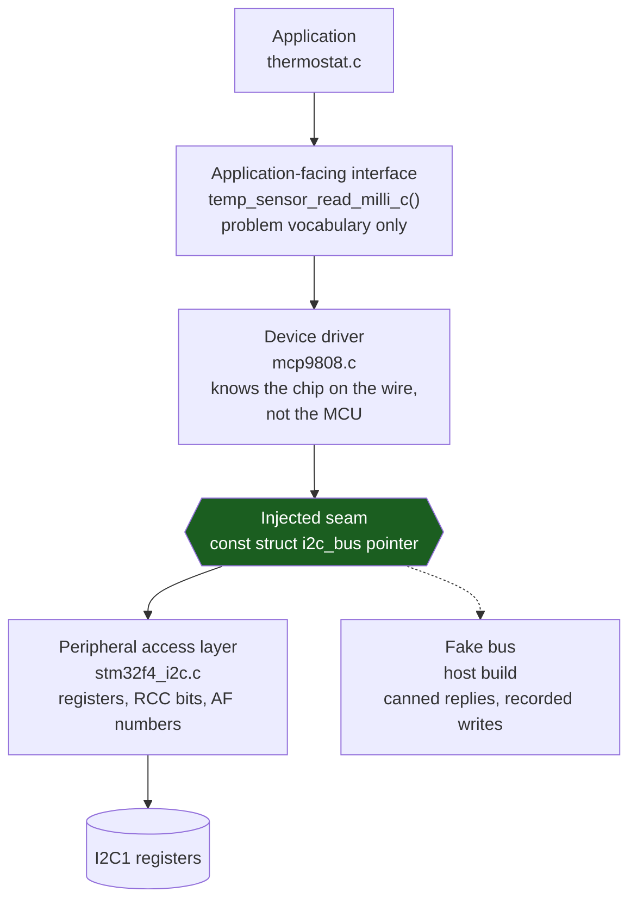

# Writing a Driver Worth Reusing

Most firmware drivers are written once, for one board, and thrown away at the next project — not because the author was careless but because the driver was never separable from the chip it was born on. It calls `HAL_I2C_Master_Transmit`. It hard-codes `I2C1`. It has a `static` state variable so there can only ever be one. It blocks forever waiting on a status bit. Each of those is a small local convenience and together they weld the driver to one MCU, one instance, one board and one timing assumption.

The mental model: **a driver is three layers with two named seams, and the seams are the entire product.** The bottom layer knows registers and nothing else. The top layer speaks the vocabulary of the problem — degrees Celsius, not bus transactions. In between sits the code that knows the *device* on the other end of the wire, and it must not know which microcontroller it is talking through. If the two seams are real, the driver ports to a different MCU by rewriting the bottom layer, and it runs on your laptop by substituting a fake for it.

That last property is not a testing convenience bolted on afterwards. It is the *proof* that the seam exists. A driver you can exercise on a host is by construction a driver whose device logic has no chip dependency — and the day you cannot compile it for the host is the day something leaked through.

:::info[Prerequisites]
[The Anatomy of a Peripheral](./anatomy-of-a-peripheral.md) has the six-step bring-up sequence that lives in the bottom layer here. [CMSIS and Vendor HALs](../04-bare-metal-programming/cmsis-and-vendor-hals.md) covers what a vendor HAL gives you and what it costs, which is the choice this page's bottom layer is making. [Static Memory and Why `malloc` Is Banned](../04-bare-metal-programming/static-memory-and-no-malloc.md) explains why every structure below is caller-allocated.
:::

## The three layers



| Layer | Knows about | Must not know about | Changes when |
|---|---|---|---|
| **Peripheral access layer** | `I2C_TypeDef`, `RCC_APB1ENR`, AF numbers, `PCLK1` | The device on the bus, the application | The MCU changes |
| **Device driver** | Register map of the *sensor*, its command set, its timings | Which MCU, which instance, which pins | The sensor changes |
| **Application-facing interface** | Degrees, millivolts, positions, states | Bytes, addresses, buses | The product changes |

The layering is worth naming because it makes disagreements resolvable. "Where does the I²C address go?" — the device driver, because a second sensor on the same bus has a different one. "Where does the pin assignment go?" — neither; it goes in a board file that constructs both. "Where does the 250 ms conversion delay go?" — the device driver, because it is a property of the sensor, not of the MCU that waits it out.

## The seam, as a header

The seam is an ordinary C struct of function pointers. No framework, no macros, no registration mechanism — the whole mechanism is that the device driver takes a pointer to one instead of calling a function by name.

```c title="i2c_bus.h — the seam. Note what this file does NOT include."
#ifndef I2C_BUS_H
#define I2C_BUS_H

#include <stddef.h>
#include <stdint.h>

typedef enum {
    BUS_OK = 0,
    BUS_ERR_PARAM,      /* caller's fault: null pointer, zero length      */
    BUS_ERR_TIMEOUT,    /* the peripheral never reported completion       */
    BUS_ERR_NACK,       /* the device did not acknowledge its address     */
    BUS_ERR_BUS,        /* arbitration lost, or SDA is being held low     */
} bus_status_t;

struct i2c_bus {
    bus_status_t (*write)(void *ctx, uint8_t addr7, const uint8_t *tx, size_t n);
    bus_status_t (*read)(void *ctx, uint8_t addr7, uint8_t *rx, size_t n);
    bus_status_t (*write_read)(void *ctx, uint8_t addr7,
                               const uint8_t *tx, size_t ntx,
                               uint8_t *rx, size_t nrx);
    void *ctx;          /* opaque to everyone above this line */
};

#endif /* I2C_BUS_H */
```

Three properties are load-bearing:

- **No vendor header.** `stdint.h` and `stddef.h` only. This file compiles on a host with `gcc` and no cross-toolchain at all, and so does everything that includes it.
- **`write_read` is not decoration.** Register-mapped I²C devices need an address write followed by a repeated START and a read, in one transaction, without releasing the bus. Expressing that as separate `write` and `read` calls is wrong on a multi-master bus, and the difference does not show up until a second master exists.
- **`ctx` is `void *`.** The device driver never dereferences it; it hands it back to the function pointers. That is what lets the same interface be backed by an STM32 peripheral, a bit-banged pair of GPIOs, or a test double.

## The device driver

```c title="mcp9808.h — portable. Compiles for the host and for the target, unchanged."
#ifndef MCP9808_H
#define MCP9808_H

#include "i2c_bus.h"

#if defined(__GNUC__)
#  define MUST_CHECK __attribute__((warn_unused_result))
#else
#  define MUST_CHECK
#endif

typedef struct {
    const struct i2c_bus *bus;    /* injected, not looked up */
    uint8_t               addr7;  /* 0x18..0x1F depending on A0..A2 */
} mcp9808_t;

MUST_CHECK bus_status_t mcp9808_init(mcp9808_t *dev,
                                     const struct i2c_bus *bus,
                                     uint8_t addr7);

MUST_CHECK bus_status_t mcp9808_read_milli_c(const mcp9808_t *dev,
                                             int32_t *out_milli_c);

#endif /* MCP9808_H */
```

```c title="mcp9808.c"
#include "mcp9808.h"

#define REG_TEMP     0x05u
#define REG_MFG_ID   0x06u
#define MFG_ID_VALUE 0x0054u

bus_status_t mcp9808_init(mcp9808_t *dev, const struct i2c_bus *bus, uint8_t addr7)
{
    if (dev == NULL || bus == NULL || addr7 > 0x7Fu) { return BUS_ERR_PARAM; }

    dev->bus   = bus;
    dev->addr7 = addr7;

    /* Probe: a device that is not there NACKs, and we find out now rather
       than three layers up when a temperature reads as 0 C. */
    uint8_t  reg = REG_MFG_ID;
    uint8_t  rx[2];
    bus_status_t st = bus->write_read(bus->ctx, addr7, &reg, 1u, rx, 2u);
    if (st != BUS_OK) { return st; }

    uint16_t id = (uint16_t)((uint16_t)rx[0] << 8) | rx[1];
    return (id == MFG_ID_VALUE) ? BUS_OK : BUS_ERR_BUS;
}

bus_status_t mcp9808_read_milli_c(const mcp9808_t *dev, int32_t *out_milli_c)
{
    if (dev == NULL || dev->bus == NULL || out_milli_c == NULL) {
        return BUS_ERR_PARAM;
    }

    uint8_t reg = REG_TEMP;
    uint8_t rx[2];
    bus_status_t st = dev->bus->write_read(dev->bus->ctx, dev->addr7,
                                           &reg, 1u, rx, 2u);
    if (st != BUS_OK) { return st; }

    /* 13-bit two's complement, 0.0625 C per LSB, sign in bit 12. */
    int16_t raw = (int16_t)(((uint16_t)(rx[0] & 0x1Fu) << 8) | rx[1]);
    if (raw & 0x1000) { raw -= 0x2000; }

    *out_milli_c = ((int32_t)raw * 625) / 10;
    return BUS_OK;
}
```

Nothing in that file mentions STM32, I2C1, a pin, a clock, or a HAL. It has no `static` state, so a board with four of these sensors declares four `mcp9808_t` and nothing is shared. Every function returns a status; the data comes back through an out-parameter. And `MUST_CHECK` turns "somebody ignored the return value" from a code-review question into a compiler warning, which is the only form of that rule anyone actually obeys.

## The peripheral access layer, and the injectable register seam

The bottom layer is the only place vendor headers appear. Its one structural rule is that **the register block is a parameter, not a constant.**

```c title="stm32f4_i2c.c — the only file in this stack that includes stm32f4xx.h"
#include "stm32f4xx.h"
#include "i2c_bus.h"

typedef struct {
    I2C_TypeDef *regs;        /* <-- the seam: I2C1, I2C2, or a struct in RAM */
    uint32_t     timeout_us;
    uint32_t   (*now_us)(void);   /* injected time source, not HAL_GetTick() */
} stm32_i2c_t;

static bool wait_flag(const stm32_i2c_t *p, uint32_t mask, bool want_set)
{
    uint32_t start = p->now_us();
    for (;;) {
        bool is_set = (p->regs->SR1 & mask) != 0u;
        if (is_set == want_set) { return true; }
        if ((p->now_us() - start) >= p->timeout_us) { return false; }
    }
}

static bus_status_t stm32_i2c_write(void *ctx, uint8_t addr7,
                                    const uint8_t *tx, size_t n)
{
    stm32_i2c_t *p = (stm32_i2c_t *)ctx;
    if (tx == NULL || n == 0u) { return BUS_ERR_PARAM; }

    p->regs->CR1 |= I2C_CR1_START;
    if (!wait_flag(p, I2C_SR1_SB, true)) { return BUS_ERR_TIMEOUT; }
    /* ... address phase, NACK check, data loop, STOP ... */
    return BUS_OK;
}

/* Constructed once, in the board file. */
void stm32_i2c_bind(struct i2c_bus *out, stm32_i2c_t *state)
{
    out->write      = stm32_i2c_write;
    out->read       = stm32_i2c_read;
    out->write_read = stm32_i2c_write_read;
    out->ctx        = state;
}
```

`regs` being a pointer rather than the literal `I2C1` costs one indirection and buys three things. A second instance is a second `stm32_i2c_t` with `regs = I2C2` and no code duplication. A host build can point `regs` at a plain `I2C_TypeDef` allocated in RAM, so the register-poking logic itself — the START/address/data sequence, the flag polling, the error decoding — becomes ordinary testable C. And when someone needs to log every register access, there is exactly one place to add it.

`now_us` being injected matters for the same reason. A driver that calls `HAL_GetTick()` cannot be run faster than real time, cannot be run at all without the HAL, and cannot have its timeout path exercised deliberately. A function pointer removes all three problems and costs nothing at runtime.

## Composition: dependency injection without a framework

"Dependency injection" in embedded C is one function, called once, that constructs everything and wires it together. It lives in a board file because it is the only code that knows this board.

```c title="board_nucleo_f411re.c"
#include "stm32f4_i2c.h"
#include "mcp9808.h"

static stm32_i2c_t   i2c1_state = { .regs = I2C1, .timeout_us = 5000u,
                                    .now_us = micros };
static struct i2c_bus i2c1_bus;

static mcp9808_t ambient;    /* 0x18 */
static mcp9808_t exhaust;    /* 0x19 */

bus_status_t board_init(void)
{
    stm32_i2c_hw_init(&i2c1_state, /* PB8 = SCL, PB9 = SDA, AF4 */ 100000u);
    stm32_i2c_bind(&i2c1_bus, &i2c1_state);

    bus_status_t st = mcp9808_init(&ambient, &i2c1_bus, 0x18u);
    if (st != BUS_OK) { return st; }
    return mcp9808_init(&exhaust, &i2c1_bus, 0x19u);
}

const mcp9808_t *board_ambient_sensor(void) { return &ambient; }
```

Everything is `static` and file-scope: no allocation, no registry, no init order to get wrong beyond the single obvious sequence in `board_init`. Two sensors share one bus because they were handed the same `&i2c1_bus`, which is the whole of the "framework".

The board file is also where the answer to "which pins?" lives, and keeping it there is what stops pin numbers from leaking into the device driver — the single most common way a driver stops being portable.

## Errors without exceptions

Five rules, and they are all consequences of having no unwinding mechanism.

- **Every function that can fail returns a status enum.** Not `void`, not `bool`. `bool` is fine for a predicate and a mistake for an operation, because the day you need to distinguish "the device NACKed" from "the bus is stuck low" you have to change every call site anyway.
- **The enum is flat, small, and closed.** Five to eight values. A caller that cannot act differently on two codes does not need two codes; a caller three layers up that can only log the value needs the value to be printable, not structured.
- **Data comes back through out-parameters.** `bus_status_t f(..., int32_t *out)` rather than a sentinel value in the return. There is no `int32_t` that safely means "failed" for a temperature.
- **Mark the return `warn_unused_result`.** An ignored status is a defect, and this is the only mechanism that finds all of them.
- **Never wait unbounded.** Every `while (!(SR & FLAG))` gets a deadline. This is not defensive style; it is the difference between a product that reports a failed sensor and one that hangs.

Propagation is early return, and it reads fine as long as the functions stay short:

```c
bus_status_t st = mcp9808_read_milli_c(&ambient, &t);
if (st != BUS_OK) { return st; }
```

The one thing worth adding beyond this is **context at the boundary**. The application does not care that `BUS_ERR_NACK` came back; it cares that the ambient sensor is missing. Translating status codes into problem-domain outcomes is the job of the top layer, and it is why that layer exists as something more than a rename.

## The seam is testable, and that is how you know it is real

Because `struct i2c_bus` is a plain vtable with no vendor dependency, a second implementation of it is about forty lines of ordinary C that runs on a host: a `write_read` that returns bytes from a table, a `write` that appends to a buffer the test can inspect afterwards, and a mode that returns `BUS_ERR_NACK` on demand. Point `mcp9808_t.bus` at it and the entire device driver — the register addresses, the two's-complement sign extension, the 0.0625 °C scaling, the `BUS_ERR_PARAM` guards, the behaviour when the sensor is absent — executes under `gcc` in milliseconds, with no board attached.

The temperature conversion is the clearest case. A raw 13-bit value of `0x1FF1` should decode to −0.9375 °C — bit 12 is set, so `8177 − 8192 = −15`, and `−15 × 0.0625 = −0.9375` — and getting the 13-bit sign extension right is a five-minute job on a host and an afternoon on hardware with a heat gun. That asymmetry is the practical argument for the seam, and it applies before anyone writes a single automated test: even used interactively, a host build of the device layer turns "reflash and squint at a UART" into "run and see".

The corresponding rule is a build-time one. **Keep a host target that compiles the device layer, and treat its failure as the portability alarm.** The moment `mcp9808.c` stops compiling without `stm32f4xx.h`, something chip-specific has leaked across the seam, and the host build tells you on the commit that did it rather than on the port six months later.

## Surviving a chip change

The measure is mechanical, and it is worth running as an actual command:

```bash
grep -rl 'stm32f4xx.h\|stm32f4xx_hal' src/ | sort
# expected output: only files under src/port/stm32f4/
```

If anything under `src/device/` or `src/app/` appears in that list, the port is not one directory. A layout that keeps the answer honest:

```text
src/
  app/                thermostat.c            problem vocabulary
  device/             mcp9808.c  mcp9808.h    portable, no vendor headers
  bus/                i2c_bus.h  spi_bus.h    the seams
  port/stm32f4/       stm32f4_i2c.c           the only vendor-dependent code
  board/              board_nucleo_f411re.c   pins, instances, composition
```

Three habits that do most of the work:

- **No vendor types in a portable header.** Not `HAL_StatusTypeDef`, not `I2C_HandleTypeDef`, not `GPIO_TypeDef *`. If a device driver's header needs to name a pin, it takes an abstract handle from a `gpio` seam of the same shape as `i2c_bus`.
- **No `HAL_Delay`.** Time is a dependency like any other. Inject it, or express waits as deadlines the caller polls.
- **Configuration is `const` data, not code.** A `static const` struct of registers-to-write for the sensor's initialisation sequence ports unchanged; a function full of `HAL_I2C_Mem_Write` calls does not.

:::warning[The second sensor that reads the first one's temperature, and the product that hangs when a cable falls out]
Two failures that both look like hardware problems and are both driver structure.

**The `static` that made the driver a singleton.** A driver written with file-scope state — `static uint8_t s_addr;`, `static bool s_initialised;`, or the very common `static I2C_HandleTypeDef hi2c1;` — works perfectly with one device. Add a second, call `mcp9808_init` on it, and the second `init` overwrites the shared state. Now both handles read from address `0x19`: the ambient sensor and the exhaust sensor report identical temperatures that track each other exactly. Everybody's first hypothesis is a wiring or address-strap error, because two sensors reading the same value is exactly what a shorted address pin looks like, and people spend an afternoon on the bench with a meter before anyone opens the driver.

The tell is that the two values are *identical to the last digit*, not merely close — two real sensors a centimetre apart never agree exactly. The fix is structural, not a bug fix: all per-instance state lives in a caller-allocated struct, the driver has no file-scope mutable variables at all, and every function takes the instance as its first argument. Grep your drivers for `static` at file scope that is not `const`; each hit is a future instance of this.

**The unbounded wait.** `while (!(I2C1->SR1 & I2C_SR1_SB));` is the natural way to write a bus driver and it is a latent hang. Unplug the sensor, or let a slave hold SDA low after a reset caught it mid-byte, and that loop never exits. On a system with an independent watchdog the product resets, boots, tries to talk to the sensor, and hangs again — a reset loop, roughly once per watchdog period, whose only symptom in the field is a device that appears to be power-cycling itself. On a system without a watchdog it is a silent freeze. In both cases the debugger, attached later, shows the core parked in a spin loop in a driver that has passed every test on a working board, because on a working board the flag always sets within microseconds.

Every wait gets a deadline and every timeout gets a distinct status code, as in `wait_flag()` above. And the recovery matters as much as the detection: for I²C specifically, a timeout should trigger the standard bus-recovery procedure — clock SCL manually until the stuck slave releases SDA, then issue a STOP — rather than simply returning an error to a caller that will immediately retry into the same stuck bus.
:::

## See also

- [The Anatomy of a Peripheral](./anatomy-of-a-peripheral.md) — the six-step bring-up sequence that belongs inside the peripheral access layer, and nowhere above it.
- [Timers and Counters](./timers-and-counters.md) — a worked driver for one peripheral, and the `timer_clock_hz()` helper as an example of deriving a constant instead of hard-coding it.
- [CMSIS and Vendor HALs](../04-bare-metal-programming/cmsis-and-vendor-hals.md) — what sits underneath the peripheral access layer, and the register-versus-LL-versus-HAL choice this structure lets you defer.
- [Static Memory and Why `malloc` Is Banned](../04-bare-metal-programming/static-memory-and-no-malloc.md) — why every structure here is caller-allocated and file-scope `static`.
- [Mocking Hardware](../11-debugging-and-testing/mocking-hardware.md) — how the register-versus-mock seam this layer creates gets exercised in a host-side unit test.

## References

- Microchip — [**MCP9808 datasheet**](https://ww1.microchip.com/downloads/en/DeviceDoc/25095A.pdf) (DS25095A). The source of every device-specific constant in the driver above: §5.1 "Register Set" gives the pointer-register map — `0x05` ambient temperature, `0x06` manufacturer ID reading `0x0054` — and the `T_A` register's bit layout, which is where the 13-bit two's-complement field with its sign in bit 12 and its 0.0625 °C per LSB comes from. Note also the three alert flags in bits 15:13, which are what the `rx[0] & 0x1F` mask in `mcp9808_read_milli_c()` exists to discard.
- Elecia White — *Making Embedded Systems*, 2nd edition (O'Reilly, 2024). Chapter 5, "Managing the Flow of Activity", and Chapter 6, "Communicating with Peripherals", are the closest thing to a canonical treatment of this layering: separating the interface from the implementation, keeping the device driver ignorant of the processor, and designing an API in the vocabulary of the caller rather than the hardware. Purchase required.
- James W. Grenning — *Test-Driven Development for Embedded C* (Pragmatic Bookshelf, 2011). The source of the "link-time and pointer-based substitution" techniques the seam above uses, and the argument that the ability to compile a module for the host is a design property rather than a testing trick. Purchase required.
- Zephyr Project — [**Device Driver Model**](https://docs.zephyrproject.org/latest/kernel/drivers/index.html). A production example of exactly this shape at scale: `struct device` carrying an opaque `data` pointer plus a `const` API vtable, with the vendor-specific implementation isolated in one directory per SoC family. Worth reading as evidence that the pattern survives contact with hundreds of boards.
- Barr Group — [**Embedded C Coding Standard**](https://barrgroup.com/embedded-systems/books/embedded-c-coding-standard) (2018 edition, free PDF on registration). Rules 6.2 and 8.x on module interfaces, file-scope variables and the discipline of keeping hardware access confined to a driver layer — the prescriptive form of the `grep` test above.
- STMicroelectronics — [**RM0383**, *STM32F411xC/E advanced Arm-based 32-bit MCUs reference manual*](https://www.st.com/resource/en/reference_manual/rm0383-stm32f411xce-advanced-armbased-32bit-mcus-stmicroelectronics.pdf), consulted at **Rev 4** (May 2025). §18 for the I²C register set the peripheral access layer above is written against, including the `SR1` flags polled in `wait_flag()` and the bus-error and acknowledge-failure conditions the status enum maps onto.
