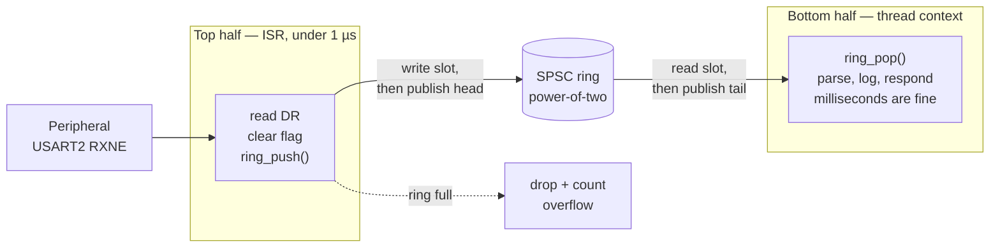

# Deferred Work

"Keep your ISRs short" is the most repeated piece of firmware advice and the least actionable, because it never says short compared to what. The useful form is a consequence of how the NVIC works rather than a style preference: **every microsecond a handler runs is a microsecond added to the worst-case latency of every interrupt at the same or a less urgent priority.** A 200 µs handler is not "a bit slow". It is a 200 µs latency tax levied on most of the system, paid every time that handler runs, and it does not appear in any register you can read.

So the design pattern is not "write less code in the handler" but "split the work at the point where it stops being urgent". The part that must happen *now* — before the next byte overwrites `DR`, before the timer's capture register is reused, before the peripheral gives up — stays in the handler. Everything else is moved to thread context and runs when the system gets round to it. Linux calls the two halves the **top half** and the **bottom half**; the vocabulary is worth borrowing even on a bare-metal superloop, because it names the decision you are making.

The mental model: **the ISR's job is to make the event non-urgent, and then stop.** Capture the perishable thing, acknowledge the hardware, hand it over, return. Everything downstream of the handoff has as long as it likes.

The handoff is where the difficulty lives, because it is a data structure shared between two contexts that can interrupt each other. This page's main artefact is the one that gets it right.

:::info[Prerequisites]
[Interrupt Handlers in C](../04-bare-metal-programming/interrupt-handlers-in-c.md) covers the handler itself — naming, flag clearing, and the list of things that must never appear inside one. [Interrupt Latency](./interrupt-latency.md) explains why handler duration is a system-wide cost. [Critical Sections and Atomicity](../04-bare-metal-programming/critical-sections-and-atomicity.md) owns the masking mechanisms this page is largely about *avoiding*.
:::

## The split



What goes in the top half is decided by one question: **what is destroyed if I wait?**

| Belongs in the ISR | Why | Belongs in the bottom half |
|---|---|---|
| Read `USART_DR` | The next byte overwrites it; `ORE` follows | Parsing the message |
| Read `TIM_CCR` | The next capture overwrites it | Computing frequency or velocity |
| Read `ADC_DR` | Same | Filtering, scaling, calibrating |
| Clear the peripheral flag | Otherwise the handler re-enters forever | — |
| Timestamp (`DWT->CYCCNT`, a tick counter) | It is only accurate now | Everything you do with the timestamp |
| Push into the ring | It is the handoff itself | Draining the ring |
| — | | Anything that allocates, formats, blocks, or writes flash |

Everything in the right-hand column has the same property: doing it later produces the same answer.

## The single-producer/single-consumer ring buffer

This is the handoff. One writer on each index, a power-of-two size, and no locking anywhere — which is what makes it usable from an ISR without touching `PRIMASK` at all.

```c title="spsc_ring.h — ISR produces, thread context consumes"
#include <stdint.h>
#include <stdbool.h>

#define RING_SIZE 256u                  /* MUST be a power of two */
#define RING_MASK (RING_SIZE - 1u)

typedef struct {
    uint8_t  buf[RING_SIZE];
    uint32_t head;      /* written ONLY by the producer (the ISR)   */
    uint32_t tail;      /* written ONLY by the consumer (main loop) */
} spsc_ring_t;

/* Producer. Call from exactly one ISR. false = ring full, caller must drop. */
static inline bool ring_push(spsc_ring_t *r, uint8_t v)
{
    uint32_t head = r->head;                    /* we are the only writer of head */
    uint32_t next = (head + 1u) & RING_MASK;

    if (next == __atomic_load_n(&r->tail, __ATOMIC_ACQUIRE)) {
        return false;                           /* full — one slot is always spare */
    }

    r->buf[head] = v;                           /* fill the slot ... */
    __atomic_store_n(&r->head, next, __ATOMIC_RELEASE);  /* ... then publish it */
    return true;
}

/* Consumer. Call from exactly one thread context. false = ring empty. */
static inline bool ring_pop(spsc_ring_t *r, uint8_t *out)
{
    uint32_t tail = r->tail;                    /* we are the only writer of tail */

    if (tail == __atomic_load_n(&r->head, __ATOMIC_ACQUIRE)) {
        return false;                           /* empty */
    }

    *out = r->buf[tail];                        /* consume the slot ... */
    __atomic_store_n(&r->tail, (tail + 1u) & RING_MASK, __ATOMIC_RELEASE);
    return true;                                /* ... then release it */
}
```

Four invariants make it correct, and breaking any one of them breaks it silently:

1. **Exactly one context writes each index.** The producer owns `head`, the consumer owns `tail`, and each only *reads* the other's. No index is ever read-modify-written by two contexts, so there is no lost update and nothing to lock. This is the whole trick; everything else is detail.
2. **The size is a power of two and wrapping is a mask.** `& RING_MASK` cannot produce an out-of-range index for any input, so even a corrupted index yields a wild *value* rather than a wild *pointer*. A `%` by a non-power-of-two costs a multi-cycle divide in the ISR and buys nothing.
3. **One slot is always left empty.** `head == tail` means empty, unambiguously; the ring holds `RING_SIZE - 1` items. The alternative — a separate `count` field — requires both sides to increment and decrement the same variable, which is a read-modify-write across contexts and is exactly the race the design exists to avoid.
4. **Data is written before the index that publishes it.** The consumer must never see `head` advance past a slot that has not been filled. That ordering is what the release store enforces.

Note what is *absent*: no `volatile`. The `__atomic_*` operations already forbid the compiler from caching or reordering those accesses, and `buf` is ordered by the release/acquire pair. Adding `volatile` on top is harmless but signals that the author was not sure which mechanism was doing the work.

### The ordering, and what it costs

On Armv7-M, `__ATOMIC_RELEASE` emits a `dmb ish` before the store. On a single-core Cortex-M4 that barrier is doing nothing against another *core*, because there is no other core — and exception entry and exception return are already context-synchronising events, so a handler on the same core cannot observe the reordering the barrier prevents. What you genuinely need against an ISR on the same core is a **compiler** barrier, and C11 has the exact primitive for it:

```c
    r->buf[head] = v;
    __atomic_signal_fence(__ATOMIC_RELEASE);    /* compiler-only: emits nothing */
    __atomic_store_n(&r->head, next, __ATOMIC_RELAXED);
```

`atomic_signal_fence` is defined as ordering "between a thread and a signal handler executed in the same thread" (ISO/IEC 9899 §7.17.4.2) — which on an MCU is precisely the ISR-versus-`main` relationship. It generates no instruction and costs no cycles.

Use the relaxed-plus-fence form when the ISR's cycle budget is genuinely tight and you have read the disassembly. Use the release/acquire form everywhere else: it costs one `dmb` (a few cycles), it is correct on multi-core parts too, and it is much harder to get wrong when someone edits it in two years.

One case where the barrier is not optional: **if a DMA controller rather than the CPU is the producer**, you are ordering against a second bus master and the `DMB` is doing real work. [DMA](../05-peripherals-and-drivers/dma.md) covers the buffer-ownership rules that go with it.

### The overflow policy you must choose

`ring_push` returns `false`. Something has to happen next, and "nothing" is not one of the options.

```c
void USART2_IRQHandler(void)
{
    uint32_t sr = USART2->SR;

    if (sr & USART_SR_RXNE) {
        uint8_t byte = (uint8_t)USART2->DR;     /* reading DR clears RXNE */
        if (!ring_push(&rx_ring, byte)) {
            rx_dropped++;                        /* ISR-private: no race */
        }
    }
    if (sr & USART_SR_ORE) {
        (void)USART2->DR;                        /* SR-then-DR clears ORE */
        rx_overruns++;
    }
}
```

- **Drop the newest** (above) keeps the oldest data and is right for a command protocol, where the start of a message is what makes the rest parseable.
- **Drop the oldest** — advance `tail` from the producer — is right for telemetry, where recent samples matter more. It also breaks invariant 1, because the producer now writes `tail`; if you need it, do it under a short critical section or accept that the ring is no longer lock-free.
- **Count the drops, always, and expose the counter.** A ring that silently discards data produces a bug report of the form "it works but occasionally a message is wrong", and there is no way to tell that from a parser bug without the counter. `rx_dropped` is written only by the ISR and read by anything, so it needs no protection beyond being a single aligned word.

## Keeping the ISR under a microsecond

One microsecond at 100 MHz is 100 core cycles. That is a useful target because it is achievable and because it makes the handler's contribution to everyone else's latency smaller than the hardware's own entry cost. A budget for the UART handler above:

| Step | Cycles (order of magnitude) |
|---|---|
| Exception entry | 12 (Cortex-M4 TRM, zero wait states) |
| `USART2->SR` read (APB1, ≤ 50 MHz) | ~4 |
| `USART2->DR` read | ~4 |
| `ring_push` — mask, compare, store, release store | ~12 |
| Prologue, epilogue, exception return | ~20 |
| **Total** | **~55, or 550 ns** |

The figures for the APB reads and the prologue are derived rather than quoted; the point of the table is the shape, not the digits. Verify yours by latching `DWT->CYCCNT` at the first and last line of the handler and printing the difference from thread context.

What blows the budget, in rough order of frequency:

- **A function call into code you did not write.** A HAL callback, a logging function, a `printf`. Its duration is not a number you can state, which means your latency budget no longer has one either.
- **A critical section inside the handler.** If the handler needs to mask interrupts, the data structure is wrong. The whole point of the SPSC ring is that the ISR side needs no mask.
- **Floating point.** The first FP instruction in a handler triggers lazy stacking of `S0`–`S15` and `FPSCR` — 17 more words, at that moment. Do the maths in the bottom half.
- **A loop whose count depends on data.** `while (bytes_available())` inside the handler turns a bounded handler into an unbounded one, and under a fast source it never returns.
- **Division.** `SDIV`/`UDIV` are multi-cycle on Cortex-M4, and a scaling calculation belongs downstream anyway.

## Getting the bottom half to run

Four ways to make thread context notice, in increasing order of sophistication:

1. **Poll the ring from the main loop.** `while (ring_pop(&rx_ring, &b)) { handle(b); }` at the top of the superloop. Latency is one loop period; correctness is free. For most systems this is the right answer and needs no further thought.
2. **A flag plus `WFI`.** Sleep in the main loop and let any interrupt wake the core. The handler need not set anything at all — the ring is self-describing — but the loop must re-check the ring *after* waking, and the check must not be skipped because the wake came from a different interrupt.
3. **A software-triggered exception at the lowest priority.** The ISR makes a low-priority exception pending; that handler runs when nothing more urgent is left, giving you a deferred context with interrupt-like plumbing and no scheduler. `PendSV` exists for exactly this shape of problem, and any spare NVIC line can be pended in software through `NVIC_ISPR` or `NVIC_STIR` ([The NVIC](../02-processor-architecture/the-nvic.md) covers both).
4. **Where an RTOS exists, hand off to a task.** Kernels provide non-blocking ISR-safe APIs for this — a queue send, a semaphore give, or the cheaper mechanism of writing directly into a per-task notification word, which avoids the queue's copy entirely and is the usual choice for a simple "wake up, there is work" signal. Those APIs, and the rule that they may only be called from interrupts below the kernel's masking ceiling, belong with the kernel material rather than here.

Options 3 and 4 have a property the first two do not: **the deferred work becomes preemptible by real interrupts**, so a slow bottom half stops being a latency problem for the rest of the system. That is usually the reason to graduate from option 1.

:::warning[The ring buffer with a `count` field, and the ISR that shared its buffer with a second interrupt]
Two ways to build a handoff that is 99.9 % correct, which is the worst kind.

**The `count` field.** It looks so much clearer than head-versus-tail arithmetic: `count++` in the producer, `count--` in the consumer, `count == 0` means empty. Both are read-modify-write sequences on the same variable from two contexts. The ISR fires between the consumer's load and its store, the consumer's stale value wins, and the count is now permanently one too high. The ring appears to hold an item that is not there; the consumer pops a stale byte; over hours the count drifts until the ring reports full while empty and the link goes silent until reboot. The symptom is "the UART stops receiving after a few hours" — a description that sends everyone to the peripheral, the cabling and the far end, and never to the eleven-line data structure. There is no `count` field in the listing above and that is not an omission. If you need a fill level, compute `(head - tail) & RING_MASK` from either side; both indices are readable and it derives cleanly.

**Two producers.** The invariant is *single*-producer. Add a second interrupt that also calls `ring_push` on the same ring — USART1 and USART6 into one "console" buffer, or a re-used driver instance — and if either can pre-empt the other, both read the same `head`, both write the same slot, and one byte vanishes while `head` advances twice. The corruption rate is proportional to load, so it passes every bench test. Two fixes, both cheap: give the two interrupts the **same preempt priority**, which makes it structurally impossible for them to interleave (see [Priorities and Nesting](./interrupt-priorities-and-nesting.md)), or give each producer its own ring. Do not reach for a critical section — that is the mechanism this data structure was chosen to avoid.
:::

## See also

- [Shared Data and Race Conditions](./shared-data-and-race-conditions.md) — the instruction-level view of why the indices above are safe and a `count` field is not.
- [Interrupt Latency](./interrupt-latency.md) — why handler duration is a system-wide cost, and how to measure the handler you just wrote.
- [Priorities and Nesting](./interrupt-priorities-and-nesting.md) — the same-preempt-level trick that gives two handlers free mutual exclusion.
- [Interrupt Handlers in C](../04-bare-metal-programming/interrupt-handlers-in-c.md) — handler naming, flag clearing, and the list of things that must never run in one.
- [DMA](../05-peripherals-and-drivers/dma.md) — the alternative to deferring work: not taking the interrupt in the first place.

## References

- ISO/IEC — **9899:2018**, *Programming languages — C*. §7.17.4.2 for `atomic_signal_fence` and its definition as ordering between a thread and a signal handler executing in the same thread, which is the formal model for the ISR-versus-`main` ordering used above; §7.17.3 for the memory-order enumerators. (The published standard is a purchase; the final committee draft N2176 is freely available and identical in these clauses.)
- Free Software Foundation — [**GCC manual, "Built-in Functions for Memory Model Aware Atomic Operations"**](https://gcc.gnu.org/onlinedocs/gcc/_005f_005fatomic-Builtins.html). `__atomic_load_n`, `__atomic_store_n`, `__atomic_signal_fence`, and what each memory-order argument emits on a given target — worth reading beside the disassembly when you are deciding between the release and the relaxed-plus-fence form.
- Arm — [***Cortex-M4 Technical Reference Manual***](https://developer.arm.com/documentation/ddi0439/latest/) (DDI 0439), exception-handling chapter. The 12-cycle entry figure used in the handler budget, quoted for zero-wait-state memory.
- Corbet, Rubini and Kroah-Hartman — [***Linux Device Drivers***, 3rd edition](https://lwn.net/Kernel/LDD3/), chapter 10, "Interrupt Handling" (freely available under CC BY-SA). The origin of the top-half/bottom-half vocabulary and the reasoning for the split, at a much larger scale than an MCU but with the same argument.
- Memfault — [**Interrupt: *A Practical guide to ARM Cortex-M Exception Handling***](https://interrupt.memfault.com/blog/arm-cortex-m-exceptions-and-nvic). Practitioner-level treatment of exception entry, priority configuration and ISR design on Cortex-M, with debugger recipes for inspecting what was running when an exception was taken.
