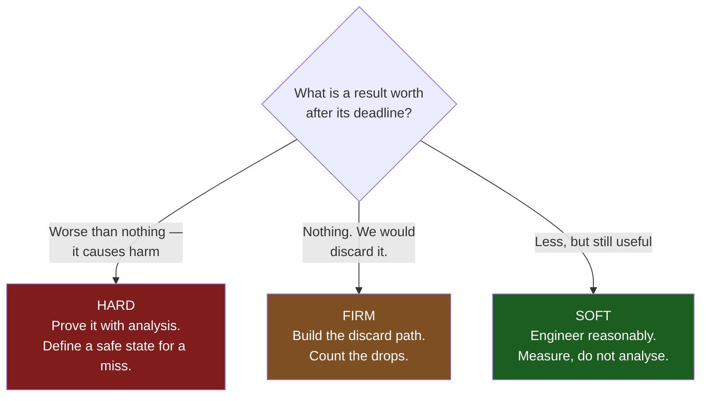

# What "Real-Time" Actually Means

"Real-time" is the most abused word in embedded engineering. It is used to mean fast, to mean interrupt-driven, to mean "there is an RTOS in the build", and occasionally to mean nothing at all beyond marketing. None of those is the definition. A real-time system is one whose **correctness depends on when a result is produced as well as on what the result is**. A right answer delivered late is a wrong answer. That is the whole idea, and everything else on this page is a consequence of it.

The mental model that keeps you honest: **real-time is a property of the worst case, not of the average.** A system that responds in 40 µs nine hundred and ninety-nine times out of a thousand and 12 ms on the thousandth is not a 40 µs system. It is a 12 ms system that spends most of its time idle. If your requirement is 100 µs, that system fails — and it fails in a way no amount of averaging, benchmarking or "it feels responsive" will reveal, because the failure is in the tail of a distribution you have not measured.

The second consequence is the one that surprises people: **"fast" and "real-time" are different properties, and optimising one can destroy the other.** Caches, branch predictors, flash accelerators, dynamic memory allocators and demand-paged virtual memory all make the average case dramatically better and the worst case harder to bound. A 1 GHz application processor beats a 100 MHz Cortex-M4 on every throughput benchmark ever written and loses badly on the only question a hard-real-time designer asks, which is "what is the largest number this can be?"

## Three classes, defined by what a miss costs

The taxonomy is not about how short the deadline is. A 24-hour deadline can be hard and a 5 ms deadline can be soft. The classification is entirely about **the value of a result delivered after its deadline**, and therefore about the consequence of a miss.

| Class | Value of a late result | Consequence of one miss | Real examples |
|---|---|---|---|
| **Hard** | Negative — a late result is worse than none | System failure. Damaged hardware, injury, loss of certification | BLDC/PMSM commutation (fire the wrong FET pair and the bridge shoot-through destroys itself); airbag squib firing, whose window after crash detection is tens of milliseconds; ABS valve modulation; pacemaker pacing pulses; flight-control surface updates under DO-178C |
| **Firm** | Zero — the result is simply discarded | Nothing breaks; the work is wasted and the output degrades | A video frame decoded after its presentation time (the display has moved on, drop it); a pick-and-place grab on a moving conveyor after the part has passed (reject the part, keep running); a TDMA radio frame that misses its slot and must be dropped rather than transmitted late into someone else's slot |
| **Soft** | Positive but decaying — still useful, just less so | Degraded quality of service; a user notices | Touchscreen redraw (past ~100 ms it feels laggy, nothing fails); logging to an SD card; a thermostat updating its display; refilling a network stream buffer that has seconds of depth |

Three things this table is trying to make unavoidable:

- **The boundary between firm and soft is whether a late result is still worth using.** If you would discard it, the deadline is firm and the correct design has an explicit "too late, drop it" path. If you would use it anyway, it is soft. Systems that are firm in reality but implemented as soft accumulate a backlog of stale work — the queue of decoded frames nobody will ever display.
- **One system contains all three.** The same motor controller has a hard commutation deadline at 200 µs, a firm deadline on the current-sense sample that pairs with a specific PWM cycle, and a soft deadline on the CAN status message the operator panel displays. The classification is per-deadline, never per-product.
- **Hard is expensive and you should want as few of them as possible.** Every hard deadline is a claim you have to defend with analysis, not measurement — see [Worst-Case Execution Time](./wcet.md). A design that reduces the hard set to two deadlines and makes the rest firm is enormously cheaper to certify than one where everything is "critical".

The classification is mechanical once you ask the right question, and the right question is never "how urgent does this feel":



## Three systems, worked through

The classification is not an academic label. It decides what the code has to contain, and the difference is visible in the source.

**A brushless motor drive — hard.** Maximum shaft speed 25 000 rpm with 2 pole pairs and 6 commutation events per electrical revolution gives 25 000 / 60 × 2 × 6 = 5000 events per second, so events arrive at most every **200 µs**. The commutation outputs must be updated within **50 µs** of the shaft-position edge, because after that the rotor has moved far enough that the winding being energised is generating back-EMF against the drive. What the hard classification forces into the design: this handler sits at the top of the priority order; nothing on its path allocates memory or takes a lock of unbounded duration; its worst-case execution time is analysed rather than sampled; and there is a defined **safe state** — disable the gate drivers — entered by a hardware timeout if the update ever fails to happen. That last item is the part people skip, and it is what separates a hard-real-time design from a fast one.

**A display pipeline — firm.** At 60 frames per second the frame period is 1/60 s ≈ **16.67 ms**. A frame composited after its vsync is worthless: the display has already scanned out. What firm forces: an explicit *drop* path that abandons the late frame rather than presenting it one frame later, double buffering so a partially composited frame is never scanned out, and a dropped-frame counter exposed for diagnostics. Omit the drop path and the pipeline degrades in the characteristic way — a queue of late frames builds, every frame is presented, and the displayed image drifts further and further behind reality until the buffer pool is exhausted. The user reports "input lag", which is a design defect, not a performance one.

**A data logger writing to an SD card — soft.** A log record is still worth writing a second late. What soft permits: buffering in a ring that absorbs card stalls, and a defined overflow policy — drop oldest, count the drops — rather than an analysed bound. This matters because SD card write latency is genuinely awful in the tail: internal wear-levelling and block erase can stall a write for a long time, and the figure is card-specific rather than something a standard guarantees. Measure the card you actually ship, size the ring for the worst stall you observe plus margin, and accept that you have not bounded it. That is the correct engineering answer for a soft deadline and an unacceptable one for a hard deadline, which is exactly why the classification came first.

## Where a deadline comes from

A deadline is derived, not chosen. If nobody can say where the number came from, it is almost always a soft deadline wearing a hard label, and the analysis effort spent on it is wasted.

- **Control loops** get their sample period from the bandwidth of the plant being controlled, and their deadline from the fact that a controller is designed around a fixed loop delay. Delay in a feedback loop is phase lag and phase lag costs stability margin; a controller tuned for a one-sample delay tolerates exactly that and destabilises when the delay varies. This is why jitter is worse than latency for control.
- **Mechanical systems** give deadlines through motion: the shaft turned, the part moved past the nozzle, the web advanced. The number falls out of a speed and a tolerance.
- **Protocols** state theirs. A bus turnaround time, an inter-frame gap, a slot in a network schedule — these are in someone else's specification and are not negotiable.
- **Humans** give the soft ones. Roughly 100 ms is the threshold at which a response stops feeling instantaneous, which is why UI deadlines cluster there and why none of them are hard.

Write the derivation next to the requirement. It is what lets the next engineer tell whether a change to the mechanical design just changed a timing requirement.

## Latency, jitter and throughput

These are three independent properties. A system can be excellent at any one of them and terrible at the others, and requirements that confuse them are the single most common source of arguments during integration.

**Latency** is the delay from a stimulus to the corresponding response. It is a scalar per event, and what matters is its distribution — specifically the maximum. [Interrupt Latency](./interrupt-latency.md) enumerates what the number is made of on this part.

**Jitter** is the *variation* in a timing property, usually the variation in latency or in the period of a supposedly periodic event. A system with 500 µs of latency and 1 µs of jitter is far more useful for closed-loop control than one with 50 µs of latency and 200 µs of jitter, because constant delay is something a controller can be designed around and variable delay is noise injected into the loop.

**Throughput** is work per unit time. It is the property benchmarks measure and the one least related to real-time behaviour. A DMA-driven design has excellent throughput and can have poor latency on any individual item; an interrupt-per-byte design has the opposite shape. [Polling, Interrupt, or DMA](./polling-interrupt-or-dma.md) is the trade-off in detail.

```wavedrom title="Constant period in, variable delay out — this is jitter, not latency" alt="A trigger signal pulsing at a fixed period, and a response signal whose pulse follows each trigger after a different delay each time"
{ "signal": [
  { "name": "trigger",  "wave": "010.....010.....010....." },
  { "name": "response", "wave": "0..10.......10........10" }
], "config": { "hscale": 2 } }
```

The trigger is exactly periodic. The response follows it after 2, 3 and 5 units respectively. Latency here is 2–5 units; jitter is the 3-unit spread. Note that you cannot see jitter at all by measuring one event, and you cannot see it by measuring the average of many — you see it only by measuring the spread, which is why a scope in infinite-persistence mode is the right instrument and a stopwatch is not.

:::note
Jitter also has a *sign* problem people trip over. Jitter in when a task is *released* propagates into every response time downstream of it, and in response-time analysis it appears as an extra term rather than being absorbed. If a sensor task is released by a timer that itself has 40 µs of jitter, every deadline computed from that release inherits the 40 µs.
:::

## Why "fast" is not the same property

Consider two systems asked to respond to a pin edge within 200 µs, every time, forever.

- A 1 GHz Cortex-A running mainline Linux. Any given piece of work executes ten to fifty times faster than on the M4. Its *typical* response to a GPIO interrupt is a few microseconds. Its worst case is set by whatever the longest non-preemptible section in the kernel happens to be on that configuration, plus a possible page fault, plus whatever the CPU frequency governor was doing at the time. That number is not in any document, varies with kernel version, and the entire `PREEMPT_RT` effort exists to bound it.
- A 100 MHz Cortex-M4 with no operating system. Every piece of work executes slowly. But the worst-case response is a sum of terms you can compute from published documents plus terms you control: masking, preemption by higher-priority handlers, instruction completion, stacking, vector fetch, and flash wait states. The result is a number you can write on a page and defend.

The slow system meets the requirement and the fast one cannot be shown to. That is the entire distinction. **Real-time is about the existence of a bound, not the size of it.**

Two corollaries worth stating explicitly, because they change how you spend effort:

- **Making code faster does not make a system real-time.** It moves the whole distribution left, including the tail, which helps — but a distribution with an unbounded tail is still unbounded after you halve it. The work that makes a system real-time is bounding: finding the mechanisms whose duration depends on history or data and removing or capping them. [Determinism Killers](./determinism-killers.md) is a catalogue of them.
- **A generous deadline does not make a requirement soft.** "Within 10 seconds" is a hard deadline if a miss trips a safety interlock. The size of the number tells you how much analysis effort it deserves, not what class it is in.

## Writing a requirement someone can test

Most timing requirements in real specifications are untestable, and the failure shows up during acceptance when nobody can agree whether the system passed. A testable one names five things:

1. **The stimulus** — a specific, observable event.
2. **The response** — a specific, observable output.
3. **The deadline** — a number, measured from the stimulus.
4. **The class** — hard, firm or soft, with the consequence of a miss stated.
5. **The assumed arrival pattern** — the period, or for an aperiodic event the *minimum interarrival time*. Without this the requirement is unanalysable, because a deadline with no bound on how often the event can arrive cannot be met by any system.

Untestable, in the form specifications usually arrive:

> The system shall respond to shaft position changes quickly, with an average response time under 100 µs.

Testable:

> On each rising edge of `TACHO_IN`, the commutation outputs shall be updated within 50 µs of the edge. This deadline is **hard**: a late update energises the wrong winding and can cause bridge shoot-through. The minimum interarrival time is 200 µs, derived from the maximum shaft speed of 25 000 rpm with 2 pole pairs and 6 commutation events per electrical revolution: 25 000 / 60 × 2 × 6 = 5000 events/s.

The derived arrival rate is the part people leave out, and it is the part that makes the requirement into something [Scheduling Theory for Firmware](./scheduling-theory.md) can actually analyse. Note also that "average" has been deleted, not tightened. An average is not a deadline and no useful statement can be made about a real-time system from one.

:::warning[The requirement written as an average, and the deadline classified by how it feels]
Two ways a timing requirement passes review and then fails in the field.

**"99.9% of responses within 10 ms."** This sounds rigorous — it has a number and a percentage. Work out what it permits. A 1 kHz control loop runs 3 600 000 times an hour; 0.1% of those is **3600 misses per hour, one every second**. If the deadline was actually hard, the specification you signed authorised a failure every second. The symptom in the field is a product that passes every bench test, passes the acceptance suite, and exhibits an intermittent fault nobody can reproduce because it is not a fault — it is exactly the behaviour that was specified. A hard deadline is specified as "always", full stop; if you cannot commit to "always", the deadline is not hard and the design needs a defined behaviour for a miss.

**Classifying by inconvenience rather than by consequence.** A commutation update gets labelled soft "because a missed step just makes the motor a bit rough". It does, at 200 rpm on the bench with no load. At 20 000 rpm under load, a commutation that arrives after the rotor has moved past the electrical angle it was computed for drives current into a winding that is now generating back-EMF against it — and the tell is not a timing symptom at all, it is a bridge FET that fails short six weeks into field trials, taking the gate driver with it. Nobody looks at scheduling when hardware burns. The classification test is always "what is the consequence of one miss", never "what does a miss feel like in the demo".
:::

## Where this leaves you

The practical output of classifying deadlines properly is a much smaller problem. You end up with a handful of hard deadlines that need worst-case analysis and a defended budget, a set of firm ones that need an explicit discard path, and a large soft remainder that needs nothing but reasonable engineering. Everything downstream — priority assignment, the choice of polling versus interrupts, whether an RTOS earns its place, how much timing analysis is worth doing — is decided by that partition.

## See also

- [Scheduling Theory for Firmware](./scheduling-theory.md) — the arithmetic that turns a set of deadlines and periods into a yes or no answer.
- [Worst-Case Execution Time](./wcet.md) — how to obtain the `C` values that any such analysis needs, and what it means to defend one.
- [Determinism Killers](./determinism-killers.md) — the mechanisms that make a worst case larger than a typical case, and which of them you can bound.
- [Interrupt Latency](./interrupt-latency.md) — the concrete latency chain on this board, term by term.
- [Bare Metal, RTOS, or Linux](../00-overview/bare-metal-vs-rtos-vs-linux.md) — the "fast versus real-time" argument above, applied to choosing a software architecture.

## References

- C. L. Liu and J. W. Layland — [***Scheduling Algorithms for Multiprogramming in a Hard-Real-Time Environment***](https://dl.acm.org/doi/10.1145/321738.321743), *Journal of the ACM* 20(1):46–61, January 1973. The founding paper of the field, and the source of the hard-real-time model used throughout this folder: periodic tasks, deadlines equal to periods, independent tasks, a single preemptive processor. Its opening sections define the terms this page uses before deriving anything. ACM Digital Library; a copy is usually reachable through an institution or the authors' hosts.
- Giorgio Buttazzo — ***Hard Real-Time Computing Systems: Predictable Scheduling Algorithms and Applications***, Springer, 3rd edition, 2011. Chapter 1 is the clearest treatment in print of what "real-time" does and does not mean, including the hard/firm/soft partition by value function rather than by deadline magnitude. A purchase.
- Hermann Kopetz — ***Real-Time Systems: Design Principles for Distributed Embedded Applications***, Springer, 2nd edition, 2011. The book to read on jitter, on the difference between event-triggered and time-triggered architectures, and on why constant delay is cheaper to design around than variable delay. A purchase.
- The Linux Foundation — [**Real-Time Linux wiki**](https://wiki.linuxfoundation.org/realtime/start). Worth reading precisely for the "fast is not real-time" argument: it documents the mechanisms in a general-purpose kernel that make worst-case latency unbounded, and the specific work `PREEMPT_RT` does to bound each one.
