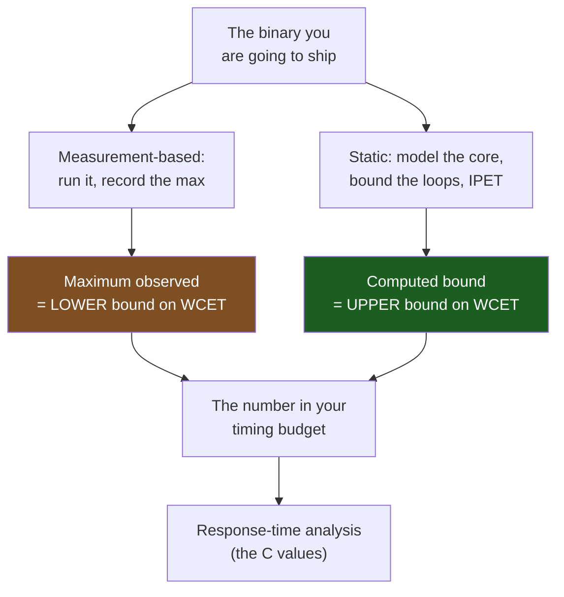

# Worst-Case Execution Time

Every piece of real-time analysis needs one number per task: how long it takes to run. Not how long it usually takes — how long it can possibly take. That number, the worst-case execution time, is the input to response-time analysis, to utilisation budgets, and to every claim that a deadline is met. It is also the hardest number in embedded engineering to obtain honestly, because the obvious way to get it — run the code and time it — cannot produce it even in principle.

The mental model: **execution time is a distribution over inputs and machine states, and you need the supremum of that distribution, not a sample from it.** Running the code gives you samples. The largest sample you have ever seen is a *lower* bound on the worst case: the true worst case is at least that big, and you have no information at all about how much bigger. Every additional test moves the observed maximum up or leaves it alone. It never establishes a ceiling.

The second thing worth stating before any technique: **a WCET figure belongs to a binary, not to source code.** Change the optimisation level, the compiler version, the linker layout, or the place a function ended up in flash, and the number changes. A WCET recorded without the toolchain and flags that produced it is not a measurement, it is a rumour.

:::info[Prerequisites]
[What "Real-Time" Actually Means](./real-time-definitions.md) establishes why the worst case is the only case that matters. [Scheduling Theory for Firmware](./scheduling-theory.md) is what consumes the numbers this page produces — the `C` values in every response-time calculation. [Interrupt Latency](./interrupt-latency.md) covers the closely related question of how long it takes to *start* running, which is a different measurement with different terms.
:::

## The five numbers people confuse

Wilhelm et al. open their survey by separating quantities that get called "the execution time" interchangeably. Getting these apart is most of the battle:

| Quantity | What it is | How you get it |
|---|---|---|
| **BCET** | The true minimum over all inputs and states | Static analysis, or never |
| **Minimum observed** | The fastest run you happened to see | Measurement |
| **Average** | The mean of the runs you happened to see | Measurement. Useful for throughput, useless for deadlines |
| **Maximum observed** | The slowest run you happened to see | Measurement. A **lower bound** on the WCET |
| **WCET** | The true maximum over all inputs and states | Not directly obtainable |
| **WCET bound** | A value provably ≥ the WCET | Static analysis |

The two numbers you can actually compute sit on opposite sides of the one you want: the maximum observed is below it, the static bound is above it. The true WCET is somewhere in between and you will never know exactly where. **A safe design uses the upper bound; a pragmatic one uses the observed maximum plus a defended margin and is honest that this is engineering judgement rather than proof.**

## Why the average is the wrong measurement

Three reasons, in increasing order of how much trouble they cause.

**Deadlines are per-activation, not per-hour.** A control loop that averages 300 µs of work in a 1000 µs period is at 30% utilisation, which sounds comfortable. If one activation in ten thousand takes 1200 µs, that activation misses, and the average is entirely unchanged by the fact. Averages describe capacity. Deadlines are about individual events.

**Averages hide exactly the mechanisms that break real-time systems.** Caches, flash accelerators, branch speculation, dynamic allocation and variable-bound loops all exist to improve the common case. Every one of them widens the gap between typical and worst. So the better your system's average, the *less* the average tells you about the maximum — the two numbers diverge precisely because of the optimisations you added. [Determinism Killers](./determinism-killers.md) catalogues them.

**The measurement conditions that produce a good average are the ones that hide the tail.** Run a handler in a tight loop at 10 kHz and it is resident in the flash accelerator, its data is in registers, and the branch is predicted. That measurement is real, repeatable, and describes a state your product will never be in. See the warning below.

## Measurement-based analysis

Instrument the code, run it, record the maximum. This is what almost all firmware does, and for good reason: it needs no hardware model, it runs on the real board with the real bus contention and the real peripheral latencies, and it costs an afternoon rather than a quarter.

What it can prove: **that the WCET is at least the largest value observed.** That is genuinely useful — it catches the case where a task is far slower than anyone thought.

What it cannot prove: anything about the ceiling. Three specific gaps:

- **Input coverage.** The worst case is reached by some input, and your test suite must generate it. For a loop whose trip count is a frame length, the worst case needs the longest frame; for a state machine, the longest path; for an algorithm with early exit, the input that never exits early. These are exactly the inputs functional testing does not prioritise, because they are not interesting functionally.
- **State coverage.** Even with the worst input, the worst time also needs the worst machine state — cold flash accelerator, DMA contending for the bus, an interrupt arriving at the least convenient moment. Reproducing that deliberately is difficult and reproducing it *accidentally* is a matter of luck.
- **The probe changes the measurement.** Anything you add to observe the code adds cycles to it, and some instrumentation adds a variable number.

The middle ground is **hybrid** or measurement-based timing analysis: instrument at basic-block or segment granularity, measure each piece, then use static path analysis to compose a worst-case path through the program that no single test ever executed. It gives a much better answer than end-to-end measurement and is still not a proof, because the composition assumes segment times are independent of each other — which pipelines and caches make false in general.

## Static analysis

Static WCET analysis derives a bound from the binary and a model of the processor, without running anything. Wilhelm et al. decompose it into stages, and knowing the stages tells you where it will fail on your project:

1. **Control-flow reconstruction** from the binary — recovering the CFG, which is hard when there are computed branches (jump tables, function pointers).
2. **Value analysis** — bounding the values in registers and memory at each program point, mostly to resolve addresses.
3. **Loop-bound analysis** — the maximum trip count of every loop. Where it cannot be inferred, *you* supply it as an annotation. A loop with no bound means no answer at all.
4. **Micro-architectural analysis** — modelling pipeline, memory latency, and (on parts that have them) caches, to get a cost for each basic block.
5. **Path analysis** — usually IPET, implicit path enumeration, which encodes the CFG and block costs as an integer linear program and maximises. This is what finds the expensive path without enumerating all of them.

What it can prove: **an upper bound on the WCET, sound with respect to its hardware model and its loop annotations.**

What it cannot do:

- **Be sound when the hardware model is wrong.** The model must be validated against the real silicon, and it is only as good as the vendor's documentation. Undocumented buffers, prefetchers and arbitration policies are the usual obstacle.
- **Avoid pessimism.** An unreachable path the analyser cannot prove unreachable, or a loop bound you had to over-declare, inflates the answer. Bounds two to five times the observed maximum are ordinary. That headroom is real cost — it is CPU you paid for and cannot use.
- **Work without effort.** Loop annotations, infeasible-path annotations and toolchain integration are a project, not a build step.

## Choosing, and what each is for



| | Measurement-based | Static analysis |
|---|---|---|
| **Produces** | Maximum observed execution time | A provable upper bound |
| **Soundness** | Lower bound on the true WCET. **Never** an upper bound | Safe upper bound, conditional on the hardware model and the loop bounds |
| **Needs** | Real board, real inputs, a cycle counter or a pin | The binary, a validated timing model, loop annotations, a commercial tool |
| **Fails when** | The worst-case input or state is never generated; the probe perturbs the code | The model is wrong or the hardware is undocumented; a loop bound is unavailable; pessimism makes the answer unusable |
| **Effort** | Hours | Weeks, plus tool cost and a validation argument |
| **Where it is used** | Almost all firmware, almost all of the time | DO-178C Level A, ISO 26262 ASIL C/D, IEC 61508 SIL 3+ — where a certification authority requires a bound rather than evidence |

The honest position for a typical product: measure carefully, understand what measurement cannot tell you, and spend the effort you save on *removing* the mechanisms that make the worst case unpredictable rather than on analysing them.

## What this part makes easy — and what it does not

Static analysis of a Cortex-M4 is unusually tractable, and it is worth being precise about why. The STM32F411 has **no instruction cache and no data cache** in the Cortex-M7 sense. Stage 4 above — micro-architectural analysis — is dominated on larger processors by cache analysis, and here there is no cache state to model. Memory latency is a small table: SRAM is zero wait states, and flash costs 3 wait states at 100 MHz (RM0383 Rev 4 §3.4.1, Table 5, for VDD in the 2.7–3.6 V range).

The complication on this part is the **ART accelerator** (RM0383 Rev 4 §3.4.2), a small cache *inside the flash interface* — 64 lines of 128 bits for instructions plus 8 lines for the literal pool, fed by a prefetch buffer. RM0383 describes it functionally. It does not publish a replacement policy or a timing model, which means a sound static bound cannot model its hits and must assume every fetch misses and pays the full wait states.

The consequence is a clean, honest position, and it is the one to write into a budget:

- **The sound bound is the ART-cold bound.** Assume no hits. That is provable from documented numbers.
- **The gap between that bound and reality is the ART's speedup**, which on hot code is large. You do not get to claim it, and you should not want to, because the ART is precisely a mechanism whose benefit depends on execution history.
- **You can force measurement to agree with the bound.** Disabling the instruction cache and prefetch in `FLASH_ACR` before a timing run makes the measurement approach the cold case, at the cost of running slower. [Determinism Killers](./determinism-killers.md) covers the register and the rules for touching it.

:::note
Every number in this section is specific to the STM32F411. A Cortex-M7 part such as an STM32F7 or H7 has real L1 instruction and data caches, and its static analysis is a genuinely harder problem with cache-state modelling and coherency to worry about. A Cortex-M0+ typically has no accelerator at all and is easier still. Take the wait-state table and the accelerator description from your part's reference manual.
:::

## Measuring on this board

The cycle counter in the DWT unit is the right instrument for execution time: it counts core clock cycles, costs a load to read, and needs no external hardware (*Armv7-M ARM* §C1.8, "Data Watchpoint and Trace unit").

```c
#include <stdint.h>

#define DEMCR       (*(volatile uint32_t *)0xE000EDFCu)  /* Armv7-M ARM §C1.6 */
#define DWT_CTRL    (*(volatile uint32_t *)0xE0001000u)
#define DWT_CYCCNT  (*(volatile uint32_t *)0xE0001004u)

static inline void cycle_counter_init(void)
{
    DEMCR      |= (1u << 24);   /* TRCENA — must be set before DWT is usable */
    DWT_CYCCNT  = 0u;
    DWT_CTRL   |= (1u << 0);    /* CYCCNTENA */
}

typedef struct {
    uint32_t worst;      /* high-water mark, in core cycles */
    uint32_t last;
    uint32_t overruns;   /* times the budget was exceeded */
    uint32_t budget;     /* what the timing table says this may cost */
} timing_t;

static inline uint32_t timing_begin(void) { return DWT_CYCCNT; }

static inline void timing_end(timing_t *t, uint32_t start)
{
    uint32_t elapsed = DWT_CYCCNT - start;  /* unsigned wrap is well defined */
    t->last = elapsed;
    if (elapsed > t->worst)  { t->worst = elapsed; }
    if (elapsed > t->budget) { t->overruns++; }
}
```

Four details that decide whether the numbers mean anything:

- **`TRCENA` first.** `DWT_CTRL` writes are ignored until bit 24 of `DEMCR` is set. The usual symptom is a cycle counter that reads zero forever and a morning spent on it.
- **Unsigned subtraction handles the wrap.** `CYCCNT` is 32 bits, so at 100 MHz it wraps every 2^32 / 10^8 ≈ **43 seconds** (derived, not quoted). The subtraction above is correct across a wrap as long as the interval being measured is shorter than that, which any execution time is.
- **Subtract the probe's own cost.** Time an empty interval — `begin` immediately followed by `end` — and subtract that constant. On a Cortex-M4 the reads are loads from the private peripheral bus and are not free.
- **Record the budget alongside the high-water mark.** The `overruns` counter is the point of the struct: it turns "we think this is fast enough" into a fact the device reports. Expose it over your diagnostic interface and check it on every board that comes back from the field.

For the events a cycle counter cannot see — the interval from a pin edge to the first instruction of a handler — a GPIO toggle and a scope are the instrument, as described in [Interrupt Latency](./interrupt-latency.md). The board's SWO pin and the instruction-trace features of the debug hardware give a third route, letting you timestamp entries and exits without adding code to the measured path; those workflows are covered with the debugging tools rather than here.

## A timing budget you can defend

A budget is a written artefact that lives in the repository, not a spreadsheet on somebody's laptop. The minimum useful form has one row per task with deadlines, and a **source** column, because the source is what makes it defensible:

| Task | `T` (µs) | `C` budget (µs) | How `C` was obtained | Margin |
|---|---|---|---|---|
| Current control | 1000 | 300 | DWT high-water over 48 h soak, worst input set, ART reset before each run; ×1.3 engineering margin applied | 3.3× to deadline |
| IMU fusion | 2500 | 900 | DWT high-water, 48 h soak; loop bounds are fixed at compile time | 2.8× |
| Host protocol | 10000 | 2500 | DWT high-water with maximum-length frames forced by a test harness | 4.0× |
| `TIM3_IRQHandler` | 200 min. interarrival | 20 | Cycle count from disassembly, cross-checked against DWT | — |

Rules that make such a table worth having:

1. **Every row states how the number was obtained.** "Measured" is not a source. "DWT high-water over a 48-hour soak with the longest frames the protocol permits" is.
2. **State margins as margins.** Multiplying a measured maximum by 1.3 is a reasonable engineering practice and is *not* a bound. Say "measured maximum × 1.3" in the table so nobody later mistakes it for analysis.
3. **Pin the binary.** Record compiler version, optimisation level and the commit. See [Optimization Flags](../03-toolchain-and-build/optimization-flags.md) for how much `-O0` versus `-O2` moves these numbers.
4. **Enforce it at run time.** The `overruns` counter above turns the budget into a live assertion. A budget nothing checks is a document, not a control.
5. **Re-derive after any change to `C`.** Feed the table straight into [Scheduling Theory for Firmware](./scheduling-theory.md) — a set that passed response-time analysis at one set of `C` values says nothing about another.

Then keep headroom. Targeting total utilisation at or below roughly 70% costs a little hardware and buys you the rate-monotonic utilisation bound as a free proof, plus room for the feature nobody has asked for yet. Systems designed at 95% utilisation are correct exactly once and are never modified again without re-analysis.

:::warning[The high-water mark that never saw the worst case, and the probe that changed the answer]
Two ways to measure execution time carefully and get a number that is wrong in the direction that hurts.

**The path the tests never took.** A protocol handler computes a CRC over the received frame, so its execution time is linear in frame length. The test harness sends 32-byte frames because that is what the functional tests needed; the field sends 512-byte frames on firmware update. The high-water mark after a 48-hour soak is a confident, stable number describing a sixteenth of the real worst case. The same shape appears with error paths — the retry branch, the recovery routine, the `default:` case that logs and re-syncs — because those are precisely the paths a passing test suite does not exercise. The tell is a timing table where the recorded maximum is suspiciously close to the *average*: a task whose worst case is within 10% of its mean is either genuinely straight-line code or has never been driven to its worst case, and it is almost always the second. Audit by reading the code for every loop whose trip count depends on data, and force each one to its bound deliberately.

**Instrumentation that blocks.** Adding `printf`-over-ITM or a `ITM_SendChar` call inside a handler to see what it is doing changes its execution time by an *unbounded* amount, because the ITM stimulus port stalls the writing core when its FIFO is full and the FIFO drains at whatever rate the debug probe and host manage. The handler's timing then depends on USB scheduling on your laptop. The symptom is the worst possible one: the system behaves differently with the debugger attached than without, in both directions — sometimes the bug disappears under instrumentation, sometimes it only appears there — and days go into chasing a Heisenbug that is the measurement apparatus. Use `DWT_CYCCNT` to record numbers into RAM and read the RAM later; never do formatted output from inside code whose timing you are measuring or whose timing matters.
:::

## See also

- [Scheduling Theory for Firmware](./scheduling-theory.md) — what the numbers on this page are for: the `C` terms in response-time analysis and utilisation bounds.
- [Determinism Killers](./determinism-killers.md) — the mechanisms that separate the worst case from the typical one, and which of them can be disabled or bounded.
- [Interrupt Latency](./interrupt-latency.md) — the companion measurement, from event to first useful instruction, with its own set of contributors.
- [Optimization Flags](../03-toolchain-and-build/optimization-flags.md) — why a WCET figure is a property of a binary, and how much the flags move it.
- [SysTick and Core Peripherals](../02-processor-architecture/systick-and-core-peripherals.md) — the core timers alongside DWT, and the alternative time bases for coarser measurements.

## References

- Reinhard Wilhelm et al. — [***The Worst-Case Execution-Time Problem — Overview of Methods and Survey of Tools***](https://dl.acm.org/doi/10.1145/1347375.1347389), *ACM Transactions on Embedded Computing Systems* 7(3), Article 36, April 2008. The definitive survey and the source of this page's framing: the distinction between observed maxima and computed bounds, the decomposition of static analysis into value, loop-bound, micro-architectural and path analysis, IPET, and a tool-by-tool comparison. Read at minimum the introduction and the "basic notions" section.
- Arm — [***Armv7-M Architecture Reference Manual***](https://developer.arm.com/documentation/ddi0403/latest/) (DDI 0403E.e). §C1.8 for the DWT unit, `DWT_CTRL.CYCCNTENA` and `DWT_CYCCNT`; §C1.6 for `DEMCR` and the `TRCENA` bit that must be set before any of it responds.
- Arm — [***Cortex-M4 Technical Reference Manual***](https://developer.arm.com/documentation/ddi0439/latest/) (DDI 0439). The instruction-timing summary, which is where per-instruction cycle counts come from when you are counting a short handler by hand rather than measuring it, including the pipeline-refill penalty notation used for branches.
- STMicroelectronics — [**RM0383**, *STM32F411xC/E reference manual*](https://www.st.com/resource/en/reference_manual/rm0383-stm32f411xce-advanced-armbased-32bit-mcus-stmicroelectronics.pdf), Rev 4. §3.4.1 Table 5 for the wait-state table and its VDD conditions; §3.4.2 for the ART accelerator's 64 instruction lines, 8 data lines and prefetch buffer — and for the fact that no replacement policy or timing model is published, which is why a sound bound must assume misses.
- AbsInt — [**aiT Worst-Case Execution Time Analyzer**](https://www.absint.com/ait/index.htm). Product documentation for a commercial static analyser, useful as a concrete statement of what such a tool requires from you: the binary, loop annotations, and a validated processor model per target. A commercial purchase, listed here for the input requirements rather than as a recommendation.
