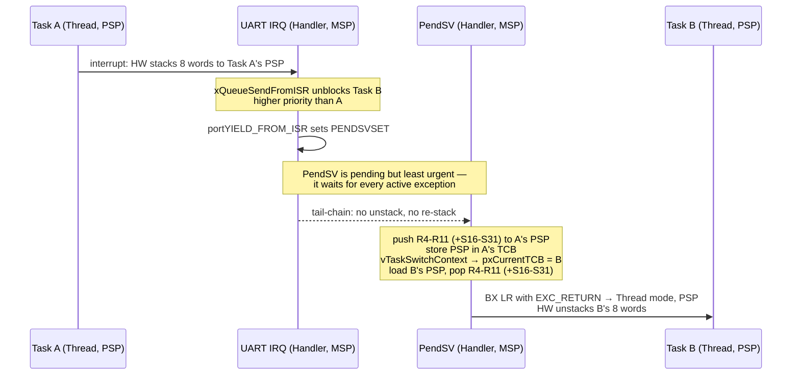

# Context Switching

A context switch is not a function call. A function call returns to its caller; a context switch enters on one task's stack and leaves on another's, and the code that resumes has no idea it was ever stopped. There is no C construct for that. What makes it possible on a Cortex-M is that the processor already performs most of it, for free, every time an exception is taken — and that an exception *return* reads its destination out of memory rather than from a register, so pointing it at a different stack points it at a different task.

The mental model: **the hardware does half the switch and the kernel does the other half, and the split is exactly the AAPCS caller/callee-saved boundary.** Exception entry pushes the caller-saved registers — the ones a C function is allowed to clobber — which is what makes an ordinary C function a legal exception handler. Those are also precisely the registers a *return* would not have preserved, so the kernel has to push the rest: the callee-saved set, which no exception mechanism knows about because no exception mechanism needs to.

Get that framing and everything else on this page follows: why the frame is split the way it is, why the port pushes `R4`–`R11` and nothing else, why the floating-point registers are split the same way, and why the whole thing runs in `PendSV`.

:::info[Prerequisites]
[Exceptions and the Vector Table](../02-processor-architecture/exceptions-and-the-vector-table.md) owns exception entry, the stack frame the hardware pushes, tail-chaining and late arrival. [Privilege Modes and the Two Stacks](../02-processor-architecture/privilege-modes-and-stacks.md) owns `MSP`/`PSP` and why an RTOS uses both. [Floating Point and DSP Extensions](../02-processor-architecture/floating-point-and-dsp.md) owns lazy stacking and the `FPCCR` bits. [Interrupt Latency](../06-interrupts-timing-and-real-time/interrupt-latency.md) owns the entry-cost budget. This page is the switch-specific material those four make possible, and does not re-derive any of them.
:::

## Why `PendSV`, and why at the lowest priority

`PendSV` is exception 14, it has no hardware source, and software raises it by setting one bit — `SCB->ICSR.PENDSVSET`. PM0214 Rev 10 §2.3.2 states its purpose outright: "PendSV is an interrupt-driven request for system-level service. In an OS environment, use PendSV for context switching when no other exception is active."

The last clause is the design. Every Cortex-M port sets `PendSV` to the **numerically largest, least urgent** configurable priority — `0xFF` before the implemented-bits shift, which on this part's four bits is level 15. Three properties follow, and the third is the one that turns a convention into a requirement.

**A switch never delays a device interrupt.** `PendSV` is pending, not active, while anything more urgent is running. If a UART interrupt arrives during the switch, the UART wins; the switch resumes afterwards. A context switch is the least time-critical work in the system — it is pure overhead — so it belongs at the bottom, exactly as [Priorities and Nesting](../06-interrupts-timing-and-real-time/interrupt-priorities-and-nesting.md) argues for deferred work generally.

**Multiple requests collapse into one.** `PENDSVSET` is a single bit. Five interrupts in a burst can each unblock a task and each request a switch; the bit is set five times and the handler runs once, after all five handlers are done, and switches directly to whichever task ended up highest priority. The intermediate switches are never performed because they were never needed. Combined with tail-chaining, a burst of interrupts costs one switch, not one per interrupt.

**The port's code is only correct if the switch is taken from Thread mode.** This is the requirement, and it is not optional. The handler's first instruction reads `PSP` to find the outgoing task's stack frame. That is right only if the frame went to `PSP` — which is true when `PendSV` pre-empted a *task*, and false when it pre-empted a *handler*, because Handler mode always runs on `MSP` (PM0214 §2.1.2). Put `PendSV` above any peripheral interrupt and it can pre-empt that interrupt's handler; the handler then saves and restores the wrong stack entirely. Lowest priority guarantees that when `PendSV` finally runs, every other exception has completed and the processor is returning to Thread mode.



The kernel raises `PendSV` from two places: `portYIELD()` inside a blocking API call that made something more urgent ready, and `portYIELD_FROM_ISR()` at the end of a handler that did the same. Both do the same thing — set one bit — and neither switches anything itself.

## Two halves of one context

Exception entry pushes eight words: `R0`–`R3`, `R12`, `LR`, the return address, and `xPSR`, with a possible ninth word of padding for 8-byte alignment. [Exceptions and the Vector Table](../02-processor-architecture/exceptions-and-the-vector-table.md) covers that frame and [Stack Usage and Overflow](../04-bare-metal-programming/stack-usage-and-overflow.md) covers its contribution to a depth budget. What matters here is *which* registers those are and why the set stops where it does.

| | Registers | Pushed by | Why this set |
|---|---|---|---|
| **Hardware frame** | `R0`–`R3`, `R12`, `LR`, return address, `xPSR` (8 words, 32 bytes) | The processor, on exception entry, to whichever stack was active | Exactly the AAPCS caller-saved set plus the return state. Saving these is what lets a plain C function be a handler: the compiler already assumes they may be destroyed across a call |
| **Software frame** | `R4`–`R11` (8 words) plus `LR`/`EXC_RETURN` (1 word) = 9 words, 36 bytes | The kernel's `PendSV` handler, to the outgoing task's `PSP` | The AAPCS callee-saved set. The compiler assumes these *survive* a call, so a switch that did not save them would corrupt every live variable the outgoing task had in a register |
| **Hardware FP frame** | `S0`–`S15`, `FPSCR`, one reserved word (18 words, 72 bytes) | The processor, on entry, only when floating-point context is active — space always reserved, contents written lazily | Caller-saved FP registers, same rule |
| **Software FP frame** | `S16`–`S31` (16 words, 64 bytes) | The kernel's `PendSV` handler, conditionally | Callee-saved FP registers, same rule |

The pattern is a single rule applied twice: **the hardware saves what a call may destroy; the kernel saves what a call must preserve.** Nothing about the split is arbitrary, and knowing that is the fastest way to tell whether a hand-written port is correct.

Adding it up for this part, derived from the sizes above rather than quoted from any document:

- A task that has never executed a floating-point instruction: 32 bytes hardware + 36 bytes software = **68 bytes** of context on its own stack at the moment of a switch.
- A task with live floating-point context: 104 bytes hardware (8 + 18 words, extended frame) + 36 + 64 = **204 bytes**, and up to 208 with the alignment word.

That third-of-a-kilobyte difference is charged to **every task that has ever touched a float**, and it is the most commonly omitted term in RTOS stack sizing. [Stacks and Heaps in an RTOS](./stacks-and-heaps-in-an-rtos.md) puts it into a budget.

## The handler, line by line

This is the shape of `xPortPendSVHandler` in the FreeRTOS Cortex-M4F port (`portable/GCC/ARM_CM4F/port.c`; `FreeRTOSConfig.h` conventionally does `#define xPortPendSVHandler PendSV_Handler` so it lands in the vector table). Read your own port's copy — this is here to be annotated, not copied.

```armasm
xPortPendSVHandler:
        mrs     r0, psp             @ the outgoing task's stack: HW frame is
        isb                         @   already on it. Handler runs on MSP.
        ldr     r3, =pxCurrentTCB   @ &pxCurrentTCB
        ldr     r2, [r3]            @ r2 = the outgoing task's TCB

        tst     r14, #0x10          @ EXC_RETURN bit 4: 0 = extended (FP) frame
        it      eq
        vstmdbeq r0!, {s16-s31}     @ callee-saved FP regs, only if FP is live

        stmdb   r0!, {r4-r11, r14}  @ callee-saved core regs + EXC_RETURN
        str     r0, [r2]            @ TCB->pxTopOfStack = r0  (offset 0!)

        stmdb   sp!, {r0, r3}       @ save across the C call, on MSP
        mov     r0, #configMAX_SYSCALL_INTERRUPT_PRIORITY
        msr     basepri, r0         @ mask kernel-aware interrupts only
        dsb
        isb
        bl      vTaskSwitchContext  @ picks the new pxCurrentTCB
        mov     r0, #0
        msr     basepri, r0         @ unmask
        ldmia   sp!, {r0, r3}

        ldr     r1, [r3]            @ r1 = the NEW pxCurrentTCB
        ldr     r0, [r1]            @ r0 = its saved stack pointer
        ldmia   r0!, {r4-r11, r14}  @ restore core regs and its EXC_RETURN

        tst     r14, #0x10          @ ... and its FP regs, if it had any
        it      eq
        vldmiaeq r0!, {s16-s31}

        msr     psp, r0             @ PSP now points at the new task's HW frame
        isb
        bx      r14                 @ EXC_RETURN → Thread mode, PSP;
                                    @ hardware unstacks the other 8 words
```

Seven details in that listing carry the whole design.

**`mrs r0, psp` on the first line, `msr psp, r0` on the last.** The handler executes on `MSP`, in Handler mode, but every push and pop it performs is against `PSP` with explicit `stmdb r0!` / `ldmia r0!` addressing. Two stacks are what make this work without relocating anything — the point [Privilege Modes and the Two Stacks](../02-processor-architecture/privilege-modes-and-stacks.md) makes from the architecture side.

**`str r0, [r2]` with no offset.** `pxTopOfStack` is the **first member** of `tskTCB`, deliberately, so saving the stack pointer is a single store to the TCB's base address. That field ordering is load-bearing: `tasks.c` carries a comment saying so, and reordering the structure breaks every assembly port at once.

**`r14` is saved and restored with the core registers.** `EXC_RETURN` lives in `LR` on entry, the `bl` to `vTaskSwitchContext` destroys it, and — the reason it goes on the *task's* stack rather than the handler's — its bit 4 records whether *that task* had floating-point context. It is per-task state, so it belongs in the per-task frame.

**`tst r14, #0x10`, twice.** Bit 4 of `EXC_RETURN` is 0 when the extended (floating-point) frame is in use and 1 when it is not. `TST` sets Z when the masked bits are zero, so `vstmdbeq` executes exactly when floating-point context is live. A task that never touches a float pays nothing: no `S16`–`S31` push, no extended frame, 68 bytes instead of 204.

**`BASEPRI`, not `PRIMASK`, around the C call.** The critical section protects the kernel's lists while `vTaskSwitchContext` walks them, and it is written with `BASEPRI` at `configMAX_SYSCALL_INTERRUPT_PRIORITY` so that interrupts *above* the kernel's ceiling keep running throughout — they cannot touch kernel state, so they need not be delayed. [Critical Sections and Atomicity](../04-bare-metal-programming/critical-sections-and-atomicity.md) covers the mechanism and the pre-shift the value needs; [Priorities and Nesting](../06-interrupts-timing-and-real-time/interrupt-priorities-and-nesting.md) covers where to put the ceiling.

**`dsb` then `isb` after writing `BASEPRI`.** Without the barriers the mask is not guaranteed to be in effect before the following instructions execute. This is the same requirement PM0214 §2.1.3 states for `MSR` on a stack pointer, and the same class of bug: it works on your desk and fails on a part with a different pipeline.

**`bx r14` is the switch.** Nothing here writes the program counter of the incoming task. `EXC_RETURN` tells the processor to return to Thread mode using `PSP`, and `PSP` now points into a different task's stack, so the hardware unstacks *that* task's `R0`–`R3`, `R12`, `LR`, `PC` and `xPSR`. The new task resumes at its own program counter with its own registers. The switch is a side effect of an ordinary exception return aimed somewhere else.

## The first switch, which cannot use this path

`PendSV`'s handler restores a context. At `vTaskStartScheduler()` there is no outgoing context to save, and the processor is in Thread mode on `MSP`, not `PSP`. The Cortex-M ports solve this with `SVC`: `prvPortStartFirstTask` resets `MSP` to the value the vector table holds at offset 0, enables interrupts, and executes `svc 0`. `vPortSVCHandler` then loads `pxCurrentTCB`, pops `R4`–`R11` and the task's `EXC_RETURN` from the artificial stack frame that `pxPortInitialiseStack` built at task-creation time, sets `PSP`, and returns.

That artificial frame is worth knowing about when you are staring at a task that faults on its very first instruction: `pxPortInitialiseStack` lays out a frame that *looks* as though the task had been interrupted — `xPSR` with the Thumb bit set, `PC` = the task function, `LR` = a "task returned" error trap, `R0` = the task parameter — so that the ordinary restore path can start it. A garbage `PC` or a clear Thumb bit in that frame is the difference between a task that runs and an immediate UsageFault with `INVSTATE` set.

## Floating point on this M4F

The STM32F411RE has a single-precision FPU (FPv4-SP-D16). [Floating Point and DSP Extensions](../02-processor-architecture/floating-point-and-dsp.md) owns the lazy-stacking mechanism, `FPCCR.ASPEN`/`LSPEN`/`LSPACT` and `FPCAR`; three consequences are specific to context switching and appear nowhere else.

**The port's `vstmdb` triggers the deferred save.** Lazy stacking reserves space for `S0`–`S15` on exception entry and writes them only if the handler executes a floating-point instruction. `vstmdbeq {s16-s31}` *is* a floating-point instruction, so on a switch out of a task with `LSPACT` set, the hardware completes the pending `S0`–`S15` save before the `VSTM` executes. The lazy saving therefore buys nothing on the `PendSV` path — but it still buys everything on the far more common path of an ordinary interrupt handler that does no floating-point work at all.

**Space is reserved per exception, not per task.** Once any code in a context has executed an FP instruction, `CONTROL.FPCA` is set and *every* exception taken from that context reserves the extended frame, whether or not the handler is the switcher. Budget 104 bytes for the hardware frame on every task that touches a float, not 32.

**Mixing an ARM_CM3 port with an M4F build is silent corruption.** The Cortex-M3 port has no `S16`–`S31` save because a Cortex-M3 has no FPU; compiled for an M4F with hardware floating point it still assembles, still links, and still runs. See the warning below.

Measuring the switch is a one-liner and you should not accept a quoted figure for it. Enable the DWT cycle counter (`DWT->CYCCNT`, `CoreDebug->DEMCR |= TRCENA`) and read it at the top and bottom of the handler, or toggle a spare GPIO across it and put a scope on the pin as in [Interrupt Latency](../06-interrupts-timing-and-real-time/interrupt-latency.md). The number depends on flash wait states, whether the handler is hot in the ART accelerator, whether floating-point context is live, and how `vTaskSwitchContext` was compiled — which is why it is a measurement rather than a table.

:::warning[The Cortex-M3 port on an M4F, and PendSV given a priority somebody thought was reasonable]
Two failures whose symptoms point at everything except the port.

**`ARM_CM3` selected on a Cortex-M4F with `-mfloat-abi=hard`.** The wrong port directory gets picked more often than you would expect: a vendor example targeted an M3, a project was copied from an older board, or the FPU was enabled months after the kernel was integrated and nobody revisited the port. Everything builds and everything runs. Then two tasks both do floating-point maths and their results become intermittently, slightly wrong — a filter that occasionally produces an absurd output, a PID that twitches. The mechanism: with hardware floating point, GCC allocates long-lived `float` variables into `S16`–`S31`, which are callee-saved and therefore the *task's* to preserve. The M3 port saves `R4`–`R11` and nothing else, so on every switch each task inherits the other's floating-point registers. The tells are specific enough to diagnose in minutes: the corruption appears only when **two or more** tasks use floating point, it is data-dependent and irreproducible under single-stepping, and the values are not garbage — they are *the other task's numbers*. Confirm by disassembling `xPortPendSVHandler` and looking for `vstmdb`; if it is not there and your build has `-mfpu=fpv4-sp-d16 -mfloat-abi=hard`, that is the bug. The fix is the `ARM_CM4F` port, not a workaround.

**`PendSV` raised above a peripheral interrupt.** Someone tidying the priority table gives `PendSV` a "sensible middle" priority, or a driver's init helpfully calls `HAL_NVIC_SetPriority(PendSV_IRQn, ...)`. Now `PendSV` can pre-empt a device handler. When it does, the exception frame is on `MSP` — Handler mode always uses `MSP` (PM0214 §2.1.2) — while the handler's very first instruction, `mrs r0, psp`, reads `PSP`. It saves nine words of an unrelated task's stack as if they were context, then restores from and writes to the wrong stack pointer on the way out. The symptom is a HardFault with an implausible stacked `PC`, or a task resuming with corrupted locals, appearing only after you changed an interrupt priority that has nothing to do with the crash. The check is two lines in a debugger: read `SCB->SHPR3` and confirm the `PendSV` byte holds the maximum value (`0xF0` on this part's four implemented bits, i.e. level 15) and that no interrupt in the system is numerically above it. FreeRTOS's `configASSERT` and `vPortValidateInterruptPriority` catch the related mistake of an ISR calling a `FromISR` API above the kernel ceiling, but they do not catch this one — the priority of `PendSV` itself is yours to protect.
:::

## See also

- [Tasks and Scheduling](./tasks-and-scheduling.md) — what decides that a switch is needed, and which task the switch goes to.
- [Privilege Modes and the Two Stacks](../02-processor-architecture/privilege-modes-and-stacks.md) — `MSP`/`PSP`, `CONTROL.SPSEL`, and why the handler can push to a stack it is not running on.
- [Exceptions and the Vector Table](../02-processor-architecture/exceptions-and-the-vector-table.md) — the hardware frame, tail-chaining and late arrival, and `PendSV`'s slot in the table.
- [Floating Point and DSP Extensions](../02-processor-architecture/floating-point-and-dsp.md) — lazy stacking, `FPCCR` and `FPCAR`, and what the extended frame costs.
- [Stacks and Heaps in an RTOS](./stacks-and-heaps-in-an-rtos.md) — where the 68 or 204 bytes derived above go in a per-task stack budget.

## References

- STMicroelectronics — [**PM0214**, *STM32 Cortex-M4 MCUs and MPUs programming manual*](https://www.st.com/resource/en/programming_manual/pm0214-stm32-cortexm4-mcus-and-mpus-programming-manual-stmicroelectronics.pdf), Rev 10. §2.3.2 for `PendSV`'s purpose and the "when no other exception is active" wording this page's priority argument rests on; §2.3.7 for exception entry, the stack frame contents and tail-chaining; §2.1.2 for Handler mode always using `MSP`; §4.4.8 for `SHPR3`, which holds the `PendSV` and SysTick priority bytes; §4.6 for the FPU registers and `FPCCR`.
- Arm — [**Armv7-M Architecture Reference Manual**](https://developer.arm.com/documentation/ddi0403/latest/) (DDI 0403). §B1.5.6 for exception entry and the `CCR.STKALIGN` padding word; §B1.5.7 for the extended floating-point frame and lazy state preservation; §B1.5.8 for the `EXC_RETURN` encodings — bit 2 (return stack), bit 3 (mode) and bit 4 (frame type) — that the `tst r14, #0x10` test and the final `bx r14` depend on.
- FreeRTOS-Kernel — [**`portable/GCC/ARM_CM4F/port.c`**](https://github.com/FreeRTOS/FreeRTOS-Kernel/blob/main/portable/GCC/ARM_CM4F/port.c). The handler annotated above, plus `pxPortInitialiseStack` (the artificial first frame), `prvPortStartFirstTask` and `vPortSVCHandler` (the `SVC` path for the first switch), `vPortEnableVFP`, and `vPortValidateInterruptPriority`. Compare against `ARM_CM3/port.c` to see exactly which instructions the FPU adds. (Source checked 2026-08-26.)
- Amazon Web Services — [**FreeRTOS: RTOS for ARM Cortex-M**](https://www.freertos.org/Documentation/02-Kernel/03-Supported-devices/02-Customization#configmax_syscall_interrupt_priority). `configMAX_SYSCALL_INTERRUPT_PRIORITY` and `configKERNEL_INTERRUPT_PRIORITY`, the requirement that `PendSV` and SysTick run at the lowest priority, and the rules for interrupts above the ceiling. (Documentation checked 2026-08-26.)
- Joseph Yiu — [***The Definitive Guide to Arm Cortex-M3 and Cortex-M4 Processors***](https://www.elsevier.com/books/the-definitive-guide-to-arm-cortex-m3-and-cortex-m4-processors/yiu/978-0-12-408082-9), 3rd edition (Newnes, 2013). The chapter on OS support walks the same `PendSV` switch with the architecture rationale beside it, and the exception-handling chapter is the clearest published account of `EXC_RETURN`. A purchase, and the standard reference for this material.
