# Priority Inversion and Deadlock

A priority is a promise about who gets the core when two tasks want it. A lock is a mechanism that can break that promise, and the reason is structural rather than accidental: a task holding a lock has implicitly borrowed the urgency of every task that will ever wait for it, and the scheduler has no way of knowing that until someone actually waits. Until that moment the holder is running at its own priority, and the system is scheduling a task that is, in effect, on the critical path of something far more urgent.

The mental model: **priority inversion is not a bug in the kernel, it is what a priority scheduler does when you add a shared resource to it.** Some inversion is unavoidable and perfectly analysable — if a high-priority task needs the I2C bus and a low-priority task is halfway through a transfer, the high-priority task waits, and the wait is bounded by the length of that transfer. That is the price of sharing and you can put a number on it. What ruins a system is the *unbounded* case, where the wait is bounded by nothing you can measure, because a third task that has nothing to do with the resource is what actually determines the length.

Deadlock is the same story taken one step further. Priority inversion is one task waiting for a resource that will eventually be released. Deadlock is a cycle of tasks waiting for resources that never will be. The mechanisms that prevent them overlap, which is why they belong on one page.

:::info[Prerequisites]
[Semaphores and Mutexes](./synchronization-primitives.md) establishes which FreeRTOS objects have an owner and therefore support inheritance at all — a binary semaphore used as a lock is the setup for everything on this page. [Concurrency and Synchronization](../../computer-science/operating-systems/concurrency-and-synchronization.md) owns the general theory, the dining philosophers, and the four Coffman conditions in their abstract form; this page applies them to firmware. [Scheduling Theory for Firmware](../06-interrupts-timing-and-real-time/scheduling-theory.md) owns the blocking term that this page's mechanisms make computable.
:::

## Bounded, then unbounded

Three tasks — H, M, L in decreasing priority. H and L share a mutex. M shares nothing with anybody. On a 100 MHz Cortex-M4 with a 1 kHz tick, L's critical section takes 10 ms of CPU and M's job takes 28 ms.

```mermaid
gantt
    title Without inheritance — H waits 33 ms for a 10 ms critical section
    dateFormat X
    axisFormat %S
    section H (high)
    Blocked on the mutex     :crit, 10, 43
    Runs at last             :active, 43, 53
    section M (medium)
    Runs, touches no mutex   :done, 12, 40
    section L (low)
    Holds mutex, running     :active, 5, 12
    Holds mutex, pre-empted  :crit, 12, 40
    Holds mutex, running     :active, 40, 43
```



*x axis is milliseconds. Illustrative model; the durations are stated above and the totals are derived arithmetic, not a measurement.*

H asks for the mutex at t = 10 ms and gets it at t = 43 ms. Of those 33 ms, **5 ms is the remainder of L's critical section** — the legitimate, bounded, analysable cost of sharing a resource — and **28 ms is M**, a task that does not use the mutex, was never considered when the locking was designed, and appears nowhere in any reasoning about that resource. That is the whole phenomenon. The bound on H's blocking is no longer a property of the critical section; it is "however long every medium-priority task in the system chooses to run", and adding an unrelated feature at a middle priority can lengthen it without anyone noticing.

With priority inheritance, the moment H blocks the kernel raises L to H's priority:

```mermaid
gantt
    title With inheritance — H waits 5 ms, the remainder of the critical section
    dateFormat X
    axisFormat %S
    section H (high)
    Blocked on the mutex     :crit, 10, 15
    Runs                     :active, 15, 25
    section M (medium)
    Ready, cannot pre-empt L :crit, 12, 25
    Runs                     :done, 25, 53
    section L (low)
    Holds mutex, running     :active, 5, 10
    Inherits H's priority    :active, 10, 15
```



*Same workload, same durations, inheritance enabled. Derived arithmetic.*

Two things changed. H's blocking dropped from 33 ms to 5 ms — and, crucially, **5 ms is a number you could have computed in advance** from the length of L's critical section. And M was delayed by 13 ms, which is correct: M is less urgent than H, and the only way to let H run was to let H's proxy run first.

**Inheritance bounds inversion; it does not eliminate it.** H still waited. It will always wait, for up to one critical section per shared resource, and that term has to go into the response-time equation as blocking. [Scheduling Theory for Firmware](../06-interrupts-timing-and-real-time/scheduling-theory.md) is where that term lives. Anyone who describes inheritance as "fixing" priority inversion has skipped the part that matters, which is that the fix converts an unbounded quantity into a bounded one — and the whole value of a real-time system is in quantities you can bound.

## What really happened on Mars

Mars Pathfinder landed on 4 July 1997 and worked. Days into surface operations the spacecraft began resetting itself, losing a day's data each time. The cause was a priority inversion of exactly the shape above, and Glenn Reeves — the flight software cognizant engineer at JPL — wrote the first-hand account that is the primary source for it. A second, more widely circulated write-up by Mike Jones, based on a conference talk, differs in details; where the two disagree, Reeves is the one to follow.

The flight computer ran VxWorks. The system was built around an **information bus**, a shared memory area through which spacecraft components passed data, with access serialised by a mutex.

- A **bus management task** ran frequently at **high priority**, moving data into and out of the bus.
- An **ASI/MET meteorological task** ran infrequently at **low priority**. To publish its data it took the bus mutex, wrote, and released.
- A **communications task** ran at **medium priority** and was long-running. It did not use the information bus at all.

When an interrupt caused the bus management task to be scheduled while ASI/MET held the mutex, the high-priority task blocked on it. The medium-priority communications task then pre-empted the low-priority ASI/MET task, which therefore could not finish and could not release the mutex. A watchdog monitoring the bus management task noticed it had not completed its cycle, concluded something had gone seriously wrong, and initiated a **total system reset**.

Three details from Reeves' account matter more than the mechanism, because they are the transferable engineering lessons:

- **It had been seen before launch.** The resets showed up during long-duration stress testing on the ground. They were infrequent, were not reproduced on demand, occurred during tests that were not the flight sequence, and were informally attributed to a hardware glitch. Nobody diagnosed them. An intermittent fault you cannot reproduce is not a fault you can dismiss.
- **They could diagnose it because the debug facilities were still in the flight build.** JPL reproduced the failure on the ground replica with tracing enabled and captured the sequence. Reeves is emphatic about this: the ability to instrument and to patch a shipped system is what turned a mission-threatening bug into a fixed one. Stripping every diagnostic out of a release build is a decision with a cost.
- **The fix was one parameter.** VxWorks' mutex constructor takes an option for priority inheritance, and the information bus mutex had been created without it. The creation parameters were held in a global variable, so JPL uploaded a small change to that variable — tested first on the replica — and the mutex was recreated with inheritance enabled when the initialisation code next ran. A parameter, changed on a spacecraft 190 million kilometres away.

The FreeRTOS lesson is direct and slightly uncomfortable: **the equivalent mistake in FreeRTOS is not a missing parameter but a wrong constructor**, because `xSemaphoreCreateBinary()` produces an object with no owner and therefore no inheritance, and it looks exactly like a lock at every call site. There is no flag to have forgotten. See [Semaphores and Mutexes](./synchronization-primitives.md).

## Inheritance and ceilings, compared

| | Priority inheritance | Immediate ceiling priority (priority ceiling emulation) |
|---|---|---|
| **When priority changes** | Only when a higher-priority task actually blocks on the lock | Unconditionally, on every successful acquisition |
| **Raised to** | the blocked waiter's priority | the resource's *ceiling* — the highest priority of any task that ever uses it |
| **Needs to know in advance** | nothing | which tasks use which resource, statically |
| **Blocking bound per job** | one critical section per resource that can block it | **one critical section total**, across all ceiling resources |
| **Deadlock among these locks** | possible — lock ordering is still your problem | **structurally impossible** |
| **Cost when uncontended** | zero | a priority change on every take and give, contended or not |
| **Where you find it** | FreeRTOS, VxWorks, Zephyr, POSIX `PTHREAD_PRIO_INHERIT` | OSEK/AUTOSAR OS resources, Ada `Ceiling_Locking`, POSIX `PTHREAD_PRIO_PROTECT` |

FreeRTOS implements inheritance only, and its own documentation describes the implementation as a simplified one. Two limits are worth knowing concretely, both visible in `tasks.c`:

- **Disinheritance happens when the last mutex goes.** A task holding two mutexes that gives one back keeps the inherited priority until it releases the other. That is conservative and safe, but it means a task can run at an elevated priority longer than the resource that caused it was held.
- **The timeout path lowers priority only partway.** If a waiter times out, `vTaskPriorityDisinheritAfterTimeout()` drops the holder to the highest priority *still* waiting on that mutex rather than to its base priority — because dropping it all the way would recreate the inversion for everyone else in the queue.

Neither is a defect. Both are reasons to keep critical sections short rather than to rely on the kernel to make long ones harmless.

## The four conditions, in firmware

The general theory — the four Coffman conditions and why breaking any one of them prevents deadlock — is [Concurrency and Synchronization](../../computer-science/operating-systems/concurrency-and-synchronization.md)'s. What follows is what each condition looks like on a microcontroller and which of them is actually worth attacking.

| Condition | In firmware | Can you break it? |
|---|---|---|
| **Mutual exclusion** | One I2C bus, one flash controller, one framebuffer. Genuinely exclusive at the hardware level | Not directly — but you can make the resource a **task** with a queue, and then there is no lock to contend for at all |
| **Hold and wait** | A task holding the SPI mutex calls a logging function that takes the log mutex | Yes, and this is the discipline: **never call out of a critical section into code you do not own** |
| **No pre-emption** | A mutex is released voluntarily or not at all | Partly — `xSemaphoreTake(m, timeout)` with a real recovery path. The recovery path is real work and is usually the thing that gets skipped |
| **Circular wait** | Task A takes SPI then log; task B takes log then SPI | Yes, and this is the cheap one: **lock ordering** |

The first row is the important one and it is easy to read past. Turning a shared resource into a task that owns it — everything else sends it messages through [a queue](./queues-and-message-passing.md) — removes the mutex, and with it removes priority inversion on that resource, deadlock involving that resource, and the entire class of "someone forgot to take the lock" bugs. It costs one task's stack. For a bus with several clients it is usually the better design, and it is the reason the queue page argues for one owner per resource.

## Lock ordering, and making the assertion fire

Where locks are unavoidable, rank them. Give every mutex in the system a number, acquire only in strictly ascending order, and never acquire a lower-ranked lock while holding a higher-ranked one. A cycle then cannot form, because a cycle requires at least one descending edge.

The rule is worth nothing if it is only in a comment, so assert it. Debug builds only — the bookkeeping vanishes entirely from the release image:

```c
typedef enum {                 /* the system-wide ranking, in one place */
    RANK_NONE = 0,
    RANK_LOG  = 10,
    RANK_SPI  = 20,
    RANK_FS   = 30,
} lock_rank_t;

typedef struct {
    SemaphoreHandle_t handle;
    lock_rank_t       rank;
} ranked_mutex_t;

/* One slot per task. vTaskSetThreadLocalStoragePointer() works too and avoids
   the array; this form keeps the example self-contained. Debug builds only. */
#if defined(LOCK_ORDER_CHECK)
static lock_rank_t held_rank[APP_MAX_TASKS];
#define MY_RANK  held_rank[app_task_index()]
#endif

/* Returns pdTRUE on success and writes the caller's previous rank to *saved,
   which ranked_give() restores — the same save-and-restore shape a nestable
   critical section uses. */
static BaseType_t ranked_take(ranked_mutex_t *l, TickType_t wait, lock_rank_t *saved)
{
    *saved = RANK_NONE;
#if defined(LOCK_ORDER_CHECK)
    /* Fires at the OFFENDING call site, with the debugger on the stack that is
       about to close the cycle — not three hours later in a watchdog log. */
    configASSERT(l->rank > MY_RANK);
    *saved = MY_RANK;
#endif
    if (xSemaphoreTake(l->handle, wait) != pdTRUE) { return pdFALSE; }
#if defined(LOCK_ORDER_CHECK)
    MY_RANK = l->rank;
#endif
    return pdTRUE;
}

static void ranked_give(ranked_mutex_t *l, lock_rank_t saved)
{
#if defined(LOCK_ORDER_CHECK)
    MY_RANK = saved;
#else
    (void) saved;
#endif
    (void) xSemaphoreGive(l->handle);
}
```

The save-and-restore shape is deliberate and is the same one [Critical Sections and Atomicity](../04-bare-metal-programming/critical-sections-and-atomicity.md) uses for `PRIMASK`: the exit restores what the entry observed rather than asserting a value, so nesting to any depth is correct. What this buys is the thing that makes lock ordering practical rather than aspirational — the violation is caught the *first* time the wrong pair is taken in the wrong order, in a lab run, at the exact call site, instead of the one time in ten thousand that the interleaving actually closes the cycle in the field.

## Finding one after the fact

A firmware deadlock rarely presents as a hang, because a watchdog is watching ([Watchdogs](../05-peripherals-and-drivers/watchdogs.md)). It presents as a reset — which destroys the evidence, exactly as it did on Pathfinder. What you get is a device that reboots every few hours with no crash dump and nothing in the log, and that is a much harder problem than a frozen system on a debugger.

Without an RTOS-aware trace tool, four things are available and all of them are worth having wired in before you need them:

- **A task-state snapshot.** `uxTaskGetSystemState()` from a low-priority diagnostics task, as in [Tasks and Scheduling](./tasks-and-scheduling.md). A deadlock has an unmistakable signature: two or more tasks Blocked indefinitely, the idle task consuming everything, and no timeouts firing.
- **The holder of every mutex.** `xSemaphoreGetMutexHolder()` (needs `INCLUDE_xSemaphoreGetMutexHolder`) turns "task A is blocked" into "task A is blocked on the mutex held by task B", which is the edge of the cycle. Print it for every mutex in the system, not just the suspect.
- **The watchdog's early-warning interrupt.** Most watchdog peripherals can be configured to interrupt shortly before they reset. That handler is the last chance to write the task-state table and the mutex holders somewhere that survives — a backup-domain register or a reserved no-init RAM section — so the next boot can report what the previous one was doing.
- **Timeouts as instrumentation.** Every `xSemaphoreTake()` given a finite timeout and a failure branch that logs which lock timed out turns a silent deadlock into a log line naming both parties. It also happens to break the no-pre-emption condition, so a system built this way sometimes recovers on its own — but the log line is the more valuable half.

Dedicated tooling — kernel-aware debugger views, and trace recorders that draw the actual task and mutex timeline — makes this an afternoon rather than a week, and belongs with the debugging material.

:::warning[The deadlock that only appears when logging is on, and the task blocked on a mutex it already holds]
Two shapes that account for most real firmware deadlocks.

**The lock cycle that logging introduced.** The SPI driver takes `spi_mutex`, and somewhere inside the transfer it calls `log_debug()`, which takes `log_mutex`. Elsewhere the logging backend flushes to an SPI-attached flash chip: it takes `log_mutex`, then calls into the SPI driver, which takes `spi_mutex`. Two orderings, opposite directions, and neither file mentions the other's lock. It needs a genuine interleaving to close the cycle, so it happens perhaps once per thousand hours, in the field, under load — and it disappears in a debug build where you have raised the log level and changed the timing. What makes it especially good at hiding is that the second path only exists when a particular sink is configured, so the bug ships in a build where logging goes to a UART and appears in the customer's build where it goes to flash. The tell, once you have the instrumentation above: the two Blocked tasks each hold the mutex the other is waiting for, which `xSemaphoreGetMutexHolder()` prints directly. The structural fix is the rank assertion; the design fix is that a logging call has no business executing inside a driver's critical section at all.

**Self-deadlock through an indirect path.** A task takes `spi_mutex`, then calls a helper that also takes `spi_mutex` — because the helper is a public driver entry point that quite reasonably locks the bus itself. With a plain (non-recursive) mutex the task blocks forever waiting for a lock it is holding. This one is unambiguous and instant, and the diagnosis is a single line: `xSemaphoreGetMutexHolder()` returns *the blocked task's own handle*. That is a fact that has exactly one explanation. It usually appears after a refactor that made an internal function public, or after someone added locking to a leaf function that was previously called only from already-locked contexts. `xSemaphoreCreateRecursiveMutex()` makes the symptom go away; splitting the module into a locking outer layer and a `_locked` inner layer fixes the confusion that produced it, and makes it obvious which functions are safe to call from where.
:::

## See also

- [Semaphores and Mutexes](./synchronization-primitives.md) — which FreeRTOS objects have an owner, and therefore which ones inheritance applies to at all.
- [Queues and Message Passing](./queues-and-message-passing.md) — the one-owner-task design that removes the lock, and with it everything on this page.
- [Scheduling Theory for Firmware](../06-interrupts-timing-and-real-time/scheduling-theory.md) — the response-time analysis whose blocking term is exactly what inheritance makes finite.
- [Concurrency and Synchronization](../../computer-science/operating-systems/concurrency-and-synchronization.md) — the four Coffman conditions, the dining philosophers, and lock ordering in their general form.
- [Watchdogs](../05-peripherals-and-drivers/watchdogs.md) — the mechanism that turns a deadlock into an unexplained reboot, and the early-warning interrupt that preserves the evidence.

## References

- Glenn E. Reeves — [***What Really Happened on Mars?***](https://users.cs.duke.edu/~carla/mars.html) (15 December 1997). The first-hand account by the Mars Pathfinder flight software cognizant engineer at JPL: the information bus and its mutex, the high-priority bus management task, the low-priority ASI/MET task, the long-running medium-priority communications task, the watchdog-initiated total system reset, the fact that the resets had been observed in pre-launch stress testing and not diagnosed, the ground-replica reproduction using tracing left in the flight build, and the fix that enabled priority inheritance on that one mutex via an uploaded change to its creation parameter. This is the primary source; Mike Jones' widely reposted write-up is secondary, derived from a conference talk, and differs in details.
- Lui Sha, Ragunathan Rajkumar and John P. Lehoczky — ["Priority Inheritance Protocols: An Approach to Real-Time Synchronization"](https://doi.org/10.1109/12.57058), *IEEE Transactions on Computers* 39(9), 1990. The formal treatment of both protocols in the comparison table: the basic priority inheritance protocol, the priority ceiling protocol, and the proofs of the blocking bounds — including the result that under the ceiling protocol a job is blocked at most once. The source for every claim about what each protocol guarantees.
- Amazon Web Services — [**FreeRTOS: mutexes and priority inheritance**](https://www.freertos.org/Documentation/02-Kernel/02-Kernel-features/02-Queues-mutexes-and-semaphores/03-Mutexes). The statement that FreeRTOS mutexes implement a simplified priority inheritance and that binary semaphores do not, plus `configUSE_MUTEXES` and `xSemaphoreGetMutexHolder()` with its `INCLUDE_` gate. (Documentation checked 2026-08-26.)
- FreeRTOS-Kernel — [**`queue.c`**](https://github.com/FreeRTOS/FreeRTOS-Kernel/blob/main/queue.c) and [**`tasks.c`**](https://github.com/FreeRTOS/FreeRTOS-Kernel/blob/main/tasks.c). The inheritance path in `xQueueSemaphoreTake()`, guarded on `uxQueueType == queueQUEUE_IS_MUTEX`; `xTaskPriorityInherit()`, `vTaskPriorityDisinherit()` and `vTaskPriorityDisinheritAfterTimeout()`, the last of which lowers the holder only to the highest priority still waiting on the mutex; and `uxBasePriority`, the field that makes the raise reversible. (Source checked 2026-08-26.)
- E. G. Coffman, M. J. Elphick and A. Shoshani — ["System Deadlocks"](https://doi.org/10.1145/356586.356588), *ACM Computing Surveys* 3(2), 1971. The original four-conditions formulation that the firmware table above specialises.
