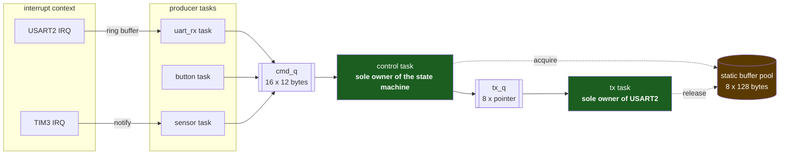

# Queues and Message Passing

A queue looks like a data structure and is really a design decision. The structure part is unremarkable — a circular buffer with a head, a tail and two waiting lists. The decision is what makes it worth a page: **a FreeRTOS queue copies the item in and copies it out again**, and every property people value in queues follows from that one fact.

Because the queue copies, the sender's buffer is free the instant `xQueueSend()` returns. It can be a stack local. It can be reused on the next line. The receiver cannot see a half-written message, because the copy happens inside a critical section and the item does not become visible until it is complete. Two tasks are never looking at the same bytes, so there is nothing to protect and no lock to forget — which is why a system built out of queues has a class of bug that a system built out of shared globals and mutexes simply does not have.

The cost is a `memcpy` on each side, and a constraint: whatever you send has to be small enough that copying it twice is cheaper than the coordination you avoided. When it is not, you send a pointer instead — and the moment you do, you have taken back the ownership problem the copy was buying you off from. Most of the interesting decisions on this page are about that trade.

:::info[Prerequisites]
[Semaphores and Mutexes](./synchronization-primitives.md) establishes that a FreeRTOS semaphore *is* a queue with an item size of zero, so the blocking and timeout behaviour below is the same behaviour. [Tasks and Scheduling](./tasks-and-scheduling.md) owns the Blocked state a full or empty queue puts a task into, and [Shared Data and Race Conditions](../06-interrupts-timing-and-real-time/shared-data-and-race-conditions.md) owns the failure mode that message passing is designed to make impossible.
:::

## A system built out of messages



Three things about that picture are the whole design pattern. **Each resource has exactly one owning task** — nothing but `tx` touches the UART, nothing but `control` touches the state machine — so there is no mutex anywhere in the diagram and there is nothing for a second task to corrupt. **The command queue carries values**, small fixed-size structs copied in and out. **The transmit queue carries pointers**, because a 128-byte frame is not worth copying twice, and the dotted lines are the ownership protocol that pointer passing forces you to write down.

The interrupt side hands off through the [single-producer/single-consumer ring buffer](../06-interrupts-timing-and-real-time/deferred-work.md) and a wake, rather than through a queue send per byte. That is deliberate: a queue send is far more work than a ring push, and doing it once per received character is how a UART interrupt stops fitting in its budget.

## Copy or pointer

| | Copy the value | Pass a pointer |
|---|---|---|
| **`uxItemSize`** | `sizeof(msg_t)` | `sizeof(void *)` — 4 bytes on Cortex-M |
| **RAM** | `length x sizeof(msg_t)` in the queue | `length x 4`, plus the pool the pointers refer to |
| **Cost per send** | two `memcpy`s of `uxItemSize` | two `memcpy`s of 4 bytes |
| **Who owns the payload** | nobody — there are two independent copies | exactly one party at a time, by a convention you write and enforce |
| **Sender's buffer after the send** | free immediately; a stack local is fine | **must not be touched or freed** until the receiver is done |
| **Typical failure** | queue RAM larger than expected | use-after-free, double-release, or a pointer to a dead stack frame |
| **Use when** | the message is a command, an event, a reading — tens of bytes | the payload is a buffer, a frame, an image row — hundreds of bytes or more |

The crossover is not a number anyone can give you honestly, because it depends on how often you send. A 64-byte message sent ten times a second costs 1.28 kB/s of `memcpy` — irrelevant. The same message sent per audio frame at 8 kHz costs 1 MB/s of `memcpy` on a 100 MHz core, which is worth caring about. Send values until the profiler says otherwise; the ownership bugs that pointer passing invites are more expensive than the copies it saves.

When you do pass pointers, pick one of three disciplines and write it in a comment at the queue's declaration:

1. **A static pool with acquire/release.** The producer acquires a block (a counting semaphore over N blocks is the natural gate), fills it, sends the pointer, and *never touches it again*. The consumer releases it. Ownership transfers with the message. This is the pattern in the diagram above and it is the one to reach for by default.
2. **Heap block, consumer frees.** Simple, and it drags the whole [case against a heap in long-running firmware](../04-bare-metal-programming/static-memory-and-no-malloc.md) into your data path. Defensible only when the block sizes are few and fixed, at which point it is pattern 1 with extra steps.
3. **Producer-owned, consumer signals completion.** The producer keeps the buffer and waits for an acknowledgement before reusing it. This is the right shape for DMA, where the hardware owns the memory until the transfer-complete interrupt, and it makes the ownership window explicit rather than implicit.

What is never acceptable is a pointer to a stack local. It is also the easiest mistake to make, and the warning at the bottom of this page is about what it looks like when it fails.

## Sizing, and what a queue actually costs

`xQueueCreate(uxQueueLength, uxItemSize)` allocates the control structure plus `uxQueueLength × uxItemSize` bytes of storage from the kernel heap. The storage term is arithmetic you can do; the control structure is `sizeof(Queue_t)`, which varies with port and with `configUSE_TRACE_FACILITY`, so measure it on your own build rather than trusting a number from a page like this one:

```c
size_t before = xPortGetFreeHeapSize();
QueueHandle_t q = xQueueCreate(16, sizeof(cmd_t));   /* cmd_t is 12 bytes */
size_t cost   = before - xPortGetFreeHeapSize();     /* 192 bytes + Queue_t */
```

On a static build the same question is answered by the map file instead, because `xQueueCreateStatic()` takes both a `StaticQueue_t` and a storage array of exactly `length × item_size` bytes — the two-buffer shape [Stacks and Heaps in an RTOS](./stacks-and-heaps-in-an-rtos.md) covers along with the rest of the static-allocation API.

Choosing the length is the part people get wrong, and it is worth being precise about what the number means. **Queue depth is a burst absorber, not a throughput mechanism.** If the consumer keeps up on average, depth only has to cover the worst burst the producer can emit before the consumer next gets to run — which is a function of the priority difference and the consumer's period, not of the average rate. If the consumer does *not* keep up on average, no depth is sufficient; the queue fills at a constant rate and the only question is when.

That distinction changes what a too-small queue means. A queue that overflows during a burst has an under-sized buffer. A queue that overflows steadily has a scheduling problem being reported by the wrong instrument, and making it deeper converts a visible dropped-message bug into an invisible growing-latency bug — the worse of the two, because a message that arrives 400 ms late is often more damaging than one that never arrives at all. `uxQueueMessagesWaiting()` logged periodically distinguishes them in a minute: a healthy queue is near-empty almost always, with occasional spikes.

## Blocking, timeouts, and the return value

Every send and receive takes a tick count, and there are exactly three defensible values:

```c
/* 0 — never block. The only legal choice where stalling is not an option. */
if (xQueueSend(cmd_q, &msg, 0) != pdPASS) {
    dropped_commands++;                    /* count it; silence is the bug */
}

/* A finite timeout — and a failure branch that is written and tested. */
if (xQueueReceive(cmd_q, &msg, pdMS_TO_TICKS(100)) == pdPASS) {
    handle(&msg);
} else {
    heartbeat();                           /* 100 ms with nothing to do */
}

/* portMAX_DELAY — block forever. Correct for a task whose entire job is
   to service this queue and which has nothing to do when it is empty. */
(void) xQueueReceive(cmd_q, &msg, portMAX_DELAY);
```

`xQueueSend()` returns `pdPASS` or `errQUEUE_FULL`; `xQueueReceive()` returns `pdPASS` or `errQUEUE_EMPTY`. Both are `BaseType_t` and both are trivially ignorable, which is why an ignored queue-send return is the single most common defect in FreeRTOS application code. With a zero timeout it means the message vanished. With a finite timeout it means the message vanished *and* the task stalled for the timeout first.

`portMAX_DELAY` means "block indefinitely" only when `INCLUDE_vTaskSuspend` is 1; otherwise it is just a very large tick count, and the call will eventually return having timed out. That is the same mechanism [Tasks and Scheduling](./tasks-and-scheduling.md) describes, where an indefinitely blocked task is parked on `xSuspendedTaskList` because there is no wake time to sort it by.

Two variants earn their place. `xQueuePeek()` reads the item at the head without removing it, which makes a **length-1 queue plus `xQueueOverwrite()`** into a mailbox: the producer always succeeds, the newest value replaces the old, and any number of consumers can read the current value without consuming it. That is the right structure for "the latest sensor reading", where an old value is worthless and a full queue would be a bug. `xQueueSendToFront()` pushes to the head instead of the tail, which is occasionally right for an abort or shutdown command and is otherwise a way to reorder messages unpredictably.

## Queue sets, and why you probably want one queue instead

A task can block on exactly one object. When it genuinely has to wait on several — a command queue *and* a timeout semaphore *and* a link-down signal — `configUSE_QUEUE_SETS` gives you a set:

```c
QueueSetHandle_t set = xQueueCreateSet(16 + 1);   /* >= sum of member capacities */
xQueueAddToSet(cmd_q,  set);                      /* both must be EMPTY when added */
xQueueAddToSet(abort_sem, set);

for (;;) {
    QueueSetMemberHandle_t who = xQueueSelectFromSet(set, portMAX_DELAY);

    if (who == cmd_q) {
        xQueueReceive(cmd_q, &msg, 0);            /* you MUST then read it */
        handle(&msg);
    } else if (who == abort_sem) {
        xSemaphoreTake(abort_sem, 0);
        abort_current_operation();
    }
}
```

The rules are strict and the kernel's documentation is explicit about them: a queue or semaphore must be **empty** when it is added to a set; the set's own length must be at least the sum of the lengths of its members (a counting semaphore contributes its maximum count); and `xQueueSelectFromSet()` only tells you *which handle* is ready — the item is still sitting in the member object, and failing to read it leaves the set permanently out of step with reality.

The set is itself a queue of handles, so it costs its own control structure plus one pointer per slot, and every send to a member does two queue operations instead of one. Before paying that, ask whether a **single command queue carrying a tagged union** would do:

```c
typedef enum { CMD_DATA, CMD_ABORT, CMD_LINK_DOWN, CMD_TICK } cmd_kind_t;

typedef struct {
    cmd_kind_t kind;
    union {
        struct { uint16_t channel; int32_t value; } data;
        struct { uint8_t reason; }                  abort;
    } u;
} cmd_t;                       /* one queue, one blocking point, one switch */
```

It is cheaper, it has one blocking point instead of a set to keep consistent, it serialises events into a defined order rather than leaving the arbitration to `xQueueSelectFromSet()`, and it turns "which of my three inputs fired" into a `switch` a reviewer can read. Queue sets earn their keep when the objects are not yours to change — a third-party stack that hands you its own queue handle — and are usually a sign of a design that grew a second inbox rather than extending its first.

For any of these to be legible in a debugger, register them: `vQueueAddToRegistry(cmd_q, "cmd_q")` with `configQUEUE_REGISTRY_SIZE` set makes an RTOS-aware debugger show a name instead of an address. It is two lines and it is the difference between "some queue at 0x2000A4C8 has 16 items" and a diagnosis.

## Designing around messages instead of shared state

The reason to prefer this over locking is not that queues are elegant. It is that **the failure modes of message passing are visible and the failure modes of shared state are not.** A queue that overflows increments a counter you can print. A mutex that was not taken corrupts a struct that surfaces three subsystems away, hours later, as something that looks like a hardware fault.

The practical rules, in the order they pay off:

- **Give every shared resource exactly one owning task.** The bus, the display, the file system, the state machine. Everything else sends it a message. This eliminates the mutex rather than making it work, and with it eliminates priority inversion and deadlock on that resource — see [Priority Inversion and Deadlock](./priority-inversion-and-deadlock.md) for what you are opting out of.
- **Send commands, not pokes at state.** `{CMD_SET_LED, .colour = RED}` rather than a global `led_colour` that the owner polls. The queue orders the requests; a shared variable loses all but the last.
- **Make the reply explicit.** If the sender needs an answer, put a reply-queue handle or a task handle in the message. A "request" queue with an implicit "the answer will appear in this global" is shared state wearing a message's clothes.
- **Keep the messages small and flat.** A message with a pointer in it is a message with an ownership contract in it. A message with three pointers has three.

:::warning[The pointer to a dead stack frame, and the queue that only drops messages under load]
Two bugs whose symptom appears nowhere near the queue.

**A pointer to a local.** A producer builds a frame in a local array, sends the address, and returns. On the bench this works perfectly, because the producer is higher priority than the consumer: the send unblocks the consumer, the producer keeps running, finishes its loop, blocks on something, and only *then* does the consumer run — by which time the local's stack slot has been reused by whatever the producer did next. Half the time the reuse is a variable that happens to hold the same bytes, so the message is correct. The failure is data-dependent, load-dependent, and *changes when you add a `printf` for debugging*, because that changes the producer's stack usage. The tell is unmistakable once suspected: the received message's first fields are right and the later ones are garbage, or the content correlates with something the producer did *after* sending. Two structural fixes, no middle ground — send the value so the kernel copies it, or hand over a block from a pool that outlives both parties. A pointer into a task's own stack is never a legal thing to put in a queue.

**The unchecked send with a zero timeout.** `xQueueSend(evt_q, &e, 0);` with the return value discarded, in a producer that is fast and a consumer that is slow, in a system where the queue is deep enough for the bench. Then a customer runs a slower SD card, or an interrupt storm delays the consumer by 40 ms, and the queue fills for 200 ms. Every message sent during that window is discarded and nothing anywhere records it. What the user sees is a button press that did nothing, once, during a firmware update — reproducible only under exactly the load that caused it, and indistinguishable from a mechanical switch problem. There is no debugging technique that finds this after the fact, because the evidence was never created. The fix costs three lines: count the failures in a `volatile uint32_t`, print it alongside `uxQueueMessagesWaiting()` and `uxQueueSpacesAvailable()` from a diagnostics task, and treat any non-zero drop count in a lab run as a defect rather than as tuning information.
:::

## See also

- [Semaphores and Mutexes](./synchronization-primitives.md) — the same queue mechanism with an item size of zero, and the ownership field that makes a mutex different.
- [Task Notifications and Event Groups](./notifications-and-event-groups.md) — the cheaper path when the "message" is one word or one bit, and the cases where it cannot replace a queue.
- [Stacks and Heaps in an RTOS](./stacks-and-heaps-in-an-rtos.md) — `xQueueCreateStatic()`'s two-buffer shape, and where a dynamically created queue's storage actually comes from.
- [Deferred Work](../06-interrupts-timing-and-real-time/deferred-work.md) — the ring buffer that carries bytes out of an ISR, and why it is not a queue send per character.
- [Shared Data and Race Conditions](../06-interrupts-timing-and-real-time/shared-data-and-race-conditions.md) — the corruption that message passing structurally prevents, at instruction level.

## References

- Amazon Web Services — [**FreeRTOS: queue API reference**](https://www.freertos.org/Documentation/02-Kernel/04-API-references/06-Queues/00-QueueManagement). Verified against this for the page: `xQueueCreate(uxQueueLength, uxItemSize)` and the copy-by-value semantics, `xQueueSend`/`xQueueSendToBack`/`xQueueSendToFront`/`xQueueReceive`/`xQueuePeek`/`xQueueOverwrite`, the `pdPASS` / `errQUEUE_FULL` / `errQUEUE_EMPTY` return values, `uxQueueMessagesWaiting()` and `uxQueueSpacesAvailable()`, `vQueueAddToRegistry()` with `configQUEUE_REGISTRY_SIZE`, and the rule that `portMAX_DELAY` blocks indefinitely only when `INCLUDE_vTaskSuspend` is 1. (Documentation checked 2026-08-26.)
- Amazon Web Services — [**FreeRTOS: queue sets**](https://www.freertos.org/Documentation/02-Kernel/02-Kernel-features/02-Queues-mutexes-and-semaphores/05-QueueSets). `configUSE_QUEUE_SETS`, `xQueueCreateSet()` / `xQueueAddToSet()` / `xQueueRemoveFromSet()` / `xQueueSelectFromSet()`, the requirement that a member be empty when added and that the set length cover the sum of member capacities, the obligation to read from the member the set returns, and the documentation's own advice that a queue set is often not the best design. (Documentation checked 2026-08-26.)
- FreeRTOS-Kernel — [**`queue.c`**](https://github.com/FreeRTOS/FreeRTOS-Kernel/blob/main/queue.c) and [**`include/queue.h`**](https://github.com/FreeRTOS/FreeRTOS-Kernel/blob/main/include/queue.h). `prvCopyDataToQueue()` and `prvCopyDataFromQueue()` — the two `memcpy`s this page is built around — the `xTasksWaitingToSend` / `xTasksWaitingToReceive` event lists, and the queue-registry behaviour where re-adding a handle overwrites the existing entry rather than duplicating it. (Source checked 2026-08-26.)
- Richard Barry and the FreeRTOS team — [***Mastering the FreeRTOS Real Time Kernel***](https://www.freertos.org/Documentation/02-Kernel/07-Books-and-manual/01-RTOS_book) (free PDF). Chapter 5, "Queue Management", works the copy-versus-pointer decision, the mailbox pattern with `xQueueOverwrite()`, and receiving structured messages from multiple sources — the tagged-union design used above.
- C. A. R. Hoare — ["Communicating Sequential Processes"](https://dl.acm.org/doi/10.1145/359576.359585), *Communications of the ACM* 21(8), 1978. The origin of the argument that processes coordinating by messages rather than shared memory are easier to reason about, which is the entire justification for the last section of this page.
