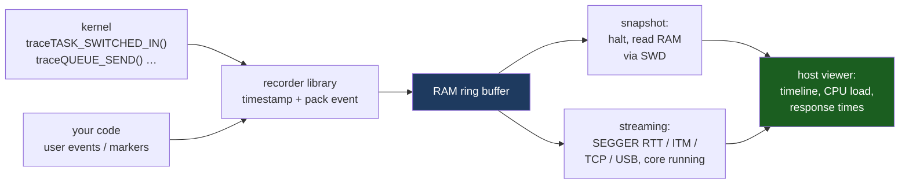

# Debugging and Tracing an RTOS

A breakpoint stops time. On bare metal that is a fair trade, because the interesting question is usually "what is in this variable", and a halted core answers it perfectly. Under an RTOS the interesting questions have changed shape: *why did the control loop run 4 ms late*, *which task was holding that mutex*, *what ran between the interrupt and the response*. Every one of those is a statement about a **sequence in time**, and the instant you halt, the sequence you wanted to observe is gone.

That is the whole reason this page exists as something separate from ordinary debugging. There are two families of tool, and they answer different questions:

- **Statistics** are cheap, always on, and aggregate. They tell you *how much* — how much CPU each task consumed, how close each stack came to overflowing, how low the heap ever got. They will never tell you *when*, or *in what order*.
- **Traces** are expensive, bounded in duration, and exact. They record every scheduling decision and every kernel call with a timestamp, and they answer the ordering questions directly. What they cost is RAM, a transport, and — if you are careless — the very timing you were trying to measure.

Reach for statistics first, because they are nearly free and they narrow the question. Reach for a trace when the answer is a sequence.

:::info[Prerequisites]
[Tasks and Scheduling](./tasks-and-scheduling.md) owns `uxTaskGetSystemState()` and the `TaskStatus_t` snapshot, which is the entry point to everything statistical here. [Stacks and Heaps in an RTOS](./stacks-and-heaps-in-an-rtos.md) owns high-water marks — including the units trap — and [Priority Inversion and Deadlock](./priority-inversion-and-deadlock.md) owns the failure that the trace-reading section teaches you to recognise on sight.
:::

## Run-time statistics: where the CPU actually went

FreeRTOS can attribute execution time to tasks, but it needs a clock you supply. `configGENERATE_RUN_TIME_STATS` turns the feature on and obliges you to define two port macros: one to start a counter, one to read it.

```c
/* FreeRTOSConfig.h */
#define configGENERATE_RUN_TIME_STATS            1
#define configUSE_TRACE_FACILITY                 1
#define configUSE_STATS_FORMATTING_FUNCTIONS     1   /* for vTaskGetRunTimeStats() */

#define portCONFIGURE_TIMER_FOR_RUN_TIME_STATS() vStatsTimerInit()
#define portGET_RUN_TIME_COUNTER_VALUE()         (TIM5->CNT)
```

The kernel reads the counter on every context switch and adds the delta to the outgoing task's total. Two properties of that counter decide whether the numbers mean anything:

- **It must be much faster than the tick.** The kernel's documentation asks for something in the region of 10 to 100 times the tick rate. Slower than that and short-running tasks accumulate nothing, because they are never the running task at the moment the counter increments. The counter's resolution *is* the measurement's resolution.
- **It must not wrap during the window you care about.** A 32-bit counter at 1 MHz wraps in 2³²/10⁶ ≈ 4295 s, just under **72 minutes**; at 100 kHz, just under 12 hours. FreeRTOS does not handle the wrap — after it, percentages are arithmetic on garbage. This is also why the Cortex-M4 `DWT->CYCCNT` is a poor choice here despite being free and already present: at the STM32F411's 100 MHz maximum it wraps every 2³²/10⁸ ≈ **43 seconds**. Excellent for timing one function, useless for a long-run CPU profile. On this part, a 32-bit general-purpose timer (TIM2 or TIM5) prescaled to somewhere around 1 MHz is the right instrument.

`vTaskGetRunTimeStats(char *buf)` formats the totals into a human-readable table, which is fine for a console and a nuisance to parse. `ulTaskGetRunTimeCounter()` and `ulTaskGetRunTimePercent()` give you one task's figure programmatically, and `uxTaskGetSystemState()` returns every task's counter in the same snapshot as its state, priority and stack mark — that snapshot, described in [Tasks and Scheduling](./tasks-and-scheduling.md), is the one call worth wiring into a low-priority diagnostics task on every project.

The single most useful derived number is **idle-task percentage**, and it is useful because of what it rules out. A system missing deadlines at 15 % idle has a scheduling or blocking problem; the CPU was available and something stopped the task using it. The same system at 0 % idle simply has more work than time, and no amount of priority tuning will fix it — that is the case [Scheduling Theory for Firmware](../06-interrupts-timing-and-real-time/scheduling-theory.md) and [Worst-Case Execution Time](../06-interrupts-timing-and-real-time/wcet.md) address.

Stack high-water marks belong in the same report and are covered in full by [Stacks and Heaps in an RTOS](./stacks-and-heaps-in-an-rtos.md) — including the fact that the API returns **words**, which is the one thing to re-read before printing them next to a byte count. Zephyr's equivalent of this whole section is `CONFIG_THREAD_ANALYZER`, which prints per-thread stack usage and, with `CONFIG_THREAD_RUNTIME_STATS`, CPU share, on a timer or on demand.

## The trace pipeline

Every serious RTOS trace tool plugs into the same place: a set of empty macros the kernel already calls at each interesting moment. In FreeRTOS they are the `trace*` hooks in `FreeRTOS.h` — `traceTASK_SWITCHED_IN()`, `traceTASK_SWITCHED_OUT()`, `traceQUEUE_SEND()`, `traceBLOCKING_ON_QUEUE_RECEIVE()`, `traceTASK_DELAY()` and several dozen more — which expand to nothing unless a recorder's header defines them first. That is why enabling a tracer is mostly a matter of adding one `#include` to `FreeRTOSConfig.h`: the call sites are already compiled in.



The split at the bottom is the decision you actually make.

**Snapshot mode** keeps a fixed RAM ring buffer and the host reads it out when you halt — or after a crash, which is its real strength. It needs no bandwidth and no special probe, and it costs you however much RAM you can spare. On a 128 KB part a few tens of kilobytes buys a window of a few hundred milliseconds at typical event rates, which is usually enough because the interesting window is short.

**Streaming mode** drains the buffer continuously while the target runs. The transport that makes this practical on Cortex-M is **SEGGER RTT**: the target writes into a ring buffer in RAM, and the debug probe reads that RAM through the debug access port *without stopping the core*. No pin, no peripheral, no interrupt — the cost on the target is a memory write per event. ITM/SWO is the alternative and is genuinely a peripheral with a pin and a baud rate, and it drops data when the link saturates.

## SystemView and Tracealyzer

The two tools people actually use. They overlap heavily and differ in emphasis.

| | **SEGGER SystemView** | **Percepio Tracealyzer** |
|---|---|---|
| Licence | free, from SEGGER | commercial, with a time-limited evaluation |
| Target library | `SEGGER_SYSVIEW_*` plus `SEGGER_SYSVIEW_FreeRTOS.h`, which defines the `trace*` macros | Percepio trace recorder (`trcRecorder.h`), snapshot or streaming build |
| Best transport | RTT over J-Link, continuous | RTT, ITM, TCP/IP, USB, file — or snapshot with any debugger |
| Kernels | FreeRTOS, embOS, Zephyr, ThreadX and others | FreeRTOS, Zephyr, ThreadX, embOS, VxWorks, Linux |
| Strength | interrupt-level detail and very low target overhead; shows ISRs, tasks and the scheduler on one timeline | analysis rather than capture — response-time plots per task instance, blocking reports, CPU load over time, communication flow between tasks |
| Weakness | timeline and CPU-load views mainly; less derived analysis | more target RAM and more setup; the useful editions are paid |

Both are worth having configured before you need them, because the day you need one is the day the board is in a customer's hands and you are recreating the build.

Zephyr does not need either integrated by hand: `CONFIG_TRACING=y` with a backend such as SystemView or the Percepio recorder wires the kernel's own tracing hooks up, and the choice is a Kconfig symbol rather than a header edit — an example of the argument in [Zephyr in Practice](./zephyr-in-practice.md) paying off.

## RTOS-aware GDB

A plain GDB session under an RTOS shows one thread: whatever the core was executing. The other tasks' stacks exist, but GDB has no idea they are stacks. **RTOS awareness** is a debug-server feature that walks the kernel's own task lists, reconstructs a call stack from each task's saved context, and presents them to GDB as threads. In OpenOCD it is one line of target configuration:

```bash
# openocd.cfg
$_TARGETNAME configure -rtos FreeRTOS     # or: -rtos Zephyr, -rtos auto
```

```text
(gdb) info threads
  Id   Target Id                          Frame
* 1    Thread 536871928 (Name: ctrl  :  Running) pid_update () at ctrl.c:88
  2    Thread 536872504 (Name: comms :  Blocked) xQueueReceive () at queue.c:1421
  3    Thread 536873080 (Name: IDLE  :  Ready)   prvIdleTask () at tasks.c:3902
(gdb) thread 2
(gdb) bt
(gdb) thread apply all bt
```

`thread apply all bt` on a hung system is the single highest-yield command in this whole page. It answers "what is every task waiting for" in one shot, and a deadlock's signature — two tasks each parked inside a `Take` — is visible immediately.

Two setup details that are pure lost-afternoon material:

- **OpenOCD's FreeRTOS support needs the symbol `uxTopUsedPriority` to exist in the image**, and the kernel no longer defines it. Without it OpenOCD reports it cannot find the symbol, or silently falls back to showing a single thread. The fix is to define it yourself and stop the linker garbage-collecting it: `const volatile UBaseType_t uxTopUsedPriority __attribute__((used)) = configMAX_PRIORITIES - 1;`, or pass `-Wl,--undefined=uxTopUsedPriority`. It also wants `configUSE_TRACE_FACILITY` set, so the TCB carries the fields it reads.
- **Zephyr needs `CONFIG_DEBUG_THREAD_INFO=y`**, which emits the offset table debuggers use to walk `struct k_thread`. It is off by default because it costs a little flash.

And the limitation that keeps this section short: **thread awareness is a halted snapshot.** It is superb at "where is everything stuck right now" and blind to "what happened in the 3 ms before the deadline". For that, you need the trace.

## Reading a trace: finding the task that missed its deadline

The skill is not operating the tool, it is knowing what to measure. Start from the definition in [Real-Time Definitions](../06-interrupts-timing-and-real-time/real-time-definitions.md): the **response time** is from the *release event* — the interrupt, the timer expiry, the queue send that made the task runnable — to the *completion event*, the point where the task finishes that piece of work and blocks again. The deadline is a bound on that interval, not on how long the task's code takes to run.

So: find the release, find the completion, and look at everything in between.

```wavedrom title="A trace of one missed deadline: CTRL is Ready but not running from t=6 to t=16" alt="Trace timeline with four lanes. An ADC interrupt pulse releases the CTRL task, which runs briefly and then stops. The lower-priority LOG task then runs for ten time units while CTRL is not running. The deadline marker passes during that gap. CTRL resumes afterwards and completes late."
{ "signal": [
  { "name": "ADC IRQ (release)", "wave": "0.10...................." },
  { "name": "CTRL  (prio 4)",    "wave": "0..1.0..........1..0...." },
  { "name": "LOG   (prio 2)",    "wave": "0.....1.........0......." },
  { "name": "idle",              "wave": "1.0................1...." },
  { "name": "deadline",          "wave": "0............10........." }
], "config": { "hscale": 2 } }
```

Read the gap. `CTRL` is at priority 4 and is not running, while `LOG` at priority 2 is. A pre-emptive fixed-priority scheduler cannot do that unless `CTRL` is not *Ready* — so `CTRL` is blocked on something `LOG` holds. That is the shape of [priority inversion](./priority-inversion-and-deadlock.md), diagnosed from the picture alone, before you have looked at a single line of source.

The classification generalises into four cases, and every trace-reading session is an attempt to decide which one you are looking at:

| What fills the response window | Reading | Where the fix lives |
|---|---|---|
| **Higher-priority tasks running** | interference — the system is over-subscribed at that priority level | [Scheduling Theory](../06-interrupts-timing-and-real-time/scheduling-theory.md); reduce load or re-assign priorities |
| **A lower-priority task running** while yours is not | blocking — yours is waiting on something that task holds | [Priority Inversion and Deadlock](./priority-inversion-and-deadlock.md); shorten the critical section, use a mutex with inheritance |
| **Your own task, running continuously, for longer than budgeted** | a WCET problem, not a scheduling one | [Worst-Case Execution Time](../06-interrupts-timing-and-real-time/wcet.md) |
| **A long delay before your task was released at all** | the interrupt was late, or the wake was deferred | [Interrupt Latency](../06-interrupts-timing-and-real-time/interrupt-latency.md); and check for a missing `portYIELD_FROM_ISR` in [ISR-Safe APIs](./isr-safe-apis.md) |

Two habits make traces far more readable. **Add your own markers**: both recorders expose user-event calls, and one marker at the start and end of each logical operation turns an anonymous forest of context switches into a labelled timeline. And **capture on the failure, not continuously** — trigger the snapshot read-out from the code that detects the overrun, so the buffer holds the milliseconds before the miss rather than whatever happened to be last.

:::warning[The RTT channel left in blocking mode, and the stats counter running at the tick rate]
Two instrumentation failures, both of which corrupt the thing they were installed to measure.

**The trace that became the bug.** SEGGER RTT channels have a mode. `SEGGER_RTT_MODE_NO_BLOCK_SKIP` — the default — drops events when the host is not draining the buffer fast enough. `SEGGER_RTT_MODE_BLOCK_IF_FIFO_FULL` instead **spins in the target until space appears**. Someone sets the blocking mode during bring-up because they were losing log lines, it works beautifully while the viewer is open, and it ships. Now a full buffer is an unbounded busy-wait inside whatever context wrote to it — frequently an ISR, which means interrupts above the kernel ceiling stall too. The symptoms are baffling in a specific way: the product misses deadlines only when a debug probe is *attached but idle*, or runs perfectly under the tracer and fails without it, or watchdog-resets during heavy logging. Every conclusion drawn from a trace taken in that configuration is also wrong, because the instrumentation added milliseconds to the intervals being measured. Check `SEGGER_RTT_ConfigUpBuffer()` for the mode on every channel, keep tracing non-blocking and accept dropped events, and gate the whole recorder behind a build flag that is off in release.

**The run-time counter that was the tick.** `portGET_RUN_TIME_COUNTER_VALUE()` defined as `xTaskGetTickCount()`, because a counter was already there and the macro compiled. Every task's execution time is now quantised to the tick period, so any task that runs and blocks inside one tick accrues **zero**, while the idle task — statistically the one running whenever the tick interrupt happens to fire — is credited with nearly everything. The report reads "97 % idle" on a board a scope shows running flat out. It is believed, because the numbers are internally consistent and the tool printed them, and the team spends a week looking for the missing work. The same macro wired to a 32-bit 1 MHz timer instead is correct for 72 minutes and then wraps, at which point deltas go negative and percentages become nonsense — a soak test that reports impossible figures after an hour is showing you the overflow, not a kernel bug. Use a dedicated counter 10–100× the tick rate, log the raw counter alongside the percentages so a wrap is visible, and sanity-check the whole report once against a GPIO toggle on a scope before trusting it.
:::

## See also

- [Stacks and Heaps in an RTOS](./stacks-and-heaps-in-an-rtos.md) — high-water marks in full, including the words-versus-bytes trap that makes a stack report lie by 4×.
- [Tasks and Scheduling](./tasks-and-scheduling.md) — `uxTaskGetSystemState()` and the `TaskStatus_t` snapshot every statistic on this page comes out of.
- [Priority Inversion and Deadlock](./priority-inversion-and-deadlock.md) — the failure the trace above shows, and what to do once you have recognised it.
- [Worst-Case Execution Time](../06-interrupts-timing-and-real-time/wcet.md) — the case where the response window is filled by your own code, and measurement will not bound it.
- [Interrupt Latency](../06-interrupts-timing-and-real-time/interrupt-latency.md) — the front half of the response time, and how to measure it without a tracer at all.

## References

- SEGGER — [**SystemView User Guide (UM08027)**](https://www.segger.com/products/development-tools/systemview/) and the [**RTT documentation**](https://www.segger.com/products/debug-probes/j-link/technology/about-real-time-transfer/). The `SEGGER_SYSVIEW_FreeRTOS.h` integration that supplies the kernel's `trace*` macros, the single-shot / post-mortem / continuous recording modes, and the RTT mechanism itself — a target-RAM ring buffer read through the debug access port while the core runs — including the `SEGGER_RTT_MODE_NO_BLOCK_SKIP` versus `SEGGER_RTT_MODE_BLOCK_IF_FIFO_FULL` channel modes behind the first warning.
- Percepio — [**Tracealyzer user manual and getting-started guides**](https://percepio.com/tracealyzer/). Snapshot versus streaming recorder configuration, the supported kernels, and the derived views this page credits it with: per-instance response-time plots, blocking reports, CPU load over time and inter-task communication flow. Tracealyzer is a commercial product; the full editions are a purchase and the evaluation is time-limited.
- Amazon Web Services — [**FreeRTOS: run-time statistics**](https://www.freertos.org/Documentation/02-Kernel/02-Kernel-features/09-RTOS-run-time-stats) and the [**customisation reference**](https://www.freertos.org/Documentation/02-Kernel/03-Supported-devices/02-Customization). `configGENERATE_RUN_TIME_STATS` with the `portCONFIGURE_TIMER_FOR_RUN_TIME_STATS()` / `portGET_RUN_TIME_COUNTER_VALUE()` pair, the recommendation that the counter run roughly 10 to 100 times the tick frequency, `vTaskGetRunTimeStats()` and its dependence on `configUSE_TRACE_FACILITY` and `configUSE_STATS_FORMATTING_FUNCTIONS`, and the `trace*` hook macros that recorders override.
- Open On-Chip Debugger — [**OpenOCD User's Guide, "RTOS Support"**](https://openocd.org/doc/html/GDB-and-OpenOCD.html). The `$_TARGETNAME configure -rtos <type>` syntax, the supported kernels including FreeRTOS and Zephyr, `-rtos auto` detection, and the documented requirement that the FreeRTOS image export `uxTopUsedPriority` — the symbol whose absence produces the single-thread failure described above.
- Zephyr Project — [**Tracing**](https://docs.zephyrproject.org/latest/services/tracing/index.html) and [**Thread Analyzer**](https://docs.zephyrproject.org/latest/services/debugging/thread-analyzer.html). `CONFIG_TRACING` with the SystemView and Percepio backends selected by Kconfig rather than by header edits, `CONFIG_THREAD_ANALYZER` and `CONFIG_THREAD_RUNTIME_STATS` as the built-in equivalent of FreeRTOS run-time statistics, and `CONFIG_DEBUG_THREAD_INFO` for debugger thread awareness.
- STMicroelectronics — [**PM0214**, *STM32 Cortex-M4 MCUs and MPUs programming manual*](https://www.st.com/resource/en/programming_manual/pm0214-stm32-cortexm4-mcus-and-mpus-programming-manual-stmicroelectronics.pdf), Rev 10. The DWT chapter for `DWT->CYCCNT` and `DWT->CTRL`, the free cycle counter whose 32-bit width gives the ~43 s wrap at 100 MHz that rules it out as a run-time-statistics source on this part.
