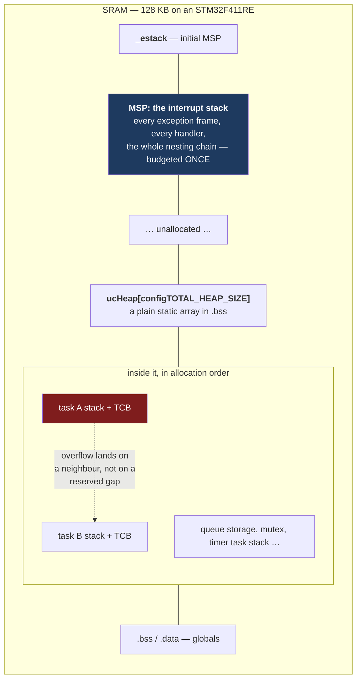

# Stacks and Heaps in an RTOS

On bare metal there is one stack, the linker script decides where it starts, and the map file tells you how much room it has. Adopting a kernel deletes all three of those facts at once. There are now N+1 stacks; the linker knows about exactly one of them; and the other N are ordinary arrays — either carved out of a heap at runtime or declared as `static` — with nothing above or below them that the toolchain considers special.

The mental model: **a task stack is just a buffer, and the kernel's only knowledge of it is a pointer and a length.** `_estack` no longer applies to anything a task does. The reserved gap that used to sit between the stack and `.bss` does not exist between two adjacent task stacks: what is immediately below task A's stack is task B's stack, or a queue's storage, or a TCB. That changes what an overflow *looks like* — instead of quietly corrupting a global, it quietly corrupts another task's locals or a kernel structure — and it multiplies the sizing problem by the number of tasks.

[Stack Usage and Overflow](../04-bare-metal-programming/stack-usage-and-overflow.md) owns the sizing method: `-fstack-usage`, the call-graph arithmetic, what `libc` costs, painting and measuring, and the MPU guard region. All of it still applies, per task. This page is the four things that change under a kernel: where the stacks come from, the extra terms in each task's budget, the measurement the kernel does for you, and what to do about the heap those stacks may be cut from.

:::info[Prerequisites]
[Stack Usage and Overflow](../04-bare-metal-programming/stack-usage-and-overflow.md) is the prerequisite for the whole page — the depth-computation method is not repeated here. [Context Switching](./context-switching.md) supplies the size of the context that lands on a task's own stack. [Static Memory and Why `malloc` Is Banned](../04-bare-metal-programming/static-memory-and-no-malloc.md) owns the objections to dynamic allocation that the heap section here answers with a kernel-specific mechanism.
:::

## Where the stacks are



Two structural facts, both consequences of [Privilege Modes and the Two Stacks](../02-processor-architecture/privilege-modes-and-stacks.md):

**Tasks run on `PSP`; handlers run on `MSP`.** So the interrupt-nesting term that the bare-metal budget adds to *the* stack is, under a kernel, budgeted once against `MSP` — not N times against N task stacks. That is a genuine saving and it is the main reason per-task stacks are affordable at all. `MSP` is the stack the linker script still owns, and its budget is exactly the bare-metal interrupt calculation: the deepest chain of distinct pre-empt levels that can be in flight together, each contributing its frame plus its handler's own depth.

**A task's own stack still pays for the context switch.** The `PendSV` handler pushes the callee-saved registers onto the *outgoing task's* stack before switching away, and the hardware pushed the caller-saved frame there on the way in. From [Context Switching](./context-switching.md), derived: **68 bytes** for a task that has never executed a floating-point instruction, **204 bytes** (up to 208 with the alignment word) for one that has. That is a per-task term that does not exist on bare metal and is left out of most first budgets.

So the per-task arithmetic is the bare-metal one with one term added and one removed:

```text
task stack  =  max_depth(that task's call graph, including libc)
            +  68, or 204 if the task ever touches a float
            +  margin

           (interrupt nesting is NOT here — it is on MSP)
```

`usStackDepth` is in **words**, not bytes. `xTaskCreate(fn, "name", 256, ...)` allocates 1024 bytes on a 32-bit part. `configMINIMAL_STACK_SIZE` is likewise a word count, it is set per port, and it is sized for the *idle task* — using it for an application task that calls `snprintf` is how a first FreeRTOS project fails.

## Measuring: the kernel paints for you

The paint-and-measure technique from [Stack Usage and Overflow](../04-bare-metal-programming/stack-usage-and-overflow.md) is built into the kernel. FreeRTOS fills every task stack with a known byte at creation and counts how much of that fill survives:

```c
/* Requires INCLUDE_uxTaskGetStackHighWaterMark = 1.
   NULL means "the calling task". */
UBaseType_t free_words = uxTaskGetStackHighWaterMark(NULL);
```

Four things about that call, all of which have cost somebody a day:

- **The return value is in words.** The kernel's own documentation is explicit: "the minimum free stack space there has been (in words, so on a 32 bit machine a value of 1 means 4 bytes) since the task started." A returned 40 means 160 bytes, not 40. Reading it as bytes makes a task that is dangerously close to overflow look comfortable by a factor of four.
- **It is a minimum-free figure, not a used figure.** Smaller is worse. Zero means the fill pattern is entirely gone, which means you have already overflowed — the number cannot go negative to tell you by how much.
- **`uxTaskGetStackHighWaterMark2()` is the same function with a return type of `configSTACK_DEPTH_TYPE`**, which exists so the value cannot silently truncate on ports where the original 8-bit-compatible type was too narrow. Prefer it on new code.
- **It is a high-water mark, not a bound** — the same caveat as painting on bare metal. It reports the deepest the task has *been*, so it proves nothing about a path your test never took. Exercise the error paths, the longest input and the heaviest interrupt load before believing it.

Report every task's mark, not just the one you are suspicious about. `uxTaskGetSystemState()` gives them all in one snapshot (see [Tasks and Scheduling](./tasks-and-scheduling.md)), and printing that table once a minute from a low-priority diagnostics task is the cheapest RTOS instrumentation there is.

Two additional safety nets, both compile-time:

**`configCHECK_FOR_STACK_OVERFLOW`.** Method 1 checks, at each context switch, whether the outgoing task's stack pointer has gone past the end of its region. Method 2 additionally checks that the last bytes of the fill pattern are intact. Either calls `vApplicationStackOverflowHook(xTask, pcTaskName)`, whose only sane implementation is to record the task name somewhere non-volatile and reset. Both are **after-the-fact**: they detect at a switch that the overflow already happened, which is enough to name the guilty task and useless for finding the instruction.

**An MPU region below each task stack.** This is the mechanism that turns the overflow into a MemManage fault at the offending instruction, and everything about configuring it — the size-alignment rule, `PRIVDEFENA`, the `MMFSR.MSTKERR`/`MMARVALID`/`MMFAR` reading — is in [The MPU](../02-processor-architecture/the-mpu.md) and the bare-metal page. Under a kernel it needs the region to be reprogrammed on every switch, which is what an MPU-enabled port (`ARM_CM4_MPU`) does for you.

## The five heap schemes

Every kernel object — task stacks and TCBs, queues, semaphores, timers, event groups — is allocated through `pvPortMalloc()`, and FreeRTOS ships five implementations in `portable/MemMang/`. You link exactly one. In a CMake build this is the `FREERTOS_HEAP` variable, which takes `1`–`5` or a path to your own implementation.

| Scheme | `vPortFree` | Coalesces adjacent frees | Determinism | Appropriate when |
|---|---|---|---|---|
| **`heap_1`** | **Not implemented** | n/a | Fully deterministic — allocation is a pointer bump through a static array | Everything is created before the scheduler starts and nothing is ever deleted. The safest scheme, and enough for a very large fraction of real firmware |
| **`heap_2`** | Yes, best fit | **No** | Deterministic, but the free list fragments without bound | **Legacy.** Retained for backward compatibility; the kernel's own documentation directs new designs to `heap_4` instead. Only defensible where allocations are always the same size |
| **`heap_3`** | Yes | Whatever `malloc` does | **None** — inherits the C library's behaviour | You already have a `malloc` you trust and want kernel allocations to come from the same pool. Wraps `malloc`/`free` with the scheduler suspended for thread safety. The heap comes from the linker script, so `configTOTAL_HEAP_SIZE` is not used |
| **`heap_4`** | Yes, first fit | **Yes** — adjacent free blocks are merged | Not constant-time, but fragmentation is bounded in practice | **The default choice** when anything is created or deleted at runtime. `configAPPLICATION_ALLOCATED_HEAP` lets you place the array yourself, e.g. in a specific RAM bank |
| **`heap_5`** | Yes, first fit | **Yes** | As `heap_4` | The heap must span **several non-contiguous** memory regions — internal SRAM plus external SDRAM, or two separate on-chip banks. Requires `vPortDefineHeapRegions()` to be called **before any allocation at all**, which means before creating the first task |

Points that are easy to get wrong:

- **`heap_5` must be initialised first.** `vPortDefineHeapRegions()` before `xTaskCreate()`, before `xQueueCreate()`, before anything. A single kernel allocation ahead of it is a fault or a silent corruption, and it typically comes from a driver's init function rather than from your `main`.
- **`heap_4` and `heap_5` gained `pvPortCalloc()`**, and — with `configHEAP_CLEAR_MEMORY_ON_FREE` — the option of zeroing memory as it is freed, which matters when the freed block held key material. `heap_2` has the same additions.
- **`xPortGetFreeHeapSize()` and `xPortGetMinimumEverFreeHeapSize()` are your heap high-water marks.** The second is the one to log: it is the worst the heap has ever been, and a slow monotonic decline in it is a leak.
- **`vApplicationMallocFailedHook()` is not optional in a shipping product.** `pvPortMalloc()` returning `NULL` is the failure mode that otherwise appears as a task that was never created and a system that half works — the same silent-failure argument [Static Memory and Why `malloc` Is Banned](../04-bare-metal-programming/static-memory-and-no-malloc.md) makes for bare metal.

The general case against a heap in long-running firmware — fragmentation in a process that never restarts, allocation failure that nobody checks, and an unbounded worst-case allocation time — is made in full on that page. A kernel does not weaken any of it. What it adds is a way to avoid the heap entirely without giving up the kernel.

## A build with no heap at all

Setting `configSUPPORT_STATIC_ALLOCATION` to 1 and `configSUPPORT_DYNAMIC_ALLOCATION` to 0 removes `pvPortMalloc()` from the image. Every kernel object is then created from memory you supply, sized at compile time, visible in the map file, and accounted for by the linker rather than at runtime.

```c
/* FreeRTOSConfig.h
     #define configSUPPORT_STATIC_ALLOCATION   1
     #define configSUPPORT_DYNAMIC_ALLOCATION  0          */

#define CONTROL_STACK_WORDS  256                  /* words → 1024 bytes */

static StackType_t  control_stack[CONTROL_STACK_WORDS];   /* in .bss */
static StaticTask_t control_tcb;                          /* in .bss */

void app_start(void)
{
    TaskHandle_t h = xTaskCreateStatic(control_task,          /* entry     */
                                       "control",             /* name      */
                                       CONTROL_STACK_WORDS,   /* WORDS     */
                                       NULL,                  /* parameter */
                                       3,                     /* priority  */
                                       control_stack,
                                       &control_tcb);
    configASSERT(h != NULL);                /* NULL only if a buffer is NULL */
    vTaskStartScheduler();
}
```

The same pattern covers the rest of the object types — `xQueueCreateStatic()` takes both a `StaticQueue_t` and a storage array of `length × item_size` bytes, and there are `Static` variants for semaphores, mutexes, timers, event groups and stream buffers.

One obligation comes with the switch and it is the thing that breaks the first build: **the kernel's own internal tasks need stacks too, and with static allocation it cannot allocate them.** The application must supply them through `vApplicationGetIdleTaskMemory()`, and `vApplicationGetTimerTaskMemory()` as well if `configUSE_TIMERS` is 1. Omit them and you get an unresolved-symbol link error whose message names a function you have never heard of. From kernel V11.0.0 there is a shortcut: setting `configKERNEL_PROVIDED_STATIC_MEMORY` to 1 makes the kernel supply default implementations of both, which is the right choice unless you need those stacks in a particular memory region.

Two further advantages worth naming, because they are why safety-oriented projects insist on this configuration:

- **Every allocation is in the map file.** Total RAM use is a link-time fact rather than a runtime outcome, and the build fails if it does not fit — instead of a task quietly failing to be created on a Tuesday.
- **It is the MISRA-friendly configuration.** The kernel's own MISRA notes recommend static allocation for compliant applications, precisely because `pvPortMalloc()` may fall through to the platform's `malloc`.

The middle road is legitimate and common: static allocation for everything created before the scheduler starts, plus `heap_4` for the genuinely dynamic minority. That gets you the map-file guarantee for the bulk of the RAM and keeps flexibility where it is actually needed.

:::warning[The high-water mark read in the wrong unit, and the overflow the hook never sees]
Two ways a stack budget can be wrong while every instrument says it is fine.

**Words read as bytes.** A diagnostics report prints `uxTaskGetStackHighWaterMark()` next to a stack size in bytes, because the size was written as `1024` in a comment and the mark comes back as `40`. It reads as "40 bytes free out of 1024" — tight but survivable. It actually means 160 bytes free, which is comfortable; or, in the direction that hurts, a mark of `12` printed as "12 bytes, fine, it's only a warning" is really 48 bytes, less than one context switch away from an overflow, on a task whose error path has never run in the lab. The two mixed units in one line are what makes it invisible. Print the units explicitly — `"%u words (%u bytes)"` — and compare against a stack size stored in the same unit the API returns. The same trap sits in `xTaskCreate`'s `usStackDepth` parameter and in `TaskStatus_t.usStackHighWaterMark`; every stack quantity in the FreeRTOS API is words, and every quantity in a map file is bytes.

**The overflow that passes both checks.** `configCHECK_FOR_STACK_OVERFLOW` runs at context-switch time. A task that descends deep — a `printf("%f")` on an error path, a recursive parser, a large automatic buffer — corrupts whatever is below its stack, returns from those frames, and *then* blocks. At the switch, the stack pointer is back inside its region and, if the deep excursion did not happen to reach the last bytes the method-2 pattern covers, the pattern check passes too. Both mechanisms report a healthy task. The damage is in the neighbouring task's stack or in a TCB, and it surfaces as that other task behaving impossibly, or as a HardFault during a switch when the kernel restores nine words of what used to be a queue. The tells: the fault or corruption follows a rare code path rather than load; `uxTaskGetStackHighWaterMark()` on the *guilty* task is small while the *reporting* task looks fine; and the symptom moves to a different subsystem when you change task creation order, because that changes which stack sits underneath which. The answer is an MPU region under each task stack — it faults at the instruction, with `MMFAR` naming the address — plus the ordinary discipline of keeping large buffers `static` rather than automatic.
:::

## See also

- [Stack Usage and Overflow](../04-bare-metal-programming/stack-usage-and-overflow.md) — the depth-computation method, `-fstack-usage`, the `libc` cost, and the MPU guard region, all of which apply per task.
- [Context Switching](./context-switching.md) — where the 68 and 204 bytes of per-switch context on each task's own stack come from.
- [Static Memory and Why `malloc` Is Banned](../04-bare-metal-programming/static-memory-and-no-malloc.md) — the general case against a heap in firmware, which the static-allocation configuration answers.
- [Tasks and Scheduling](./tasks-and-scheduling.md) — `uxTaskGetSystemState()` and the per-task snapshot that reports every high-water mark at once.
- [The MPU](../02-processor-architecture/the-mpu.md) — the region configuration that converts an overflow into a fault with an address.

## References

- Amazon Web Services — [**FreeRTOS: memory management**](https://www.freertos.org/Documentation/02-Kernel/02-Kernel-features/09-Memory-management/01-Memory-management). The authoritative description of `heap_1` through `heap_5`: which implement `vPortFree`, which coalesce adjacent blocks, the `heap_5` requirement to call `vPortDefineHeapRegions()` before any other kernel API, and the guidance that `heap_2` is retained only for backward compatibility. Also `xPortGetFreeHeapSize()`, `xPortGetMinimumEverFreeHeapSize()` and `vApplicationMallocFailedHook()`. (Documentation checked 2026-08-26.)
- Amazon Web Services — [**FreeRTOS: static vs dynamic memory allocation**](https://www.freertos.org/Documentation/02-Kernel/02-Kernel-features/09-Memory-management/02-Static-vs-Dynamic-memory-allocation) and the [**`xTaskCreateStatic` API reference**](https://www.freertos.org/Documentation/02-Kernel/04-API-references/01-Task-creation/02-xTaskCreateStatic). Verified against these: `configSUPPORT_STATIC_ALLOCATION` / `configSUPPORT_DYNAMIC_ALLOCATION`, the `xTaskCreateStatic` signature with its `StackType_t *` and `StaticTask_t *` parameters, the `vApplicationGetIdleTaskMemory` / `vApplicationGetTimerTaskMemory` obligation, and `configKERNEL_PROVIDED_STATIC_MEMORY`, which supplies default implementations of both from kernel V11.0.0. (Documentation checked 2026-08-26.)
- FreeRTOS-Kernel — [**`include/task.h`**](https://github.com/FreeRTOS/FreeRTOS-Kernel/blob/main/include/task.h) and [**`tasks.c`**](https://github.com/FreeRTOS/FreeRTOS-Kernel/blob/main/tasks.c). The `uxTaskGetStackHighWaterMark()` documentation quoted above ("in words, so on a 32 bit machine a value of 1 means 4 bytes"), its `uxTaskGetStackHighWaterMark2()` variant with `configSTACK_DEPTH_TYPE`, `prvTaskCheckFreeStackSpace()` which counts the surviving fill bytes, and `INCLUDE_uxTaskGetStackHighWaterMark`. See also [**`MISRA.md`**](https://github.com/FreeRTOS/FreeRTOS-Kernel/blob/main/MISRA.md) for the recommendation of static allocation in MISRA-compliant applications. (Source checked 2026-08-26.)
- Richard Barry and the FreeRTOS team — [***Mastering the FreeRTOS Real Time Kernel***](https://www.freertos.org/Documentation/02-Kernel/07-Books-and-manual/01-RTOS_book) (free PDF). Chapter 2 covers heap management scheme by scheme with the fragmentation diagrams, and §3.4 covers stack sizing, the word-versus-byte unit of `usStackDepth`, and `configMINIMAL_STACK_SIZE`. (Documentation checked 2026-08-26.)
- STMicroelectronics — [**PM0214**, *STM32 Cortex-M4 MCUs and MPUs programming manual*](https://www.st.com/resource/en/programming_manual/pm0214-stm32-cortexm4-mcus-and-mpus-programming-manual-stmicroelectronics.pdf), Rev 10. §2.1.2 for the two stack pointers and the rule that Handler mode always uses `MSP` — the basis for budgeting interrupt nesting once rather than per task; §4.2 for the MPU registers behind the per-task guard region.
