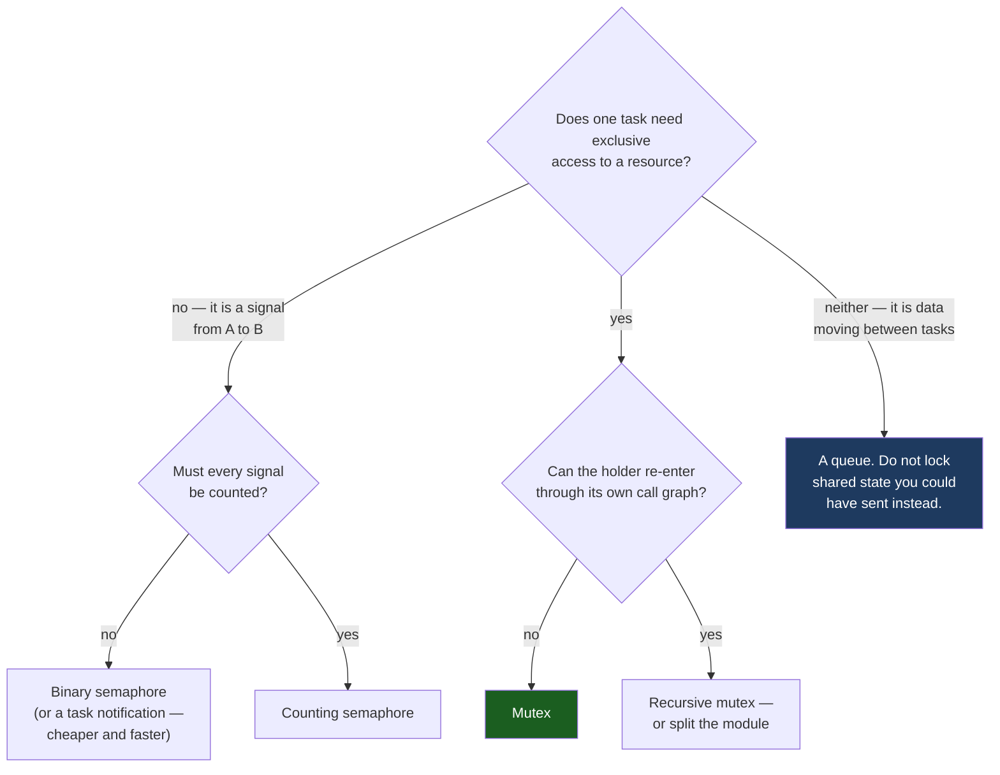

# Semaphores and Mutexes

Adding a scheduler adds a second way for code to be interrupted. On bare metal the only thing that could run between your load and your store was an exception handler, and [Critical Sections and Atomicity](../04-bare-metal-programming/critical-sections-and-atomicity.md) is the complete answer to that. Under a kernel, a task can also be pre-empted by another *task*, at any instruction, for reasons that have nothing to do with the NVIC. Masking interrupts no longer covers the hazard, because the thing that pre-empted you was the scheduler doing its job.

The mental model that makes the FreeRTOS primitives make sense: **all four of them are the same queue, and the only thing that distinguishes them is whether the object records who owns it.** `queue.h` says so directly — `queueQUEUE_TYPE_BASE`, `queueQUEUE_TYPE_MUTEX`, `queueQUEUE_TYPE_COUNTING_SEMAPHORE`, `queueQUEUE_TYPE_BINARY_SEMAPHORE` and `queueQUEUE_TYPE_RECURSIVE_MUTEX` are five values of one field on one structure. A semaphore is a queue with an item size of zero, so "how many items are waiting" *is* the count. A mutex is the same object with one extra field populated: `u.xSemaphore.xMutexHolder`, the handle of the task that currently holds it.

Everything on this page falls out of that one field. Priority inheritance needs to know whose priority to raise, so it exists only where there is a holder. An ISR has no task handle to write into that field, so a mutex cannot be taken from one. And a binary semaphore, which has no holder, cannot be a lock no matter how convincingly the calling code is arranged to look like one.

:::info[Prerequisites]
[Concurrency and Synchronization](../../computer-science/operating-systems/concurrency-and-synchronization.md) owns the general theory — races, mutual exclusion, the ownership distinction in the abstract, and the four deadlock conditions. This page is the FreeRTOS behaviour built on top of it. [Tasks and Scheduling](./tasks-and-scheduling.md) owns the Blocked state that every `Take` below enters, and [Shared Data and Race Conditions](../06-interrupts-timing-and-real-time/shared-data-and-race-conditions.md) owns the instruction-level failure these primitives prevent.
:::

## The four objects, side by side

| | Binary semaphore | Counting semaphore | Mutex | Recursive mutex |
|---|---|---|---|---|
| **Create** | `xSemaphoreCreateBinary()` | `xSemaphoreCreateCounting(max, initial)` | `xSemaphoreCreateMutex()` | `xSemaphoreCreateRecursiveMutex()` |
| **Config gate** | always available | `configUSE_COUNTING_SEMAPHORES` | `configUSE_MUTEXES` | `configUSE_RECURSIVE_MUTEXES` |
| **Initial state** | **empty** — a `Take` blocks until someone `Give`s | `initial`, chosen by you | **available** — the first `Take` succeeds | available |
| **Records an owner** | No | No | **Yes** (`xMutexHolder`) | **Yes**, plus a nesting count |
| **Priority inheritance** | **No** | **No** | **Yes** | **Yes** |
| **Give from a non-taker** | Legal and normal | Legal and normal | Fails — only the holder may give | Fails |
| **Usable from an ISR** | `xSemaphoreGiveFromISR()`, `xSemaphoreTakeFromISR()` | same | **No** | **No** |
| **Take it twice yourself** | Blocks forever (self-deadlock) | Decrements twice | Blocks forever (self-deadlock) | Succeeds, count 2 |
| **What it is for** | "an event happened" | "N units are available" | "I am inside the critical section" | the same, when the call graph re-enters |

Read that table's two `No` cells in the priority-inheritance row as the point of the page rather than a detail. They are the reason a binary semaphore used as a lock is a latent real-time defect and not merely a style preference.

## Signalling: what a semaphore is actually for

A semaphore is a counter with a waiting list. The producer increments it and never waits; the consumer decrements it and waits when it is zero. Neither side owns anything, and that is a feature — the counter is a fact about the world ("three bytes have arrived", "two buffers are free"), not a claim of exclusive access by a particular task.

```c
/* Deferred interrupt handling: the ISR signals, a task does the work.
   The FromISR call and the yield idiom that must accompany it belong with
   the ISR-safe API material; the shape is what matters here. */
static SemaphoreHandle_t rx_ready;

void rx_task(void *arg)
{
    rx_ready = xSemaphoreCreateBinary();          /* starts EMPTY */
    configASSERT(rx_ready != NULL);

    for (;;) {
        if (xSemaphoreTake(rx_ready, pdMS_TO_TICKS(500)) == pdTRUE) {
            drain_ring_buffer();                  /* an event arrived */
        } else {
            report_rx_timeout();                  /* 500 ms of silence */
        }
    }
}
```

The binary form loses count: two `Give`s before the task runs produce one wake, because the count saturates at one. That is correct for "there is work in the ring buffer, go look" — the [single-producer/single-consumer ring buffer](../06-interrupts-timing-and-real-time/deferred-work.md) is self-describing, so a missed wake costs nothing as long as the consumer drains the ring in a loop. It is wrong for "one more item was appended", where each `Give` must produce one `Take`. That case wants a counting semaphore created with `xSemaphoreCreateCounting(depth, 0)`, whose count is the number of unserviced events.

The other use of a counting semaphore is resource counting: create it with `uxInitialCount == uxMaxCount == N`, and each `Take` reserves one of N interchangeable things — DMA channels, transmit buffers, slots in a fixed pool. `uxSemaphoreGetCount()` reports how many are left, which is a genuinely useful health metric to log.

## Ownership: what a mutex adds

A mutex is a binary semaphore that starts available and records its holder. Three behaviours follow, and only the first is widely known:

**Only the holder can give it.** `xSemaphoreGive()` on a mutex held by another task returns `pdFAIL`. This turns "task B released task A's lock" from a silent corruption into a return value — provided anyone checks it.

**A higher-priority waiter raises the holder's priority.** When a task blocks on a mutex, the kernel calls `xTaskPriorityInherit()` on the recorded holder, and the holder runs at the waiter's priority until it gives the mutex back. The TCB carries `uxBasePriority` alongside `uxPriority` for exactly this reason, which is why `TaskStatus_t` reports a current *and* a base priority in the snapshot [Tasks and Scheduling](./tasks-and-scheduling.md) describes. The inheritance path in `queue.c` is guarded on `pxQueue->uxQueueType == queueQUEUE_IS_MUTEX`; a binary semaphore takes the identical code path with that branch not taken. Why this matters, what it bounds and what it does not, is [Priority Inversion and Deadlock](./priority-inversion-and-deadlock.md).

**Timing out is handled, and it is subtler than it looks.** If the waiter's timeout expires, the kernel does not simply restore the holder's base priority — it calls `vTaskPriorityDisinheritAfterTimeout()`, which lowers the holder only as far as the highest priority still waiting on that mutex. Dropping it all the way would re-create the inversion for the remaining waiters.

None of this exists unless `configUSE_MUTEXES` is 1. With it at 0, `xSemaphoreCreateMutex()` is not compiled and the code does not link — a good failure, unlike the alternative.

## Recursive mutexes, and what they are telling you

`xSemaphoreCreateRecursiveMutex()` produces a mutex that the holder may take again. It keeps a nesting count, and the mutex is released only when `xSemaphoreGiveRecursive()` has been called as many times as `xSemaphoreTakeRecursive()`. Mixing the APIs is a bug: a recursive mutex must always be taken and given with the `Recursive` calls, and a plain mutex never with them.

It exists for the call graph that genuinely re-enters — a driver whose public functions each take the bus lock, and one of which is implemented in terms of another. That is a real shape and the recursive mutex is the honest fix. It is also, more often, a sign that the module has two layers glued into one: an outer layer that owns locking and an inner layer that assumes it is already locked. Splitting them (`spi_write()` takes the lock and calls `spi_write_locked()`) removes both the recursion and the ambiguity about which functions are safe to call from where, and costs one underscore-suffixed static function.

## The error this page exists to prevent

```c
/* WRONG. This is not a lock, and the fact that it behaves like one on the
   bench is the problem. */
static SemaphoreHandle_t bus_lock;

void app_init(void)
{
    bus_lock = xSemaphoreCreateBinary();
    xSemaphoreGive(bus_lock);            /* "prime" it so the first Take works */
}

void sensor_read(void)
{
    xSemaphoreTake(bus_lock, portMAX_DELAY);
    i2c_transfer(...);
    xSemaphoreGive(bus_lock);
}
```

This compiles, runs, and provides mutual exclusion. Four things are nonetheless wrong with it, in increasing order of how long they take to find:

- **No priority inheritance.** A low-priority task inside `i2c_transfer()` blocks a high-priority one for as long as any *medium*-priority task chooses to run. The critical section is 200 µs; the blocking is unbounded. This is the Mars Pathfinder failure, and it is on the [next page](./priority-inversion-and-deadlock.md).
- **Anyone can give it.** A cleanup path, an error handler or a watchdog "recovery" that calls `xSemaphoreGive(bus_lock)` without ever having taken it succeeds, and now two tasks are inside the critical section with no diagnostic anywhere. On a real mutex that same call returns `pdFAIL`.
- **The priming `Give` is load-bearing and undocumented.** Delete it during a refactor and the first `Take` blocks forever. It looks like initialisation noise, which is exactly what someone will conclude.
- **A response-time analysis of this system is wrong.** The blocking term in [Scheduling Theory for Firmware](../06-interrupts-timing-and-real-time/scheduling-theory.md) assumes blocking is bounded by the length of the critical section. With no inheritance that assumption does not hold, so the analysis says the deadline is met and the hardware disagrees.

The fix is one word: `xSemaphoreCreateMutex()`, and delete the priming `Give`. The rule to carry out of it — **a semaphore signals across tasks, a mutex protects a resource; if the same task takes and gives it around a critical section, it must be a mutex.**

## Why a mutex must never be taken from an ISR

There is no `xSemaphoreTakeFromISR()` variant that works on a mutex, and this is a design decision rather than an omission. An interrupt handler is not a task: there is nothing for the kernel to write into `xMutexHolder` except `pxCurrentTCB`, which names whichever task happened to be interrupted. That task would then inherit priority for a lock it never took and would be expected to release it, and the handler that actually took it would return, leaving the mutex held by an innocent bystander forever.

The reasoning generalises to the whole family:

- **A handler cannot block.** `Take` with a timeout has no meaning where there is no task to place on an event list; the only honest ISR-side primitive is a non-blocking one.
- **`xSemaphoreGiveFromISR()` is documented as not usable on mutexes** for the mirror-image reason: giving a mutex may run the disinheritance path, and there is no task context in which to do that.
- **A binary or counting semaphore has neither problem**, which is precisely because it has no owner. `xSemaphoreGiveFromISR()` and `xSemaphoreTakeFromISR()` are legal on those, which is why "ISR signals, task locks" is the standard structure.

The complementary constraint — that even the legal `FromISR` calls may only be made from interrupts at or below the kernel's masking ceiling, and what happens when they are not — belongs with the ISR-safe API material and the `BASEPRI` threshold described in [Priorities and Nesting](../06-interrupts-timing-and-real-time/interrupt-priorities-and-nesting.md).

## Choosing



Two entries deserve emphasis. The "cheaper and faster" note on the binary semaphore is not a small effect — a direct-to-task notification does the same job with no separate object at all, and [Task Notifications and Event Groups](./notifications-and-event-groups.md) quantifies it. And the rightmost branch is the one that removes the most bugs: a resource with exactly one owning task, reached only through [a queue](./queues-and-message-passing.md), needs no lock, cannot deadlock, and cannot suffer priority inversion because there is nothing to invert.

Every object above also has a `Static` constructor — `xSemaphoreCreateBinaryStatic()`, `xSemaphoreCreateMutexStatic()` and the rest, each taking a `StaticSemaphore_t *` you supply. On a no-heap build that is mandatory; [Stacks and Heaps in an RTOS](./stacks-and-heaps-in-an-rtos.md) covers the configuration.

:::warning[The semaphore that started empty, and the take whose return value nobody read]
Two failures that both present as something other than a locking bug.

**`vSemaphoreCreateBinary` versus `xSemaphoreCreateBinary`.** The deprecated macro created the semaphore in the *available* state; the current function creates it **empty**. Both still exist, because the kernel kept the old one for backward compatibility while introducing the new one to make the semantics consistent. Port a driver from an older code base, or copy a ten-year-old example from a forum, and the one-character difference in the constructor turns a working "prime it once, then lock with it" pattern into a task that blocks on its first `Take` and never runs again. The symptom is not a crash: it is a subsystem that is simply absent, with `uxTaskGetSystemState()` showing the task permanently Blocked and every other task healthy. Whenever a task is Blocked on an object at start-up and never wakes, check the constructor before checking the logic — and note that this trap only exists because a semaphore was being used as a lock in the first place.

**The unchecked `xSemaphoreTake`.** `xSemaphoreTake(m, pdMS_TO_TICKS(50));` with the return value discarded is common, because the timeout was added defensively and "it never times out". On the day it does — a lower-priority holder delayed by an unrelated load spike — the function proceeds into the critical section *without the lock*. Two tasks then drive the same SPI peripheral, and the trailing `xSemaphoreGive()` from the non-holder returns `pdFAIL`, silently. The damage is a corrupted transfer somewhere else entirely: a display that draws one wrong row, a flash write that lands in the wrong sector. Nothing points back at the mutex, because the mutex worked perfectly. There are exactly two defensible forms — `portMAX_DELAY` where blocking forever is genuinely correct, or a finite timeout whose failure branch is written and tested. `configASSERT(xSemaphoreTake(...) == pdTRUE)` is not the third one, because `configASSERT` compiles out of the release build and takes the call with it.
:::

## See also

- [Priority Inversion and Deadlock](./priority-inversion-and-deadlock.md) — what priority inheritance buys, what it does not, and the Pathfinder failure caused by the mutex that lacked it.
- [Queues and Message Passing](./queues-and-message-passing.md) — the design that needs no lock at all, and the copy semantics that make it safe.
- [Task Notifications and Event Groups](./notifications-and-event-groups.md) — the cheaper replacement for a binary semaphore, and the cases where it is not one.
- [Concurrency and Synchronization](../../computer-science/operating-systems/concurrency-and-synchronization.md) — the general theory of mutual exclusion, ownership and deadlock that this page specialises.
- [Critical Sections and Atomicity](../04-bare-metal-programming/critical-sections-and-atomicity.md) — the other half of the hazard: what still has to be masked when the competitor is an interrupt rather than a task.

## References

- Amazon Web Services — [**FreeRTOS: semaphore and mutex API reference**](https://www.freertos.org/Documentation/02-Kernel/04-API-references/10-Semaphore-and-Mutexes/00-Semaphores). Verified against this for the page: `xSemaphoreCreateBinary()` creating the semaphore empty against the deprecated `vSemaphoreCreateBinary()` creating it available; `xSemaphoreCreateCounting(uxMaxCount, uxInitialCount)`; `xSemaphoreCreateMutex()` and `xSemaphoreCreateRecursiveMutex()`, the `configUSE_MUTEXES` / `configUSE_RECURSIVE_MUTEXES` / `configUSE_COUNTING_SEMAPHORES` gates, the `TakeRecursive`/`GiveRecursive` pairing rule, `xSemaphoreGetMutexHolder()`, and the statement that `xSemaphoreGiveFromISR()` must not be used with mutexes. (Documentation checked 2026-08-26.)
- FreeRTOS-Kernel — [**`queue.c`**](https://github.com/FreeRTOS/FreeRTOS-Kernel/blob/main/queue.c) and [**`include/queue.h`**](https://github.com/FreeRTOS/FreeRTOS-Kernel/blob/main/include/queue.h). The `queueQUEUE_TYPE_BASE` / `_MUTEX` / `_COUNTING_SEMAPHORE` / `_BINARY_SEMAPHORE` / `_RECURSIVE_MUTEX` enumeration showing all five are one structure; `u.xSemaphore.xMutexHolder`; and `xQueueSemaphoreTake()`, where the `xTaskPriorityInherit()` call is guarded on `uxQueueType == queueQUEUE_IS_MUTEX` and the timeout path calls `vTaskPriorityDisinheritAfterTimeout()` with the highest remaining waiter's priority. This is the file that proves the ownership distinction rather than asserting it. (Source checked 2026-08-26.)
- Richard Barry and the FreeRTOS team — [***Mastering the FreeRTOS Real Time Kernel***](https://www.freertos.org/Documentation/02-Kernel/07-Books-and-manual/01-RTOS_book) (free PDF from freertos.org). Chapter 7, "Resource Management", is the canonical narrative treatment: binary and counting semaphores, the mutex-versus-semaphore argument with worked examples, priority inheritance, recursive mutexes, and the gatekeeper-task pattern the decision tree above points at.
- Edsger W. Dijkstra — "Cooperating Sequential Processes" (1965), reprinted in *The Origin of Concurrent Programming* (Springer, 2002). The origin of the semaphore as a signalling counter with no notion of ownership — the historical reason the two primitives are distinct rather than one being a special case of the other.
