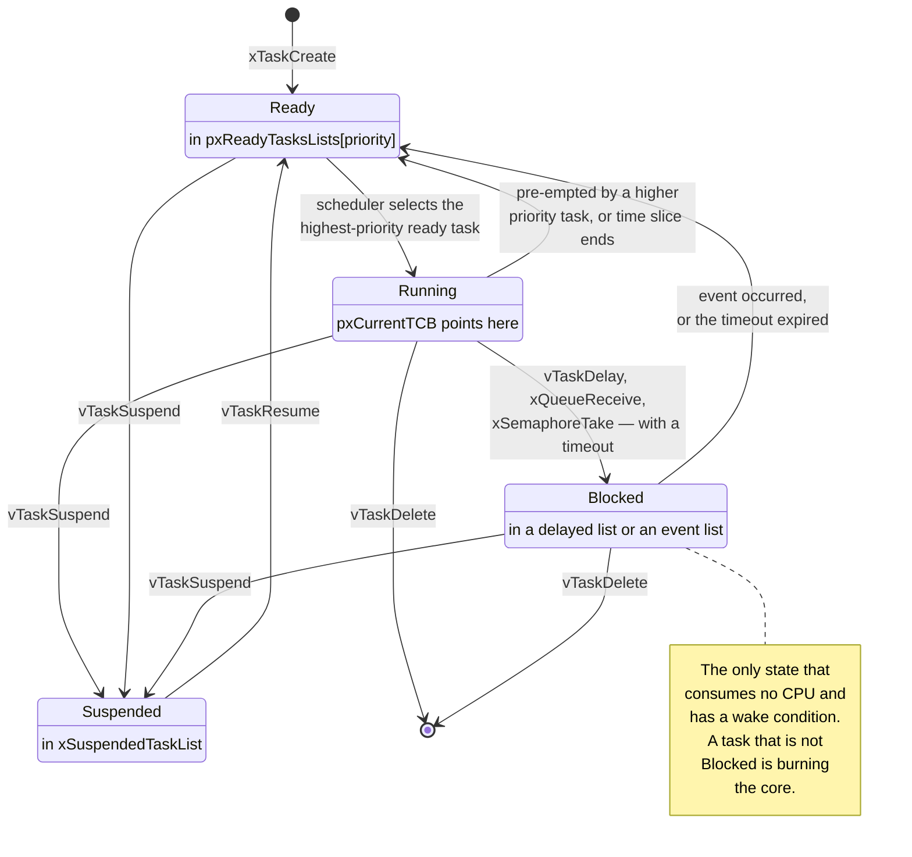

# Tasks and Scheduling

A task looks like an infinite loop written as if it owned the processor. That illusion is the whole product, and it is manufactured from three things: a block of RAM used as a stack, a small structure recording where that stack's pointer got to, and membership of exactly one linked list. Everything the scheduler does is move that structure between lists.

The mental model: **the scheduler is not a policy engine, it is a list lookup.** At every point where a scheduling decision can happen, FreeRTOS answers one question — what is the highest-priority ready list that is not empty? — and runs the task at its head. There is no fairness, no ageing, no dynamic priority, no heuristic to keep a starved task alive. If a high-priority task never blocks, nothing below it ever runs again, and the kernel will let that happen without complaint because concealing it would make the timing unanalysable.

That is the sharpest difference from the general-purpose policies in [Scheduling](../../computer-science/operating-systems/scheduling.md), which owns round robin, multilevel feedback queues, CFS and the throughput-versus-fairness trade-off. This page is about the model a small real-time kernel implements instead, with FreeRTOS as the worked example.

:::info[Prerequisites]
[Why an RTOS](./why-an-rtos.md) covers what the kernel buys and costs. [Scheduling](../../computer-science/operating-systems/scheduling.md) owns general scheduling theory. [Scheduling Theory for Firmware](../06-interrupts-timing-and-real-time/scheduling-theory.md) owns rate-monotonic priority assignment and response-time analysis — the arithmetic that decides which numbers you should assign here. This page is the FreeRTOS mechanism those two describe from either side.
:::

## The four states, and what moves between them

Every task is in exactly one state, and the kernel reports it through `eTaskGetState()`, which returns an `eTaskState`: `eRunning`, `eReady`, `eBlocked`, `eSuspended`, `eDeleted`, or `eInvalid` for a handle that names nothing.



The distinction that matters most is **Blocked versus Suspended**, because they look similar and behave nothing alike:

- **Blocked** is entered by the task itself, always with a wake condition: a timeout, a queue item, a semaphore, a notification. It is the state the kernel exists to provide. A blocked task is on a *delayed list* ordered by wake time, an *event list* belonging to the object it is waiting on, or both.
- **Suspended** is imposed from outside by `vTaskSuspend()`, has no wake condition at all, and is left only when someone else calls `vTaskResume()`. It is an administrative state, and a design that relies on it for synchronisation has usually reinvented a semaphore badly — with a race, because the suspend can arrive before the task reaches the point it was meant to be suspended at.

One overlap worth knowing about, because it shows up when you read `tasks.c`: a task that blocks indefinitely — `portMAX_DELAY` with `INCLUDE_vTaskSuspend` set to 1 — is placed on `xSuspendedTaskList` rather than a delayed list, because there is no wake time to order it by. It is still *reported* as Blocked, and it is still woken by its event. The list is an implementation detail; the state is not.

## The ready lists and the selection

`pxReadyTasksLists` is an array of `configMAX_PRIORITIES` doubly linked lists, one per priority. A ready task is in the list for its priority; `pxCurrentTCB` points at the task that is running. Selection is:

1. Find the highest index with a non-empty list.
2. Advance that list's index pointer one place (this is what makes equal-priority tasks round-robin) and take the task it now points at.

Step 1 is where the ports differ, and it is the difference between an O(n) scheduler and an O(1) one. The generic implementation walks down from `uxTopReadyPriority` until it finds a non-empty list. The Cortex-M ports instead use `configUSE_PORT_OPTIMISED_TASK_SELECTION`, which keeps a bitmap of which priorities have ready tasks and finds the top one with a single **`CLZ`** instruction — count leading zeros, one cycle on Armv7-M. Selection becomes constant-time regardless of how many priorities exist.

Two consequences fall straight out of that mechanism:

- **The optimised selection caps `configMAX_PRIORITIES` at 32**, because the bitmap is one word. If you need more priorities than that on a Cortex-M, you are opting back into the generic list walk, and you should ask why a design needs more than 32 distinct urgencies.
- **`configMAX_PRIORITIES` costs RAM whether or not you use the priorities.** Each unused priority is still an empty `List_t` in the array. Setting it to 32 "for headroom" on a part with modest SRAM buys nothing and costs a few hundred bytes.

**FreeRTOS priority numbers run opposite to Cortex-M interrupt priority numbers.** In FreeRTOS, `tskIDLE_PRIORITY` is 0 and numerically *higher* is more urgent, up to `configMAX_PRIORITIES - 1`. On the NVIC, numerically *lower* is more urgent. Both conventions are on the same chip, in the same source file, frequently on adjacent lines. See [Priorities and Nesting](../06-interrupts-timing-and-real-time/interrupt-priorities-and-nesting.md) for the NVIC side.

Assigning the numbers is not this page's job. Order tasks by period, shortest period highest priority, and check the result with response-time analysis — that is rate-monotonic assignment, and [Scheduling Theory for Firmware](../06-interrupts-timing-and-real-time/scheduling-theory.md) derives it, gives the utilisation bound and works a task set on this exact board. What that page treats as an abstract "task" is precisely what this page calls a task, and the two are meant to be read together.

## The tick

`configTICK_RATE_HZ` sets a periodic interrupt, driven by SysTick on a Cortex-M port ([SysTick and the Core Peripherals](../02-processor-architecture/systick-and-core-peripherals.md)). Its handler calls `xTaskIncrementTick()`, which does three things:

1. Increments `xTickCount`.
2. Moves every task whose wake time has arrived from the delayed list to its ready list.
3. Returns whether a context switch is needed — because it unblocked something more urgent than the running task, or because a time slice ended.

The delayed-list arrangement is worth understanding, because it is what keeps the tick O(1) in the common case. Blocked-with-timeout tasks are held in a list *sorted by wake time*, and the kernel caches the earliest of those in `xNextTaskUnblockTime`. Most ticks therefore compare one word and do nothing else — no scan of the task set. Because a 32-bit tick count wraps, there are two delayed lists, current and overflow, and the pointers swap when `xTickCount` wraps; a task whose computed wake time is numerically less than the current tick goes on the overflow list. This is the same wrap problem the superloop solves with `time_after()`, solved once inside the kernel instead of at every call site — see [The Superloop and Cooperative Scheduling](../04-bare-metal-programming/the-superloop.md).

Choosing the rate is a real trade-off and 1000 Hz is a default, not an answer:

| Tick rate | Cost | What it buys |
|---|---|---|
| 100 Hz | Tick handler runs 100×/s | 10 ms timing granularity. Ample for UI, comms timeouts, housekeeping. Best for low power |
| 1000 Hz | 10× the tick overhead | 1 ms granularity — the usual default, and the one most published examples assume |
| 10 kHz | Tick overhead becomes a visible percentage of CPU | Rarely worth it. If you need this resolution, you need a hardware timer, not a faster tick |

The overhead is measurable rather than guessable: run `configGENERATE_RUN_TIME_STATS` against a free-running timer, or toggle a GPIO at the top and bottom of the tick handler and read the duty cycle on a scope, as in [Interrupt Latency](../06-interrupts-timing-and-real-time/interrupt-latency.md).

The rule the tick rate does *not* change: **a delay is not a timing mechanism.** `vTaskDelay(1)` means "at least one tick", and the wake is quantised to the tick, so the actual delay is between just over 0 and 1 tick, plus however long a higher-priority task holds the core afterwards. Anything with a hardware timing requirement belongs on a timer peripheral ([Timers and Counters](../05-peripherals-and-drivers/timers-and-counters.md)), not on the scheduler.

## Time slicing among equal priorities

`configUSE_TIME_SLICING` defaults to 1, and it means: when the tick fires and there is another ready task *at the same priority as the running task*, switch to it. Equal-priority tasks share the core round-robin, one tick each.

The subtlety, and it is the source of a lot of confusion about "wasted" context switches, is `configIDLE_SHOULD_YIELD`. Because the idle task sits at priority 0, an application task also at priority 0 would otherwise share ticks with it fifty-fifty. With `configIDLE_SHOULD_YIELD` set to 1 — the default — the idle task yields immediately whenever any other task at priority 0 is ready, instead of consuming its full slice. The side effect is that a priority-0 application task may receive *less* than a full tick of runtime when it is the one being yielded to and another priority-0 task then takes over. The clean way out is not to put application tasks at priority 0 at all; leave that priority to the idle task.

Turning time slicing off (`configUSE_TIME_SLICING` 0) makes equal-priority tasks run until they block or explicitly `taskYIELD()`. That is cooperative scheduling within a priority level, and it is occasionally the right choice: it removes a class of race between tasks that were written assuming they could not be interrupted by their own peer, and it removes the switch overhead. It also means one non-blocking equal-priority task starves its peers permanently.

## The idle task

`vTaskStartScheduler()` creates the idle task before it starts scheduling. It runs at `tskIDLE_PRIORITY` (0), it is always ready, and it exists so that the core always has something to run. It is not a placeholder — it has a job:

- **It frees the memory of deleted tasks.** `vTaskDelete()` cannot free the stack the calling task is standing on, so when a task deletes itself the TCB and stack are handed to the idle task to reclaim. If the idle task never runs, that memory is never returned, and the heap shrinks by one task's worth per deletion.
- **It runs `vApplicationIdleHook()`** if `configUSE_IDLE_HOOK` is 1. This is where a `__WFI()` belongs on a system that has not yet adopted tickless idle, and where a low-priority background wipe or a watchdog-liveness counter can live.
- **It is a free CPU-load meter.** Count iterations of the idle hook per second and compare with the count on an unloaded system: the ratio is your idle fraction, without needing run-time statistics compiled in.

Two hard rules for the idle hook, both from the kernel's own documentation and both easy to violate:

- **It must never block, and never call a kernel API that could block.** Blocking the idle task means there is no task ready to run, which the scheduler treats as a fatal condition.
- **It must return.** It is called in a loop by the idle task; an idle hook containing its own `for(;;)` prevents the idle task from ever reclaiming deleted-task memory.

If the plan is to sleep the core properly rather than spin in `__WFI()`, tickless idle (`configUSE_TICKLESS_IDLE`) is the mechanism: the kernel suppresses the tick for as long as it knows no task can be ready, sleeps, and corrects `xTickCount` on wake. That is a low-power topic and it belongs with the low-power material rather than here.

:::warning[The heap that only leaks when a client disconnects, and the priority numbers that run backwards]
Two bugs that are specific to this page's mechanisms and cost days each.

**The idle task that never runs, and the leak nobody can find.** A busy application task at priority 1 polls a flag instead of blocking on it — a loop with no `vTaskDelay`, no queue receive, nothing. It never blocks, so priority 0 never becomes the highest non-empty ready list, so the idle task never executes. Everything works: the polling task is only priority 1, so real work still pre-empts it. Then you add a feature that creates a worker task per connection and deletes it on disconnect, and `xPortGetFreeHeapSize()` starts a slow monotonic decline that stops exactly when connections stop. The stack and TCB of every deleted task are queued for the idle task to free, and the idle task is starved. Nothing in the delete path looks wrong, because nothing in the delete path *is* wrong. Two tells identify it in a minute: `xPortGetFreeHeapSize()` falls only on task deletion and never otherwise, and a counter incremented in `vApplicationIdleHook()` reads zero. The fix is to make the polling task block; the busy-wait was a defect before it caused this one.

**FreeRTOS priorities and NVIC priorities in the same function.** In FreeRTOS higher numbers are more urgent; on the NVIC lower numbers are more urgent. Firmware routinely contains `xTaskCreate(..., 3, ...)` and `NVIC_SetPriority(USART2_IRQn, 3)` within a few lines of each other, meaning opposite things, and a developer who has internalised one convention will read the other backwards. The failure is not a crash — it is a system whose priority *design* is inverted from its priority *implementation*, so the urgent task is the one that gets pre-empted. The symptom is a deadline missed under load by a task that "obviously has the highest priority", where a debugger shows it Ready rather than Running while something trivial runs. Two habits remove it: never write a bare priority number at a call site (use an enum for the task priorities and a second, differently named one for interrupts, as in [Priorities and Nesting](../06-interrupts-timing-and-real-time/interrupt-priorities-and-nesting.md)), and write the direction in a comment next to each enum, because reviewers read comments and do not read conventions.
:::

## Reading the state of the system at runtime

`uxTaskGetSystemState()` fills an array of `TaskStatus_t` — handle, name, task number, current state, current and base priority, stack high-water mark, and run-time counter if `configGENERATE_RUN_TIME_STATS` is enabled. It is the programmatic form of the ready-list and state model above, and it is the single most useful diagnostic in a FreeRTOS system.

```c
/* Requires configUSE_TRACE_FACILITY = 1. Called from a low-priority
   diagnostics task, never from an ISR: it suspends the scheduler. */
static void report_tasks(void)
{
    UBaseType_t     count = uxTaskGetNumberOfTasks();
    TaskStatus_t   *snap  = pvPortMalloc(count * sizeof(TaskStatus_t));
    if (snap == NULL) { return; }

    count = uxTaskGetSystemState(snap, count, NULL);

    for (UBaseType_t i = 0; i < count; i++) {
        printf("%-12s pri %2u  state %u  stack free %u words\n",
               snap[i].pcTaskName,
               (unsigned)snap[i].uxCurrentPriority,
               (unsigned)snap[i].eCurrentState,      /* eTaskState above */
               (unsigned)snap[i].usStackHighWaterMark);
    }
    vPortFree(snap);
}
```

Note `usStackHighWaterMark` is in **words**, not bytes — the same units as `uxTaskGetStackHighWaterMark()`, and the same trap. [Stacks and Heaps in an RTOS](./stacks-and-heaps-in-an-rtos.md) covers what to do with the number. Note also the allocation: on a static-only build, size the array at compile time from a known task count instead.

The single most informative thing this report tells you is how many tasks are in a state other than Blocked. In a healthy event-driven system, at any given instant nearly everything is Blocked and the core is idle. A snapshot showing several Ready tasks is a system that is running out of CPU, and it shows up here long before it shows up as a missed deadline.

## See also

- [Context Switching](./context-switching.md) — what actually happens between "the scheduler selected a different task" and that task running.
- [Stacks and Heaps in an RTOS](./stacks-and-heaps-in-an-rtos.md) — where the per-task stacks come from and how to size the ones this page creates.
- [Scheduling Theory for Firmware](../06-interrupts-timing-and-real-time/scheduling-theory.md) — rate-monotonic assignment and response-time analysis: which priority numbers to give the tasks above.
- [Scheduling](../../computer-science/operating-systems/scheduling.md) — the general theory of scheduling policies, and the fairness-oriented alternatives a real-time kernel deliberately does not implement.
- [The Superloop and Cooperative Scheduling](../04-bare-metal-programming/the-superloop.md) — the same problem solved with one stack, and the wrap-safe tick comparison the kernel does internally.

## References

- Richard Barry and the FreeRTOS team — [***Mastering the FreeRTOS Real Time Kernel***](https://www.freertos.org/Documentation/02-Kernel/07-Books-and-manual/01-RTOS_book) (free PDF from freertos.org). Chapter 3 "Task Management" is the canonical treatment of the state diagram, priorities, the idle task and its hook, and the delay functions; §3.14 covers scheduling algorithms and the interaction between `configUSE_TIME_SLICING` and `configIDLE_SHOULD_YIELD`. (Documentation checked 2026-08-26.)
- Amazon Web Services — [**FreeRTOS kernel API reference — task control**](https://www.freertos.org/Documentation/02-Kernel/04-API-references/01-Task-creation/00-TaskHandle) and the [**customisation reference**](https://www.freertos.org/Documentation/02-Kernel/03-Supported-devices/02-Customization). Verified against these for this page: the `eTaskState` enumerators (`eRunning`, `eReady`, `eBlocked`, `eSuspended`, `eDeleted`, `eInvalid`) and `eTaskGetState()`; `uxTaskGetSystemState()` and the `TaskStatus_t` fields; and the `configMAX_PRIORITIES`, `configTICK_RATE_HZ`, `configUSE_TIME_SLICING`, `configIDLE_SHOULD_YIELD`, `configUSE_PORT_OPTIMISED_TASK_SELECTION` and `configUSE_IDLE_HOOK` options. (Documentation checked 2026-08-26.)
- FreeRTOS-Kernel — [**`tasks.c`**](https://github.com/FreeRTOS/FreeRTOS-Kernel/blob/main/tasks.c) and [**`include/task.h`**](https://github.com/FreeRTOS/FreeRTOS-Kernel/blob/main/include/task.h). The source of every mechanism above: `pxReadyTasksLists` and `uxTopReadyPriority`, `prvAddCurrentTaskToDelayedList` with its `pxDelayedList` / `pxOverflowDelayedList` pair and the `xNextTaskUnblockTime` cache, `xTaskIncrementTick`, and `prvIdleTask`. The kernel is small enough to read, and this is the file to read first. (Source checked 2026-08-26.)
- C. L. Liu and James W. Layland — ["Scheduling Algorithms for Multiprogramming in a Hard-Real-Time Environment"](https://dl.acm.org/doi/10.1145/321738.321743), *Journal of the ACM* 20(1), 1973. The origin of the fixed-priority model this scheduler implements, and of the rate-monotonic assignment the sibling page applies to it.
- STMicroelectronics — [**PM0214**, *STM32 Cortex-M4 MCUs and MPUs programming manual*](https://www.st.com/resource/en/programming_manual/pm0214-stm32-cortexm4-mcus-and-mpus-programming-manual-stmicroelectronics.pdf), Rev 10. §4.5 for the SysTick timer that drives the tick, and §2.3.5 for the inverted interrupt-priority convention that the warning above contrasts with FreeRTOS's own.
