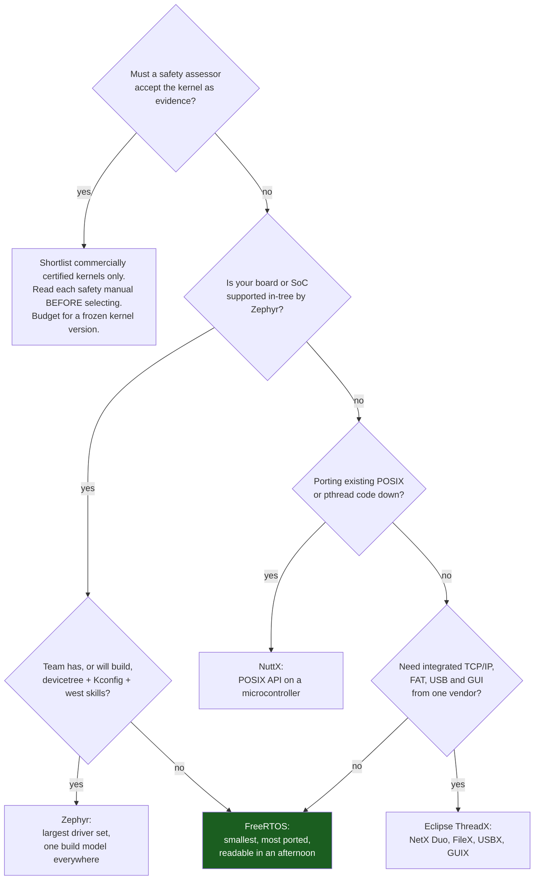

# The RTOS Landscape

Every kernel on this page implements fixed-priority pre-emptive scheduling with a ready list per priority, blocking primitives, and a tick. If you compare them on scheduling behaviour you will find almost nothing to choose between them, and you will have compared the wrong thing. The scheduler is the commodity part.

The mental model: **you are choosing a licence, a driver ecosystem, a build system and a certification story, and the scheduler comes along for the ride.** Those four things are what you will still be living with in five years. The licence decides what you must publish and what you must attribute. The ecosystem decides whether bringing up a new sensor is an afternoon or a fortnight. The build system decides how your CI works and how a new engineer gets a blinking LED. And the certification pedigree decides whether a safety assessor will accept the kernel at all, or whether you will be writing the evidence yourself.

A warning that applies to this entire page before any of the detail: **licences change, certifications lapse, and projects get donated to new foundations.** Every claim below is stated as of the check date in the references, with a link to the project's own page. Verify each one against that page at the moment you make the decision — the cost of getting this wrong is discovered by a lawyer or an assessor, late, and it is not a cost you can engineer around.

## The comparison

Footprint is given as a band rather than a number on purpose. A published "6 KB kernel" figure is measured with a specific configuration, port and compiler, and yours will differ by a factor that matters; the only honest number is the delta in your own map file. The bands describe a minimal but useful configuration — scheduler, a handful of tasks, queues and mutexes — with no networking stack.

| Kernel | Licence | ROM band (minimal config) | Certification pedigree | Ecosystem and build model |
|---|---|---|---|---|
| **FreeRTOS** | MIT | Single-digit KB | The kernel itself is not sold as pre-certified. **SafeRTOS** (WITTENSTEIN high integrity systems) is a separately licensed, commercially certified derivative with the same API shape — that is the route for IEC 61508 / IEC 62304 / ISO 26262 work | Kernel plus AWS-curated libraries (coreMQTT, FreeRTOS+TCP, corePKCS11). Drivers come from your silicon vendor's HAL, not from the kernel. CMake or vendor IDE. Ports for nearly every 32-bit architecture in production |
| **Zephyr** | Apache-2.0 | Tens of KB | A Linux Foundation project with a dedicated safety working group; functional-safety certification of a Zephyr LTS release has been an explicit programme goal. **Check the project's current safety status directly** — this is the fastest-moving row in the table | The largest in-tree driver and board collection of anything here. Devicetree describes the hardware, Kconfig selects the software, `west` manages the multi-repo workspace. Steepest learning curve, largest payoff on a board with in-tree support |
| **Eclipse ThreadX** | MIT | Single-digit KB | The strongest pre-certification story on this list. Its Express Logic lineage carried TÜV and UL certifications for IEC 61508, IEC 62304 and ISO 26262 use; the project moved to the Eclipse Foundation in 2023–24 and **which artefacts transferred, and for which versions, must be checked against Eclipse's own current statements** | Kernel plus NetX Duo (TCP/IP), FileX (FAT), USBX, GUIX — a genuinely integrated middleware suite, which is its main differentiator. Long history in medical and industrial products |
| **RT-Thread** | Apache-2.0 | Single-digit KB (nano) to tens of KB (full) | Not a mainstream Western safety-certification route. Evaluate on its own documentation if you need one | Very large package ecosystem and strong support for Chinese silicon vendors; documentation is more complete in Chinese than in English. Two profiles: RT-Thread Nano (kernel only) and the full distribution with drivers, FS and network stack |
| **Apache NuttX** | Apache-2.0 | Tens of KB | Not sold as pre-certified | A POSIX/ANSI-compliant small OS rather than a bare kernel: it gives you a shell, a filesystem, sockets and `pthread`s with a Linux-shaped API. Kconfig-based build. The right answer when porting POSIX code down to a microcontroller |
| **RTEMS** | BSD-2-Clause (modernised from an older GPL-with-exception) | Tens of KB | The spaceflight pedigree on this list — long use by NASA and ESA missions, with pre-qualification data-package activities driven by those agencies. Assess against the specific standard you must meet | POSIX and classic RTEID/ORKID APIs, strong support for architectures the commercial kernels ignore (SPARC/LEON, PowerPC). Its own RSB build system. Small community, deep expertise, excellent documentation |
| **Mbed OS** | Apache-2.0 | Tens of KB | Not applicable in practice — see below | **Arm announced the end of life of Mbed OS and the Mbed online tooling.** Treat it as a maintenance-only ecosystem: do not start a new product on it, and if you inherit one, plan the migration (usually to Zephyr or to FreeRTOS plus the vendor HAL) as a scheduled project rather than an emergency |

## Reading the licence column

Three of these are Apache-2.0, two are MIT, one is BSD-2-Clause. All six are permissive: none of them requires you to publish your application source. The differences that actually reach a product:

- **Apache-2.0 has an explicit patent grant and a `NOTICE`-file obligation.** The patent grant is a genuine advantage in a corporate review. The obligation is that you must reproduce attribution and any `NOTICE` content with your distribution — for firmware that usually means a licences page in the manual or the device UI, and it is a task, not a formality.
- **MIT and BSD-2-Clause require attribution and nothing else.** Reproduce the copyright notice and the licence text.
- **None of them requires source disclosure**, which is why FreeRTOS's move from a modified GPL to MIT at V10.0.0 mattered so much: the older licence's exception was widely misread, and moving to MIT removed the argument entirely.

The trap is not the kernel licence. It is the **middleware licence**, which is frequently different and occasionally copyleft: a TCP/IP stack, a USB device stack, a filesystem or a GUI library shipped alongside a permissive kernel may carry its own terms, and a vendor "RTOS package" is a bundle of components with a bundle of licences. Run the audit over the shipping image, not over the kernel's repository.

## When a certified kernel is non-negotiable

Non-negotiable means: an assessor will require evidence about the kernel, and you will not be able to produce it retroactively for a kernel that was not built to produce it. The standards that put you there:

| Domain | Standard | What it wants from the kernel |
|---|---|---|
| Industrial functional safety | IEC 61508 (SIL 1–4) | Development-process evidence, requirements traceability, structural coverage of the kernel's own code |
| Automotive | ISO 26262 (ASIL A–D) | The above, plus a safety manual stating assumptions of use and the freedom-from-interference argument for memory and timing partitioning |
| Medical devices | IEC 62304 (Class A/B/C) | Software-of-unknown-provenance justification, or a kernel supplied with the lifecycle evidence the standard demands |
| Airborne | DO-178C (DAL A–E) | The most demanding: requirements-based test evidence and MC/DC structural coverage of every line you ship |

Three things about "pre-certified" that cost projects real money when they are learned late:

**The certificate names a version, a compiler, a port and a configuration.** It is evidence about that exact artefact. Take the next patch release, switch from GCC 12 to GCC 14, enable a config option that was off in the certified build, and you are outside the certified envelope. Kernel upgrades stop being routine — this is the single largest practical difference between working with a certified kernel and an uncertified one.

**Certifying the kernel certifies the kernel.** Your application, your drivers, your HAL and your integration are all still yours to evidence. A pre-certified kernel removes one large, awkward piece of the work; it does not shorten the project by a factor.

**Every certified kernel ships a safety manual, and it is binding.** It states the assumptions of use — which API calls are permitted from which context, which configuration options are prohibited, what the integrator must verify. Violating the safety manual invalidates the certificate as effectively as modifying the source. Read it before selecting, not after: occasionally an assumption of use rules out an architecture you had already committed to.

## Choosing

The default at the bottom right is a real recommendation and not a shrug. FreeRTOS is the worked example throughout this folder for a reason that is worth naming: **`tasks.c` is a few thousand lines of ordinary, commented C, and you can read the whole scheduler in an afternoon.** For learning what a kernel does — which is what the rest of folder 07 is about — that property outweighs every feature comparison. Zephyr's model gets its own page later in this folder rather than being folded into the FreeRTOS material, because devicetree, Kconfig and `west` are different enough to need one.

## What to check before committing, on your actual board

The table above narrows the field; these are the questions that decide it, and every one of them is answerable in a day with the evaluation board you already have. Answer them *before* the architecture is written around a kernel, because each is expensive to discover afterwards.

- **Does an official port exist for your exact core, and who maintains it?** "Cortex-M4" is not specific enough — a Cortex-M4F port that saves `S16`–`S31` is a different file from a Cortex-M3 port, and picking the wrong one is a silent-corruption bug ([Context Switching](./context-switching.md)). A port maintained in the kernel's own tree is worth substantially more than one maintained in a silicon vendor's fork.
- **Does the kernel coexist with the vendor HAL, or replace it?** FreeRTOS and ThreadX sit *underneath* your vendor's HAL and leave driver code alone. Zephyr and NuttX bring their own driver model, which means the vendor HAL is largely bypassed — a much larger change, and much better long-term if your board is supported in-tree.
- **Does your debugger understand it?** RTOS-aware debugging — a thread list, per-task backtraces, per-task register views — is the difference between debugging one core and debugging N tasks. Check what your probe's GDB server or IDE supports for the specific kernel, and check it against the *version* you intend to use.
- **What does the trace story look like?** Whether SEGGER SystemView, Percepio Tracealyzer or a kernel-native tracing hook, confirm that the instrumentation macros exist in the port you selected and that you have the pin or SWO bandwidth for them.
- **Build a blinking LED, from a clean checkout, on a clean machine, and time it.** This measures the thing that dominates the first month and appears in no comparison table: how long it takes an engineer who has never seen the project to get to a running image.
- **Read the kernel's context-switch code.** Ten minutes. If you cannot follow it at all, you have chosen a component you will not be able to debug at 3 a.m., and that is worth knowing before rather than after.

:::warning[The certified kernel that was not certified, and the licence found at tape-out]
Two failures that both surface far too late to fix cheaply.

**The certified kernel used outside its envelope.** A team buys a pre-certified kernel, integrates it, and eighteen months later the assessor asks which certified configuration the shipping build corresponds to. It corresponds to none: somebody took a maintenance release to pick up a bug fix, somebody else enabled an option the certified configuration had disabled, and the compiler moved a minor version during a CI upgrade. Every one of those changes was individually reasonable and none was recorded as a certification-relevant event. The recovery is a re-certification with the supplier — months of calendar time and a five-figure invoice — or reverting to the certified build and re-qualifying whatever the bug fix was for. The prevention is mechanical and cheap: pin the kernel version, the compiler version and the entire `FreeRTOSConfig.h`-equivalent in the repository, and make any change to those three a reviewed event that names the certificate it affects. Diff your configuration header against the certified reference as a CI step.

**The licence audit that happens after tape-out.** The kernel is MIT and nobody worried. The shipping image also contains a USB device stack from a chip vendor's example, a graphics library pulled in by the display middleware, and a font. One of those carries a copyleft or a non-commercial term. The symptom is a legal review, weeks before launch, blocking release on a component that was integrated in month two by someone who has since left. The tell that you are exposed: nobody can produce a list of every third-party source file in the image. Generate one from the build — the map file plus the source paths of every object linked in — and run it at every release, not at the end.
:::

## See also

- [Why an RTOS](./why-an-rtos.md) — the prior question, and the costs that apply whichever kernel you pick.
- [Tasks and Scheduling](./tasks-and-scheduling.md) — the model all of these kernels share, worked through in FreeRTOS's vocabulary.
- [Bare-Metal, RTOS, or Linux](../00-overview/bare-metal-vs-rtos-vs-linux.md) — the tier above this choice, including where embedded Linux becomes the honest answer.
- [Build Systems and Vendor Tools](../03-toolchain-and-build/build-systems-and-vendor-tools.md) — the build-model column of the table above, in detail.
- [Real-Time Definitions](../06-interrupts-timing-and-real-time/real-time-definitions.md) — what the "RT" in each of these names does and does not promise.

## References

- Amazon Web Services — [**FreeRTOS documentation**](https://www.freertos.org/Documentation/00-Overview) and the [**licensing page**](https://www.freertos.org/Documentation/03-Libraries/07-Licensing/01-Licensing). The MIT licence text, the history of the move from the modified GPL at V10.0.0, and the pointer to SafeRTOS as the separately licensed certified derivative. (Documentation checked 2026-08-26.)
- WITTENSTEIN high integrity systems — [**SafeRTOS**](https://www.highintegritysystems.com/safertos/). The certified derivative's own statement of which standards and which certification bodies, and the design-assurance pack contents — the concrete example of what "pre-certified" ships as. Commercial product, quoted per project.
- The Linux Foundation — [**Zephyr Project documentation**](https://docs.zephyrproject.org/latest/) and the [**safety overview**](https://docs.zephyrproject.org/latest/safety/safety_overview.html). Licence, the supported-board index, the devicetree and Kconfig model, and the project's own current statement of functional-safety status — the authoritative source for the row this page deliberately hedges. (Documentation checked 2026-08-26.)
- Eclipse Foundation — [**Eclipse ThreadX**](https://github.com/eclipse-threadx/threadx) and the project documentation. Licence terms after the move to Eclipse, the NetX Duo / FileX / USBX / GUIX component set, and the current statements about which pre-certification artefacts apply to which release. (Documentation checked 2026-08-26.)
- [**Apache NuttX**](https://nuttx.apache.org/docs/latest/), [**RT-Thread**](https://www.rt-thread.io/document.html) and the [**RTEMS Documentation**](https://docs.rtems.org/). Each project's own licence, footprint guidance and API model; RTEMS's documentation in particular is unusually candid about qualification scope and what a user must still produce themselves.
- International Electrotechnical Commission — [**IEC 61508**](https://webstore.iec.ch/publication/5515) and [**IEC 62304**](https://webstore.iec.ch/publication/22794); ISO — [**ISO 26262**](https://www.iso.org/standard/68383.html). The standards behind the certification column. All are **paid purchases**, and each runs to several hundred pages; the safety manual supplied with a certified kernel is a far cheaper way to understand what compliance demands of an integrator.
