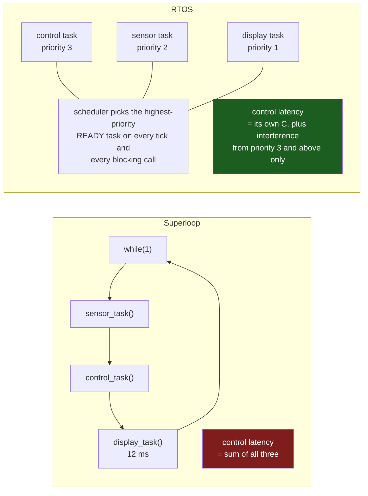

# Why an RTOS

An RTOS does not make anything faster. It runs the same instructions on the same core at the same clock, and it adds work — a tick interrupt, a scheduler, a context switch — so a system that adopts one gets strictly *less* CPU time for its application. Anybody selling a kernel on performance is selling the wrong thing.

The mental model: **an RTOS buys you the ability to block.** In a superloop, waiting is something the whole program does; there is one stack, one program counter, and if any function stops to wait then nothing else in the system runs. A kernel gives each activity its own stack and its own program counter, so "wait for the sensor to be ready" becomes a statement one activity makes about itself rather than a statement about the machine. Everything else an RTOS provides — priorities, pre-emption, queues, mutexes — follows from that one change, and so does everything it costs you.

The corollary is the honest test for whether you need one. If no part of your program ever wants to wait, or all of the waiting fits comfortably into a state machine, a kernel buys you nothing and charges you for it. [The Superloop and Cooperative Scheduling](../04-bare-metal-programming/the-superloop.md) is the architecture this page is the alternative to, and it lists the specific behavioural signals that mean you have outgrown it. This page starts where that list ends: what a kernel actually changes, and what the change costs in RAM, flash and defect classes.

:::info[Prerequisites]
[The Superloop and Cooperative Scheduling](../04-bare-metal-programming/the-superloop.md) owns the cooperative model, the non-blocking discipline and the timing-budget table this page refers back to. [Bare-Metal, RTOS, or Linux](../00-overview/bare-metal-vs-rtos-vs-linux.md) frames the three-way choice at project level. [Privilege Modes and the Two Stacks](../02-processor-architecture/privilege-modes-and-stacks.md) explains the `MSP`/`PSP` split that makes per-task stacks possible on a Cortex-M.
:::

## Symptom, mechanism, and what a kernel changes

The superloop page names the signals; this table pairs each one with the kernel mechanism that addresses it, and — the column people skip — what you pay for that mechanism.

| Superloop symptom | Why it happens | What an RTOS changes | What it costs you |
|---|---|---|---|
| One task's response time depends on every other task's execution time | There is one stack and one flow of control; the loop period is the sum of everything in it | Fixed-priority pre-emption: the highest-priority ready task runs, and the loop period stops being a term in its latency | Every shared variable is now a race. The loop's implicit mutual exclusion is gone |
| A long operation (flash erase, full-screen refresh) freezes unrelated features | Blocking is global | The blocking task blocks *itself*; the scheduler runs somebody else | One stack per task, sized for that task's worst case |
| A feature's timing regresses when an unrelated feature is added | Every task's cost lands in every task's latency | Interference is bounded by *higher-priority* tasks only, and is computable — see [Scheduling Theory for Firmware](../06-interrupts-timing-and-real-time/scheduling-theory.md) | You now have to do that analysis, and assign priorities deliberately |
| A sequential process (connect → authenticate → transfer → ack) has become an unreadable state machine | The flattening of a sequence into states is manual | The sequence is written as a sequence, and the stack holds "where I am" | A stack deep enough to hold it, plus the kernel objects it waits on |
| You are calling one task twice per loop to make it run more often | You have built an undocumented scheduler | The scheduler is a documented, testable component someone else maintains | 6–12 KB of flash and a tick interrupt you do not control |
| A third-party stack (TCP/IP, USB host, FAT) demands blocking calls | Those libraries assume a thread | They get one | Their stack depth is now your stack depth, and it is rarely documented |

Two rows in that table do *not* appear, and their absence is the point.

**"An interrupt is not being serviced fast enough."** A kernel does not help. On a Cortex-M every interrupt handler pre-empts every task regardless of task priority — the NVIC has never heard of the scheduler. If the deadline lives in an ISR, the answers are in [Interrupt Latency](../06-interrupts-timing-and-real-time/interrupt-latency.md) and [Priorities and Nesting](../06-interrupts-timing-and-real-time/interrupt-priorities-and-nesting.md), and adding a kernel makes the latency slightly *worse* because the kernel's own critical sections join yours.

**"We are running out of CPU."** A kernel does not create CPU time. If total utilisation exceeds 100% the set is unschedulable under any policy, and the only remedies are less work, more clock, or hardware offload.

## What it costs, in numbers you can check

The three costs are RAM, flash, and a class of defect that did not previously exist. The third is the expensive one.

**RAM** is the cost that surprises people, because it scales with task count rather than code size. Per task, on a Cortex-M4F under FreeRTOS:

| Item | Rough size | Notes |
|---|---|---|
| Task control block (`tskTCB`) | ~ 60–100 bytes | Depends on `configMAX_TASK_NAME_LEN`, `configUSE_TRACE_FACILITY`, `configUSE_MUTEXES` and the notification array. Read `sizeof(StaticTask_t)` on your build — it is the only figure that is true |
| Task stack | **the whole problem** | Must hold the task's own worst-case depth *plus* the context the switch pushes onto it. See [Stacks and Heaps in an RTOS](./stacks-and-heaps-in-an-rtos.md) |
| Each queue, semaphore, mutex, event group | tens of bytes plus its storage | A queue also holds `length × item_size` bytes of copy space |

Five tasks with 512-byte stacks is 2.5 KB before a single kernel object, on a part with 128 KB of SRAM. That is affordable here and is not affordable on a part with 8 KB, which is most of why very small parts stay bare-metal.

**Flash** is the cheapest of the three. FreeRTOS's own documentation puts the kernel binary in the region of a few kilobytes for a typical configuration, and the figure moves with the features you enable (`configUSE_TIMERS`, `configUSE_TRACE_FACILITY`, `configGENERATE_RUN_TIME_STATS`). The honest number is the delta in your own `.text` between a build with the kernel and one without — see [ELF, Map Files and Size](../03-toolchain-and-build/elf-map-files-and-size.md).

**The defect class** is the real bill. The superloop gave you mutual exclusion for free: two functions in the same loop cannot interleave, so a global updated in one is safe to read in the other. Pre-emption removes that guarantee everywhere at once. Every global that two tasks touch is now a potential race, and the general theory of what that means — critical sections, mutual exclusion, deadlock — is owned by [Concurrency and Synchronization](../../computer-science/operating-systems/concurrency-and-synchronization.md). The Cortex-M mechanics of protecting one are in [Critical Sections and Atomicity](../04-bare-metal-programming/critical-sections-and-atomicity.md), which is as true under a kernel as without one.

## The shape of the change

The same program, before and after. Nothing about the work changed; what changed is who decides when it happens.

The display task still takes 12 ms. The difference is that those 12 ms are now interruptible at any instruction, so the control task's worst case no longer contains them. That single property is what you are buying, and it is why the decision is a *timing* decision rather than a code-tidiness one.

## What "real-time" adds to "operating system"

Both words are doing work, and the first is a stronger claim than most projects need. [Real-Time Definitions](../06-interrupts-timing-and-real-time/real-time-definitions.md) owns the hard/firm/soft distinction; what matters here is the property a kernel has to provide to be usable in a timing argument at all:

- **Bounded, documented worst-case timings for its own operations.** Taking a semaphore, posting to a queue, and switching context must have a worst case you can write into a budget. A kernel whose scheduler walks a list of unknown length does not qualify.
- **Strict priority order with no fairness heuristics.** A general-purpose scheduler will boost a starved low-priority task to keep the system responsive. A real-time scheduler must not: if the low-priority task is starved, that is the design telling you something, and hiding it makes the system unanalysable. This is the sharpest difference from the policies in [Scheduling](../../computer-science/operating-systems/scheduling.md), which are largely about throughput and fairness.
- **A bounded answer to priority inversion.** Priority inheritance on mutexes, or a ceiling protocol, so that a low-priority task holding a lock cannot delay a high-priority task indefinitely.

"Deterministic" is the word vendors use and it is worth translating: it means the worst case is bounded and stated, not that every operation takes the same time. A kernel that is O(1) in the number of tasks is deterministic; so is one that is O(n) with a documented and small n.

:::warning[The migration that broke a subsystem nobody edited]
The characteristic first-RTOS bug is not in the RTOS. It is in code that was correct for years and stopped being correct the moment it could be pre-empted.

You move a superloop to FreeRTOS the sensible way — one task per existing loop function, same code, same globals. The build works, the LEDs blink, and a week later the logged sensor values contain occasional impossible readings: a value from one sample paired with a timestamp from another, or a 32-bit reading that is half old and half new.

The mechanism is that `sensor_task` writes a two-word structure and `log_task` reads it, and in the superloop those two never interleaved because the loop ran them one after the other. Under the kernel, `log_task` at a higher priority can be made ready by a tick in the middle of `sensor_task`'s two stores. Nothing in the diff touched either function. The sharing was always there; the *protection* was an accident of the architecture, and the migration removed it everywhere in one commit without changing a line of the code that depended on it.

How to recognise it: the corruption is always a **partial update** — a struct whose fields are individually valid but mutually inconsistent, a `uint64_t` counter that jumps backwards by exactly 2³², a pointer and a length that do not match. It correlates with load and with priority changes, not with the subsystem that reports it. A single-stepped debugger will never show it, because single-stepping serialises the very interleaving that causes it.

The discipline that prevents it: before the migration, list every file-scope variable and every `static` in the codebase and decide, for each one, which task owns it. Anything with more than one owner needs a mutex, a queue, or a critical section — and the ones that turn out to have no owner at all are usually the bugs you already had.
:::

## Migrating without breaking everything at once

The warning above describes the failure of the obvious approach — one task per loop function, all at once. The approach that works treats the migration as several small changes, each of which leaves a testable system:

1. **Fix the ownership first, while you still have a superloop.** List every file-scope and `static` variable and assign it to exactly one loop function. Anything with two owners gets a getter/setter pair or moves into a ring buffer *now*, under the architecture where it is still safe. This is the step that prevents the partial-update bug, and it can be done and shipped before the kernel exists.
2. **Introduce the kernel with one task.** `vTaskStartScheduler()` with a single task whose body is the existing superloop, unchanged. The scheduler runs, the tick runs, nothing is concurrent yet, and you have proved the port, the linker script, the stack sizing for `MSP` and the tooling.
3. **Split off the leaf that blocks.** Pick the one function whose blocking hurt most — the display refresh, the flash write — and make it a task. Now there are exactly two tasks and exactly one interface between them, which is small enough to reason about completely.
4. **Convert the ISR-to-loop handovers to queues.** The split-handler ring buffers from [Deferred Work](../06-interrupts-timing-and-real-time/deferred-work.md) become queues with `xQueueSendFromISR`, and the consuming task blocks on the queue instead of polling. This is where the kernel starts paying for itself: the polling disappears and the core starts idling.
5. **Only then, assign real priorities**, using the analysis in [Scheduling Theory for Firmware](../06-interrupts-timing-and-real-time/scheduling-theory.md). Leaving everything at one priority until this point is deliberate — it keeps the system cooperative, so any bug you meet in steps 2–4 is a bug in your restructuring rather than a race.

The property that makes this work is that steps 1 and 4 are improvements to the superloop in their own right. If the migration is cancelled halfway, you are left with better bare-metal firmware rather than a half-converted mess.

## When the answer is still "no"

Worth stating plainly, because the pressure runs the other way. A superloop with a written timing budget is easier to reason about, easier to certify, and easier to hand over than the same product with a kernel underneath it. Reasons that are *not* sufficient on their own:

- **Task count.** Twenty non-blocking state machines in a table is a fine architecture.
- **"We need a millisecond tick."** SysTick provides one without a kernel — see [SysTick and the Core Peripherals](../02-processor-architecture/systick-and-core-peripherals.md).
- **"It feels more professional."** A great deal of shipped, certified, long-lived firmware is a superloop.
- **"We might need it later."** Adding a kernel later is a mechanical change if the code was written non-blocking. Adding one now costs the defect class immediately.

The sufficient reasons are the first, third and fourth rows of the table above: a deadline that the loop period cannot meet, a timing regression you cannot bound, and a sequential process that has outgrown being flattened by hand.

## See also

- [The Superloop and Cooperative Scheduling](../04-bare-metal-programming/the-superloop.md) — the architecture this page is the alternative to, and the behavioural signals that you have outgrown it.
- [Tasks and Scheduling](./tasks-and-scheduling.md) — the model you get once you say yes: task states, ready lists, the tick, and the idle task.
- [The RTOS Landscape](./the-rtos-landscape.md) — which kernel, on licence, footprint, certification pedigree and ecosystem.
- [Scheduling Theory for Firmware](../06-interrupts-timing-and-real-time/scheduling-theory.md) — the analysis that turns "it has priorities" into "it meets its deadlines".
- [Bare-Metal, RTOS, or Linux](../00-overview/bare-metal-vs-rtos-vs-linux.md) — the three-way version of this decision, including where a full OS becomes the right answer.

## References

- Richard Barry and the FreeRTOS team — [***Mastering the FreeRTOS Real Time Kernel — a Hands-On Tutorial Guide***](https://www.freertos.org/Documentation/02-Kernel/07-Books-and-manual/01-RTOS_book) (free PDF from freertos.org). Chapter 1 makes the "multitasking versus a superloop" argument in the kernel author's own words, and chapter 3 is the task-model reference the rest of this folder builds on. The best single free source for everything in folder 07. (Documentation checked 2026-08-26.)
- Amazon Web Services — [**FreeRTOS: RTOS Fundamentals**](https://www.freertos.org/Documentation/01-FreeRTOS-quick-start/01-Beginners-guide/02-Kernel-features). The kernel's own statement of what it provides and what it costs, including the memory-footprint discussion and the list of features that are individually compile-time selectable. (Documentation checked 2026-08-26.)
- Elecia White — [***Making Embedded Systems***](https://www.oreilly.com/library/view/making-embedded-systems/9781098151539/), 2nd edition (O'Reilly, 2024). Chapter 5, "Task Management", covers the superloop-to-kernel transition as an architectural decision rather than a technology one, and is unusually honest about the cases where the kernel is the wrong answer.
- Jean J. Labrosse — [***µC/OS-III: The Real-Time Kernel***](https://www.silabs.com/documents/public/books/uCOS-III-STM32F107.pdf) (Micrium/Silicon Labs, free PDF). Chapters 1–3 are a kernel author's account of why the primitives exist, written against a different kernel, which makes it a good cross-check that the concepts here are not FreeRTOS-specific.
- Philip Koopman — [**"Better Embedded System Software"** course materials](https://users.ece.cmu.edu/~koopman/lectures/index.html), Carnegie Mellon. The lectures on real-time scheduling and on concurrency defects catalogue exactly the defect class this page warns about, with field data on how often each shows up in reviewed industrial firmware.
