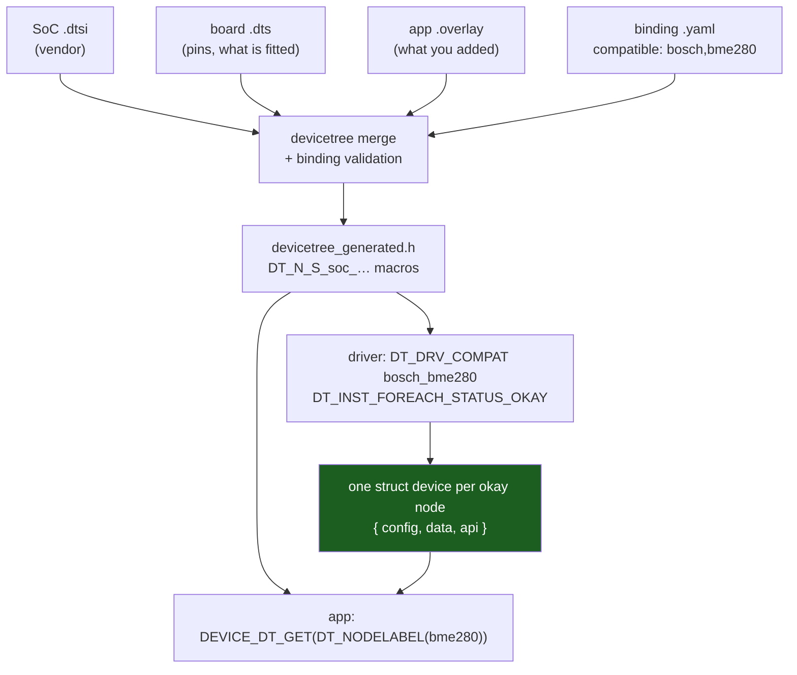

# Zephyr in Practice

Everything up to here has treated the RTOS as a library. FreeRTOS is a handful of `.c` files you add to a project you already own: you keep your linker script, your startup code, your CubeMX-generated `HAL_Init()`, your `main()`. The kernel schedules; you do everything else. Swapping FreeRTOS for ThreadX would change the function names and almost nothing structural.

Zephyr is not that, and treating it as that is how the first month goes badly. Zephyr is a build system, a hardware description language, a configuration system, a driver framework, a workspace manager, and — somewhere inside all of it — a kernel that occupies a fraction of the mental space the rest does. The claim it makes is a strong one: **the hardware is data, not code.** Which pins, which buses, which chips are on the board, at what addresses and speeds, is described in devicetree and consumed by the build. Which software gets compiled in is decided by Kconfig. Which repositories make up the source tree is decided by `west`. Your application is what is left over.

The payoff is that a well-written Zephyr driver runs on any board whose devicetree says the chip is present, and porting an application to a new board can genuinely be a `-b` flag. The price is that three declarative systems sit between your `main()` and the register, and when something does not work, the question "why is this device NULL?" is answered in a generated header rather than in your source.

:::info[Prerequisites]
[The RTOS Landscape](./the-rtos-landscape.md) placed Zephyr among the alternatives and explained when its ecosystem is worth its weight; this page is what using it actually feels like. [Tasks and Scheduling](./tasks-and-scheduling.md) owns the fixed-priority pre-emptive model that Zephyr shares with FreeRTOS — the concepts below are not re-derived, only the differences. [Build Systems and Vendor Tools](../03-toolchain-and-build/build-systems-and-vendor-tools.md) and [CMake for Embedded](../03-toolchain-and-build/cmake-for-embedded.md) cover the CMake underneath `west build`.
:::

## The same thread, twice

Start with the part that is nearly identical, because it isolates everything that is not.

<Tabs>
<TabItem value="freertos" label="FreeRTOS" default>

```c
#include "FreeRTOS.h"
#include "task.h"

#define SENSOR_STACK_WORDS  256          /* WORDS → 1024 bytes */
#define SENSOR_PRIORITY     3            /* bigger = more urgent, 0..configMAX_PRIORITIES-1 */

static void sensor_task(void *arg)
{
    TickType_t last = xTaskGetTickCount();
    (void)arg;

    for (;;) {
        sample_and_publish();
        vTaskDelayUntil(&last, pdMS_TO_TICKS(10));
    }
}

int main(void)
{
    HAL_Init();
    SystemClock_Config();
    MX_I2C1_Init();                      /* you wrote/generated this */

    xTaskCreate(sensor_task, "sensor", SENSOR_STACK_WORDS,
                NULL, SENSOR_PRIORITY, NULL);

    vTaskStartScheduler();               /* never returns */
    for (;;) { }
}
```

</TabItem>
<TabItem value="zephyr" label="Zephyr">

```c
#include <zephyr/kernel.h>
#include <zephyr/device.h>
#include <zephyr/drivers/sensor.h>

#define SENSOR_STACK_SIZE   1024         /* BYTES */
#define SENSOR_PRIORITY     5            /* smaller = more urgent; negative = cooperative */

static void sensor_thread(void *p1, void *p2, void *p3)
{
    const struct device *const bme = DEVICE_DT_GET(DT_NODELABEL(bme280));

    ARG_UNUSED(p1); ARG_UNUSED(p2); ARG_UNUSED(p3);

    if (!device_is_ready(bme)) {
        return;                          /* exists in the image, failed to initialise */
    }

    for (;;) {
        sensor_sample_fetch(bme);
        k_sleep(K_MSEC(10));
    }
}

K_THREAD_DEFINE(sensor_tid, SENSOR_STACK_SIZE, sensor_thread,
                NULL, NULL, NULL, SENSOR_PRIORITY, 0, 0);

/* There is no main() here at all — and if you write one, it is just
   another thread. The kernel and every driver are already running
   before it is entered. */
```

</TabItem>
</Tabs>

Six differences, in rising order of how much they change your thinking:

1. **Stack size is bytes, not words.** `usStackDepth` in FreeRTOS is a word count ([Stacks and Heaps in an RTOS](./stacks-and-heaps-in-an-rtos.md) has the trap); `K_THREAD_STACK_DEFINE` and `K_THREAD_DEFINE` take bytes. Porting a size across without converting gives you a quarter of the stack you meant, or four times.
2. **Priority runs the other way.** Zephyr's preemptible priorities are `0` to `CONFIG_NUM_PREEMPT_PRIORITIES - 1` and **numerically lower is more urgent** — the same direction as the NVIC, and the opposite of FreeRTOS. Negative values are *cooperative* threads, which are never pre-empted by another thread and yield explicitly. There is no equivalent class in FreeRTOS.
3. **`K_THREAD_DEFINE` is a static declaration.** It places the stack, the `struct k_thread`, and an initialisation record in linker sections; the thread exists before any of your code runs. `k_thread_create(&tcb, stack, K_THREAD_STACK_SIZEOF(stack), entry, NULL, NULL, NULL, prio, 0, K_NO_WAIT)` is the runtime form when you genuinely need one, and it still requires a stack declared with `K_THREAD_STACK_DEFINE` — stacks have alignment and MPU-region requirements that a plain array does not satisfy.
4. **Nothing starts the scheduler.** There is no `vTaskStartScheduler()`. The kernel boots, runs every device's initialisation at its declared level and priority, and then runs `main` as an ordinary thread. Returning from `main()` is legal and unremarkable.
5. **The entry point takes three `void *`, not one.** A small thing that breaks every copied signature.
6. **The device came from the devicetree, not from an init call you wrote.** `MX_I2C1_Init()` has no counterpart. That is the rest of this page.

The synchronisation objects map across almost one-for-one — `k_sem`, `k_mutex` (with priority inheritance), `k_msgq`, `k_fifo`, `k_event`, and each with a `K_*_DEFINE` static form such as `K_MSGQ_DEFINE(q, sizeof(item), 10, 1)`. The semantics are the ones [Semaphores and Mutexes](./synchronization-primitives.md) and [Queues and Message Passing](./queues-and-message-passing.md) already establish; only the spelling differs, and the API reference is the right place to look them up rather than a page like this one.

## Devicetree: the hardware as data

A devicetree is a tree of **nodes**, each with **properties**. Zephyr's build system takes the SoC's `.dtsi`, the board's `.dts`, and any application `.overlay` files, merges them, and generates a header full of `DT_*` macros. Nothing is parsed at runtime; there is no blob in flash. It is a preprocessing step whose output is `#define`s.

```text
/* boards/nucleo_f411re.overlay — an application overlay, merged on top of the board */
&i2c1 {
    status = "okay";
    clock-frequency = <I2C_BITRATE_FAST>;

    bme280: bme280@76 {
        compatible = "bosch,bme280";
        reg = <0x76>;
        status = "okay";
    };
};
```

Four pieces carry all the meaning:

- **`compatible`** names the *kind* of hardware. It is the join key: a driver declares which compatible strings it handles, and the build instantiates that driver once for every matching node whose `status` is `"okay"`.
- **`status`** is the on/off switch. A node that is not `"okay"` is not built. This is how one board `.dts` can describe every peripheral the SoC has while a given application compiles in three of them.
- **`bme280:`** before the node name is a **node label** — a build-time alias. `DT_NODELABEL(bme280)` resolves to it, which is the readable alternative to `DT_PATH(soc, i2c_40005400, bme280_76)`.
- **`reg`** and the rest are properties, and which ones are legal, required, and what type each has is fixed by a **binding**.

A binding is a YAML file, matched to nodes by its own `compatible` field, that acts as the schema:

```text
# dts/bindings/sensor/bosch,bme280-i2c.yaml
description: Bosch BME280 humidity/pressure/temperature sensor on I2C
compatible: "bosch,bme280"
include: [sensor-device.yaml, i2c-device.yaml]
properties:
  int-gpios:
    type: phandle-array
    description: DRDY interrupt line, if wired
```

Without a binding, the properties on the node generate nothing and the build tells you so. **Binding a driver to a node** is therefore three linked declarations — the binding's `compatible`, the node's `compatible`, and the driver's `DT_DRV_COMPAT` — that must agree exactly, with the comma and hyphen turned into underscores in the C form.



## The driver model: `struct device` and its vtable

A Zephyr driver is a `struct device` per instance, and that structure has exactly three interesting members: `config` (const, in flash — the addresses, speeds and GPIO specs pulled out of the devicetree), `data` (RAM — runtime state), and `api`, a pointer to a **const struct of function pointers**. The api struct is the subsystem's interface: every sensor driver fills in a `struct sensor_driver_api`, every GPIO driver a `struct gpio_driver_api`. `sensor_sample_fetch(dev)` is a static inline that dereferences `dev->api` and calls through it.

That indirection is what makes the subsystems generic, and it is a real cost — one extra load and an indirect branch per call, which matters in a bit-banged inner loop and does not matter anywhere else.

```c
#define DT_DRV_COMPAT bosch_bme280       /* the join key, underscored */

static const struct sensor_driver_api bme280_api = {
    .sample_fetch = bme280_sample_fetch,
    .channel_get  = bme280_channel_get,
};

#define BME280_DEFINE(inst)                                             \
    static struct bme280_data bme280_data_##inst;                       \
    static const struct bme280_config bme280_config_##inst = {          \
        .bus = I2C_DT_SPEC_INST_GET(inst),   /* bus + address, from DT */\
    };                                                                  \
    DEVICE_DT_INST_DEFINE(inst, bme280_init, NULL,                      \
                          &bme280_data_##inst, &bme280_config_##inst,   \
                          POST_KERNEL, CONFIG_SENSOR_INIT_PRIORITY,     \
                          &bme280_api);

/* One instantiation per devicetree node with a matching compatible
   and status = "okay". Zero nodes → zero code, no #ifdef anywhere. */
DT_INST_FOREACH_STATUS_OKAY(BME280_DEFINE)
```

On the application side, `DEVICE_DT_GET(DT_NODELABEL(bme280))` resolves **at build time** to the address of that instance. There is no lookup, no string comparison, no runtime registry — it is a link-time constant, and if the node does not exist or no driver claimed it, you get a link error rather than a `NULL` at runtime.

`device_is_ready()` is still mandatory, and the distinction is the one people skip: `DEVICE_DT_GET` proves the device *exists in the image*. `device_is_ready()` reports whether its init function **succeeded** — whether the chip answered on the bus, whether the clock was there. A sensor that is unplugged gives you a perfectly valid non-NULL pointer to a device that is not ready.

## Kconfig: the software as configuration

Kconfig is the Linux kernel's configuration system, unchanged in spirit. Every subsystem declares symbols with types, defaults, dependencies and help text; the build resolves them into `build/zephyr/.config` and a generated `autoconf.h` full of `CONFIG_*` macros. Source files are compiled or not by `CMakeLists.txt` conditions on those symbols, so disabling a feature removes its code rather than compiling it out with `#ifdef` at every call site.

The layering is where the surprises live. Later sources win:

| Order | Source | Typical content |
|---|---|---|
| 1 | `Kconfig` `default` statements | the subsystem's own opinion |
| 2 | `<board>_defconfig` | what this board must have on to boot at all |
| 3 | `prj.conf` (or `-DCONF_FILE=…`) | your application's choices |
| 4 | `boards/<board>.conf` in your app | per-board deltas without forking `prj.conf` |
| 5 | `-DEXTRA_CONF_FILE=overlay-foo.conf` | a feature you switch on for one build |
| 6 | `-DCONFIG_FOO=y` on the command line | one-off experiments |

```text
# prj.conf
CONFIG_I2C=y
CONFIG_SENSOR=y
CONFIG_BME280=y
CONFIG_LOG=y
CONFIG_LOG_DEFAULT_LEVEL=3
CONFIG_MAIN_STACK_SIZE=2048
CONFIG_NUM_PREEMPT_PRIORITIES=16
```

The rule that saves the most time: **a symbol whose dependencies are unmet cannot be set, and setting it anyway is not an error.** `CONFIG_BME280=y` with `CONFIG_I2C` left off resolves to `n`. Recent Zephyr prints a warning during CMake configure; older versions and busy build logs swallow it. `build/zephyr/.config` is the only authority on what your build actually has, and `west build -t menuconfig` is the way to find out *why* a symbol refuses to turn on — it shows the unmet dependency directly.

## `west`: the workspace

`west` is not a build tool. It is a multi-repository manager that also happens to wrap CMake. A Zephyr **workspace** is a directory containing a manifest repository, the `zephyr` repository itself, and a `modules/` tree of everything else — HALs, Mbed TLS, LVGL, the CMSIS headers — each pinned to an exact revision by `west.yml`.

```bash
west init -m https://github.com/example/my-fw --mr main my-workspace
cd my-workspace
west update            # clone/checkout every project at the manifest revision

west build -p auto -b nucleo_f411re app
west flash
west debug             # launches GDB against the right runner for the board

# One-off variations, without editing anything:
west build -b nucleo_f411re app -- \
    -DEXTRA_CONF_FILE=overlay-debug.conf \
    -DDTC_OVERLAY_FILE=boards/bench-rig.overlay
```

Two consequences worth internalising. **Your application is not inside the Zephyr tree** — it is a sibling directory with its own `CMakeLists.txt`, `prj.conf` and `boards/`, and `west.yml` is what makes the pairing reproducible. Pinning revisions there is the whole mechanism by which a Zephyr build is repeatable a year later; a `west update` on a floating branch is not. And **`-p auto` is not optional discipline**: changing a Kconfig fragment or a devicetree overlay often needs a fresh CMake configure, and a stale build directory produces a binary that does not match the files you just edited, silently.

## What porting to a new board actually costs

The honest answer splits sharply on one question.

**If the SoC is already supported**, a board port is a directory of description — no driver code. Under Zephyr's hardware model v2 it is `boards/<vendor>/<board>/` containing `board.yml` (the board and its SoC qualifiers), `<board>.dts` (which SoC, which pins, what is fitted, pinctrl assignments), `<board>_defconfig` (the minimum Kconfig to boot), `Kconfig.<board>`, and `board.cmake` (which flash/debug runner to use). Everything you write is a statement about wiring. A day for something close to an existing board, a few days for something unusual.

**If the SoC is new**, you are writing drivers, and the cost is measured in weeks or months: an entry under `soc/`, a devicetree `.dtsi` describing every peripheral instance, pinctrl definitions, and a driver per subsystem you need, each with its own binding. This is the case where Zephyr's structure is a tax you pay before you get any of its benefits, and it is the honest counterweight to the "just add `-b`" story.

The middle case is the common one and is worth naming separately: **the board exists upstream but your hardware differs from it** — a different sensor, an extra UART, a pin moved. That needs no board port at all. An `.overlay` in your application's `boards/` directory, named after the board, is merged automatically, and it is the mechanism the whole system is designed around. Reach for a board port only when the base board genuinely is not yours.

:::warning[The undefined reference to a number, and the Kconfig symbol that quietly stayed off]
Two failures that are specific to this model and mean nothing to a FreeRTOS reflex.

**`undefined reference to '__device_dts_ord_57'`.** The link fails, naming a symbol you did not write and a number that appears nowhere in your source. It means `DEVICE_DT_GET` resolved a devicetree node — so the node exists — but **no driver instantiated a `struct device` for it**. There are exactly three causes and the error distinguishes none of them: the node's `status` is not `"okay"`; the node's `compatible` does not match any driver's `DT_DRV_COMPAT`, usually a typo or a vendor prefix that differs from the binding's; or the driver's Kconfig symbol is off, so the file was never compiled. The instinct is to search the codebase for `57`, which finds nothing because the ordinal is assigned by the generator. The fix is to read `build/zephyr/zephyr.dts` — the merged, post-overlay devicetree, which is the only file that reflects what the build actually believes — find the node, check its `status` and `compatible`, and then check `build/zephyr/.config` for the driver's symbol. Three minutes with those two generated files, versus an afternoon in the source tree.

**The fragment that was never read.** `CONFIG_LOG_BACKEND_UART=y` added to `prj.conf`, `west build` re-run, no logs. The build did not fail and nothing warned loudly. Two mechanisms produce it. Either the symbol's dependencies are unmet, so Kconfig resolved it to `n` while accepting the assignment — the `.config` will show `# CONFIG_LOG_BACKEND_UART is not set`, which is the tell. Or the file you edited is not in the build at all: an `EXTRA_CONF_FILE` from a previous invocation is cached in `build/CMakeCache.txt` and a later `west build` without the flag can keep using the cached set, while a `boards/<board>.conf` is picked up only if its name matches the board *exactly*, qualifiers included. Both present identically as "my configuration is being ignored", which sends people to re-flash and re-cable. Never debug configuration from your source files: `grep` the symbol in `build/zephyr/.config`, and if it is absent or `not set`, the problem is upstream of your code. `west build -p always` eliminates the caching half of it at the cost of a full rebuild.
:::

## See also

- [The RTOS Landscape](./the-rtos-landscape.md) — where Zephyr sits against FreeRTOS, ThreadX and the rest, and the licensing and ecosystem arguments for choosing it.
- [Tasks and Scheduling](./tasks-and-scheduling.md) — the fixed-priority pre-emptive model both kernels implement, and the FreeRTOS priority direction this page inverts.
- [Writing a Portable Driver](../05-peripherals-and-drivers/writing-a-portable-driver.md) — the hand-rolled version of the config/data/api split Zephyr's `struct device` formalises.
- [Build Systems and Vendor Tools](../03-toolchain-and-build/build-systems-and-vendor-tools.md) — what `west build` is wrapping, and how it compares to the vendor IDE flow.
- [Stacks and Heaps in an RTOS](./stacks-and-heaps-in-an-rtos.md) — stack sizing, and the words-versus-bytes difference that makes a ported thread definition wrong by 4×.

## References

- Zephyr Project — [**Devicetree Guide**](https://docs.zephyrproject.org/latest/build/dts/index.html), in particular the *HOWTOs* and *Bindings* pages. Verified against these for this page: `DEVICE_DT_GET(DT_NODELABEL(label))` as the build-time way to obtain a `struct device *`, with the accompanying `device_is_ready()` check and `-ENODEV` return shown in the documentation's own example; the skeletal binding file shape (`description:`, `compatible:`, `include:`); and the statement that a devicetree-aware driver creates a `struct device` for each node with `status = "okay"` matching its compatible. (Documentation checked 2026-08-26.)
- Zephyr Project — [**Device Driver Model**](https://docs.zephyrproject.org/latest/kernel/drivers/index.html) and [**Kernel Services: Threads**](https://docs.zephyrproject.org/latest/kernel/services/threads/index.html). The `struct device` `config`/`data`/`api` split, `DEVICE_DT_INST_DEFINE` with its init level and priority, and `DT_INST_FOREACH_STATUS_OKAY`; and the thread APIs used above — `K_THREAD_DEFINE(tid, stack_size, entry, p1, p2, p3, prio, options, delay)`, `K_THREAD_STACK_DEFINE`, `k_thread_create()` with `K_THREAD_STACK_SIZEOF()`, and the cooperative (negative) versus preemptible priority ranges. (Documentation checked 2026-08-26.)
- Zephyr Project — [**West (Zephyr's meta-tool)**](https://docs.zephyrproject.org/latest/develop/west/index.html) — *Basics*, *Manifests*, and *Building, Flashing and Debugging*. `west init -m <url>` creating the workspace and cloning the manifest repository, `west update` cloning the projects it lists, `west build -b <board>` with `-p`, `west flash`, `west debug`, `west config build.board`, and the `-DEXTRA_CONF_FILE=` / `-DCONF_FILE=` / `-DDTC_OVERLAY_FILE=` build arguments used above. (Documentation checked 2026-08-26.)
- Zephyr Project — [**Kconfig: Setting Configuration Values**](https://docs.zephyrproject.org/latest/build/kconfig/setting.html) and [**Board Porting Guide**](https://docs.zephyrproject.org/latest/hardware/porting/board_porting.html). The precedence order reproduced in the table, the role of `build/zephyr/.config` as the resolved result, `west build -t menuconfig`; and the hardware-model-v2 board directory contents (`board.yml`, `<board>.dts`, `<board>_defconfig`, `Kconfig.<board>`, `board.cmake`) that the porting-cost section is based on. (Documentation checked 2026-08-26.)
- Zephyr Project — [**Zephyr API documentation**](https://docs.zephyrproject.org/latest/doxygen/html/index.html). The reference for the kernel objects named in passing above (`k_sem`, `k_mutex`, `k_msgq`, `k_fifo`, `k_event`, `k_sleep` and the `K_TIMEOUT_*` forms) rather than trusting a FreeRTOS-shaped assumption about their semantics.
