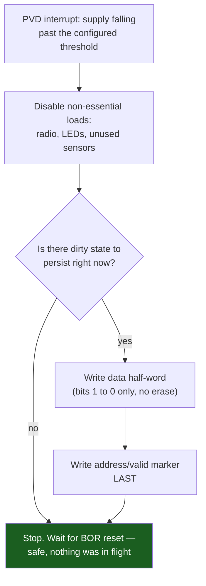

# Brownout and Power-Loss Safety

A supply does not fail like a light switch. Pull the plug, drop a battery connector, or let a coin cell finally reach the end of its discharge curve, and `VDD` does not fall to zero — it decays, over a span set by whatever capacitance is still holding charge on the rail and whatever the circuit is still drawing from it. That decay is the entire subject of this page, because it is the only thing standing between "the supply is gone" and "the core has actually stopped running," and the honest answer to "how long do I have" is: a lot less than most designs assume, and the amount is calculable rather than a matter of taste.

The instinct this page argues against is the tidy one — detect the brownout, run a graceful shutdown routine, close everything down in order, then reset. That instinct assumes a shutdown routine has *time*, and the arithmetic later on this page works out, for a representative board, roughly how much it actually gets. The number is small enough that "graceful shutdown" is the wrong design target. The right target is to make every persistent write already safe to be interrupted at any point, so that whichever moment power actually fails, what is left on flash afterward is unambiguously one of two states — the value before the update, or the value after it — and never a mixture of both.

:::info[Prerequisites]
[Internal Flash and EEPROM Emulation](../05-peripherals-and-drivers/flash-and-eeprom-emulation.md) owns the append-only, power-loss-safe record format this page's design consequence points at — the "bits only go 1→0" primitive and the AN3969 two-page scheme are established there and not repeated here. [Watchdogs](../05-peripherals-and-drivers/watchdogs.md) owns the IWDG behaviour this page's warning depends on.
:::

## Brownout detection: what the hardware watches

The STM32F411's power controller includes a **brownout reset (BOR)** circuit that monitors `VDD` continuously and forces a reset if it falls below a configured threshold — separate from and in addition to the power-on reset (POR) that holds the part in reset from a cold start. BOR's threshold is one of the option bytes (`BOR_LEV`), set at programming time rather than at runtime, and it offers a small number of discrete levels rather than an arbitrary voltage:

| `BOR_LEV` | Level | Approximate threshold range |
|---|---|---|
| `11` | BOR off | POR/PDR only — reset holds until roughly 1.8–2.1 V |
| `10` | Level 1 (`VBOR1`) | roughly 2.1–2.4 V |
| `01` | Level 2 (`VBOR2`) | roughly 2.4–2.7 V |
| `00` | Level 3 (`VBOR3`), the default in most tool configurations | roughly 2.7–3.6 V |

:::note[These ranges are corroborated, not independently re-verified this session]
RM0383's power-controller chapter is the authoritative source for the exact typical and hysteresis figures within each level, and the STM32F411 datasheet's electrical characteristics carry the precise `VBOR` numbers. Direct fetches of both PDFs from st.com timed out while writing this page, consistent with the same access problem noted on the other pages in this folder — the ranges above were corroborated against secondary sources describing the option-byte table rather than read from the primary document directly. Confirm the exact figures against RM0383's brownout reset section before depending on them in a real design; treat the table above as indicative of scale, not as a citation-quality number.
:::

Choosing a level is a trade-off in its own right: a higher level (`VBOR3`) resets the part earlier — while there is still more voltage headroom left — which sounds strictly safer, but it also means normal operation on a supply that sags briefly (a motor starting on the same battery, a radio transmit burst pulling the rail down for a few milliseconds) can trip a reset that a lower level would have ridden through. The level has to be chosen against the same supply-sag behaviour the rest of a power budget already has to account for, not just against "how early do I want a warning."

A second peripheral, the **programmable voltage detector (PVD)**, complements BOR rather than duplicating it: its threshold is set at runtime (`PWR_CR.PLS`, RM0383 PWR chapter) rather than by option byte, and crossing it raises an interrupt (`EXTI` line 16, `PWR_CSR.PVDO`) instead of forcing a reset. Configured above the chosen BOR level, the PVD is what actually gives firmware a *chance* to act: BOR alone gives zero warning — the reset simply happens — while a PVD interrupt fires while there is still supply headroom between it and the BOR threshold, and that headroom is where the arithmetic below spends its budget.

## The capacitor-energy arithmetic

This is the calculation the rest of the page's design conclusion rests on, and it is worked explicitly, with every assumption stated, because the answer is not obvious from intuition and the reasoning has to be checkable.

**What funds the time between "the PVD fired" and "the core stops running":** nothing external — mains is gone, the battery connector is gone, whatever failed has failed — except the charge already stored on the board's own decoupling and bulk capacitance. The energy stored in a capacitor is the standard result:

```text
E = 1/2 x C x V^2
```

and the *usable* portion of that energy is not everything down to 0 V — it is the portion between the voltage at which the supply is known to be failing (the PVD/BOR threshold) and the minimum voltage at which the MCU can still execute code and write flash correctly, `V_min`. Energy stored below `V_min` exists but cannot be spent, because nothing can run to spend it.

**Assumptions, stated explicitly:**

- **Decoupling capacitance, `C ≈ 10 µF`.** This is a representative figure for a small board's combined local decoupling (typically several 100 nF ceramics at the MCU's `VDD` pins) plus one bulk capacitor in the low-µF range — not a measured value for any specific board. Read the actual schematic — [UM1724](https://www.st.com/resource/en/user_manual/um1724-stm32-nucleo64-boards-mb1136-stmicroelectronics.pdf) for the Nucleo-64, or your own board's BOM — and recompute with the real total before trusting this number for a specific design. The arithmetic scales linearly with `C`, so a board with 47 µF of bulk capacitance gets roughly 4.7× the answer below, and a board with only the MCU's own 100 nF pin decoupling gets roughly 1/100th of it.
- **`V_BOR ≈ 2.9 V`**, taken as representative of BOR Level 3 / a PVD threshold set just above it, per the corroborated-not-verified table above.
- **`V_min ≈ 1.7 V`**, the STM32F411's documented minimum `VDD` for general operation (DS10314 general operating conditions). This figure is likewise not independently re-verified against the primary PDF this session and should be confirmed against DS10314 directly.
- **Supply current while finishing the write, `I ≈ 1.6 mA`**, using the same ~100 µA/MHz Run-mode figure established in [Clock and Peripheral Gating](./clock-and-peripheral-gating.md), at 16 MHz on the HSI — deliberately not the PLL, since relying on a clock source that needs ~200 µs to relock is the wrong choice for a routine that may already be running on a collapsing supply. This is a derived figure, not a quoted datasheet current for "flash write current" specifically — DS10314 does not tabulate flash program/erase current separately from Run-mode current at the operating frequency, so the Run-mode figure at the frequency the write executes at is the defensible stand-in.
- **Average voltage during the discharge, `V_avg ≈ (V_BOR + V_min) / 2 ≈ 2.3 V`**, used to convert the assumed current into power, since the actual supply is falling throughout the interval being computed rather than holding steady.

**Stored, usable energy:**

```text
E = 1/2 x C x (V_BOR^2 - V_min^2)
  = 1/2 x 10e-6 F x (2.9^2 - 1.7^2) V^2
  = 5e-6 x (8.41 - 2.89)
  = 5e-6 x 5.52
  = 2.76e-5 J
  ≈ 28 uJ
```

**Power drawn while spending it:**

```text
P = I x V_avg = 1.6 mA x 2.3 V ≈ 3.7 mW
```

**Time that energy funds:**

```text
t = E / P = 28 uJ / 3.7 mW ≈ 7.5 ms
```

**What that buys in flash writes**, using [Internal Flash and EEPROM Emulation](../05-peripherals-and-drivers/flash-and-eeprom-emulation.md)'s own timing figures (DS10314 Table 45: word program 16 µs typical, 100 µs maximum):

```text
typical:      7.5 ms / 16 us  ≈ 470 word writes  ≈ 1.8 KB
worst case:   7.5 ms / 100 us ≈  75 word writes  ≈ 0.3 KB
```

**The order of magnitude: roughly ten milliseconds, funding on the order of a few hundred word writes — one to two kilobytes at typical timing, a few hundred bytes at worst-case timing.** That is the whole design conclusion in one number. It is not zero, and it is enough to complete a handful of small, atomic record writes of the kind [Internal Flash and EEPROM Emulation](../05-peripherals-and-drivers/flash-and-eeprom-emulation.md) already documents. It is nowhere near enough to serialise an application's full working state to flash, close a filesystem cleanly, or do anything resembling the "graceful shutdown" the opening section warned against — and this estimate is optimistic besides, because it assumes the write routine's current is the *only* load left on the rail. Any sensor, radio, or external IC still drawn from the same capacitor at the moment of failure eats directly into this budget, and none of that is accounted for above.

## The design consequence: journal small records, do not try to save everything

The arithmetic above is the argument for the append-only record format [Internal Flash and EEPROM Emulation](../05-peripherals-and-drivers/flash-and-eeprom-emulation.md) already describes, not a new one: with roughly a kilobyte of writable budget and no guarantee of even that much, a design that periodically *appends* one small, self-validating record — rather than rewriting a large block on every change — is the only shape of persistence that fits inside a power-loss window this narrow. The record format's own safety property does the rest: writing the data half-word before the address/valid marker (that page's ordering, not repeated here) means a write interrupted anywhere — mid-data, mid-marker, or between the two — leaves either a complete prior record or an unambiguously incomplete new one, never a torn value silently read back as valid.



Power can fail at any node in that diagram — before `B`, between `B` and `D`, mid-write at `D`, between `D` and `E`, or after `E` — and every one of those points leaves flash in a state [Internal Flash and EEPROM Emulation](../05-peripherals-and-drivers/flash-and-eeprom-emulation.md)'s scan logic already treats as legal: either the previous record stands because the new one never completed, or the new one stands because it did. Nothing in this sequence depends on reaching node `Z`; correctness is a property of the ordering, not of finishing.

## Validating it: power-cycle test rigs

The one power-loss code path in a product is, almost by definition, the path least exercised by ordinary testing — it only runs when something is already going wrong, and it is rarely triggered on a bench where the supply is a clean, stable rail. Validating it requires deliberately manufacturing the failure, repeatedly, at every point in the write sequence: an automated rig — a programmable electronic load, a relay under script control, or a bench supply with a remote on/off input — that cuts power at a swept or randomised delay relative to a GPIO marker toggled at write entry, then, on the next boot, checks that the stored record is one of the two legal prior states and never a torn one. Run enough cycles sweeping the cut point across the full width of a write, and a design that is actually safe at every point in the diagram above proves it empirically rather than by argument; a design with an ordering bug produces a corrupted or ambiguous record within a modest number of cycles, because the vulnerable window — however narrow — eventually gets hit.

:::warning[BOR left at its default of off, and the write that verified correctly and lost retention weeks later]
`BOR_LEV` defaults to `11` — BOR off — on a part whose option bytes have never been explicitly programmed, leaving only the POR/PDR threshold around 1.8–2.1 V active. That is not automatically wrong, but it interacts badly with a fact [Internal Flash and EEPROM Emulation](../05-peripherals-and-drivers/flash-and-eeprom-emulation.md) already documents: flash programming at `PSIZE` = x32 requires `VDD ≥ 2.7 V`, and RM0383 states explicitly that a program operation started with the parallelism set wider than the supply allows "may lead to unpredicted results" — including a **verify read that returns the value just written and passes, while the cell's actual retention is compromised** and the data is gone weeks or months later. With BOR disabled, a supply sagging through 2.7 V during a brownout does not reset the part; the core keeps running, a scheduled or in-progress flash write proceeds at whatever `PSIZE` firmware left configured, verifies successfully, and the failure does not surface until a much later read — long after the brownout event that caused it, on a device that by then looks completely unrelated to a power event. The fix is two habits working together, both already recommended on the page that owns flash programming: select `PSIZE` from a measured `VDDA` rather than a compile-time constant, and set a BOR level (or a PVD threshold) above whatever voltage that `PSIZE` choice requires, so that a supply sag either forces a safe reset before an under-voltage write can start, or the write logic itself refuses to proceed rather than programming blind. The bench check that catches this before it ships takes one minute and needs no code change: read the option bytes back off the part with STM32CubeProgrammer and look at `BOR_LEV` directly — a board that has never had its option bytes programmed reads `11`, and every unit off the line reads the same, so finding it on one unit means finding it on the whole build.
:::

## See also

- [Internal Flash and EEPROM Emulation](../05-peripherals-and-drivers/flash-and-eeprom-emulation.md) — the append-only record format and the `PSIZE`/retention warning this page's design consequence and final warning both build on directly.
- [Measuring Power](./measuring-power.md) — instrumenting the actual current a shutdown routine draws, to check the assumed `I ≈ 1.6 mA` in the arithmetic above against a real board.
- [Watchdogs](../05-peripherals-and-drivers/watchdogs.md) — the IWDG interaction that can turn a PVD-triggered shutdown routine that runs too long into a reset landing mid-write, the same failure this page's arithmetic is trying to avoid by keeping the routine short.
- [Energy Budgets](./energy-budgets.md) — the same ½CV² and current-times-time reasoning applied to battery lifetime rather than a single power-loss event.

## References

- STMicroelectronics — [**RM0383**, *STM32F411xC/E advanced Arm-based 32-bit MCUs reference manual*](https://www.st.com/resource/en/reference_manual/rm0383-stm32f411xce-advanced-armbased-32bit-mcus-stmicroelectronics.pdf), consulted at Rev 4. Chapter 5 ("Power controller (PWR)") for the BOR option bytes (`BOR_LEV`), the four threshold levels, and the PVD (`PWR_CR.PLS`, `PWR_CSR.PVDO`, EXTI line 16) — the primary reference for the exact figures the corroborated table above approximates.
- STMicroelectronics — [**STM32F411xC/STM32F411xE datasheet**](https://www.st.com/resource/en/datasheet/stm32f411re.pdf) (DS10314). General operating conditions for the `VDD` minimum used as `V_min` above, and Table 45 (flash program/erase timing) and the Run-mode current table, both reused from [Internal Flash and EEPROM Emulation](../05-peripherals-and-drivers/flash-and-eeprom-emulation.md) and [Clock and Peripheral Gating](./clock-and-peripheral-gating.md) respectively for the arithmetic on this page.
- STMicroelectronics — [**UM1724**, *STM32 Nucleo-64 boards (MB1136) user manual*](https://www.st.com/resource/en/user_manual/um1724-stm32-nucleo64-boards-mb1136-stmicroelectronics.pdf). The board schematic where a Nucleo-64's actual decoupling and bulk capacitance can be read, in place of the representative 10 µF assumed above.
