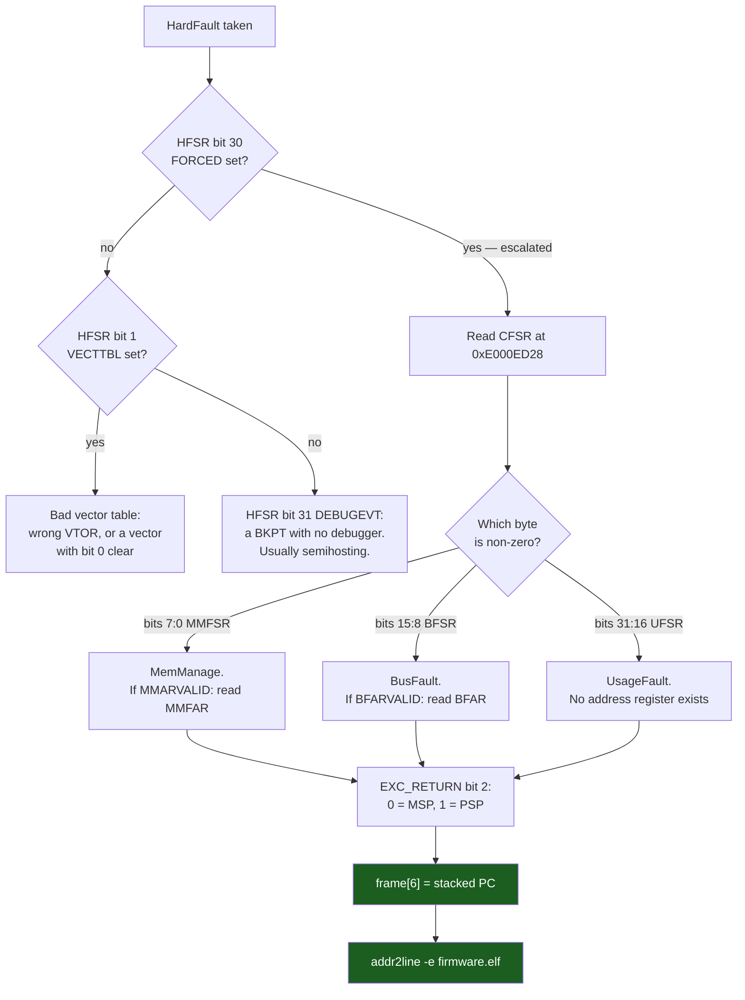

# HardFault Forensics

A HardFault is not an error message. It is the processor announcing that it has already stopped being able to run your program, and that everything it knows about why is sitting in four registers and one stack frame. Nothing is printed, nothing is logged, and the default handler in every startup file ever shipped is `b .` — an infinite loop that discards all of it.

The mental model worth carrying: **the fault is not where the handler is, and the handler already has the address of where it is.** When the exception was taken, the hardware pushed the interrupted context onto whichever stack was in use, and the seventh word of that frame is the address of the instruction that could not complete. Everything on this page is machinery for getting from "the board is dead" to that one 32-bit number and then to a line of C.

There is a second thing the hardware recorded, and it is the one people skip. The Cortex-M4 has four *configurable* faults — MemManage, BusFault, UsageFault, and the SecureFault that does not exist on this part — each with its own status bits. If their handlers are not enabled, or if a fault occurs while a same-or-higher-priority handler is already running, the fault **escalates** to HardFault. So on a default STM32 project almost every HardFault is really a UsageFault or a BusFault wearing a HardFault's exception number, and the diagnosis is a two-step: ask HardFault whether it is a stand-in, then ask the real fault what happened.

:::info[Prerequisites]
[The Register Model](../02-processor-architecture/cortex-m-register-model.md) owns `EXC_RETURN`, the exception stack frames, and the offsets this page reads from. Read the `EXC_RETURN` section there first — this page uses its results and does not re-derive them. [Exceptions and the Vector Table](../02-processor-architecture/exceptions-and-the-vector-table.md) covers where `HardFault_Handler` comes from and how the weak alias in the startup file is replaced. [Reading Disassembly](../../computer-science/assembly/reading-disassembly.md) is what you do with the faulting address once you have it.
:::

## The five-step procedure

Under pressure, in order, with no thinking required:

1. **Read `CFSR` and `HFSR`.** `CFSR` at `0xE000ED28` is three sub-registers in one word. `HFSR` at `0xE000ED2C` tells you whether the HardFault is genuine or an escalation.
2. **If the address is valid, read `MMFAR` or `BFAR`.** Valid means `MMARVALID` or `BFARVALID` is set. Without the valid bit those registers hold stale garbage from a previous fault.
3. **Work out which stack the frame is on** from `EXC_RETURN` bit 2 — `0` = `MSP`, `1` = `PSP`.
4. **Read the stacked `PC`** at offset `0x18` from that stack pointer — word 6 of the frame.
5. **Map the `PC` to a source line** with `arm-none-eabi-addr2line -e firmware.elf <pc>`, or by finding the enclosing symbol in the `.map` file.



## Step 1: `CFSR`, three registers in one word

```wavedrom title="CFSR at 0xE000ED28 — MMFSR in byte 0, BFSR in byte 1, UFSR in halfword 1" alt="Bit-field strip of the 32-bit Configurable Fault Status Register showing IACCVIOL, DACCVIOL, MUNSTKERR, MSTKERR, MLSPERR and MMARVALID in the low byte, IBUSERR, PRECISERR, IMPRECISERR, UNSTKERR, STKERR, LSPERR and BFARVALID in the second byte, and UNDEFINSTR, INVSTATE, INVPC, NOCP, UNALIGNED and DIVBYZERO in the upper halfword"
{ "reg": [
    { "bits": 1, "name": "IACCVIOL",   "type": 2 },
    { "bits": 1, "name": "DACCVIOL",   "type": 2 },
    { "bits": 1, "type": 1 },
    { "bits": 1, "name": "MUNSTKERR",  "type": 2 },
    { "bits": 1, "name": "MSTKERR",    "type": 2 },
    { "bits": 1, "name": "MLSPERR",    "type": 2 },
    { "bits": 1, "type": 1 },
    { "bits": 1, "name": "MMARVALID",  "type": 5 },
    { "bits": 1, "name": "IBUSERR",    "type": 3 },
    { "bits": 1, "name": "PRECISERR",  "type": 3 },
    { "bits": 1, "name": "IMPRECISERR","type": 3 },
    { "bits": 1, "name": "UNSTKERR",   "type": 3 },
    { "bits": 1, "name": "STKERR",     "type": 3 },
    { "bits": 1, "name": "LSPERR",     "type": 3 },
    { "bits": 1, "type": 1 },
    { "bits": 1, "name": "BFARVALID",  "type": 5 },
    { "bits": 1, "name": "UNDEFINSTR", "type": 4 },
    { "bits": 1, "name": "INVSTATE",   "type": 4 },
    { "bits": 1, "name": "INVPC",      "type": 4 },
    { "bits": 1, "name": "NOCP",       "type": 4 },
    { "bits": 4, "type": 1 },
    { "bits": 1, "name": "UNALIGNED",  "type": 4 },
    { "bits": 1, "name": "DIVBYZERO",  "type": 4 },
    { "bits": 6, "type": 1 }
  ],
  "config": { "bits": 32, "lanes": 4, "hspace": 640 }
}
```

Every field below resets to `0` and is **write-1-to-clear** — writing `CFSR = CFSR` at the end of your handler clears exactly the bits that were set, which is what you want before the next fault.

| Bits | Sub-register | Field | Reset | What it means |
|---|---|---|---|---|
| 0 | MMFSR | `IACCVIOL` | 0 | Instruction fetch from a region the MPU forbids execution in. `MMFAR` is *not* updated. |
| 1 | MMFSR | `DACCVIOL` | 0 | Data access violating an MPU region. `MMFAR` holds the address. |
| 3 | MMFSR | `MUNSTKERR` | 0 | MPU violation while *unstacking* on exception return. The original return is lost. |
| 4 | MMFSR | `MSTKERR` | 0 | MPU violation while *stacking* on exception entry — classically an MPU guard region at the bottom of a stack. |
| 5 | MMFSR | `MLSPERR` | 0 | MPU violation during floating-point lazy state preservation. |
| 7 | MMFSR | `MMARVALID` | 0 | **`MMFAR` holds a valid address.** If clear, do not read `MMFAR`. |
| 8 | BFSR | `IBUSERR` | 0 | Bus error on an instruction *prefetch*. Flagged only when the instruction is actually executed. |
| 9 | BFSR | `PRECISERR` | 0 | Precise data bus error. The stacked `PC` is the faulting instruction. |
| 10 | BFSR | `IMPRECISERR` | 0 | Imprecise data bus error — a buffered write failed later. **The stacked `PC` is not the culprit.** |
| 11 | BFSR | `UNSTKERR` | 0 | Bus error while unstacking on exception return. |
| 12 | BFSR | `STKERR` | 0 | Bus error while stacking on exception entry — a stack pointer that has left valid RAM. |
| 13 | BFSR | `LSPERR` | 0 | Bus error during floating-point lazy state preservation. |
| 15 | BFSR | `BFARVALID` | 0 | **`BFAR` holds a valid address.** Never set together with `IMPRECISERR` in a useful way. |
| 16 | UFSR | `UNDEFINSTR` | 0 | Undefined instruction. Executing data, or a `PC` that landed mid-instruction. |
| 17 | UFSR | `INVSTATE` | 0 | Invalid execution state — `EPSR.T` clear. A branch to an address with bit 0 clear. |
| 18 | UFSR | `INVPC` | 0 | Illegal `EXC_RETURN`, or an invalid `PC` load on exception return. |
| 19 | UFSR | `NOCP` | 0 | Coprocessor access with the coprocessor disabled. **On this part: an FPU instruction with `CPACR` not set.** |
| 24 | UFSR | `UNALIGNED` | 0 | Unaligned access, when `CCR.UNALIGN_TRP` is set — or always, for `LDM`/`STM`/`LDRD`/`STRD`. |
| 25 | UFSR | `DIVBYZERO` | 0 | `SDIV`/`UDIV` by zero, when `CCR.DIV_0_TRP` is set. Off by default. |

Bits 2, 6, 14, 20–23 and 26–31 are reserved. Field names and bit positions are the *Armv7-M ARM* DDI 0403E.e §B3.2.15 and PM0214 Rev 10 §4.4.9–§4.4.11, cross-checked field-by-field against Arm's own `core_cm4.h` (`SCB_CFSR_*_Pos`), which is the machine-readable form of the same table.

`HFSR` at `0xE000ED2C` has three bits and one of them does all the work:

| Bit | Field | Reset | What it means |
|---|---|---|---|
| 1 | `VECTTBL` | 0 | The vector fetch itself faulted. Wrong `VTOR`, or a vector entry with bit 0 clear. |
| 30 | `FORCED` | 0 | **An escalated configurable fault.** The real cause is in `CFSR`; this bit is why you must read both. |
| 31 | `DEBUGEVT` | 0 | A debug event — in practice a `BKPT` executed with no debugger attached. |

`FORCED` is the bit that reframes the whole exercise. Set, it means a MemManage, BusFault or UsageFault could not be taken — because its handler is not enabled in `SHCSR`, or because it could not pre-empt what was already running — and was promoted. A default STM32CubeMX project enables none of the three, so `FORCED` is set on essentially every HardFault you will ever see on this board, and the useful information is entirely in `CFSR`.

## Step 2: the address registers, and the bits that make them real

`MMFAR` sits at `0xE000ED34` and `BFAR` at `0xE000ED38`. Neither is self-describing. They are only meaningful when the corresponding valid bit is set in `CFSR`, and the reason is worth stating because it is what turns a debugging session into a wild goose chase: **the address registers are not cleared when a fault does not set an address.** A `PRECISERR` last week left `0x40021000` in `BFAR`; today's `UNDEFINSTR` leaves it untouched; you read `BFAR`, get a plausible peripheral address, and spend the afternoon on the RCC.

There is a second reason the valid bits exist, and it is architectural rather than housekeeping. DDI 0403E.e §B3.2.15 notes that the fault address registers can be invalidated by a higher-priority exception taken between the fault and your read of the register. Test the bit. It costs one `and`.

`IMPRECISERR` deserves its own sentence. A Cortex-M4 buffers writes; a write that fails at the bus can be reported cycles after the instruction that issued it, by which point the `PC` has moved on and there is no address to give you. `BFARVALID` will be clear and the stacked `PC` will point at some innocent instruction downstream. The standard trick is to put a `__DSB()` after the suspect write during debugging: it drains the write buffer, which converts the imprecise fault into a precise one at the instruction that caused it. That costs a pipeline stall and is a debugging measure, not a shipping one.

## Steps 3 and 4: getting the frame

[The Register Model](../02-processor-architecture/cortex-m-register-model.md) establishes the two facts this step uses, and you should read them there rather than trust a summary: `EXC_RETURN` **bit 2 selects the stack — `0` means the frame is on `MSP`, `1` means it is on `PSP`** — and the Basic frame is R0, R1, R2, R3, R12, LR, return address, `xPSR` at offsets `0x00` through `0x1C`. The return address is therefore at **offset `0x18` — 24 bytes, word index 6**.

`EXC_RETURN` bit 4 tells you the frame *type*: `0` means space was allocated for an Extended (floating-point) frame, `1` means Basic. It does not move the `PC`, which is at `0x18` either way — it changes where anything *beyond* the frame lives, and it changes how much stack the fault consumed, which matters when the fault is a stack overflow.

The one thing you cannot do is read `LR` from C. The compiler's prologue is free to push it and reuse the register before your first statement runs, and often does. `EXC_RETURN` has to be captured in assembly, in the handler's very first instruction.

## A fault handler worth shipping

Two parts: a `naked` stub that chooses the stack pointer and hands both values to C, and a C body that captures everything and does something durable with it.

```c title="fault_handler.c — the stub"
/* Naked: no prologue, no epilogue, so LR still holds EXC_RETURN
   at the first instruction. GCC's `naked` attribute forbids any C
   in the body, so the body is a basic asm block and nothing else. */
__attribute__((naked)) void HardFault_Handler(void)
{
    __asm volatile (
        "tst   lr, #4            \n" /* EXC_RETURN bit 2: 0 = MSP, 1 = PSP */
        "ite   eq                \n"
        "mrseq r0, msp           \n" /* Z set  -> bit 2 clear -> main stack   */
        "mrsne r0, psp           \n" /* Z clear-> bit 2 set   -> process stack*/
        "mov   r1, lr            \n" /* pass EXC_RETURN itself as arg 2       */
        "b     hardfault_report  \n" /* tail-call; never returns              */
    );
}
```

`tst lr, #4` ANDs `LR` with `0b100` and sets the flags without writing a register: `eq` (Z set) means bit 2 was clear, which is `MSP`. Getting that polarity backwards is the single most common defect in fault handlers found in the wild, and it fails *silently* — both stack pointers point at real, readable memory, so you get a number, and the number is wrong. Alias `MemManage_Handler`, `BusFault_Handler` and `UsageFault_Handler` to the same stub if you enable them.

```c title="fault_handler.c — the report"
/* Frame layout: Armv7-M ARM DDI 0403E.e §B1.5.6, Figure B1-3.
   Register addresses and bit positions: PM0214 Rev 10 §4.4.9-§4.4.12. */
typedef struct {
    uint32_t r0, r1, r2, r3, r12, lr, pc, xpsr;
} exception_frame_t;

typedef struct {
    uint32_t magic;
    uint32_t cfsr, hfsr, mmfar, bfar, exc_return;
    uint32_t sp;
    exception_frame_t frame;
} fault_record_t;

#define FAULT_MAGIC 0xFA17EDu

/* .noinit is excluded from the startup zero-fill; see the postmortem page. */
static fault_record_t g_fault __attribute__((section(".noinit")));

void hardfault_report(const uint32_t *sp, uint32_t exc_return)
{
    const exception_frame_t *f = (const exception_frame_t *)sp;

    g_fault.cfsr       = SCB->CFSR;    /* 0xE000ED28 */
    g_fault.hfsr       = SCB->HFSR;    /* 0xE000ED2C */
    g_fault.exc_return = exc_return;
    g_fault.sp         = (uint32_t)sp;
    g_fault.frame      = *f;           /* pc is f->pc, i.e. sp[6], offset 0x18 */

    /* Only meaningful when the valid bit says so. Otherwise: stale. */
    g_fault.mmfar = (g_fault.cfsr & SCB_CFSR_MMARVALID_Msk) ? SCB->MMFAR : 0u;
    g_fault.bfar  = (g_fault.cfsr & SCB_CFSR_BFARVALID_Msk) ? SCB->BFAR  : 0u;

    g_fault.magic = FAULT_MAGIC;       /* write LAST: the record is now complete */

    SCB->CFSR = g_fault.cfsr;          /* write-1-to-clear the bits we saw */

    /* If a probe is attached, stop here so the debugger owns the state. */
    if (CoreDebug->DHCSR & CoreDebug_DHCSR_C_DEBUGEN_Msk) {
        __BKPT(0);
    }
    NVIC_SystemReset();                /* otherwise: reboot and report next boot */
}
```

Five decisions in that function, each of which is the difference between a handler that helps and one that does not:

- **`magic` is written last.** A reset in the middle of the capture leaves a half-written record; the magic word is the commit. On the next boot, the record counts only if the magic matches.
- **The valid bits gate the address reads**, so a field of `0` means "the hardware had no address", not "the address is zero".
- **`CFSR` is cleared after capture.** These bits are sticky across faults; leave them and the next fault reports today's cause as well as its own.
- **`DHCSR.C_DEBUGEN`** (`0xE000EDF0`, bit 0) is set only when a debugger has enabled halting debug. Testing it means the same binary breaks into GDB on your desk and reboots in the field, with no build-time switch. Note the failure this prevents: an unconditional `__BKPT` with no debugger attached is itself a fault — it sets `HFSR.DEBUGEVT` — so a "helpful" breakpoint in a fault handler turns one fault into an unreadable loop of two.
- **It resets rather than spinning.** A device wedged in `while(1)` inside a fault handler is a device that is not doing its job and not being watched by anything. Reset, then report on the next boot; [Postmortem Debugging](./postmortem-and-crash-dumps.md) is that half.

## Step 5: from a `PC` to a line of C

The stacked `PC` is a flash address like `0x08001A4E`. Two ways back to source, both offline, neither needing the board:

```bash
# The direct answer, if the ELF was built with -g.
arm-none-eabi-addr2line -e build/firmware.elf -f -p -i 0x08001a4e
# malloc_lock at /path/to/src/heap.c:41
#  (inlined by) heap_alloc at /path/to/src/heap.c:88

# The instruction, its neighbours, and the C it came from.
arm-none-eabi-objdump -d -S --start-address=0x08001a30 \
                      --stop-address=0x08001a70 build/firmware.elf
```

`-f` prints the function name, `-p` puts it on one line, `-i` expands the inline chain — worth having on by default, because at `-O2` the line `addr2line` names alone is frequently inside a header three inlines deep and looks like the wrong file.

When the build has no debug info — a release image from the field — the `.map` file still gives you the enclosing symbol: find the largest symbol address that is less than the `PC`. [Reading the Map File](../03-toolchain-and-build/elf-map-files-and-size.md) covers the map's structure and the `nm --print-size --size-sort` listing that makes this a two-second lookup. That gets you a function, not a line, which is usually enough to know where to look.

Then read the disassembly around that address. [Reading Disassembly](../../computer-science/assembly/reading-disassembly.md) owns that skill; what is specific here is what you are looking for. A `PC` in the middle of a `ldr r3, [r2, #8]` with `r2` visible in the stacked frame as `0x00000000` is a null-pointer dereference and you are done in thirty seconds — which is the argument for capturing R0–R3 and R12, not just the `PC`.

:::warning[Two fault handlers that lie, and the fault that reports the wrong function]
**The handler that reads `MSP` unconditionally.** Correct in bare-metal firmware where everything runs on `MSP`; wrong the day an RTOS is added, because tasks run on `PSP` and the frame is over there. `MSP` at that moment points into the handler's own stack, so every field you read is real memory and none of it is the crash. The symptom is unmistakable in hindsight: a "faulting" `PC` that resolves to a function in the kernel, or to your fault handler itself, on every crash regardless of what the firmware was doing. If your crash reports all name the same implausible function, this is why. Test `EXC_RETURN` bit 2.

**The handler that reads `BFAR` without `BFARVALID`.** The address registers are not architecturally cleared between faults. A `UsageFault` from an unaligned `LDRD` sets `UFSR.UNALIGNED` and touches no address register at all, so `BFAR` still holds whatever the last bus fault left there — often a real peripheral address, which is exactly what makes it convincing. The tell: the reported address is stable across crashes that are otherwise completely different. Always `if (cfsr & BFARVALID)`.

**`IMPRECISERR`, where the `PC` is genuinely innocent.** A buffered write to a peripheral whose clock is not enabled fails at the bus some cycles after the store issued. `BFSR.IMPRECISERR` is set, `BFARVALID` is clear, and the stacked `PC` points at whatever the core had reached by then — commonly several source lines later, sometimes in a different function. Engineers stare at a `for` loop that cannot possibly bus-fault. The recognition rule is the flag itself: if `IMPRECISERR` is set, **stop trusting the `PC`** and instead look for a write to an unclocked or non-existent peripheral in the preceding lines. Inserting `__DSB()` after suspects until the fault becomes `PRECISERR` bisects it in a few builds.
:::

## Making the fault fire earlier

The default configuration reports less than it could. Four changes, all one line each, all worth making in every project:

```c
/* 1-3. Enable the configurable faults so they arrive as themselves,
        not as an escalated HardFault. PM0214 Rev 10 §4.4.7 (SHCSR). */
SCB->SHCSR |= SCB_SHCSR_MEMFAULTENA_Msk    /* bit 16 */
            | SCB_SHCSR_BUSFAULTENA_Msk    /* bit 17 */
            | SCB_SHCSR_USGFAULTENA_Msk;   /* bit 18 */

/* 4. Trap divide-by-zero and unaligned access. PM0214 Rev 10 §4.4.4 (CCR). */
SCB->CCR |= SCB_CCR_DIV_0_TRP_Msk          /* bit 4 */
          | SCB_CCR_UNALIGN_TRP_Msk;       /* bit 3 */
```

Enabling the three handlers means the exception number in `IPSR` alone tells you the class of fault, and `HFSR.FORCED` stops being set on everything. `DIV_0_TRP` converts an integer divide by zero — which otherwise returns `0` silently, which is *worse* — into a `UsageFault` at the offending instruction. `UNALIGN_TRP` is more disruptive: it makes every unaligned single access fault, which will find real bugs in packet-parsing code and may also break a third-party library that was relying on the core's tolerance. Turn it on during development, measure what it catches, then decide.

The complementary move is an MPU region with no access permission at the low end of each stack, so an overflow faults at the instruction that caused it — with `MMFSR.MSTKERR` or `DACCVIOL` set and `MMFAR` naming the address — instead of silently overwriting a neighbouring variable. [The Memory Protection Unit](../02-processor-architecture/the-mpu.md) has the configuration.

:::note
Register addresses on this page are architectural — the System Control Block is at `0xE000ED00` on every Armv7-M part, so `CFSR`, `HFSR`, `MMFAR` and `BFAR` are at the same addresses on a Cortex-M3, M4 and M7. What differs is which bits exist: `MLSPERR` and `LSPERR` require the FP extension, `MMFSR` is meaningful only where an MPU is implemented, and Armv6-M (Cortex-M0/M0+) has **no `CFSR` at all** — there is only HardFault, with no status register, which is why fault debugging on an M0 is a genuinely different and harder exercise.
:::

## See also

- [The Register Model](../02-processor-architecture/cortex-m-register-model.md) — `EXC_RETURN` bit by bit, the six legal values, and the Basic and Extended frame layouts this page reads.
- [Postmortem Debugging](./postmortem-and-crash-dumps.md) — where the `.noinit` record above goes, how it survives the reset, and how it reaches you from the field.
- [SWD, JTAG, and GDB](./swd-jtag-and-gdb.md) — reading `CFSR` live from a halted target, and the watchpoints that catch the corruption before it faults.
- [Reading Disassembly](../../computer-science/assembly/reading-disassembly.md) — what to do with the instruction at the faulting `PC` once `addr2line` has found it.
- [Reading the Map File](../03-toolchain-and-build/elf-map-files-and-size.md) — resolving a `PC` to an enclosing symbol when the release build has no debug info.

## References

- STMicroelectronics — [**PM0214**, *STM32 Cortex-M4 MCUs and MPUs programming manual*](https://www.st.com/resource/en/programming_manual/pm0214-stm32-cortexm4-mcus-and-mpus-programming-manual-stmicroelectronics.pdf), consulted at **Rev 10** (March 2020). §2.3.4 "Fault handling" for escalation and the definition of a forced HardFault; §4.4.7 `SHCSR` for the three enable bits; §4.4.9 `CFSR` with its `MMFSR`/`BFSR`/`UFSR` decomposition and every field in the table above; §4.4.10 `HFSR` for `VECTTBL`, `FORCED` and `DEBUGEVT`; §4.4.11–§4.4.12 for `MMFAR` and `BFAR` and the rule that they are only valid when the corresponding valid bit is set; §4.4.4 `CCR` for `DIV_0_TRP` and `UNALIGN_TRP`.
- Arm — [***Armv7-M Architecture Reference Manual***](https://developer.arm.com/documentation/ddi0403/latest/), consulted at **DDI 0403E.e (ID021621)**. §B3.2.15 for the normative `CFSR` field definitions and the note that a fault address register can be invalidated by a higher-priority exception; §B1.5.6 Figure B1-3 for the stack-frame offsets, which is where "the `PC` is at `0x18`" comes from; §B1.5.8 for `EXC_RETURN` and the bit-2 stack selection; §C1.6 `DHCSR` for `C_DEBUGEN`.
- Arm — [**CMSIS-Core (Cortex-M)**](https://arm-software.github.io/CMSIS_6/latest/Core/index.html), header `core_cm4.h`. The `SCB_CFSR_*_Pos`, `SCB_HFSR_*_Pos` and `SCB_SHCSR_*_Pos` macros are the machine-readable form of the bit tables above and were used to verify every position on this page; also `NVIC_SystemReset()` and `__BKPT()`.
- Memfault — [**"How to debug a HardFault on an ARM Cortex-M MCU"**](https://interrupt.memfault.com/blog/cortex-m-hardfault-debug). The best worked treatment of this procedure anywhere, with deliberately crashed example programs for each `CFSR` bit and a GDB session per fault class. Its companion [**"Advanced GDB Usage"**](https://interrupt.memfault.com/blog/advanced-gdb) covers scripting the decode into a GDB command.
- Free Software Foundation — [**GNU Binutils: `addr2line`**](https://sourceware.org/binutils/docs/binutils/addr2line.html). The `-f`, `-p`, `-i` and `-e` options used above, and the note that inline expansion needs the compiler to have emitted the inline records, which `-g` does and `-g0` does not.
