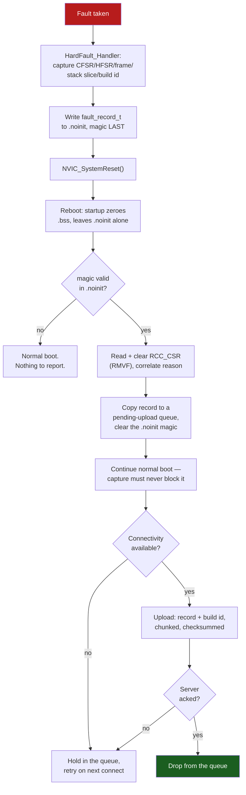

# Postmortem Debugging

Every technique in [HardFault Forensics](./hardfault-debugging.md) assumes something that is only true on your bench: a debugger attached at the moment of the fault, watching `CFSR` before anything clears it, holding the stack frame before the stack is reused. A device in the field has none of that. It faults, and unless you decided in advance what to do about it, the only evidence is a `b .` loop nobody is watching, or a reset that erases everything and starts the firmware running again as if nothing happened.

The mental model is a flight recorder, not a debugger session: you do not get to ask questions after the fact, so you have to decide *before the crash* exactly what a future you, reading a bug report from a customer six months from now, will wish had been written down. Too little and the report says only "it crashed" — which you already knew. Too much and you have spent SRAM, flash wear, and engineering time capturing detail nobody will read. The right amount is small, fixed, and chosen up front: the same handful of fields every time, written by code that cannot itself fault.

The second half of the problem is transport, not capture. A record sitting in RAM on a device in a customer's garage is exactly as useless as no record at all until it reaches you. This page is the two halves together: what survives the reset that follows a fault, and how it gets from there to your desk. Decoding what the record *means* — walking `CFSR` to a cause, a stacked frame to a `PC`, a `PC` to a source line — is entirely [HardFault Forensics](./hardfault-debugging.md)'s job; this page does not repeat it.

:::info[Prerequisites]
[HardFault Forensics](./hardfault-debugging.md) owns the fault registers, the stack-frame recovery, and the `fault_record_t` / `hardfault_report()` handler this page extends — read it first. [Memory Sections and VMA vs LMA](../03-toolchain-and-build/memory-sections.md) owns `.noinit`: how it is declared `(NOLOAD)` in the linker script and why the startup zero-fill loop must not cover it. [Reset and Boot Configuration](../01-hardware-foundations/reset-and-boot-configuration.md) owns `RCC_CSR` in full — every reset-cause flag, the sticky-flags warning, and `RMVF`.
:::

## What is worth writing down

Five fields, and the argument for each is the same: it is cheap to capture and expensive to reconstruct after the fact.

1. **The stacked exception frame** — `R0`–`R3`, `R12`, `LR`, `PC`, `xPSR`. This is the frame `hardfault_report()` already captures; it is what makes `addr2line` and register-argument inspection possible at all.
2. **`CFSR` and `HFSR`**, and `MMFAR`/`BFAR` when their valid bits say so. Without these you know *that* something faulted and nothing about *which* fault.
3. **The handler's own view of `MSP` and `PSP`.** The frame tells you which stack it came from, but reading both pointers directly, unconditionally, is what lets you notice a stack that has grown into territory it should not occupy — the frame alone does not show you the *other* stack's state, and a corrupted `PSP` on an RTOS build is itself diagnostic.
4. **A bounded slice of the stack below the frame**, not just the eight frame words. The frame tells you where execution stopped; the words beneath it are frequently the call chain that got there — return addresses left by earlier, un-inlined calls — and a null-pointer write two calls up a corrupted linked list is invisible in the frame alone.
5. **A build identifier.** A `PC` or a return address is only meaningful against the ELF that produced it. A crash report with no build ID is a crash report you cannot safely decode — the address `0x08001A4E` names a different function in every build that has touched the surrounding source.

```c title="fault_record_t, extended for a record that has to survive on its own"
#define FAULT_STACK_WORDS 24   /* 96 bytes: frame words plus call-chain context */

typedef struct {
    uint32_t magic;
    uint32_t cfsr, hfsr, mmfar, bfar, exc_return;
    uint32_t msp, psp;                        /* read directly, not inferred    */
    uint32_t sp;                               /* the stack EXC_RETURN selected */
    exception_frame_t frame;                   /* R0-R3, R12, LR, PC, xPSR       */
    uint32_t stack_slice[FAULT_STACK_WORDS];   /* words below the frame, bounded */
    uint8_t  build_id[8];                      /* see "Tying a dump to a build"  */
} fault_record_t;

static fault_record_t g_fault __attribute__((section(".noinit")));
```

The bounded slice is the field most implementations get wrong in one of two directions: too small to show a call chain, or unbounded and therefore capable of reading outside SRAM. On the F411, SRAM1 is `0x2000_0000`–`0x2001_FFFF` — [The Memory Map](../02-processor-architecture/memory-map-and-bit-banding.md) is the source for that range — and a stack-overflow fault is exactly the case where the pointer you are about to read *from* is the one that is wrong. Clamp the read to that range before you touch it:

```c
static void capture_stack_slice(fault_record_t *r, const uint32_t *sp)
{
    const uint32_t *top = (const uint32_t *)0x20020000u;   /* one past SRAM1  */
    const uint32_t *base = sp + (sizeof(exception_frame_t) / 4);
    unsigned n = 0;
    for (const uint32_t *p = base; p < top && n < FAULT_STACK_WORDS; p++, n++) {
        r->stack_slice[n] = *p;
    }
    while (n < FAULT_STACK_WORDS) { r->stack_slice[n++] = 0; }  /* pad, don't leave stale */
}
```

Checking `top` before every read is not defensive-programming theatre. A fault that corrupts the stack pointer itself is a real, common shape of failure, and dereferencing an arbitrary 32-bit value as if it were a valid SRAM address risks turning a diagnostic capture into a second fault inside the handler that is already servicing the first one — which the warning below covers.

## Where the record survives the reset

None of these choices is "better" in the abstract; each trades capacity against durability. All three are real options on the F411.

| Storage | Capacity here | Survives system reset | Survives `V`<sub>`DD`</sub> loss | Cleared by | Access cost |
|---|---|---|---|---|---|
| `.noinit` SRAM | As much as you reserve, up to the 128 KB budget | **Yes** | No — SRAM contents are undefined after power-on | Any code that writes it; power loss | A plain C struct, zero cost |
| RTC backup registers (`RTC_BKPxR`) | 80 bytes fixed (20 × 32-bit) | Yes | **Yes, if `VBAT` is populated** | Backup-domain reset (`BDRST`), a tamper event | Needs `DBP` unlocked once; exempt from `RTC_WPR` |
| A reserved flash sector | One erase sector (16 KB is the smallest on this part) | Yes | **Yes, unconditionally** | An explicit erase, or a chip-erase reflash | Erase-before-write, up to ~2 s stall, finite endurance |

`.noinit` SRAM is the right default and the one the extended `fault_record_t` above targets: free, fast, and — per [Memory Sections and VMA vs LMA](../03-toolchain-and-build/memory-sections.md) — untouched by the `.bss` zero-fill loop across a watchdog, software, or pin reset. Its one real weakness is a genuine power cycle: SRAM content after `V`<sub>`DD`</sub> returns is architecturally undefined, so a `.noinit` record without a magic-number guard is a coin flip. A field failure that pulls the battery is exactly the case `.noinit` cannot help with.

**RTC backup registers** close that gap for a battery- or supercap-backed design: [The Backup Domain](../05-peripherals-and-drivers/rtc-and-timekeeping.md) already owns the mechanism — the switch to `VBAT`, the `DBP` unlock, and the fact that the twenty backup registers are exempt from `RTC_WPR` — so this page only adds the postmortem-specific point, which is capacity. Eighty bytes is not the full extended `fault_record_t` above; it fits `magic`, `cfsr`, `hfsr`, `exc_return`, the stacked `PC`, and a handful of build-ID bytes, and not much more. Treat it as a compressed summary, not the full record — write the full struct to `.noinit`, and mirror only the fields you would need if the SRAM copy were gone.

**A reserved flash sector** is the only option that is non-volatile without a battery. [Internal Flash and EEPROM Emulation](../05-peripherals-and-drivers/flash-and-eeprom-emulation.md) owns the sector table and the erase-before-write mechanics — the smallest sector on this part is 16 KB, an entire sector for a record that might be under 200 bytes, and the erase itself can stall the core for close to two seconds, so writing it is something you do once per fault, from a context where that stall is acceptable (after the reset, in `main`, not from the fault handler itself). If sectors 1 and 2 are already committed to settings storage, sector 3 is the next 16 KB block and a reasonable default. The gotcha, worth stating plainly because it costs people a returned unit's worth of evidence: a routine `program … verify reset exit` reflash that erases the whole device — [Flashing and Programming](../03-toolchain-and-build/flashing-and-programming.md) covers that idiom — erases your postmortem sector along with everything else. If you want a crash record to survive the *next* firmware update, exclude that sector from the erase range explicitly.

:::note[No Backup SRAM on this part]
Some STM32F4 parts — the F405/415/407/417 line among them — have a dedicated Backup SRAM block in the backup domain, separate from the RTC registers. RM0383's peripheral map, as tabulated in [The Memory Map and Bit-Banding](../02-processor-architecture/memory-map-and-bit-banding.md), carries no such block for the F411: the only RAM inside the backup domain here is the 80 bytes of `RTC_BKPxR`. Code ported from a Backup-SRAM-equipped part that assumes a kilobyte of always-on scratch RAM will not compile, let alone run, on this board.
:::

## The capture-to-upload flow



Two decisions in that flow are easy to get backwards:

- **The `.noinit` magic is cleared as soon as the record is copied into the upload queue**, not after the upload succeeds. Otherwise a second fault before the first report has left the device re-triggers the "magic valid" branch on the same stale record, and if your queue logic assumes one pending record you drop the second fault silently. The queue — wherever you put it, RAM or flash — owns retry state from that point forward; `.noinit` only needed to survive the one reset.
- **Continuing the boot must never depend on the upload succeeding.** A device that will not finish starting until it has phoned home about the *previous* crash turns a transient network outage into a second outage of its own making. Capture is synchronous with boot; reporting is not.

## Correlating with the reset cause

`RCC_CSR` — [Reset and Boot Configuration](../01-hardware-foundations/reset-and-boot-configuration.md) has the full flag table and the `RMVF` discipline — is the other half of "why did I reboot", and it answers a question the fault record cannot: whether there *was* a fault at all. An `IWDGRSTF` with no valid `.noinit` magic means the firmware hung somewhere that never reached the fault handler — a spin loop, a deadlock, an ISR that never returns — which is a different bug class from anything `CFSR` describes. Reading both together, in this order, turns two partial answers into one:

| `.noinit` magic | `RCC_CSR` flag | What actually happened |
|---|---|---|
| Valid | `SFTRSTF` | The fault handler ran to completion and called `NVIC_SystemReset()` itself — the expected path. Decode the record. |
| Valid | anything else | The record was written but the reset that followed wasn't the handler's own — a watchdog fired *during* capture, or capture raced a second fault. Treat the record as best-effort. |
| Invalid | `IWDGRSTF` / `WWDGRSTF` | A hang, not a fault. No `PC` to decode; the watchdog itself is the only evidence, and where it fired is not recorded — this is the argument for a per-checkpoint watchdog refresh discussed in [Watchdogs](../05-peripherals-and-drivers/watchdogs.md), so the *absence* of a refresh at least narrows where. |
| Invalid | `PORRSTF` / `BORRSTF` | A genuine power event — cold start or brownout. Nothing to report; this is normal operation. |
| Invalid | `PINRSTF` | `NRST` was pulled low — a button, or a debug probe attaching. Not a firmware failure. |

Read `RCC_CSR` and write `RMVF` in the same early-`main` code path that checks the `.noinit` magic, for the same reason the flags need clearing at all: leave them and the next boot's read is contaminated by this one's cause, and a device that watchdog-reset once and browns-out repeatedly after will report both on every subsequent boot, indistinguishably. [Reset and Boot Configuration](../01-hardware-foundations/reset-and-boot-configuration.md) covers the general case; the postmortem-specific rule is simply to read `RCC_CSR` in the same breath as the `.noinit` magic, so one snapshot answers both questions at once.

## Tying a dump to a build

An address with no build ID is not evidence — it is a coordinate in a document you may no longer have. Two levels of rigor, and either beats none:

```bash
# 1. Link with a build-id note (SHA-1 by default).
arm-none-eabi-gcc ... -Wl,--build-id=sha1 -o firmware.elf

# 2. Read it back — this is the value that must match the crash report.
arm-none-eabi-readelf -n firmware.elf
#  Displaying notes found in: .note.gnu.build-id
#   Owner  Data size  Description
#   GNU    0x00000014 NT_GNU_BUILD_ID (unique build ID bitstring)
#    Build ID: 9f2a6c1d4e8b0a3f7c5d1e9b2a4f6c8d0e1a3b5c
```

Getting that ID from the ELF onto the device is the part that trips people up: `.note.gnu.build-id` is a section in the ELF, not automatically a symbol your C code can read. The reliable route is a build step, not a runtime one — generate a small header from the same hash (or truncate it) as part of the build and compile it into flash at a fixed, named symbol:

```c
/* Generated by the build script from the linker's own build-id output,
   so the value baked into flash and the value readelf reports agree. */
const uint8_t g_build_id[8] __attribute__((used, section(".rodata.build_id"))) =
    { 0x9f, 0x2a, 0x6c, 0x1d, 0x4e, 0x8b, 0x0a, 0x3f };
```

The fault handler copies `g_build_id` into `fault_record_t.build_id` alongside everything else, and the record now carries the one fact that lets the receiving end pick the correct ELF out of every build ever shipped before it runs `addr2line`. A record without this is still readable *if* you happen to know which firmware version was on the device — which is exactly the assumption that fails the day two builds are in the field at once.

:::warning[The backup register that erased itself the moment it mattered]
Moving the crash summary into `RTC_BKPxR` for extra durability looks strictly safer than `.noinit` — until the failure mode that reboots the board is the same class of event that trips tamper detection. [The Backup Domain](../05-peripherals-and-drivers/rtc-and-timekeeping.md) documents that the backup registers are erased by a tamper event, and that this is deliberate security behaviour rather than a bug. An ESD strike or a supply glitch severe enough to reset the part is also exactly the kind of event that can toggle a tamper pin left floating — and the tamper erasure runs *before* your boot code gets a chance to read anything out. The symptom is specific and maddening: the `.noinit` copy of the record is intact and readable, the backup-register copy you added as insurance is zeroed, and the correlation between "this fault was severe enough to trip tamper" and "this is the fault whose backup copy is missing" is easy to miss because it looks like intermittent hardware flakiness in the backup registers rather than a documented, deterministic erasure. If tamper detection is enabled at all, treat the backup registers as a *best-effort* mirror, never the only copy.

A second, unrelated way to lose a capture entirely: dereferencing a corrupted stack pointer while gathering the bounded slice above. A fault taken while the processor is already executing at HardFault priority — the highest priority that exists — cannot be taken as another HardFault; the architecture calls the result **lockup**, and on this part recovery from lockup requires an external reset, not a debugger reconnect. The bounds check in `capture_stack_slice()` above exists specifically to keep a second fault, triggered by the handler's own diagnostic code, from turning "we got most of a crash report" into "the board is now unresponsive and nobody is watching it reboot".
:::

## See also

- [HardFault Forensics](./hardfault-debugging.md) — the decode procedure this page's record feeds: `CFSR`/`HFSR` interpretation, `EXC_RETURN`, and mapping the stacked `PC` to source.
- [Reset and Boot Configuration](../01-hardware-foundations/reset-and-boot-configuration.md) — the full `RCC_CSR` flag table, the sticky-flags trap, and `RMVF`.
- [The Backup Domain](../05-peripherals-and-drivers/rtc-and-timekeeping.md) — `RTC_BKPxR`, the `DBP` unlock, and the tamper-erasure behaviour the warning above depends on.
- [Internal Flash and EEPROM Emulation](../05-peripherals-and-drivers/flash-and-eeprom-emulation.md) — the sector table, erase-before-write costs, and the power-loss-safe record format a flash-resident crash log is a special case of.
- [Watchdogs](../05-peripherals-and-drivers/watchdogs.md) — what `IWDGRSTF`/`WWDGRSTF` mean with no fault record behind them, and designing a refresh scheme that at least narrows where a hang occurred.

## References

- Memfault — [**Coredump Collection**](https://docs.memfault.com/docs/mcu/coredumps). What a minimal coredump needs to contain, why a build ID is mandatory metadata on every uploaded trace, the RAM-backed vs. flash-backed storage options, and the general shape of capture-then-queue-then-upload this page's flow follows. The companion Interrupt article [**"How to implement and use .noinit RAM"**](https://interrupt.memfault.com/blog/noinit-memory) covers the linker-script and startup-code side of the `.noinit` mechanism this page builds on, from the same practical angle as [Memory Sections and VMA vs LMA](../03-toolchain-and-build/memory-sections.md).
- STMicroelectronics — [**RM0383**, *STM32F411xC/E reference manual*](https://www.st.com/resource/en/reference_manual/rm0383-stm32f411xce-advanced-armbased-32bit-mcus-stmicroelectronics.pdf), consulted at **Rev 4** (May 2025). §6.3.20 for `RCC_CSR` and every reset-cause flag referenced in the correlation table; §5.1.2 for the backup domain and what `VBAT` powers; §3.3 Table 1 for the peripheral base-address map that carries no Backup SRAM entry for this part; §3.3 Table 4 for the flash sector table used for the reserved-sector option.
- Arm — [***Armv7-M Architecture Reference Manual***](https://developer.arm.com/documentation/ddi0403/latest/), consulted at **DDI 0403E.e (ID021621)**. The description of the **lockup** state — a fault that cannot be taken because the processor is already executing at the highest exception priority — that the second half of the warning above depends on; corroborated against Memfault's and Keil's worked treatments below rather than pinned to a single subsection number, since this session's access to the primary manual was through the citations already established in sibling pages rather than a fresh fetch.
- Keil / Arm — [**AN209, "Using Cortex-M3/M4/M7 Fault Exceptions"**](https://www.keil.com/appnotes/files/apnt209.pdf). Fault escalation and the conditions that produce a lockup, with worked examples across the M3/M4/M7 family.
- Free Software Foundation — [**GNU `ld` manual, `--build-id`**](https://sourceware.org/binutils/docs/ld/Options.html) and [**GNU Binutils, `readelf`**](https://sourceware.org/binutils/docs/binutils/readelf.html). The `--build-id` linker option and its default SHA-1 form, and `readelf -n` for reading the resulting `.note.gnu.build-id` back out of an ELF.
