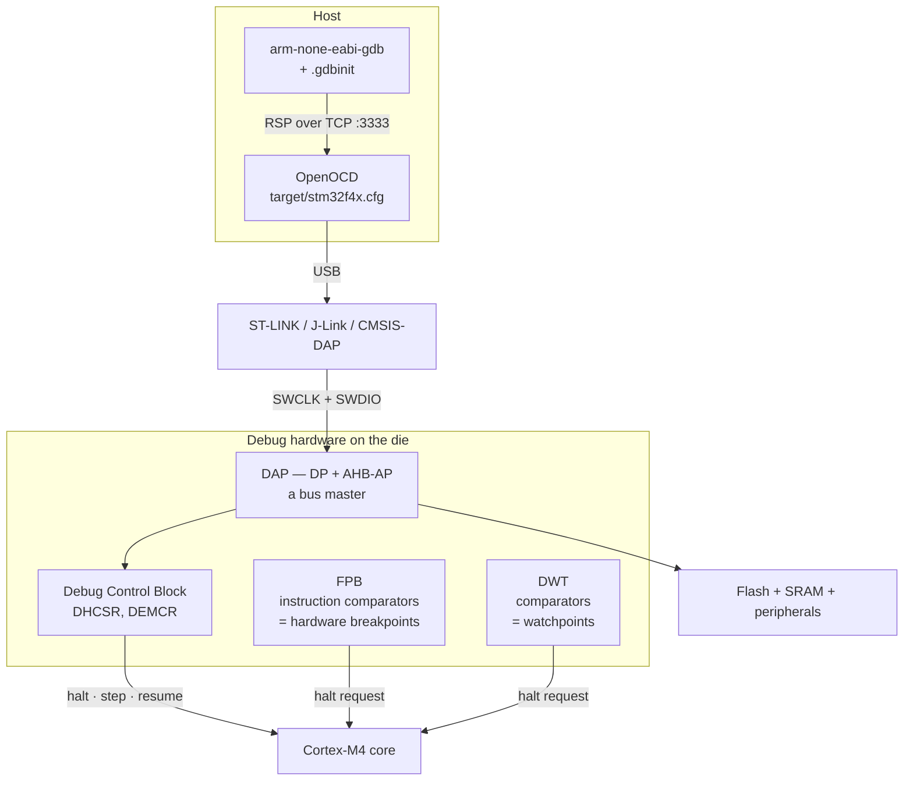

# SWD, JTAG, and GDB

The thing that surprises people about on-chip debugging is how little of it is software. GDB does not single-step your firmware; the *processor* single-steps it, because Armv7-M defines a halting-debug mode with its own registers, comparator hardware for breakpoints, and comparator hardware for watchpoints. GDB is a client. OpenOCD is a translator. The debug capability is silicon that was on the die before you wrote anything, and it is finite in a way that software breakpoints on a hosted system are not.

That finiteness is the mental model. On your laptop, breakpoints are free — GDB rewrites the instruction in memory and puts it back afterwards, so you can have ten thousand. On a Cortex-M, your code is in flash and cannot be rewritten instruction by instruction, so a breakpoint on a flash address must be a **hardware comparator**, and there are single digits of them. Watchpoints come from a different unit and there are fewer still. Knowing the numbers, and knowing when the tool has quietly run out, is the difference between a debugger you trust and one that mysteriously does not stop where you asked.

:::info[Prerequisites]
[Flashing and Programming](../03-toolchain-and-build/flashing-and-programming.md) owns the SWD-versus-JTAG wiring comparison, the probe and tool landscape, the `program … verify reset exit` idiom, and the connect-under-reset recovery when a target stops responding. This page assumes you can already get an image onto the board and picks up at the interactive session.
:::

## The chain from your keyboard to the core



Two things in that picture explain most of a debugger's behaviour.

**The AHB-AP is a bus master.** It reads and writes memory without asking the core, which is why a probe can dump SRAM while the CPU is halted, why it can read your peripherals while the firmware is wedged in a fault loop, and why a live watch window costs the target bus bandwidth but not instructions.

**Halting is a request to the core, not a rewrite of your program.** `DHCSR` at `0xE000EDF0` carries `C_DEBUGEN`, `C_HALT` and `C_STEP`; the FPB and DWT raise a halt request when their comparators match. Nothing in flash is modified. This is also why your firmware can *detect* a debugger — the `C_DEBUGEN` test in [HardFault Forensics](./hardfault-debugging.md) reads that same register.

## Bringing up a session

```bash
# Terminal 1: the server. Stays running across many GDB sessions.
openocd -f interface/stlink.cfg -f target/stm32f4x.cfg
```

```bash
# Terminal 2. `extended-remote` (not `remote`) enables run control:
# `kill`, `run`, and re-`load` without restarting OpenOCD.
arm-none-eabi-gdb build/firmware.elf \
  -ex "target extended-remote localhost:3333" \
  -ex "monitor reset halt" \
  -ex "load" \
  -ex "break main" \
  -ex "continue"
```

Put that in a `.gdbinit` next to the project and the session becomes one command. Two configuration points repay reading about once:

- **`adapter speed`.** The SWD clock. Too fast and the connection is flaky in ways that look like target bugs; too slow and `load` crawls. OpenOCD's stock STM32F4 config picks a safe default; raising it after a `reset init` (when the target is at full clock) is where the speed is.
- **`monitor` is the escape hatch.** Anything after `monitor` (or `mon`) goes to OpenOCD rather than GDB: `mon reset halt`, `mon reg`, `mon mdw 0xE000ED28`, `mon arm semihosting enable`. When something is not a GDB concept — flash programming, adapter speed, reset behaviour — it is a `monitor` command.

## The commands worth knowing

| Command | What it does | Note for this target |
|---|---|---|
| `monitor reset halt` | Reset the target and stop at the reset vector | The clean start; do this before `load` |
| `load` | Write the ELF's loadable sections into flash | Only the ELF's `PT_LOAD` segments — not `.noinit` |
| `break <loc>` / `b` | Breakpoint, GDB's choice of hardware or software | On flash, always ends up as an FPB comparator |
| `hbreak <loc>` | Force a hardware breakpoint | Use when the location is in RAM but must not be patched |
| `tbreak <loc>` | Temporary — deletes itself after one hit | Frees the comparator; use liberally |
| `watch <expr>` | Break when a value is **written** | DWT comparator. The tool for memory corruption |
| `rwatch` / `awatch` | Break on **read** / on read-or-write | Same scarce comparators |
| `info break` / `info watch` | List them, with hit counts | Where you discover you have run out |
| `bt` | Backtrace | Needs `-g`; unwinding through a fault handler needs help |
| `info registers` | The core registers | Add `$msp`, `$psp`, `$primask`, `$basepri`, `$control` by name |
| `p/x *(uint32_t*)0xE000ED28` | Read `CFSR` from a halted target | The live version of the fault procedure |
| `x/16xw $sp` | Dump 16 words from the stack | The exception frame, read by hand |
| `x/8i $pc` | Disassemble around the PC | Where [Reading Disassembly](../../computer-science/assembly/reading-disassembly.md) starts |
| `monitor cortex_m maskisr on` | Step over an ISR instead of into it | Essential when stepping code that a timer interrupt keeps stealing |
| `set var x = 1` | Change a variable, or `set $pc = ...` | Skip a hang, test a branch, avoid a rebuild |
| `compare-sections` | Verify flash matches the ELF | Catches "I forgot to `load`", which costs hours |
| `detach` | Leave the target **running** | As opposed to `quit`, which may leave it halted |

`compare-sections` is underrated. The single most common wasted debugging hour is debugging a binary that is not the one on the chip, and this command answers that in a second.

## Breakpoints are hardware, and there are few

Breakpoints on a Cortex-M come from the **Flash Patch and Breakpoint unit**, and its comparator count is an implementation choice made by the silicon vendor. The Cortex-M4 TRM's debug-configuration section lists the two options: **six instruction comparators plus two literal comparators, or a reduced configuration with only two instruction comparators**. Watchpoints come from a different unit, the **DWT**, whose comparator count is likewise configurable — four, or a minimal one.

Do not memorise a number for your part; read it. Both units report their own size:

```text
(gdb) p/x (*(uint32_t*)0xE0002000 >> 4) & 0xF     # FP_CTRL NUM_CODE[3:0]
(gdb) p/x (*(uint32_t*)0xE0002000 >> 12) & 0x7    # FP_CTRL NUM_CODE[6:4]
(gdb) p/x (*(uint32_t*)0xE0001000 >> 28) & 0xF    # DWT_CTRL NUMCOMP
```

`FP_CTRL` is at `0xE0002000` and splits `NUM_CODE` across two fields — bits `[7:4]` are the low nibble and bits `[14:12]` the high bits, so the total is `(high << 4) | low`; `NUM_LIT` is bits `[11:8]` (*Armv7-M ARM* §C1.11.3). `DWT_CTRL` is at `0xE0001000` with `NUMCOMP` in bits `[31:28]` (§C1.8.7, and `DWT_CTRL_NUMCOMP_Pos` = 28 in `core_cm4.h`). On an STM32F4 with an ST-LINK, OpenOCD reports what it found at connect time — commonly six breakpoints and four watchpoints — and that line in the OpenOCD log is the fastest place to look.

The consequences of the number being small:

- **GDB will use software breakpoints where it can, and it cannot on flash.** A software breakpoint is a `BKPT` instruction written over yours; that works in RAM and not in a flash address, so every breakpoint on ordinary firmware consumes a comparator. OpenOCD's `gdb_breakpoint_override hard` forces the choice explicitly if you want no ambiguity.
- **Running out is a runtime failure, not a syntax error.** GDB prints `Cannot insert breakpoint N` when you `continue`, and if you miss it in the noise the target free-runs past the place you were waiting for. Symptom: "my breakpoint stopped working."
- **`tbreak` and `delete` are the discipline.** Breakpoints accumulate across a long session; `info break` and a `delete` of the dead ones is a ten-second habit that removes a whole class of confusion.
- **Conditional breakpoints are evaluated by GDB, on the host.** `break foo if x == 3` halts the target on *every* hit, reads `x` over SWD, decides, and resumes. That is milliseconds per hit — enough to break real-time behaviour on a hot function. Where the condition matters more than the halt, a `printf`-free instrumentation counter and one unconditional breakpoint is often faster.

## Watchpoints: the tool for memory corruption

The single highest-value use of a debugger on this architecture is the one people reach for last. A global that holds an impossible value, and no code that writes it wrongly, is a question with a mechanical answer:

```text
(gdb) watch config.checksum
Hardware watchpoint 2: config.checksum

(gdb) continue
Hardware watchpoint 2: config.checksum
Old value = 3735928559
New value = 0
0x08002114 in memset_impl (d=0x20000a40, ...) at src/util.c:22
(gdb) bt
```

The DWT compared every data address the core touched, at full speed, and halted on the one that matched. No instrumentation, no rebuild, no slowdown. The backtrace then names the culprit — very often a `memset`, `memcpy` or array write in a function that has no business being near that address, which is the signature of an off-by-one or an overflowed buffer next door.

Three things that make watchpoints work in practice:

- **Watch the address, not the expression, when scope is a problem.** `watch *(uint32_t*)0x20000a44` survives the variable going out of scope, which a `watch var` on a local does not.
- **The DWT can watch a range**, not just a word, via its mask register. GDB exposes this unevenly; OpenOCD's `wp <address> <length> <r|w|a>` is the direct route and is the right tool for "something is writing anywhere in this 64-byte struct".
- **A stack-overflow watchpoint is a standing configuration, not a debugging step.** Put a watchpoint on the word just below a task's stack limit and you catch the overflow at the instruction that caused it. An MPU region does the same thing without a debugger attached and works in the field — see [The Memory Protection Unit](../02-processor-architecture/the-mpu.md) — but the watchpoint takes ten seconds to set up.

## Attaching to a running target

Every command sequence above starts with `monitor reset halt`, which destroys the state you may have wanted. When the interesting condition is *already present* on a board that has been running for two hours, you attach without disturbing it:

```bash
# No `reset`, no `load`. Just connect and stop where it is.
arm-none-eabi-gdb build/firmware.elf \
  -ex "target extended-remote localhost:3333" \
  -ex "monitor halt"

# ... and when you are done, leave it running:
(gdb) detach
```

The rules that make this reliable:

- **`monitor halt`, never `monitor reset halt`.** The second word is the one that throws away the bug.
- **Do not `load`.** GDB will happily reprogram flash and restart the very state you were investigating.
- **The ELF must match the running image**, or every symbol is a lie. `compare-sections` before you believe a backtrace.
- **OpenOCD must not reset on connect.** Its default `reset_config` for many targets asserts `SRST` during `init`. Starting the server with `-c "gdb_report_data_abort enable"` and a `reset_config none` line, or simply starting OpenOCD *before* powering the target and using `-c "init"` without `reset`, keeps the target untouched. This is the opposite of the connect-under-reset recovery in [Flashing and Programming](../03-toolchain-and-build/flashing-and-programming.md) — same knob, opposite direction, and it is worth knowing that both configurations exist for opposite reasons.

Attaching live is the technique for the hang that takes hours to appear: leave the board running, attach when it stops responding, `bt` and `info registers`. It answers "what is it doing *right now*", which no amount of post-hoc reasoning will.

:::warning[Three ways a GDB session tells you something that is not true]
**Debugging the wrong binary.** You rebuilt, forgot to `load`, and are now stepping through source lines that do not correspond to the instructions on the chip. The symptom is uncanny: breakpoints hit in the wrong place, the highlighted line does not match what the variables are doing, and stepping jumps around. It is not a compiler bug and not an optimisation artefact. `compare-sections` prints `MIS-MATCHED` and settles it in one second. Make it the first thing you type whenever a session starts behaving oddly.

**Single-stepping into an interrupt forever.** Step a line in `main` on a board with a 1 kHz SysTick and GDB stops inside `SysTick_Handler`, because a step takes far longer than a millisecond and the interrupt fires during it. Step again and you are still in the handler. It looks like the program is stuck in the ISR; it is not, it is stuck in your step. `monitor cortex_m maskisr on` masks interrupts for the duration of each step and gives you back the ability to step ordinary code — remember to turn it off, because with it on you will never step *into* a handler you actually want to see.

**A halted core with a peripheral that did not halt.** The classic is the watchdog: halt at a breakpoint, the IWDG counter keeps counting, the board resets the instant you resume, and it looks like your next line of code crashes the system. STM32 provides `DBGMCU` freeze bits for exactly this — [Watchdogs](../05-peripherals-and-drivers/watchdogs.md) covers `DBG_IWDG_STOP` and `DBG_WWDG_STOP` and the fact that setting them means your debug builds have no watchdog. The same class of problem, without a freeze bit to fix it, applies to a UART that overruns while you are stopped and to an I²C counterparty that times out. If the state after resuming makes no sense, ask what kept running while you were not.
:::

## See also

- [The Debug Toolbox](./the-debug-toolbox.md) — where the debugger sits among the other instruments, and the perturbation cost of halting.
- [HardFault Forensics](./hardfault-debugging.md) — reading `CFSR` and the stacked frame from a halted target, using the `p/x` and `x/16xw` commands above.
- [Flashing and Programming](../03-toolchain-and-build/flashing-and-programming.md) — the probe, the transports, OpenOCD configuration files, and connect-under-reset when the target will not answer.
- [RTOS Debugging and Tracing](../07-rtos/rtos-debugging-and-tracing.md) — thread-aware GDB, which turns one backtrace into one per task.
- [The Memory Protection Unit](../02-processor-architecture/the-mpu.md) — the always-on version of the stack-overflow watchpoint above.

## References

- OpenOCD Project — [**OpenOCD User's Guide**](https://openocd.org/doc/html/index.html). [GDB and OpenOCD](https://openocd.org/doc/html/GDB-and-OpenOCD.html) for the `:3333` server, `gdb_breakpoint_override` and the `monitor` passthrough; [General Commands](https://openocd.org/doc/html/General-Commands.html) for `halt`, `resume`, `step`, `mdw`/`mww` and the `bp`/`wp` breakpoint and watchpoint commands with their length and access-type arguments; [Architecture and Core Commands](https://openocd.org/doc/html/Architecture-and-Core-Commands.html) for `cortex_m maskisr` and `cortex_m vector_catch`.
- Free Software Foundation — [**Debugging with GDB**](https://sourceware.org/gdb/current/onlinedocs/gdb.html/). [Breakpoints, Watchpoints, and Catchpoints](https://sourceware.org/gdb/current/onlinedocs/gdb.html/Breakpoints.html) for `hbreak`, `tbreak`, `watch`/`rwatch`/`awatch` and the note that conditions are evaluated on the host; [Connecting to a Remote Target](https://sourceware.org/gdb/current/onlinedocs/gdb.html/Connecting.html) for `target remote` versus `target extended-remote` and `detach`; [Files](https://sourceware.org/gdb/current/onlinedocs/gdb.html/Files.html) for `compare-sections`.
- Arm — [***Armv7-M Architecture Reference Manual***](https://developer.arm.com/documentation/ddi0403/latest/), consulted at **DDI 0403E.e (ID021621)**. §C1.6 for `DHCSR`, `C_DEBUGEN`, `C_HALT` and `C_STEP`; §C1.8 for the DWT, its comparators and `DWT_CTRL.NUMCOMP`; §C1.11 for the FPB, with §C1.11.3 giving the `FP_CTRL` layout including the split `NUM_CODE` field read above.
- Arm — [**Cortex-M4 Technical Reference Manual**](https://developer.arm.com/documentation/100166/latest/), "Debug configuration". The implementation options this page quotes: a breakpoint unit with six instruction and two literal comparators or a reduced two-comparator form, and the corresponding DWT configurations — which is why the count must be read from the part rather than assumed.
- STMicroelectronics — [**RM0383**, *STM32F411xC/E reference manual*](https://www.st.com/resource/en/reference_manual/rm0383-stm32f411xce-advanced-armbased-32bit-mcus-stmicroelectronics.pdf), consulted at **Rev 4** (May 2025). §23 "Debug support (DBG)" for `DBGMCU`, the low-power debug bits (`DBG_SLEEP`, `DBG_STOP`, `DBG_STANDBY`) that keep the debug clock alive, and §23.16.2 for the peripheral freeze bits that stop a timer or watchdog while the core is halted.
