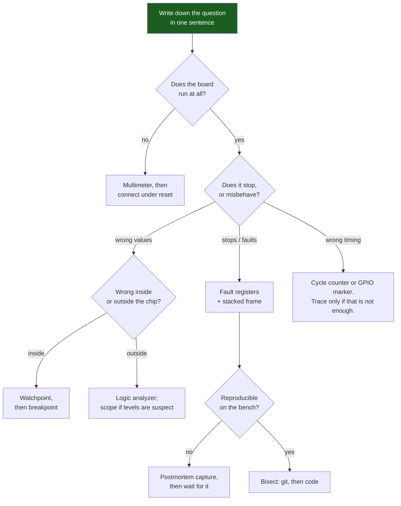

# The Debug Toolbox

Embedded debugging goes wrong in a particular way. You have a symptom — the board hangs after eleven minutes, the sensor returns zeros every hundredth read, the current draw is four times what the datasheet promises — and you reach for the instrument you are most comfortable with rather than the one that can answer the question. Then you measure the wrong thing very carefully for a day.

The mental model that fixes it: **every instrument answers exactly one class of question, and each one is blind outside that class.** A debugger sees inside the chip and nothing outside it. A logic analyzer sees outside the chip and nothing inside it. A scope sees the shape of a signal and almost nothing about its meaning. There is no general-purpose instrument, so the first move on any bug is not to measure — it is to write down, in one sentence, what you are trying to find out. The sentence picks the tool.

The second principle is about ordering, and it is the one that saves the most time: **prefer the observation that does not change the program.** Halting the core stops time for the firmware and not for the motor, the I²C peripheral, or the counterparty on the other end of a link. Adding a blocking `printf` inserts milliseconds into a path that may have been measured in microseconds. Both of these routinely make the bug disappear, and a bug that disappears under measurement has cost you the measurement and taught you nothing. Start with the passive instruments and only halt when you have to.

## Symptom to instrument

| Symptom | Reach for | Because it answers | It cannot tell you |
|---|---|---|---|
| Board is dead — no LED, no output, no debugger connection | **Multimeter**, then the probe under reset | Is there power, is `NRST` released, does the DAP respond at all | Anything about your code |
| It crashes and stops | **Fault registers** — `CFSR`, `HFSR`, the stacked frame | The exact instruction that could not complete, and why | Which of the previous ten thousand instructions corrupted the state |
| A variable holds a wrong value and nothing writes it wrongly | **Watchpoint** (DWT) | The instruction that actually performed the write, at full speed | Whether the write was intentional |
| A value is right on the register and wrong at the far end | **Logic analyzer** | What bits and what timing actually left the pin | Voltage, edge shape, drive strength |
| Communication works at 100 kHz and fails at 400 kHz | **Oscilloscope** | Rise time, level, ringing, whether the "1" reached `V_IH` | Long multi-channel captures, protocol context |
| A deadline is missed occasionally, under load | **DWT cycle counter**, a GPIO toggle plus a scope, or a trace | Real elapsed cycles, with no observer cost worth counting | *Why* the code took that long |
| A hang whose cause is upstream in time | **Trace** (ITM/DWT events, or an RTOS trace) | The event sequence leading up to it | Anything, if enabling trace changes the timing enough to hide it |
| It works on the bench and fails in the field | **Postmortem record** in `.noinit` RAM plus the reset reason | What the last failure was, on a board you cannot attach to | Anything you did not decide to capture in advance |
| Logic is wrong but hardware is fine | **Host unit test** | Whether the state machine, parser or algorithm is correct — in milliseconds, in a loop | Anything about registers, timing or the real peripheral |
| A defect class you suspect exists but cannot reproduce | **Compiler warnings, then a static analyzer** | Every instance in the tree, including the ones not exercised yet | Whether any of them actually happens at runtime |

Read the fourth column as seriously as the third. Most wasted days come from asking an instrument a question that is outside its physics — asking a logic analyzer whether the level was marginal, or asking a debugger what happened on the wire.

## The ordering that finds bugs fastest

Three habits sit underneath that flow and matter more than any individual instrument.

**Reproduce before you investigate.** An intermittent bug you cannot trigger on demand will consume an unbounded amount of time, because you cannot tell a fix from a coincidence. Spending an hour building a stress loop that fails in thirty seconds is almost always cheaper than the alternative, and it also gives you the only thing that can prove the fix worked.

**Bisect with `git bisect` before you bisect with your brain.** If it worked last month, the machine can find the commit in a logarithmic number of builds while you make tea. This requires a build that is scriptable from the command line and a test you can run without a human, which is a reason to have both.

**Question the assumption, not the code.** The bug is generally not where you are looking, because you have already looked there. Firmware bugs concentrate in the places where two people's assumptions meet: an interrupt priority, a peripheral clock enable, a register that is write-1-to-clear, a buffer whose ownership passes to DMA, a byte order. Ask what you believe to be true and then measure that.

## What each instrument costs you

The unit that matters is not money — it is how much the measurement perturbs what you are measuring.

| Instrument | Effect on the running program | Order of magnitude |
|---|---|---|
| Logic analyzer, scope | **None.** The program does not know it exists | 0 |
| A GPIO toggle as a marker | Two stores | ~10 ns at 100 MHz |
| DWT cycle counter read | One load from the PPB | ~10 ns |
| ITM/SWO write | One store, plus a possible FIFO wait | ~10 ns typical |
| RTT write | A `memcpy` into a RAM ring buffer | ~1 µs per line |
| DMA-backed UART log | A `memcpy`, and the DMA drains it later | ~1 µs per line |
| Blocking `printf` over UART at 115200 | The core waits for the wire | **~3.5 ms for a 40-character line** |
| Semihosting `printf` | The **core halts** while the host services the call | milliseconds, and nothing else runs |
| A breakpoint | Time stops for the CPU and for nothing else | unbounded |

The 3.5 ms figure is derived, not quoted: 8N1 framing is 10 bit-times per byte, so at 115200 baud one byte is 86.8 µs and 40 bytes is 3.47 ms — about 347,000 core cycles at 100 MHz. [Logging Without Breaking Timing](./printf-debugging-done-right.md) works through the rest of that table and what to do about it.

That table is the whole argument for reaching down it rather than up. A breakpoint is the most powerful instrument here and the most destructive; it is the right choice when the fault is deterministic and the timing does not matter, and the wrong one for anything involving a peripheral that keeps running, a link with a timeout, or a control loop attached to something that moves.

:::warning[The bug that only exists when nobody is watching]
Three specific versions of the observer problem, each of which has cost somebody a week.

**Halting at a breakpoint while a peripheral keeps running.** You stop the core inside a UART receive handler to inspect a byte. The peripheral does not stop; the next three bytes arrive and overrun. `ORE` is set, reception has stalled, and when you resume, the driver is in a state it can never reach in normal operation. You then debug that state. The same applies to I²C, whose counterparty times out; to a timer-driven PWM output stage, which holds whatever it was driving; and to a watchdog, unless `DBG_IWDG_STOP` is set. The recognition rule: **if the failure only appears after you have stepped, it is probably yours.** Free-run and instrument instead.

**A `printf` that fixes the bug.** A race between an ISR and main-loop code is decided by a window a few instructions wide. Add a blocking log line to the main loop and you have inserted 3.5 ms of dead time, which changes when everything happens and closes the window. The bug is now "fixed" and will return in the field, in six months, on a faster build. If adding logging makes a fault go away, **you have found strong evidence about the fault's nature** — treat that as a result and go looking for a timing dependency, rather than shipping the log line.

**Reading a status register from a live watch window.** The debugger polls the target periodically to refresh its views. Read-to-clear flags — SysTick's `COUNTFLAG` is the classic — are consumed by that read, so a polled loop in the firmware misses them and the code behaves differently with the watch window open than closed. [SysTick and the Core Peripherals](../02-processor-architecture/systick-and-core-peripherals.md) documents that specific case; the general form is that **the debugger's reads are real bus accesses with real side effects**, and any register with clear-on-read semantics is at risk.
:::

## The instruments this folder covers

Beyond the six pages linked below, the rest of the folder covers the instruments that do not fit in a `See also` list: the oscilloscope, where analog detail matters and a logic analyzer lies; instruction and event tracing with DWT, ITM, ETM and RTOS-aware tools; unit testing firmware logic on the host; mocking hardware behind a seam; static analysis and sanitizers; and simulation and emulation with QEMU and Renode. They arrive in this same folder, in order, and each is the answer to one row of the symptom table above.

## See also

- [SWD, JTAG, and GDB](./swd-jtag-and-gdb.md) — the debugger: breakpoints, the small fixed number of hardware ones, and watchpoints for memory corruption.
- [Logging Without Breaking Timing](./printf-debugging-done-right.md) — the cost column of the table above, measured, and the four transports that beat a blocking `printf`.
- [HardFault Forensics](./hardfault-debugging.md) — the procedure for the "it crashes and stops" row, from `CFSR` to a line of C.
- [Postmortem Debugging](./postmortem-and-crash-dumps.md) — the answer to "it works on the bench", designed in before the failure happens.
- [Logic Analyzer Workflows](./logic-analyzer-workflows.md) — the instrument for everything that happens outside the package, and the bugs only visible there.

## References

- Memfault — [**Interrupt**](https://interrupt.memfault.com/). The most useful continuously-updated body of writing on embedded debugging practice; the [debugging tag](https://interrupt.memfault.com/tags/debugging/) collects the fault, GDB, coredump and tracing articles that the rest of this folder cites individually.
- David J. Agans — ***Debugging: The 9 Indispensable Rules for Finding Even the Most Elusive Software and Hardware Problems***, AMACOM, 2nd ed. 2021. A purchase, and a short one. "Quit thinking and look", "make it fail", "divide and conquer" and "check the plug" are the ordering principles at the top of this page, stated better and with hardware war stories attached.
- Elecia White — ***Making Embedded Systems***, O'Reilly, 2nd ed. 2024. A purchase. The debugging chapter is the best short treatment of choosing an instrument for a symptom, and of designing observability into firmware before you need it.
- Arm — [**CoreSight and debug architecture overview**](https://developer.arm.com/Architectures/CoreSight). What the debug hardware inside a Cortex-M actually provides — DAP, FPB, DWT, ITM, TPIU — which is the ceiling on what any tool in this folder can do.
