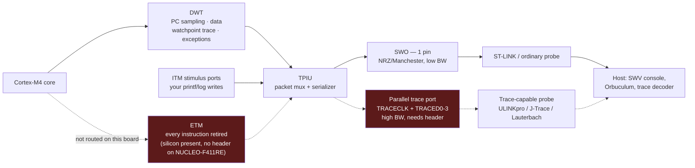

# Instruction and Event Tracing

There is a category of bug that a breakpoint destroys by looking at it, and a log line destroys almost as thoroughly. A race between two interrupts, an occasional priority inversion, a state machine that takes a wrong branch once in ten thousand iterations — halting the core to inspect any of these changes exactly the timing that produced them, and a `printf` line inserted to catch them costs enough cycles to close the window it was supposed to observe. [The Debug Toolbox](./the-debug-toolbox.md)'s perturbation table already ranks every instrument in this folder by how much it disturbs the thing it is measuring; trace is the answer at the bottom of that table, the one built specifically to be close to zero.

The mental model: **trace hardware watches the bus, it does not interrupt the program running on it.** A breakpoint is a request the core has to service — it stops. A software log line is an instruction your program executes — it costs cycles it would not otherwise spend. Trace is neither: dedicated silicon on the die observes addresses, data values and instruction retirement as they happen, packages what it sees, and streams it off-chip through a path that exists purely for this purpose. The core does not know it is being watched, with one partial exception — the ITM, which is a peripheral your code writes to on purpose, and which this page distinguishes carefully from the parts of the pipeline that watch passively.

What trace buys you is not free in a different currency: bandwidth off the chip, and in the case of full instruction trace, pins the board may not have wired out at all. The rest of this page is about that trade — which of the three trace sources on a Cortex-M4 gives you what, at what hardware cost, and how the data actually leaves the package.

:::info[Prerequisites]
[SysTick and the Core Peripherals](../02-processor-architecture/systick-and-core-peripherals.md) owns the DWT cycle counter and the ITM's register-level bring-up — the `TRCENA` bit, the lock key, `ITM_TCR`/`ITM_TER` — and this page does not repeat that setup. [Logging Without Breaking Timing](./printf-debugging-done-right.md) already worked through SWO and ITM as a log transport in detail, including the SWO bandwidth derivation; this page's ITM section is about what else rides that same pipe, not the logging use case again. [SWD, JTAG, and GDB](./swd-jtag-and-gdb.md) covers the DWT's other job — watchpoints that halt the core — which this page's data-watchpoint tracing is the non-halting alternative to.
:::

## Three ways to watch a program, and what each actually costs

| Technique | What generates the record | Cost to the running program |
|---|---|---|
| Breakpoint | A comparator halts the core on match | The core stops. Unbounded, until resumed |
| Software log (`printf`, RTT, a manual event buffer) | Your code executes an instruction to record the event | Cycles per call — from ~10 ns for an ITM store to milliseconds for a blocking UART line |
| Hardware trace (DWT, ITM packet generation, ETM) | Dedicated silicon watches the bus and emits a packet | Effectively zero core-side cost; the cost moves entirely off-chip, to trace bandwidth |

That third row is the whole argument for this page. The DWT does not execute an instruction to notice that `PC` reached a value or that a watched address was written — it is comparator hardware sitting on the bus, built for exactly this. The catch, and it is a real one, is that "the cost moves off-chip" is not "the cost disappears": a full instruction trace at core clock speed produces vastly more data than a single SWO pin can carry, which is precisely why three different trace sources exist at three different price points rather than one.

## DWT: watching the bus without stopping it

The DWT's cycle counter — `CYCCNT` — is the part everyone enables first, and [SysTick and the Core Peripherals](../02-processor-architecture/systick-and-core-peripherals.md) covers it. The DWT does two more things that belong specifically in a trace discussion, because both turn a debugger operation that normally halts the core into one that does not:

- **PC sampling.** Instead of a watchpoint that halts on an address match, the DWT can periodically emit the current `PC` as a trace packet — a statistical profiler built into the silicon. Sample often enough over a long enough run and the distribution of captured addresses approximates where the core actually spends its time, entirely without instrumenting the code and without the intrusiveness of single-stepping through it.
- **Data watchpoint trace.** [SWD, JTAG, and GDB](./swd-jtag-and-gdb.md)'s `watch` command programs a DWT comparator to *halt* the core on a match. The same comparator hardware can instead be configured to emit a trace packet containing the PC and the data value on a match, with the core left running. This is the non-intrusive version of "what wrote this variable" — useful specifically when halting on every hit would itself perturb the bug, such as a corruption that only reproduces under sustained, uninterrupted load.
- **Exception trace.** Entry and exit of every exception — including which one and at what cycle — comes out as its own packet type, which is how a trace decoder reconstructs interrupt nesting and latency after the fact instead of inferring it from a handful of GPIO markers.

None of this requires the core to execute anything extra. The comparator hardware is watching the same address and data buses the core already uses; generating a packet is a side effect of a compare that was going to happen in silicon regardless.

## ITM: the pipe, and what else rides it

[Logging Without Breaking Timing](./printf-debugging-done-right.md) covers the ITM as a logging transport — stimulus port writes, the FIFO, the unguarded-write hang — in the depth that topic deserves, and this page does not restate it. What belongs here is the fact that page mentions only in passing: **the DWT's packets are not a separate physical channel. They are multiplexed onto the same ITM/TPIU pipe as your stimulus-port writes**, distinguished by packet type rather than by wire. A PC-sample packet, an exception-trace packet and your own `ITM->PORT[0]` log write all leave the chip over the same SWO pin (or the same parallel trace port, on hardware that has one), interleaved by the ITM's packet formatter. This is why enabling verbose DWT tracing on a device already using ITM for logging directly eats into the log channel's own bandwidth — they are competing for the same pipe, not two independent ones.

## ETM: full instruction trace, and why this board mostly cannot have it

The DWT and ITM answer "what happened at these specific points" — a sample, a watched write, an exception. The **Embedded Trace Macrocell** answers a stronger question: **every instruction the core retired**, compressed and streamed continuously, with enough information for an offline tool to reconstruct the exact path taken through the code, branch by branch, including branches a breakpoint-based session would never have stopped you at. It is the only tool in this folder that can answer "what did the code actually do, completely, leading up to this crash" without having anticipated the question in advance with a log statement.

The cost is what makes it rare in practice rather than routine. Full instruction trace at core clock speed is a very high data rate, and SWO's single pin cannot carry it — ETM output needs the **parallel trace port**: a dedicated `TRACECLK` plus up to four `TRACED[3:0]` data lines, multiplexed through the same TPIU that also serves SWO, and captured by a probe built for the purpose (Lauterbach, Arm's ULINKpro, SEGGER's J-Trace) rather than an ordinary ST-LINK or CMSIS-DAP clone.

:::note[The part has ETM; the board mostly does not give you access to it]
The STM32F411xC/E does implement ETM, with `TRACECLK` and `TRACED[3:0]` broken out on dedicated pins (DS10314, pin definitions). What most Nucleo-64 boards — including the **NUCLEO-F411RE** — do not provide is the 20-pin trace connector that exposes those signals to a probe; the Nucleo-64 form factor is built around ST-LINK's SWD debug header, not a full trace header, and the trace pins are only reachable by hand-soldering to the MCU pads or fitting a specialized breakout. Full ETM instruction trace is real silicon on this part and a genuinely impractical acquisition on this specific board without extra hardware. The trace source that is always available on a stock NUCLEO-F411RE is DWT and ITM over the single SWO pin the ST-LINK already wires up — which is the trace path most of this page and [Logging Without Breaking Timing](./printf-debugging-done-right.md) actually assume.
:::

The dotted paths are the ones that need hardware a stock NUCLEO-F411RE does not have. Everything solid is available today, over the SWD header already on the board.

## SystemView, Tracealyzer, and the RTOS layer above this one

Once ITM (or RTT) is carrying a stream of events off the chip, an RTOS can log its own scheduling events — task switch, ISR entry, queue send — into that same pipe, and a tool on the host reconstructs a timeline of *tasks* rather than instructions. [Debugging and Tracing an RTOS](../07-rtos/rtos-debugging-and-tracing.md) owns SEGGER SystemView and Percepio Tracealyzer in full — the trace pipeline, the streaming-versus-snapshot trade, and the specific failure mode of a blocking RTT channel corrupting the very timing it is trying to measure. This page's contribution is the layer underneath: SystemView's ITM/RTT transport option is riding exactly the ITM pipe described above, and its snapshot mode is exactly the DWT-style "capture the state, decode later" pattern applied to kernel events instead of PC samples.

## `ftrace` and `perf`, a different world one level up

Everything above is specific to a Cortex-M running bare-metal or RTOS firmware, where there is no operating system to instrument and the trace hardware is the only game in town. The moment the target is an embedded Linux board rather than a microcontroller, the picture inverts: the kernel itself carries a rich tracing infrastructure — `ftrace`'s function and scheduling tracers, `perf`'s hardware performance-counter sampling and software event tracepoints — implemented largely in software, hooked into specific, deliberately placed instrumentation points rather than watched passively off a bus. It answers the same category of question ("what happened, in order, leading up to this") with a different mechanism and a different cost model: `ftrace`'s ring buffer and `perf`'s sampling both cost real CPU time and cache pressure, in exchange for needing no dedicated trace silicon or extra pins at all. Cortex-M DWT/ITM/ETM and Linux `ftrace`/`perf` solve the same class of problem for two different classes of target, and knowing which world you are in decides which of the two you reach for — this page and this folder are about the former.

## Using trace to find the fault a breakpoint would perturb away

The case this page exists for: an interrupt handler occasionally reads a variable mid-update from a lower-priority context, producing a torn value once in a very long while. A breakpoint set inside the handler to inspect the read changes exactly the interleaving that produces the bug — stopping there gives the lower-priority code all the time it needs to finish, and the race that only exists in a few-cycle window closes the instant you look at it. A watchpoint on the variable has the same problem: halting on every write, at production load, changes the schedule enough that the specific interleaving may never recur.

Data watchpoint *trace* — the DWT comparator emitting a packet instead of halting — sidesteps both. Every write to the variable is logged with its PC and value while the system runs at full, unperturbed speed; exception trace on the same stream shows exactly which interrupt was active at each write. Enough samples and the torn-value event shows up in the trace as an ordinary write from the wrong context, with the preceding interrupt-entry packet naming which handler was running when it happened — the same conclusion a `watch` breakpoint would have given you, reached without ever making the core stop.

:::warning[A profiler that lies about which function is hot, and a trace tool that draws a confident line through missing data]
**PC sampling aliasing with a periodic workload.** A statistical PC-sample profile assumes the sample instants are effectively random with respect to what the code is doing. If the sampling interval happens to be a near-multiple of a loop's period — a control loop running at a fixed tick, or a busy-wait with a stable duration — the sampler can land in the same phase of that loop on almost every sample, and the reported hot spot is wherever that phase happens to be, not where the time is actually going. The tell is a profile that looks implausibly concentrated in a small, fast-looking function while a known-expensive one barely registers. Vary the sample rate, or sample on an unrelated interrupt source, and see whether the profile changes shape; if it does, you were aliased.

**A trace decoder reconstructing a plausible but wrong timeline from a stream with dropped packets.** [Logging Without Breaking Timing](./printf-debugging-done-right.md) already names the ITM overflow flag and the packets it silently discards when the FIFO saturates. The failure specific to *trace* rather than plain logging is what happens next: a host-side trace tool does not know packets are missing unless it checks the overflow indicator, so it happily draws a continuous, self-consistent timeline out of a stream with gaps — an exception that appears to run for an implausibly long time, or an event that appears to precede its own cause, because the packets that would have shown the true ordering were dropped and nothing in the displayed trace says so. The DWT and ITM overflow bits exist precisely to catch this; check them before trusting causality in a reconstructed trace, the same way [Logic Analyzer Workflows](./logic-analyzer-workflows.md) warns against trusting a clean protocol decode without checking the electrical signal underneath it.
:::

## See also

- [Logging Without Breaking Timing](./printf-debugging-done-right.md) — SWO and ITM as a log transport in full depth, the FIFO overflow behaviour, and the bandwidth derivation this page's ITM section builds on rather than repeats.
- [SWD, JTAG, and GDB](./swd-jtag-and-gdb.md) — the halting version of a data watchpoint, and the DWT comparator count this page's non-halting trace mode shares with it.
- [The Debug Toolbox](./the-debug-toolbox.md) — the full perturbation-cost table trace sits at the bottom of, and the ordering principle of preferring the least-intrusive instrument.
- [Debugging and Tracing an RTOS](../07-rtos/rtos-debugging-and-tracing.md) — SystemView and Tracealyzer, the kernel-event layer built on top of the ITM/RTT pipe described here.
- [SysTick and the Core Peripherals](../02-processor-architecture/systick-and-core-peripherals.md) — the DWT and ITM register-level bring-up this page assumes is already done.

## References

- STMicroelectronics — [**PM0214**, *STM32 Cortex-M4 MCUs and MPUs programming manual*](https://www.st.com/resource/en/programming_manual/pm0214-stm32-cortexm4-mcus-and-mpus-programming-manual-stmicroelectronics.pdf), consulted at **Rev 10** (March 2020). The DWT chapter for PC sampling, data-trace packet generation as the non-halting alternative to a data-comparator match, and exception-trace packet generation; the ITM chapter for the packet multiplexing between stimulus-port writes and DWT-sourced packets on the same pipe.
- Arm — [**CoreSight Architecture Specification**](https://developer.arm.com/documentation/ihi0029/latest/) and the [**CoreSight technical introduction**](https://developer.arm.com/Architectures/CoreSight). The trace funnel and TPIU that multiplex ITM and ETM sources onto SWO or the parallel trace port, and the general architecture every trace-capable Cortex-M implements a subset of.
- Arm — [***Armv7-M Architecture Reference Manual***](https://developer.arm.com/documentation/ddi0403/latest/), **DDI 0403E.e**, Appendix C1 "Debug". The normative DWT and ITM packet formats this page's mermaid diagram and packet-multiplexing description are drawn from.
- STMicroelectronics — [**DS10314**, *STM32F411xC/E datasheet*](https://www.st.com/resource/en/datasheet/stm32f411ce.pdf), consulted at **Rev 8** (January 2024). The pin definition tables confirming `TRACECLK`/`TRACED[3:0]` are implemented on this part, which is the source for this page's note about ETM being present in silicon but not exposed on a stock NUCLEO-F411RE.
- SEGGER — [**SystemView User Guide**](https://www.segger.com/products/development-tools/systemview/). The RTOS-event tracer built on top of the ITM/RTT transport described above; see [Debugging and Tracing an RTOS](../07-rtos/rtos-debugging-and-tracing.md) for the full treatment.
