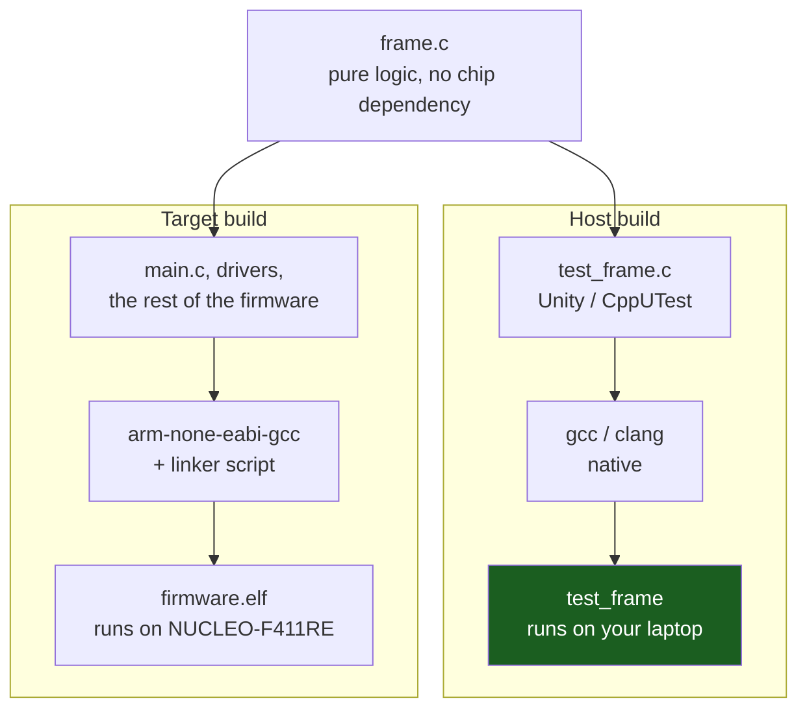

# Unit Testing Firmware

The ordinary embedded development loop is: change a line, build, flash, power-cycle or reset, and watch a UART or an LED to see whether the change did what you meant. On a fast board with a fast probe that loop is a few seconds; on a slow one, or one shared with a bench full of other work, it is tens of seconds, and every one of those seconds is spent re-verifying code paths that had nothing to do with the line you just changed. A state machine with a dozen transitions and a handful of edge cases does not get thoroughly exercised at that cadence — it gets exercised until the one case someone thought to try passes, and the rest ride along untested until a customer finds them.

The alternative is not exotic: compile the logic under test with the host's own compiler, link it against a test framework, and run it as an ordinary executable. No board, no probe, no flashing. [Writing a Driver Worth Reusing](../05-peripherals-and-drivers/writing-a-portable-driver.md) already made the structural argument for why this works — a driver whose device layer has no chip dependency is, by construction, a driver that compiles for the host — and closed with the load-bearing claim that a host build target is not a testing convenience bolted on afterwards, it is the *proof* the seam is real. This page is what you do once that build exists: which framework runs the tests, how to structure a test around the seam, and — the part that gets skipped when a team is excited about their new fast test suite — what a green test run has not told you.

The payoff is not "tests are good practice." It is concrete and measurable: a five-minute reflash-and-squint cycle on a state machine with several dozen transitions becomes a sub-second `ceedling test:all` that exercises every transition, every time, on every commit, without a board on the desk.

:::info[Prerequisites]
[Writing a Driver Worth Reusing](../05-peripherals-and-drivers/writing-a-portable-driver.md) owns the layered structure and the injectable seam this page's tests are written against — read it first; this page does not re-derive the layering, only what to do with it once you are writing tests. [Mocking Hardware](./mocking-hardware.md) is the companion page for the case where the logic under test *does* touch a peripheral seam and needs a fake on the other end of it, rather than being pure logic with no hardware dependency at all.
:::

## What "the logic" means, and what it excludes

Not all firmware is equally testable off the target, and the useful line to draw is not "driver code" versus "application code" — it is **does this function's behaviour depend on real time passing, a real bus responding, or a real interrupt firing, or is it a pure computation on its inputs.** A CRC routine, a protocol frame parser, a state machine that reacts to abstract events, a filter, a unit conversion, a ring-buffer's index arithmetic — none of these care whether they are running on an STM32 or your laptop. Register access, ISR entry, and anything gated on `DWT->CYCCNT` or a peripheral status flag do care, and belong on the other side of a seam a host test either mocks (see [Mocking Hardware](./mocking-hardware.md)) or does not attempt to exercise at all.

A small frame parser is a clean example precisely because it needs nothing:

```c title="frame.h — no hardware dependency whatsoever"
#ifndef FRAME_H
#define FRAME_H
#include <stdint.h>
#include <stddef.h>

typedef enum { FRAME_OK = 0, FRAME_BAD_LENGTH, FRAME_BAD_CHECKSUM } frame_status_t;

/* Wire format: [LEN][PAYLOAD...][CHECKSUM] — checksum is the XOR of LEN and PAYLOAD. */
frame_status_t frame_parse(const uint8_t *buf, size_t n,
                            uint8_t *out_payload, size_t *out_len);

#endif
```

This compiles under `arm-none-eabi-gcc` for the target and under the host's own `gcc` or `clang` unmodified — nothing in the signature or the implementation names a register, a peripheral, or a chip.

## Two builds, one source tree



`frame.c` is compiled twice, by two different toolchains, into two binaries that never run on the same machine. Nothing about the source file changes between them — if it did, the host build would no longer be proving anything about the code that ships. The host binary runs in milliseconds and reports pass/fail on `stdout`; the target binary runs on the board and does everything else firmware does. Keeping both builds alive as first-class citizens of the same build system — not the host build as an afterthought — is what makes "run the tests" a reflex instead of a chore.

## Unity, CppUTest, and choosing between them

Both are C/C++ test frameworks built with embedded constraints in mind — small footprint, no dependency on a hosted C++ runtime beyond what CppUTest itself needs, and a syntax light enough to write quickly. They differ in language and in how assertions read.

<Tabs>
<TabItem value="unity" label="Unity (C)">

```c title="test_frame.c"
#include "unity.h"
#include "frame.h"

void setUp(void) {}
void tearDown(void) {}

void test_frame_parse_should_ReturnPayloadForValidFrame(void)
{
    uint8_t wire[] = { 0x02, 0xDE, 0xAD, 0xDE ^ 0xAD ^ 0x02 };
    uint8_t payload[8];
    size_t  len = 0;

    frame_status_t st = frame_parse(wire, sizeof wire, payload, &len);

    TEST_ASSERT_EQUAL(FRAME_OK, st);
    TEST_ASSERT_EQUAL_UINT8_ARRAY(((uint8_t[]){0xDE, 0xAD}), payload, 2);
}

void test_frame_parse_should_RejectBadChecksum(void)
{
    uint8_t wire[] = { 0x02, 0xDE, 0xAD, 0x00 };  /* wrong checksum byte */
    uint8_t payload[8];
    size_t  len = 0;

    TEST_ASSERT_EQUAL(FRAME_BAD_CHECKSUM,
                       frame_parse(wire, sizeof wire, payload, &len));
}

int main(void)
{
    UNITY_BEGIN();
    RUN_TEST(test_frame_parse_should_ReturnPayloadForValidFrame);
    RUN_TEST(test_frame_parse_should_RejectBadChecksum);
    return UNITY_END();
}
```

</TabItem>
<TabItem value="cpputest" label="CppUTest (C++ harness, C under test)">

```cpp title="test_frame.cpp"
#include "CppUTest/TestHarness.h"
extern "C" {
#include "frame.h"
}

TEST_GROUP(FrameParser) { };

TEST(FrameParser, ReturnsPayloadForValidFrame)
{
    uint8_t wire[] = { 0x02, 0xDE, 0xAD, 0xDE ^ 0xAD ^ 0x02 };
    uint8_t payload[8];
    size_t  len = 0;

    frame_status_t st = frame_parse(wire, sizeof wire, payload, &len);

    LONGS_EQUAL(FRAME_OK, st);
    MEMCMP_EQUAL(((uint8_t[]){0xDE, 0xAD}), payload, 2);
}

TEST(FrameParser, RejectsBadChecksum)
{
    uint8_t wire[] = { 0x02, 0xDE, 0xAD, 0x00 };
    uint8_t payload[8];
    size_t  len = 0;

    LONGS_EQUAL(FRAME_BAD_CHECKSUM, frame_parse(wire, sizeof wire, payload, &len));
}
```

</TabItem>
</Tabs>

The practical difference is less about capability than ecosystem. **Unity** is plain C, has no runtime dependency beyond the C standard library, and is the natural choice when the target toolchain itself is C-only or when you want the test binary's build to look as close as possible to the firmware's own. **CppUTest** is C++ (testing C code through an `extern "C"` boundary, as above, is the normal pattern) and ships with its own memory-leak detector and mocking library, **CppUMock**, built in rather than bolted on — worth knowing if the project is going to need mocks and would rather not add a code-generation step to get them. Both run the same way at the end: an executable, invoked from the command line or from CI, that prints pass/fail and returns a nonzero exit code on failure.

**Ceedling** is not a third framework competing with the first two — it is a Rake-based build tool that wraps Unity (and CMock, its companion mocking generator) and removes the boilerplate: it finds test files by naming convention, generates the `main()` runner shown by hand above, builds a mock header automatically from a real one when a test asks for it, and reports results uniformly.

```bash
ceedling test:all              # every test file in the project
ceedling test:TestFrame        # one test executable, by name
```

A `project.yml` declares source and test paths, the toolchain, and any `:defines` a specific test executable needs — the point of the tool is that a new test file dropped into the configured test directory is picked up and built without editing a makefile. (Ceedling documentation checked 2026-08-27.)

## Testing a state machine: the thing this approach is actually for

A parser is a clean first example; a state machine is where host testing earns its keep, because a state machine's defect surface is combinatorial — inputs times states — and a bench session only ever walks one path through it at a time.

```c title="Exercising every transition without a board"
void test_charger_sm_should_GoToFaultOnOvertempFromAnyState(void)
{
    charger_state_t start_states[] = { CHG_IDLE, CHG_PRECHARGE, CHG_FAST_CHARGE, CHG_TOPOFF };

    for (size_t i = 0; i < sizeof(start_states) / sizeof(start_states[0]); i++) {
        charger_sm_t sm;
        charger_sm_init(&sm, start_states[i]);

        charger_sm_handle_event(&sm, EVT_OVERTEMP);

        TEST_ASSERT_EQUAL_MESSAGE(CHG_FAULT, charger_sm_state(&sm),
                                   "overtemp must fault from every reachable state");
    }
}
```

That loop is the argument in miniature: four starting states checked against one invariant, in a test that runs in microseconds and can be run on every commit. Finding the same defect on a bench means being in precharge state, at the right temperature, at the moment you happen to be watching — a much longer and much less repeatable search.

## What a host test does not prove — and it is a hard limit, not a caveat

Say this plainly, because it is the single most common way a team over-trusts a green test suite: **a host test proves your logic is correct. It proves nothing about your understanding of the hardware.** The frame parser above will pass every test whether or not the real UART DMA that feeds it bytes is configured correctly, whether the real checksum algorithm matches what the far end's silicon actually computes, or whether an interrupt priority lets the parser run before the buffer it reads is overwritten. None of those are logic questions the test exercises; all of them are questions about the world outside the seam, and the seam is exactly the boundary a host test cannot see across by construction.

This is not a flaw in the technique, it is what makes the technique fast — a test that also verified DMA wiring would need the DMA, and would run at hardware speed with hardware flakiness, which is the whole problem host testing exists to avoid. The correct response is not to distrust host tests; it is to pair them deliberately with the checks that *do* see the hardware:

- [HardFault Forensics](./hardfault-debugging.md)'s procedure catches the class of bug a host test cannot even represent — a wrong register, a bad pointer into a peripheral, a stack that ran into a guard region. No amount of passing logic tests prevents a fault caused by code the tests never touch.
- [Logic Analyzer Workflows](./logic-analyzer-workflows.md) is where you confirm the bytes a driver claims to have sent are the bytes that actually left the pin, at the timing the datasheet requires — a question a host build, with no bus to put bytes on, cannot ask.

A green host test suite is a necessary condition for shipping firmware you trust and an insufficient one. Treat "the logic is right" and "the hardware does what the logic assumes" as two separate claims that need two separate kinds of evidence, and do not let a fast, satisfying test run stand in for the on-target check it was never designed to replace.

:::warning[The host test that passes because it tests the mock, not the code]
A subtler version of the limit above, and the one that erodes trust in a test suite from the inside: a test written against a hand-rolled fake that has quietly drifted from what the real hardware does. Someone writes a fake I²C bus that always ACKs, always returns the bytes the test expects, and never times out — and every test built on it passes forever, including after a genuine regression that would make the real device NACK. The suite is green, the driver is broken, and nothing in the test run says so, because the test was verifying that the code correctly calls a fake that no longer resembles the datasheet. The symptom in the field is a driver that "worked in CI" and fails on every board. [Mocking Hardware](./mocking-hardware.md) covers the discipline that prevents this — keeping a fake's behaviour traceable to the datasheet rather than to whatever made an early test pass — and it is worth internalising before writing the first fake: a test suite is only as honest as the fakes underneath it.
:::

## See also

- [Writing a Driver Worth Reusing](../05-peripherals-and-drivers/writing-a-portable-driver.md) — the layered structure and the injectable seam this page's tests are written against, and the argument that a host build is proof the seam is real.
- [Mocking Hardware](./mocking-hardware.md) — the companion technique for logic that does touch a peripheral seam, and keeping the fake on the other end honest against the datasheet.
- [Static Analysis and Sanitizers](./static-analysis-and-sanitizers.md) — running ASan/UBSan against the same host test binaries described here, for defect classes a passing assertion does not catch.
- [HardFault Forensics](./hardfault-debugging.md) — the on-target check that catches what a host test structurally cannot: a fault caused by code the tests never exercised in a real memory map.
- [Logic Analyzer Workflows](./logic-analyzer-workflows.md) — confirming what a driver claims to have sent actually left the pin, the question a host build has no bus to ask.

## References

- ThrowTheSwitch — [**Unity Assertions Reference**](https://github.com/throwtheswitch/unity/blob/master/docs/UnityAssertionsReference.md) and [**Unity Getting Started Guide**](https://github.com/throwtheswitch/unity/blob/master/docs/UnityGettingStartedGuide.md). The `TEST_ASSERT_EQUAL_*`, array and memory-comparison macro families, `TEST_FAIL`/`TEST_IGNORE`, and the `setUp`/`tearDown`/`RUN_TEST`/`UNITY_BEGIN`/`UNITY_END` structure used above (documentation checked 2026-08-27).
- ThrowTheSwitch — [**Ceedling documentation**](https://github.com/throwtheswitch/ceedling) and [**testing guide**](https://github.com/throwtheswitch/ceedling/blob/master/docs/mkdocs/testing-guide/test-sample.md). `test:all`, `test:<TestName>`, the `project.yml` `:defines` matcher, and the automatic runner generation and mock generation this page's Ceedling section summarizes (documentation checked 2026-08-27).
- CppUTest — [**README and test macro reference**](https://github.com/cpputest/cpputest/blob/master/README.md). `TEST_GROUP`, `TEST`, the `CHECK_EQUAL`/`LONGS_EQUAL`/`STRCMP_EQUAL`/`DOUBLES_EQUAL` assertion family, and CppUMock as the built-in mocking library (documentation checked 2026-08-27).
- James W. Grenning — *Test-Driven Development for Embedded C* (Pragmatic Bookshelf, 2011). The book-length treatment of everything on this page: the dual-target build, writing tests before the hardware exists, and the discipline of keeping a test suite honest about what it does and does not cover. Purchase required.
