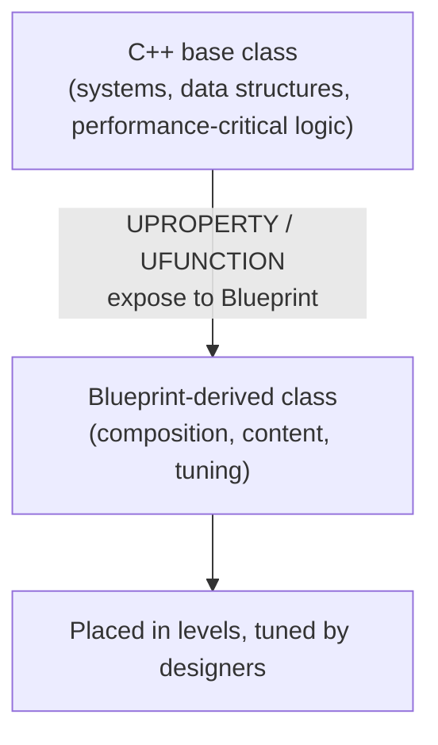

# C++ versus Blueprint

Every doc in this section assumes a specific split: **systems and data live in C++; composition and
tuning live in Blueprint.** That's not a stylistic preference — get this split wrong in either
direction and it costs you later, either as an unshippable performance problem or as a designer team
that can't touch anything without an engineer. This page states the policy explicitly so later docs
can assume it instead of re-arguing it.

## Mental model: two languages, one hierarchy

Blueprint is not a separate toy layer bolted onto "real" C++ code — it's a visual scripting layer that
interacts with whatever functionality C++ exposes to it. Epic's own guidance is to use C++ as the
foundational layer and build Blueprint classes on top of it, exposing the elements Blueprint needs
through specifiers rather than reimplementing engine-level logic in graphs.



A C++ class defines the shape and the rules; a Blueprint subclass fills in content and numbers within
those rules. The C++ class never needs to know which Blueprint subclasses exist — it just needs to
expose the right surface.

## The mechanics of exposing C++ to Blueprint

Two mechanisms cover most of the interop surface:

- **Blueprint subclassing** — a C++ `UCLASS` marked `Blueprintable` can be subclassed in the editor.
  Its `UPROPERTY(BlueprintReadWrite)` fields and `UFUNCTION(BlueprintCallable)` methods become
  editable/callable from the subclass's graph.
- **Blueprint function libraries** — a C++ class extending `UBlueprintFunctionLibrary` exposes static
  functions to every Blueprint graph, without requiring inheritance. This is the right shape for
  stateless helpers (math, string formatting, gameplay queries) rather than per-actor behavior.

```cpp showLineNumbers title="AInteractableActor.h"
UCLASS(Blueprintable)
class MYGAME_API AInteractableActor : public AActor
{
    GENERATED_BODY()

public:
    AInteractableActor();

    // Designers tune this per-placed-instance in the editor; C++ owns the type and default.
    UPROPERTY(EditAnywhere, BlueprintReadWrite, Category = "Interaction")
    float InteractionRadius = 150.f;

    // Callable from Blueprint graphs; implemented in C++ where the logic actually needs to live.
    UFUNCTION(BlueprintCallable, Category = "Interaction")
    void Interact(AActor* Instigator);

    // Lets a Blueprint subclass extend the C++ implementation without overriding it entirely.
    UFUNCTION(BlueprintImplementableEvent, Category = "Interaction")
    void OnInteracted(AActor* Instigator);
};
```

```cpp showLineNumbers title="GameplayMathLibrary.h"
UCLASS()
class MYGAME_API UGameplayMathLibrary : public UBlueprintFunctionLibrary
{
    GENERATED_BODY()

public:
    UFUNCTION(BlueprintCallable, Category = "Gameplay|Math")
    static float ApplyDamageFalloff(float BaseDamage, float Distance, float MaxRange);
};
```

## Why this split, specifically

**C++ for systems and data** because:

- Performance-critical or hot-path logic (per-frame ticks over many actors, math-heavy calculations)
  compiles to native code instead of being interpreted through the Blueprint virtual machine.
- Data structures, save-game formats, and networking-replicated state need a stable, refactorable
  representation — C++ types and compiler-checked changes are safer to evolve than a web of Blueprint
  graphs referencing the same struct.
- Source control handles C++ text files (real diffs, real merges) far better than Blueprint assets,
  which are effectively binary and merge-conflict badly.

**Blueprint for composition and tuning** because:

- Designers iterate on placement, timing, and numeric tuning without a recompile — that's the entire
  value proposition of Play In Editor plus Blueprint.
- Content-side wiring (this trigger fires that particle effect) doesn't need engineering review on
  every change; a code review process for numeric tuning is friction with no payoff.

## Failure modes of both extremes

:::warning All-Blueprint gameplay logic
Whole gameplay systems built entirely in Blueprint graphs tend to degrade the same way over a
project's lifetime: growing, hard-to-navigate graphs; merge conflicts that can't be resolved with a
text diff, only by redoing one person's changes; and per-frame logic that's measurably slower than the
equivalent C++ once profiled. It's the natural failure mode of "no engineer wanted to write the C++
class," not a deliberate architectural choice.
:::

:::warning All-C++, no exposed surface
The opposite failure is a C++ class that hardcodes every tunable value and every level-specific
behavior, leaving designers no lever to pull without filing a ticket. This defeats Blueprint's actual
purpose and turns every content iteration into an engineering bottleneck — usually a sign that
`UPROPERTY(EditAnywhere)` and `BlueprintImplementableEvent` were skipped where they were needed.
:::

:::caution Recompiling C++ is not free
A C++ change forces a rebuild and, depending on what changed, an editor restart — much slower than a
Blueprint edit. This is itself a reason to push genuinely volatile, frequently-tuned values (not
structural logic) into Blueprint-editable properties rather than C++ constants.
:::

## See also

- [Mastery roadmap](./mastery-roadmap.md) — where this decision first comes up in practice.
- [Engine architecture map](./engine-architecture-map.md) — where C++ systems sit relative to content.
- [Exposing C++ to Blueprint](../04-blueprint-interop/exposing-cpp-to-blueprint.md) — the specifiers in
  depth.
- [C++ base, Blueprint derived](../04-blueprint-interop/cpp-base-blueprint-derived.md) — this pattern,
  expanded.
- [Blueprint function libraries](../04-blueprint-interop/blueprint-function-libraries.md) — the
  `UBlueprintFunctionLibrary` pattern in depth.
- [Epic's C++ vs Blueprint guidance](https://dev.epicgames.com/documentation/unreal-engine/coding-in-unreal-engine-blueprint-vs-cplusplus) — the authoritative source for this split.
