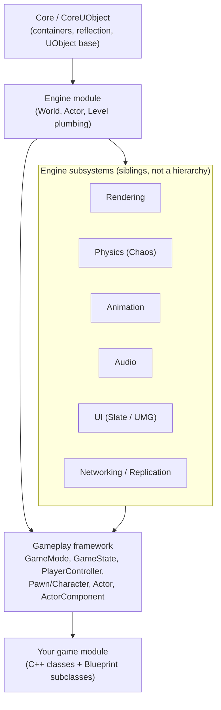

# Engine architecture map

Every later doc in this section assumes you can place a new piece of knowledge somewhere on a map.
"Where does this subsystem sit relative to the gameplay framework?" is the question you'll ask
constantly once you're past the tutorial stage — a `UActorComponent` that talks to physics behaves
differently from one that talks to rendering, and neither behaves like a `Subsystem` that talks to
neither. Without this map, every new concept looks like a flat, undifferentiated pile of UE-specific
jargon.

## Mental model: layers, not a flat list

Unreal Engine's C++ is organized in dependency layers. Lower layers know nothing about higher ones —
`Core` has no idea `Engine` exists, and `Engine` has no idea your game module exists. Your gameplay
code sits at the top, consuming subsystems it does not own.

Read the diagram as: **Core** gives you `UObject`, reflection, and containers; **Engine** builds
`World`/`Level`/`Actor` plumbing on top of that; the **subsystems** (rendering, physics, animation,
audio, UI, networking) are peers that the engine layer wires together per-`Actor` via components; the
**gameplay framework** is the set of base classes (`AGameModeBase`, `APawn`, `ACharacter`,
`APlayerController`, and friends) that give those pieces game-specific meaning; and **your game** is
Blueprint and C++ classes derived from the framework.

## How the gameplay framework threads through the subsystems

The gameplay framework doesn't compete with rendering, physics, or animation — it's the layer that
directs them per-actor:

- A `APawn` (or its common subclass, `ACharacter`) is the physical stand-in for a player or AI in the
  world. It owns components — a mesh component talks to **rendering**, a collision/movement component
  talks to **physics**, a skeletal mesh + anim instance on `ACharacter` talks to **animation**.
- A `AController` (`APlayerController` for a human, `AAIController` for AI) is non-physical — it has
  no location of its own in the world and exists purely to *possess* a Pawn and feed it input or
  decisions.
- `AGameModeBase` spawns and owns `AGameStateBase`, which replicates game-wide state to every client;
  `AGameModeBase` itself is server-only and never replicates.
- The **physics** subsystem (built on Chaos) handles collision, raycasts/traces, destruction, and
  cloth/hair simulation underneath whatever component requested it — a `UPrimitiveComponent` asks
  physics to simulate; it doesn't implement simulation itself.
- **Networking/replication** cuts across all of the above rather than sitting beside them: any
  `AActor` can be marked to replicate, and `UPROPERTY(Replicated)` fields on it are what
  synchronizes state across the wire.

None of these subsystems are things you instantiate directly day to day — you configure them through
the Actor/Component API and let the engine layer drive them each frame.

## Where subsystems (the C++ kind) fit

Don't confuse "engine subsystems" in the architectural sense above with `USubsystem` — a specific C++
base class for auto-instantiated singleton-like objects scoped to an `Engine`, `GameInstance`,
`World`, or local player. A `UGameInstanceSubsystem` is a good home for cross-level manager code that
doesn't belong on any one Actor. That mechanism is covered in
[Subsystems](../02-cpp-in-unreal/subsystems.md); this page is about the bigger architectural picture,
not that one class family.

:::note
Frame-by-frame tick ordering between subsystems (when physics runs relative to animation and
rendering within a single frame) is engine-version- and project-setting-dependent. Not confirmed
against 5.7 in the sources consulted — verify against your engine version and project tick group
configuration before relying on ordering assumptions.
:::

## Gotchas

:::warning[Don't put gameplay logic in the wrong layer]
Code that reaches "down" past the gameplay framework — an `AActor` subclass calling low-level physics
or rendering APIs directly instead of going through its components — is a maintenance trap. It breaks
the composability the component system exists for, and the next person to touch that Actor won't know
where to look for the behavior.
:::

:::caution[GameState is not GameMode with a different name]
`AGameStateBase` exists specifically because `AGameModeBase` is server-only and never replicates. If
you put state a client needs to read (score, match phase, player list) on `GameMode` instead of
`GameState`, it will work in a single-player PIE session and silently fail to reach clients the moment
you test networked. See [Game mode and game state](../03-gameplay-framework/game-mode-and-game-state.md).
:::

## See also

- [What is Unreal Engine 5?](./what-is-unreal-engine.md) — the module/editor/runtime picture this map
  builds on.
- [Mastery roadmap](./mastery-roadmap.md) — the order to actually learn these layers in.
- [Framework overview](../03-gameplay-framework/framework-overview.md) — the gameplay framework
  classes in depth.
- [UObject and reflection](../02-cpp-in-unreal/uobject-and-reflection.md) — what `Core`/`CoreUObject`
  actually provide.
- [Epic's Gameplay Framework overview](https://dev.epicgames.com/documentation/unreal-engine/gameplay-framework-in-unreal-engine) — authoritative source for the framework classes.

