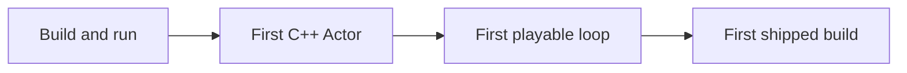

# Mastery roadmap

This section has 18+ folders behind it by the time it's complete, and none of them are meant to be
read cover to cover before you touch the editor. Unreal punishes the "read everything first" approach
specifically: most of its concepts only make sense once you've hit the problem they solve. This page
is the order that avoids the two failure modes — drowning in reference material before you've built
anything, or flailing in the editor with no mental model at all.

## Mental model: milestones, not chapters

Treat the roadmap as a sequence of working states you can demo, not a syllabus. Each milestone should
leave you with something that runs, however small.

## Milestone 1: build and run

Get a stock Third Person or Blank C++ project template compiling and launching, in both the editor
(Play In Editor) and as a standalone packaged build. This alone exercises the toolchain end to end:
[installation](../01-toolchain-and-build/installation-and-versions.md),
[project anatomy](../01-toolchain-and-build/project-anatomy.md), and a first contact with
[Unreal Build Tool](../01-toolchain-and-build/unreal-build-tool.md). Don't write gameplay code yet —
the goal is proving the environment works before you add variables to the problem.

## Milestone 2: first C++ Actor

Write one `AActor` subclass from scratch: a `UPROPERTY`-exposed field, a `UFUNCTION(BlueprintCallable)`
method, a component attached in the constructor. Compile it with
[Unreal Header Tool](../01-toolchain-and-build/unreal-header-tool.md) running behind the scenes,
place it in a level, and confirm [live coding](../01-toolchain-and-build/live-coding-and-hot-reload.md)
lets you iterate without restarting the editor. This milestone is where
[UObject and reflection](../02-cpp-in-unreal/uobject-and-reflection.md) stops being abstract.

## Milestone 3: first playable loop

Wire up the minimum gameplay framework needed for something a player can actually interact with: a
`Pawn`/`Character`, a `PlayerController`, input bound to movement or an action, and a `GameMode` that
starts the match. This is the point where
[cpp-vs-blueprint](./cpp-vs-blueprint.md) stops being a policy statement and becomes a decision you
make constantly — which parts of this loop belong in C++, which in Blueprint.

## Milestone 4: first shipped build

Package a build for a real target platform, not just "Package Project" into a folder you never open.
Confirm the packaged build runs outside the editor, with no editor-only references leaking in. This
milestone exposes the gap between "works in PIE" and "works for a player," which is a recurring theme
across this whole section.

## Signals you're ready to move on

Each milestone has a concrete exit condition — don't advance on a schedule, advance when the signal
is true:

| Milestone | You're done when... |
|-----------|----------------------|
| 1. Build and run | The template launches in PIE **and** as a standalone packaged build, with no build warnings you can't explain. |
| 2. First C++ Actor | You can change a `UPROPERTY` value in the editor, hit Compile, and see the change without restarting the editor. |
| 3. First playable loop | Someone other than you can pick up the packaged build and understand the goal without an explanation. |
| 4. First shipped build | The build runs on a machine that has never had the editor installed. |

## Reference-only folders, by group

Folders in this knowledge base fall into two rough groups. Core-path folders map directly onto the
four milestones above; reference-only folders answer a question when you already know you have it,
and are not meant to be read in sequence.

| Group | Folders | When to read |
|-------|---------|--------------|
| Core path | `01-toolchain-and-build`, `02-cpp-in-unreal`, `03-gameplay-framework`, `04-blueprint-interop` | During milestones 1–3, as each concept becomes relevant. |
| Reference-only (later tranches) | input/movement, UI, AI, animation, audio, rendering, networking, performance, testing/shipping | Once a specific milestone or bug forces the question — not before. |

## What to skip on a first pass

Large parts of this section are reference material, not sequence material. Skip these entirely until
a milestone above actually needs them:

- Anything under a folder whose topic doesn't appear in your current milestone — you do not need
  animation blending to build milestone 2.
- Performance and profiling topics — premature before you have anything expensive to profile.
- Multiplayer and networking topics — real complexity, not needed for a single-player first loop.
- Testing, debugging tooling, and shipping/packaging detail beyond "does it launch" — useful once you
  have something worth protecting with tests, not before.

Treat those folders as reference: come back when a specific milestone or bug forces the question,
not on a fixed schedule.

:::tip[Multiplayer is deferred, not ignored]
If you already know a project needs multiplayer, the *rule* is worth internalizing even before you
reach the dedicated networking material later in this knowledge base: keep authority checks in place,
never assume the local client owns state, and keep gameplay state in replicable containers. Designing
around that rule from milestone 3 onward is far cheaper than retrofitting it after the loop already
assumes single-player authority.
:::

## Gotchas

:::warning[Reference-only does not mean unimportant]
"Skip on a first pass" is about sequencing, not priority. Coding standards, containers, and smart
pointer conventions in [02-cpp-in-unreal](../02-cpp-in-unreal/coding-standard-and-naming.md) matter
from the first line of C++ you write — "skip" here means don't read the whole folder before you write
that first line, not "ignore the conventions."
:::

:::caution[Don't chase 100% engine coverage before shipping anything]
Unreal's surface area is large enough that "I should understand X before I start" is nearly always an
excuse. Every milestone above is reachable with a small, specific slice of the engine — resist the
urge to detour into an unrelated subsystem because it looked interesting in the sidebar.
:::

## See also

- [What is Unreal Engine 5?](./what-is-unreal-engine.md) — orientation before milestone 1.
- [Engine architecture map](./engine-architecture-map.md) — where each milestone's concepts live.
- [C++ vs Blueprint](./cpp-vs-blueprint.md) — the recurring decision inside milestone 3.
- [Learning resources](./learning-resources.md) — material for going deeper once the loop works.
- [Epic's official learning paths](https://dev.epicgames.com/community/learning/paths/7a/welcome-to-unreal-engine) — a parallel, editor-first sequence to this roadmap.
