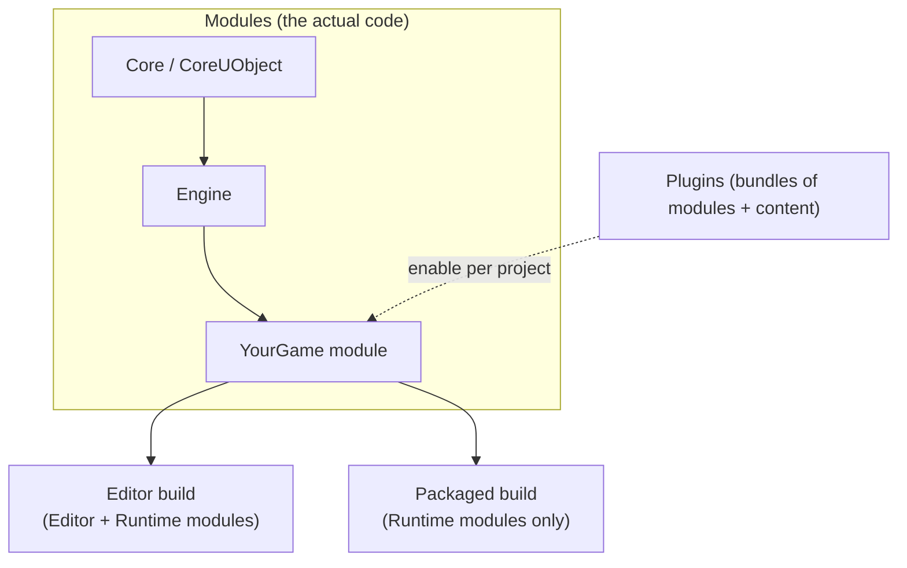

# What is Unreal Engine 5?

Unreal Engine 5 (UE5) is not one program — it is an editor, a runtime, and a large tree of C++
modules that both of those are built from. Treating "the engine" as a monolith is the single most
common source of confusion for newcomers: it leads to searching for one "engine settings file" that
doesn't exist, or assuming a change to editor behavior automatically ships in the packaged game. This
page positions the pieces so the rest of this section — build tooling, C++ conventions, the gameplay
framework — has somewhere to attach.

## Mental model: editor, runtime, modules, plugins

Everything you interact with as "Unreal Engine" is assembled from **modules** — the fundamental
building blocks of the engine's code and architecture. A module is a compilation unit with its own
`.Build.cs` file declaring what it depends on and what it exposes. The Unreal Editor, the game
runtime, and every plugin are all just particular sets of modules loaded together.



**Plugins** are collections of modules and content that can be enabled or disabled per project from
the editor — they are how self-contained features (a networking library, a file format importer, a
gameplay subsystem) travel between projects without becoming a permanent part of your game module.

- **The editor** is a build of the engine with `Editor`-type modules loaded on top of the runtime
  ones: level design tools, asset browsers, Blueprint compiler, all of it C++ under the hood.
- **The runtime** is what actually ships: `Runtime`-type modules only, no editor code, compiled into
  the executable a player launches.
- **Your project** is itself one or more modules (a "game module") that depends on engine modules the
  same way engine modules depend on each other.

This module boundary is why [Unreal Build Tool](../01-toolchain-and-build/unreal-build-tool.md) exists
at all: someone has to resolve "which modules does this target need, in what order" before a compiler
can run.

## The source-available model

Unreal Engine ships two ways: the precompiled Editor from the Epic Games Launcher, or a full source
build downloaded from Epic's GitHub repository after linking your GitHub account to your Epic Games
account. Source builds are not optional extras — some workflows *require* one, most notably console
development, which needs platform-specific engine code that isn't in the launcher build.

Having source access changes how you debug. When a crash bottoms out in `UGameplayStatics::` or a
component you didn't write, you can step into the actual engine implementation instead of guessing
from documentation. It also means "the engine" is something you can grep, patch, and rebuild locally
— most large studios carry a handful of engine-level patches specific to their project.

:::warning Source-available is not open source
You can read and modify the engine source, and redistribute your modified engine internally, but
Unreal Engine ships under Epic's own EULA, not an OSI license. Shipping a commercial product still
means agreeing to Epic's royalty terms above a revenue threshold. "I can see the source" and "I can
do whatever I want with it" are different claims — don't conflate them when a licensing question
actually matters (console porting, middleware redistribution, revenue-sharing deals).
:::

## A first look at the pieces

A minimal game module declares its dependencies in `.Build.cs` — this is the concrete, buildable
expression of the "modules depend on modules" picture above:

```csharp title="MyGame.Build.cs"
using UnrealBuildTool;

public class MyGame : ModuleRules
{
    public MyGame(ReadOnlyTargetRules Target) : base(Target)
    {
        PCHUsage = PCHUsageMode.UseExplicitOrSharedPCHs;

        PublicDependencyModuleNames.AddRange(new[]
        {
            "Core", "CoreUObject", "Engine", "InputCore"
        });
    }
}
```

A plugin adds one more layer of indirection — a manifest describing which modules it ships and when
they load:

```csharp title="MyPlugin.uplugin (conceptually — this file is JSON, not C#)"
// Illustrative structure only; see modules-and-plugins.md for the real .uplugin format.
// { "Modules": [ { "Name": "MyPlugin", "Type": "Runtime", "LoadingPhase": "Default" } ] }
```

:::note
The `.uplugin` manifest format above is JSON in practice, shown here only to keep the module/plugin
relationship visible in one place. See
[Modules and plugins](../01-toolchain-and-build/modules-and-plugins.md) for a real, working example.
:::

## Gotchas

:::warning "It works in the editor" is not proof
Editor-only modules, editor-only Blueprint nodes, and PIE (Play In Editor) conveniences do not exist
in a packaged build. A reference to an editor utility class compiled into gameplay code will fail to
package, sometimes only on the platform you didn't test.
:::

:::caution The launcher build and a source build are different products
A launcher-installed Editor cannot be rebuilt from source, cannot easily be patched at the engine
level, and won't support platforms that require a source build. Decide early which one your project
needs — switching later means re-provisioning the whole toolchain. See
[Installation and versions](../01-toolchain-and-build/installation-and-versions.md).
:::

## See also

- [Engine architecture map](./engine-architecture-map.md) — how the subsystems below "Engine" relate
  to each other.
- [Mastery roadmap](./mastery-roadmap.md) — what to learn first.
- [Modules and plugins](../01-toolchain-and-build/modules-and-plugins.md) — the real `.uplugin` and
  module-loading mechanics.
- [Unreal Build Tool](../01-toolchain-and-build/unreal-build-tool.md) — how `.Build.cs` files become a
  compiled binary.
- [Epic's official engine architecture overview](https://dev.epicgames.com/documentation/unreal-engine/understanding-the-basics-of-unreal-engine) — authoritative source for editor/tooling structure.
