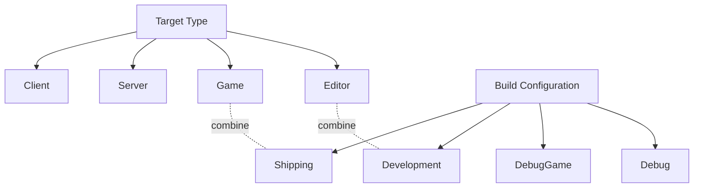

# Build configurations and targets

The dropdown in Visual Studio's toolbar (`DebugGame Editor`, `Development Editor`, `Shipping`, ...)
looks like a single setting, but it's really two independent axes multiplied together: **what kind
of target** you're building, and **what configuration** you're building it in. Picking the wrong
combination is a common source of "why is the editor missing" or "why is this 40x slower than the
shipped game" confusion.

## Mental model: target type × build configuration



A **target** (`EBuildTargetType`: `Game`, `Server`, `Client`, `Editor`, `Program`) decides *which
executable* gets built — does it include the editor UI and tooling, or just the runtime game loop. A
**configuration** decides *how* that executable is compiled — with full debug symbols and no
optimization, or fully optimized with debugging and non-shipping features stripped. Visual Studio's
solution configurations (`DebugGame Editor`, `Development Editor`, `Shipping`, and so on) are exactly
this pair, concatenated.

## Build configurations

| Configuration | Engine code | Game code | Typical use |
|---|---|---|---|
| **Debug** | Debug (unoptimized, full symbols) | Debug | Debugging deep engine issues; rarely used day to day — very slow |
| **DebugGame** | Development (optimized) | Debug (unoptimized, full symbols) | The default for day-to-day game code debugging — fast engine, debuggable game code |
| **Development** | Development (optimized) | Development (optimized) | Default editor configuration; reflects code changes, keeps most debugging/profiling tools |
| **Shipping** | Fully optimized | Fully optimized | Release builds — strips debug tooling, console commands, and non-shipping checks for performance |

`DebugGame` is the one worth internalizing early: it gives you full breakpoint-level debugging in
*your* code while keeping the engine itself compiled in an optimized configuration, which is the
difference between an editor that launches in seconds and one that takes minutes.

:::note
Epic's documented enum also lists a `Test` configuration (Shipping-like optimizations with some
profiling/testing features retained) used mainly for platform certification and automated testing
passes — not something you reach for during normal development.
:::

## Target types

- **Editor** — includes the full editor UI, asset processing, and all `Editor`-typed modules. This
  is what `DebugGame Editor` / `Development Editor` build. Never shipped to players.
- **Game** — the standalone runtime, no editor UI, only `Runtime`-typed modules (see
  [Modules and plugins](./modules-and-plugins.md) for module types). This is what actually ships.
- **Server** — a dedicated-server build: game logic without rendering/audio-heavy client-only
  systems, when your project defines a server target.
- **Client** — the inverse: client-only systems, used in dedicated client/server architectures.
- **Program** — standalone command-line tools built against engine code outside the game/editor
  loop entirely (cook commandlets and similar utilities).

## Reading a Visual Studio configuration name

`DebugGame Editor` means: **DebugGame** configuration, **Editor** target — your game code
unoptimized and debuggable, running inside the full editor. `Shipping` alone (no target suffix
visible because it's implied as `Game`) means the fully optimized, non-editor runtime build that
matches what you'd package and distribute.

```csharp title="MyGameEditor.Target.cs"
using UnrealBuildTool;
using System.Collections.Generic;

public class MyGameEditorTarget : TargetRules
{
	public MyGameEditorTarget(TargetInfo Target) : base(Target)
	{
		Type = TargetType.Editor;
		DefaultBuildSettings = BuildSettingsVersion.Latest;
		IncludeOrderVersion = EngineIncludeOrderVersion.Latest;
		ExtraModuleNames.AddRange(new string[] { "MyGame" });
	}
}
```

```csharp title="MyGame.Target.cs"
using UnrealBuildTool;
using System.Collections.Generic;

public class MyGameTarget : TargetRules
{
	public MyGameTarget(TargetInfo Target) : base(Target)
	{
		Type = TargetType.Game;
		DefaultBuildSettings = BuildSettingsVersion.Latest;
		IncludeOrderVersion = EngineIncludeOrderVersion.Latest;
		ExtraModuleNames.AddRange(new string[] { "MyGame" });
	}
}
```

Both `.Target.cs` files reference the same `MyGame` module and its `Build.cs` — the target only
decides which `TargetType` (and therefore which set of modules by their `EHostType`) gets linked in,
not a separate copy of your gameplay code.

:::warning Shipping strips more than performance
`Shipping` doesn't just optimize — it compiles out console commands, most logging, `ensure`/`check`
diagnostics beyond fatal ones, and any code gated behind `#if !UE_BUILD_SHIPPING` or
`WITH_EDITOR`/`WITH_EDITORONLY_DATA`. Code that works in `Development Editor` but silently no-ops or
behaves differently in `Shipping` is almost always gated behind one of these macros somewhere in its
call chain — test in a `Shipping` (or at least `Development Game`) build before you consider a
feature done.
:::

:::warning DebugGame Editor is not the same as Debug Editor
`Debug` configures the *engine* itself as unoptimized, which makes editor startup and general
interaction painfully slow. Unless you're actively stepping through engine internals, use
`DebugGame Editor` — it keeps the engine fast and only compiles your game module unoptimized.
:::

## See also

- [Unreal Build Tool](./unreal-build-tool.md) — how `Build.cs` and `.Target.cs` relate.
- [Modules and plugins](./modules-and-plugins.md) — how a module's `EHostType` interacts with target type.
- [Live Coding and hot reload](./live-coding-and-hot-reload.md) — why iteration usually happens in `DebugGame Editor`, not `Shipping`.
- [Using the Project Launcher](https://dev.epicgames.com/documentation/unreal-engine/using-the-project-launcher-in-unreal-engine) — Epic's official reference for packaging build configurations.
