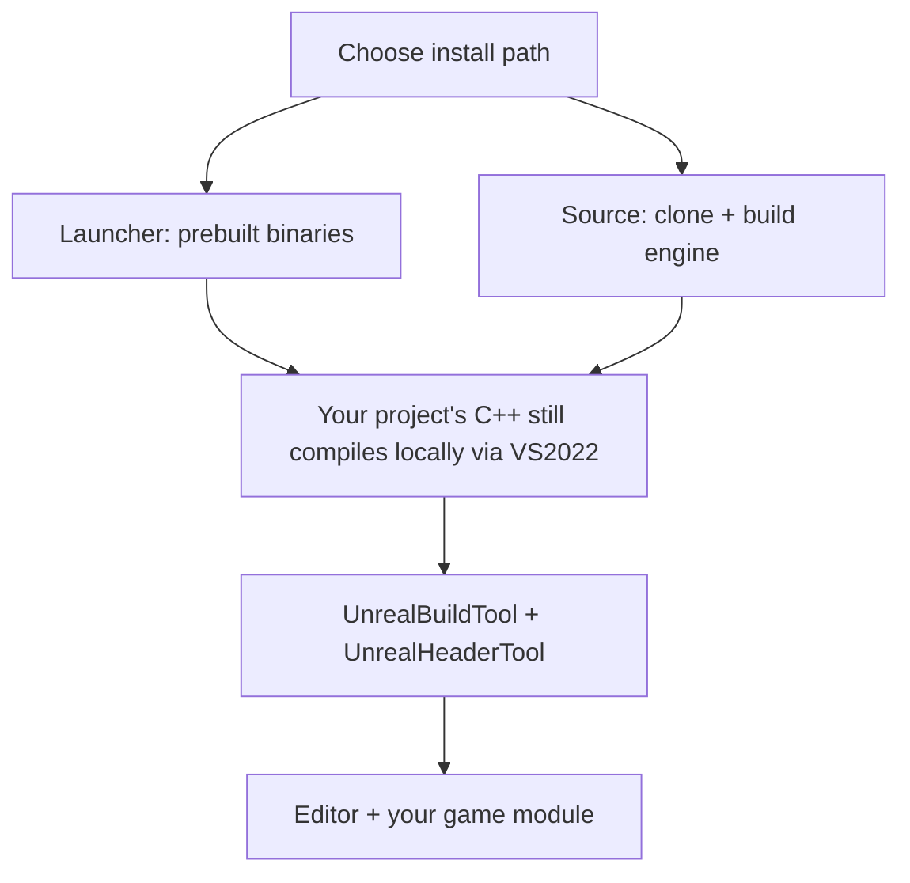

# Installation and versions

Everything downstream — compile times, IntelliSense accuracy, whether Live Coding works at all —
depends on getting the toolchain right before you open the editor. A mismatched Visual Studio
workload or a missing Windows SDK component doesn't fail loudly at install time; it fails an hour
later as an unexplained compile error or a `.uproject` that refuses to generate project files.
This page targets Windows with Visual Studio 2022 and UE 5.7, the combination the rest of this
folder assumes.

## Mental model: two install paths, one editor

There are two ways to get Unreal Engine onto your machine, and they diverge more than the marketing
suggests:

- **Launcher (binary) install** — Epic Games Launcher downloads a prebuilt engine. You get a working
  editor immediately; the engine itself is not editable, and C++ project compilation still requires
  Visual Studio because your *project's* code always compiles locally.
- **Source build** — you clone the `UnrealEngine` repository (Epic GitHub org, requires linking your
  GitHub account to your Epic account) and build the engine itself from source. Slower to set up,
  much larger on disk, but the entire engine — including engine-level C++ — is debuggable and
  patchable.

Both paths land in the same place: a working editor plus a Visual Studio toolchain that compiles
*your* game modules. The difference only matters when you need to step into or modify engine code —
see the callouts below.

## Windows software requirements

For UE 5.7 on Windows, Epic's minimum documented requirements are:

- Windows 10 (Creators Update, version 1703) or later.
- **Visual Studio 2022** — this is a hard requirement for C++ projects; there is no supported path to
  VS2019 or earlier on current engine versions.
- The Windows 10/11 SDK matching your Visual Studio installation.
- DirectX End-User Runtime.

:::note
Epic's build farm for UE 5.8 compiles against Visual Studio 2022 17.14 with Windows SDK
10.0.22621.0. Treat that as the floor to match, not a UE 5.7-specific pin — verify the exact minimum
VS2022 point release against your installed 5.7 release notes.
:::

## Visual Studio 2022 workload setup

The Visual Studio Installer needs the **Game development with C++** workload. Under its optional
components, make sure these are checked:

- **Desktop development with C++** (pulled in automatically by the game dev workload's core, but
  worth confirming — MSVC toolset and the Windows SDK live here).
- **.NET desktop development** — UnrealBuildTool and UnrealHeaderTool are C# programs; this workload
  provides the .NET SDK they run on. Recent engine versions build against .NET 8.
- **C++ profiling tools** and **C++ AddressSanitizer** (optional but useful for debugging).
- The **Windows 10/11 SDK** entry matching what your engine build expects.

Without **Game development with C++** specifically, the installer's Unreal Engine integration step
(the checkbox that registers `.uproject` file association and project templates) does not appear.

:::warning[Right-click "Generate Visual Studio project files" if VS doesn't open]
If double-clicking a `.uproject` doesn't launch a working IDE session, right-click the file and
choose **Generate Visual Studio project files** (or use **Tools > Refresh Visual Studio Project**
from inside the editor once it's open). This regenerates the `.sln` and `.vcxproj` files from your
current module layout — necessary any time you add or rename a module, and often necessary once
right after installing VS2022 for the first time.
:::

## Picking an engine version

UE 5.7 uses the same file formats and reflection macros as neighboring 5.x releases, but plugin and
Marketplace compatibility is pinned to a specific minor version. Two rules keep this simple:

1. Match your team's engine version exactly — a `.uproject` opened in a newer engine offers to
   convert it, and that conversion is one-directional per project copy.
2. Don't mix a Launcher-installed engine version with a source-built one for the same project unless
   you're deliberately testing engine changes; the generated project files point at one specific
   engine install path.

## Launcher vs source build: where behavior actually differs

| Concern | Launcher install | Source build |
|---|---|---|
| Setup time | Minutes (download, install) | Long (clone, `Setup.bat`, `GenerateProjectFiles.bat`, full engine compile) |
| Disk space | Smaller (prebuilt binaries only) | Much larger (full source + intermediate build products) |
| Editing engine C++ | Not possible — engine code isn't present | Full access, step-through debugging into engine internals |
| Live Coding on engine code | N/A | Works, same as project code |
| Marketplace / Fab plugin compatibility | Straightforward, prebuilt binaries match | May need plugins rebuilt against your exact source build |
| Typical audience | Solo devs, most studios, learning | Engine contributors, platform teams, deep customization |

If you don't already know you need to modify engine internals, default to the Launcher install —
it's the path this folder's other pages assume unless a page calls out a source-build difference
explicitly.

:::warning[Source builds need a GitHub-linked Epic account]
Cloning the private `EpicGames/UnrealEngine` repository requires linking your GitHub account to your
Epic Games account first; an unlinked account gets a 404, not a permissions error, which is a common
point of confusion.
:::

## See also

- [Project anatomy](./project-anatomy.md) — what a fresh `.uproject` actually contains.
- [Unreal Build Tool](./unreal-build-tool.md) — what compiles your project's C++ once VS2022 is set up.
- [Live Coding and hot reload](./live-coding-and-hot-reload.md) — why source builds get more from Live Coding than Launcher installs.
- [Unreal Engine directory structure](https://dev.epicgames.com/documentation/unreal-engine/unreal-engine-directory-structure) — Epic's official reference.
