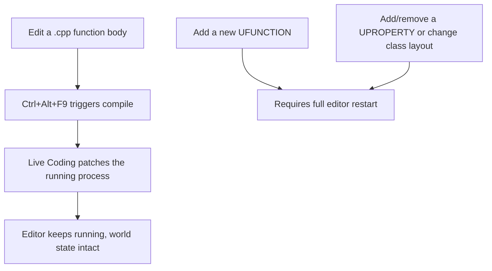

# Live Coding and hot reload

The single biggest iteration-speed lever in Unreal C++ development is not touching the "restart the
editor" workflow more than you have to. Live Coding lets you recompile and patch code into a
*running* editor session, but it patches function bodies, not the shape of your types — knowing
exactly where that line falls is what separates a five-second patch from a confusing crash after
you assumed it would just work.

## Mental model: patching a running process, not recompiling it



Live Coding works by patching compiled code into the already-running editor process while it's
still executing — the editor never closes, your open level, selected actors, and PIE state (if not
mid-simulation) survive. This is fundamentally different from the older "hot reload" workflow, which
recompiled and reloaded whole modules; Live Coding is the modern, faster mechanism and is what you
should default to.

## What Live Coding patches successfully

- **Existing function bodies** — change what a function does, and Live Coding recompiles just that
  function and patches it into the running process. This is the common case and it's fast.
- Logic changes inside `.cpp` files that don't alter any class's memory layout or public interface.

## What requires a full editor restart

- **Adding a new `UFUNCTION`.** Epic's own documentation is explicit about this: Live Coding updates
  existing function bodies, but a newly added `UFUNCTION` is not propagated into the running
  process — it requires a full editor restart before it becomes callable.
- **Adding, removing, or reordering a `UPROPERTY`** (or any member variable that changes a class's
  memory layout). Patching a function body in place works because the function's *address* doesn't
  move; changing a class's layout would invalidate every existing instance of that class already
  alive in memory, which Live Coding cannot safely retrofit.
- Structural header changes generally — new base classes, changed inheritance, new virtual
  functions that change a vtable's shape.

The dividing line to internalize: **body edits, yes; shape edits, no.** If your change only rewrites
what happens inside `{ }`, Live Coding almost always handles it. If your change adds a symbol another
piece of code needs to call, or changes how big or how a class is laid out in memory, plan on a
restart.

## Triggering a Live Coding compile

Live Coding is bound to **Ctrl+Alt+F11** to toggle it on, and **Ctrl+Alt+F9** to trigger a compile
of pending changes, by default — save your `.cpp` changes in your IDE, then trigger the compile from
inside the editor (or let Visual Studio's Live Coding integration trigger it automatically on
build). You do not need to close the editor or run a separate `Build.cs`-driven build for a
body-only change.

:::note
The default keybindings above are the long-standing Live Coding defaults; not independently
re-confirmed against 5.7 in the sources consulted — verify in **Editor Preferences > Live Coding**
if a compile doesn't trigger as expected.
:::

```cpp title="MyActor.cpp — safe to Live Coding-patch"
void AMyActor::ApplyDamage(float Amount)
{
	// Editing this function body and re-compiling patches it into the running editor.
	CurrentHealth = FMath::Clamp(CurrentHealth - Amount, 0.0f, MaxHealth);
}
```

```cpp title="MyActor.h — requires a restart, not a Live Coding patch"
UCLASS()
class MYGAME_API AMyActor : public AActor
{
	GENERATED_BODY()

public:
	// Adding this UPROPERTY changes AMyActor's layout — restart required.
	UPROPERTY(EditAnywhere, BlueprintReadWrite, Category = "MyActor")
	float Armor = 0.0f;

	// Adding this UFUNCTION won't be callable until the editor restarts.
	UFUNCTION(BlueprintCallable, Category = "MyActor")
	void ApplyArmorReduction(float Amount);
};
```

## Source builds get more from Live Coding than Launcher installs

Because a source-built engine compiles engine code locally the same way it compiles your project
code, Live Coding applies to engine-level `.cpp` changes too, not just your game module — useful if
you're debugging or patching engine behavior directly. On a Launcher install, engine code isn't
present to edit at all, so Live Coding is scoped to your project's own modules by definition; this
is a difference in *what's available to edit*, not in how Live Coding itself behaves. See
[Installation and versions](./installation-and-versions.md) for the two install paths.

:::warning Don't trust Live Coding after a header shape change
If you've just added a `UPROPERTY`, added a `UFUNCTION`, or changed a class's inheritance, restart
the editor before continuing to iterate. Continuing to Live Coding-patch on top of a stale layout is
a common source of confusing, hard-to-diagnose corruption or crashes — the safe habit is: shape
change means restart, no exceptions.
:::

:::warning Be mindful of hot reload in coding style, too
Epic's own C++ coding standard calls out minimizing unnecessary dependencies specifically to keep
hot-reload/Live Coding iteration fast, and cautions against inlining or heavy template use in
functions that are likely to change frequently during iteration, since those patterns increase what
has to be recompiled and can affect reload reliability.
:::

## See also

- [Unreal Header Tool](./unreal-header-tool.md) — why `UPROPERTY`/`UFUNCTION` changes touch generated reflection data that Live Coding can't patch.
- [Build configurations and targets](./build-configurations-and-targets.md) — the `DebugGame Editor` configuration Live Coding iteration typically happens in.
- [Installation and versions](./installation-and-versions.md) — Launcher vs source build, and what each exposes to Live Coding.
- [C++ development setup — Live Coding](https://dev.epicgames.com/documentation/unreal-engine/setting-up-your-development-environment-for-cplusplus-in-unreal-engine) — Epic's official reference.
