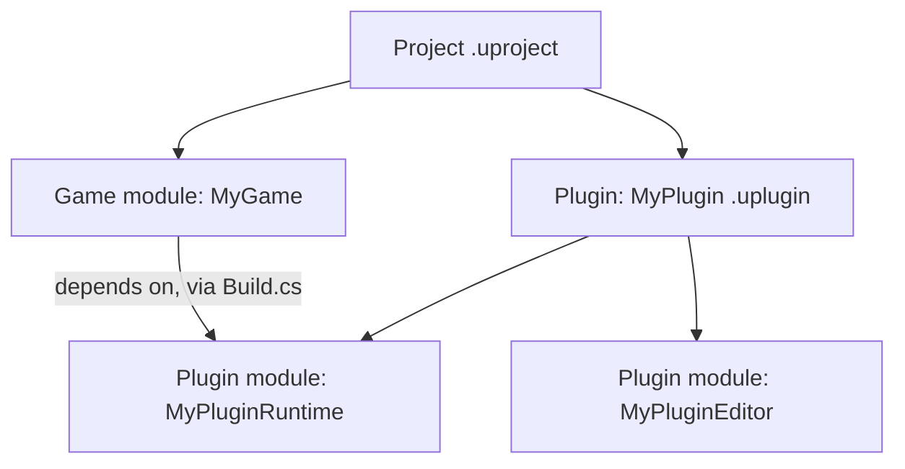

# Modules and plugins

A module is the compilation unit; a plugin is the distribution unit. Confusing the two leads to two
common mistakes: cramming unrelated systems into one module because "it's easier," which turns
every unrelated change into a full recompile of everything that depends on it, and reaching for a
full plugin when a second module in the same project would have done the job with far less
ceremony.

## Mental model: modules nest inside plugins, plugins nest inside projects



A **module** is exactly what [Unreal Build Tool](./unreal-build-tool.md) compiles: a folder with a
`Build.cs`, producing one `.dll` (or statically linked unit, depending on build settings). A
**plugin** is a folder with a `.uplugin` descriptor that bundles one or more modules together with
their own content, config, and metadata — the unit you enable/disable per project, and the unit you
package and redistribute independently of the project that first created it.

## Module types (EHostType)

Every module entry in a `.uplugin` (and, for game modules, in the `.uproject`) declares a `Type`
that controls **where** the module is allowed to load — which build targets and runtime contexts
include it at all. The documented values include:

| Type | Loads in |
|---|---|
| `Runtime` | Game and editor, cooked and uncooked builds |
| `RuntimeNoCommandlet` | Runtime, except commandlet execution |
| `RuntimeAndProgram` | Runtime plus standalone Program targets |
| `Developer` | Development-time only, editor and non-shipping targets |
| `DeveloperTool` | Developer tooling, similar scope to `Developer` |
| `Editor` | Editor only |
| `EditorNoCommandlet` | Editor, except commandlet execution |
| `EditorAndProgram` | Editor plus standalone Program targets |
| `Program` | Standalone Program targets only |
| `ServerOnly` / `ClientOnly` | Restricted to dedicated server or client-only builds |
| `CookedOnly` / `UncookedOnly` | Restricted by cook state |

Picking `Editor` for a module that contains a custom Details panel customization, versus `Runtime`
for the gameplay code it edits, is what keeps editor-only UMG/Slate dependencies out of a shipped
`Shipping` game build entirely.

## Loading phases

Each module also declares a `LoadingPhase` controlling **when** in engine startup it's brought
online relative to other systems. Confirmed values from Epic's plugin documentation include
`Default` (the common case — loads with the standard module set) and `PostConfigInit` (used when a
module's initialization needs config values that aren't available yet at the earliest loading
points, such as shader-related modules).

```json title="MyPlugin.uplugin (module descriptor excerpt)"
{
	"Modules": [
		{
			"Name": "MyPluginRuntime",
			"Type": "Runtime",
			"LoadingPhase": "Default"
		},
		{
			"Name": "MyPluginEditor",
			"Type": "Editor",
			"LoadingPhase": "Default"
		}
	]
}
```

:::note
The full set of `LoadingPhase` values beyond `Default` and `PostConfigInit` (engine documentation and
source reference additional phases such as pre- and post-engine-init points) was not exhaustively
confirmed against 5.7 in the sources consulted — verify the complete enum against your engine
version's `ELoadingPhase` definition before depending on a specific ordering.
:::

## When a plugin beats a module

Adding a second module to your project is the lighter move — a new folder under `Source/`, a new
`Build.cs`, an entry in the `.uproject`'s module list, and a regenerate of project files. Reach for a
**plugin** instead when any of these apply:

- The code needs to be **enabled or disabled per project** without deleting source — plugins have an
  explicit enabled/disabled state in the `.uproject` and Plugins browser.
- The code will be **reused across multiple projects** or distributed (Fab/Marketplace, or an
  internal plugin repository) — a plugin is a self-contained, relocatable unit; a module is not.
- The feature bundles **its own Content** (Blueprints, assets) alongside C++ — plugins support a
  `Content/` folder with `CanContainContent` in the descriptor; a bare game module does not have an
  equivalent concept.
- You want an **Editor-only module cleanly separated** from the Runtime module it extends, with the
  editor module depending on the runtime one — the plugin structure makes that split explicit via
  separate module descriptors.

If none of those apply — it's project-specific code, used once, with no separate content — a second
module is less ceremony for the same compilation benefits.

## See also

- [Unreal Build Tool](./unreal-build-tool.md) — how `Build.cs` dependency lists work regardless of module vs plugin.
- [Project anatomy](./project-anatomy.md) — where plugin folders sit relative to `Source/` and `Content/`.
- [Live Coding and hot reload](./live-coding-and-hot-reload.md) — loading-phase and module-type interactions with Live Coding.
- [Plugins in Unreal Engine](https://dev.epicgames.com/documentation/unreal-engine/plugins-in-unreal-engine) — Epic's official reference.
