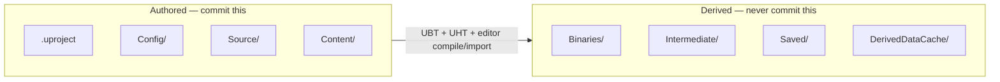

# Project anatomy

Knowing which folders in a project are source of truth and which are disposable build output is
the difference between a clean `git status` and a repository bloated with gigabytes of regenerable
junk. It also tells you what's safe to delete when the editor is misbehaving — deleting the wrong
folder loses work; deleting the right one just costs a recompile.

## Mental model: authored vs derived

Every folder in an Unreal project falls into one of two categories: **authored** (you or a teammate
created it, source control must track it) or **derived** (UnrealBuildTool, UnrealHeaderTool, or the
editor generated it from the authored files, and it can be regenerated on demand).



If you deleted every folder in the Derived group and reopened the `.uproject`, the editor would
regenerate all of it (recompiling C++, rebuilding the derived-data cache, recreating logs) and you'd
be back to a working project. Deleting anything in the Authored group loses actual work.

## The .uproject file

A `.uproject` is a JSON descriptor at the project root — it names the engine association (or an
explicit engine version/path), lists the project's modules, and lists enabled plugins. Double-clicking
it launches the editor; right-clicking it offers **Generate Visual Studio project files**, which
regenerates the `.sln`/`.vcxproj` from the module list without touching any of your actual code.

## Config/

Default settings the project loads at startup: input bindings, engine settings, editor preferences,
game-specific settings — split across files like `DefaultEngine.ini`, `DefaultGame.ini`,
`DefaultInput.ini`. These are authored (or edited via Project Settings in the editor, which writes
back to these files) and belong in source control. Platform-specific overrides live in per-platform
subfolders (e.g. `Windows/WindowsEngine.ini`).

## Source/

Your game module's C++: headers, `.cpp` files, and each module's `Build.cs`. This is hand-written
code and always belongs in source control. See [Unreal Build Tool](./unreal-build-tool.md) for how
the files under here map to compiled modules.

## Content/

Assets — Blueprints, materials, meshes, levels, data assets — stored as binary `.uasset` and `.umap`
files. Authored (even though it isn't C++, it isn't derived — an artist or designer created it
through the editor), and always belongs in source control, typically with Git LFS or a
Perforce-style locking workflow because these are large binary files that don't diff. See
[Source control setup](./source-control-setup.md).

## Binaries/

Compiled output: the project's `.exe`/`.dll` (or `.so`/`.dylib` on other platforms) produced by
UnrealBuildTool. Fully derived from `Source/` — delete it and the next build regenerates it. Never
commit this folder.

## Intermediate/

UnrealBuildTool and UnrealHeaderTool's working directory: generated Visual Studio project files
(`.vcxproj`, `.sln`), object files, and — critically — the `.generated.h` files UnrealHeaderTool
produces from your `UCLASS`/`USTRUCT`/`UFUNCTION` macros (see
[Unreal Header Tool](./unreal-header-tool.md)). Fully derived. This is the first folder to delete
when a build is stuck in a broken state that a normal rebuild won't clear.

## Saved/

Editor-generated runtime state: autosaves, crash logs (`Saved/Logs/`), per-user editor preferences,
and — importantly — the config files under `Saved/Config/` that layer on top of `Config/` at
runtime. Derived and user-specific; never commit it. If the editor is behaving strangely in ways a
restart doesn't fix, deleting `Saved/` (particularly `Saved/Config/`) resets per-user editor state
without touching the project itself.

## DerivedDataCache/

A local cache of processed asset data (compiled shaders, cooked textures at various settings) keyed
so it can be regenerated from `Content/` at any time. Epic's own documentation describes the DDC as
exactly that — a cache, with the "derived" in the name meaning the same thing it means everywhere
else on this page. Deleting it costs you a slow shader-recompile pass the next time you open the
project; it loses no data.

:::warning "Safe to delete" still means "expect a slow rebuild"
Deleting `Intermediate/`, `Saved/`, and `DerivedDataCache/` will not corrupt your project, but it
does throw away every cached build product. The next editor launch or compile will be noticeably
slower — full UHT pass, full shader compile — because there's nothing left to reuse. Don't do this
reflexively on every glitch; do it when a build is actually stuck.
:::

## What a fresh C++ project looks like on disk

```
MyGame/
├── MyGame.uproject
├── Config/
│   ├── DefaultEngine.ini
│   ├── DefaultGame.ini
│   └── DefaultInput.ini
├── Source/
│   └── MyGame/
│       ├── MyGame.Build.cs
│       ├── MyGame.h
│       ├── MyGame.cpp
│       ├── MyGameGameModeBase.h
│       └── MyGameGameModeBase.cpp
├── Content/
│   └── ThirdPerson/ ...
├── Binaries/        # generated on first build
├── Intermediate/     # generated on first build
└── Saved/            # generated on first editor launch
```

`DerivedDataCache/` typically only appears once the editor has actually processed assets, and on a
Launcher install it's often shared at the engine level rather than per-project.

## See also

- [Installation and versions](./installation-and-versions.md) — getting the toolchain that produces these folders.
- [Unreal Build Tool](./unreal-build-tool.md) — how `Source/*.Build.cs` becomes `Binaries/`.
- [Source control setup](./source-control-setup.md) — the `.gitignore` that keeps derived folders out of your repo.
- [Unreal Engine directory structure](https://dev.epicgames.com/documentation/unreal-engine/unreal-engine-directory-structure) — Epic's official reference.
