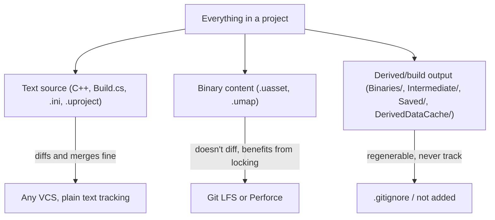

# Source control setup

Unreal projects mix hand-written C++ with large binary asset files and gigabytes of regenerable
build output — none of the defaults from a typical software repository apply cleanly. Committing the
wrong folders bloats a repository permanently (history doesn't forget a large binary once it's
pushed), and picking the wrong source control system for a content-heavy project causes merge pain
that has nothing to do with your actual code changes.

## Mental model: three categories, three different treatments



Text source diffs and merges the way any codebase does. Binary content (`.uasset`, `.umap`) doesn't
diff meaningfully and benefits from exclusive checkout/locking so two people don't silently clobber
each other's edits to the same asset. Derived build output (see
[Project anatomy](./project-anatomy.md) for the full breakdown of `Binaries/`, `Intermediate/`,
`Saved/`, `DerivedDataCache/`) should never be tracked at all — it's regenerated from the other two
categories on every build.

## Git + LFS vs Perforce

Epic ships official source control integrations for both **Git** and **Perforce**, selectable from
the editor's Source Control settings.

| | Git + LFS | Perforce |
|---|---|---|
| Binary asset workflow | Git LFS stores large binaries out-of-line; no built-in exclusive lock by default (Git LFS file locking is an opt-in extra) | Native exclusive checkout/locking for binary files, the traditional game-industry default |
| Best fit | Smaller teams, projects already living in a Git-centric workflow, open-source projects | Larger teams and studios with heavy concurrent asset editing |
| History size | Can grow large with binary content even with LFS if history isn't managed carefully | Handles large binary history more gracefully by design |
| Setup | Familiar to most developers already; Epic's `GitSourceControl` plugin plus `.gitattributes` for LFS | More game-industry-specific tooling, typically a dedicated server |

Solo developers and small teams commonly default to Git + LFS because the tooling is already
familiar; teams with several artists editing binary content concurrently often get real value from
Perforce's locking model instead. Neither is objectively correct — pick based on team size and how
much concurrent binary editing actually happens.

:::note
The Git source control plugin ships as a beta-labeled module in the engine (`GitSourceControl`,
under `Engine/Plugins/Developer/`) — solid for day-to-day use, but treat it as such rather than
assuming full parity with Perforce's more mature integration.
:::

## The .gitignore that keeps derived data out

If you're using Git, ignore every derived folder from [Project anatomy](./project-anatomy.md) at the
project root, plus the equivalent per-plugin derived folders:

```ini title=".gitignore"
# Derived build output — regenerated by UnrealBuildTool / UnrealHeaderTool
Binaries/
Intermediate/
DerivedDataCache/

# Editor-generated, user-specific runtime state
Saved/

# Visual Studio project files — regenerated by "Generate Visual Studio project files"
*.sln
*.vcxproj
*.vcxproj.filters
*.vcxproj.user
.vs/

# Per-plugin derived folders follow the same pattern
Plugins/*/Binaries/
Plugins/*/Intermediate/
```

Everything else at the project root — `Config/`, `Source/`, `Content/`, the `.uproject` itself —
should be tracked normally.

## Git LFS for Content/

Binary asset extensions need to be routed through LFS explicitly via `.gitattributes`, or they'll be
stored as regular Git blobs and bloat the repository the same way `Binaries/` would:

```ini title=".gitattributes"
*.uasset filter=lfs diff=lfs merge=lfs -text
*.umap filter=lfs diff=lfs merge=lfs -text
*.png filter=lfs diff=lfs merge=lfs -text
*.fbx filter=lfs diff=lfs merge=lfs -text
*.wav filter=lfs diff=lfs merge=lfs -text
```

:::warning[A committed binary is in history forever]
Adding `.gitattributes` after binary files have already been committed as regular blobs doesn't
retroactively move them into LFS — history still holds the original blobs. Set up LFS tracking
*before* the first `Content/` commit, not after you notice the repository is large.
:::

:::warning[Two people editing the same .uasset without locking is a silent conflict]
Unlike text files, Git cannot merge two divergent edits to the same binary asset — the result is
"theirs" or "ours," never a real merge, and Git won't necessarily warn you loudly which one you got.
If your team edits shared binary assets concurrently, either enable Git LFS file locking
(`git lfs lock`) or move that workflow to Perforce, which enforces exclusive checkout by default.
:::

## See also

- [Project anatomy](./project-anatomy.md) — the full breakdown of authored vs derived folders this `.gitignore` encodes.
- [Installation and versions](./installation-and-versions.md) — Launcher vs source build, relevant if your team also tracks engine source separately.
- [Unreal Build Tool](./unreal-build-tool.md) — what regenerates `Binaries/` and `Intermediate/` after a clean checkout.
- [Source Control plugins](https://dev.epicgames.com/documentation/unreal-engine/API/PluginIndex) — Epic's official plugin index, including Git and Perforce integrations.
