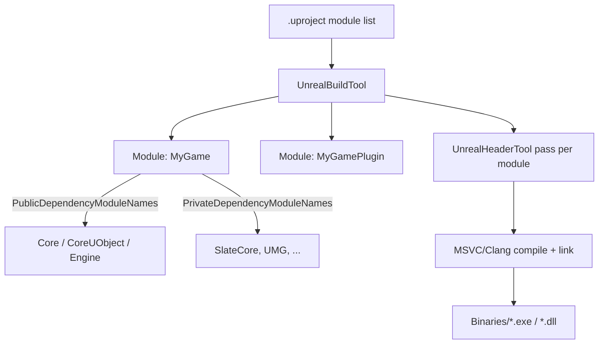

# Unreal Build Tool and module rules

Unreal doesn't use a single monolithic compile step — it compiles per-module, and every module's
`Build.cs` file decides what that module can see. Get the dependency lists wrong and you get either
a build that won't link (missing dependency) or a build that compiles fine but silently bloats
compile times and binary size for every module downstream (dependency in the wrong list). This is
the file you touch every time you use a new engine subsystem for the first time.

## Mental model: UBT compiles modules, not files

**UnrealBuildTool (UBT)** is the C# program that drives compilation. It doesn't work file-by-file
the way a plain `g++ *.cpp` invocation would — it works **module-by-module**. Each module is a
folder under `Source/` containing a `.Build.cs` file that describes the module: its name, what other
modules it depends on, and which of its own headers are visible to dependents.



UBT reads the `.uproject`'s module list, resolves each module's `Build.cs` dependency graph, invokes
UnrealHeaderTool on each module that uses reflection macros (see
[Unreal Header Tool](./unreal-header-tool.md)), then hands the actual compilation to the platform
toolchain (MSVC on Windows) and links the result into `Binaries/`.

## Build.cs: a ModuleRules subclass

Every module's `Build.cs` defines a class deriving from `ModuleRules`, named after the module, whose
constructor configures dependency lists:

```csharp title="MyGame.Build.cs"
using UnrealBuildTool;

public class MyGame : ModuleRules
{
	public MyGame(ReadOnlyTargetRules Target) : base(Target)
	{
		PCHUsage = ModuleRules.PCHUsageMode.UseExplicitOrSharedPCHs;

		PublicDependencyModuleNames.AddRange(new string[]
		{
			"Core",
			"CoreUObject",
			"Engine",
			"InputCore",
			"EnhancedInput",
		});

		PrivateDependencyModuleNames.AddRange(new string[]
		{
			"Slate",
			"SlateCore",
		});

		// Uncomment if you use Slate UI components from within this module.
		// PrivateDependencyModuleNames.AddRange(new string[] { "UMG" });
	}
}
```

## Public vs private dependencies

This is the distinction that actually matters day to day:

- **`PublicDependencyModuleNames`** — modules whose headers your module's *public* headers include,
  or whose types appear in your module's public API. Anything that depends on your module
  transitively gets access to these too. Use this when another module needs to see types you expose
  from a dependency (for example, a base class parameter type from `Engine`).
- **`PrivateDependencyModuleNames`** — modules you use internally, in `.cpp` files or private
  headers, that don't leak into your module's public interface. Anything that depends on your module
  does *not* automatically get these.

Every new C++ project ships with `Core`, `CoreUObject`, `Engine`, and `InputCore` in
`PublicDependencyModuleNames` by default — these four cover `UObject`, actors, and basic input, which
is why nearly every gameplay class compiles without extra setup.

:::warning[Default to Private; promote to Public only when required]
Putting a dependency in `PublicDependencyModuleNames` when `PrivateDependencyModuleNames` would do
increases compile times for every module that depends on yours, since it pulls in that module's
public include paths transitively. Start private; move a dependency to public only when you get a
compile error proving another module genuinely needs it exposed.
:::

## Include paths

`PublicIncludePaths` and `PrivateIncludePaths` extend where the compiler looks for headers beyond a
module's own `Public/`/`Private`-style layout, when your source layout doesn't follow the default
convention. Most modules never need to touch these explicitly — UBT infers standard include paths
from a module's `Public/` and `Private/` subfolders (or from the module root, for the simpler
single-folder layout most starter projects use) — but plugins with nonstandard folder layouts often
do.

## Dynamically loaded modules

`DynamicallyLoadedModuleNames` lists modules your code loads at runtime via `FModuleManager` rather
than linking against at compile time — common for optional engine subsystems your module doesn't
want a hard dependency on. This doesn't affect compilation the way the two `Dependency` lists do; it
only affects what UBT stages for packaging.

## Regenerating after a Build.cs change

Editing an existing module's `Build.cs` dependency lists doesn't require regenerating project files —
just recompile. Adding a **new module** (a new folder with its own `Build.cs`, registered in the
`.uproject`) does require **Generate Visual Studio project files** again, since the `.sln` itself
needs a new project entry.

:::warning[A missing dependency shows up as a linker error, not a header error]
If you `#include` a header from a module you haven't added to either dependency list, you'll often
get away with it at the `#include` stage — the compiler may still find the header via a transitively
public include path — but linking fails with unresolved symbols. When you see an unresolved external
symbol for a type or function you know exists, check `Build.cs` before you check the header.
:::

## See also

- [Modules and plugins](./modules-and-plugins.md) — module types and loading phases beyond the dependency graph.
- [Unreal Header Tool](./unreal-header-tool.md) — the reflection pass UBT runs per module.
- [Build configurations and targets](./build-configurations-and-targets.md) — how the same `Build.cs` compiles differently per configuration.
- [Unreal Build Tool](https://dev.epicgames.com/documentation/unreal-engine/unreal-build-tool-in-unreal-engine) — Epic's official reference.
