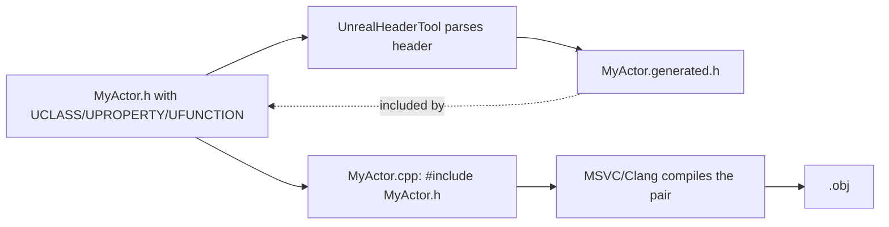

# Unreal Header Tool and generated headers

`UCLASS`, `UPROPERTY`, and `UFUNCTION` look like ordinary C++ macros, but the code that makes them
mean something isn't the C++ compiler — it's a separate tool that runs before compilation and
generates the plumbing those macros expand into. Forget the one `#include` that wires a header into
this pass, and the error you get back is a wall of confusing macro-expansion nonsense, not a clear
"you forgot an include."

## Mental model: a code-generation pass before the real compile

**UnrealHeaderTool (UHT)** parses every header in a module that uses reflection macros, and for each
one emits a matching `.generated.h` file containing the boilerplate that makes reflection actually
work — property offsets, `UClass` registration, virtual function thunks for `UFUNCTION`s called from
Blueprint. Your header doesn't compile without that generated file; the two are compiled together as
one translation unit.



UHT runs as part of the normal UnrealBuildTool invocation — you don't invoke it directly day to day —
but understanding that it's a distinct pass explains why reflection-related errors look different
from ordinary C++ errors: UHT is complaining about what it parsed out of your header *before* MSVC
ever sees it.

## The macros UHT understands

- **`UCLASS(...)`** — marks a class deriving (directly or transitively) from `UObject` as
  reflected: known to the garbage collector, constructible from Blueprint if `Blueprintable`,
  editable in the Details panel if its properties are exposed.
- **`USTRUCT(...)`** — the struct equivalent, for plain data types that need reflection (Blueprint
  variables, `UPROPERTY` serialization) without `UObject`'s identity and lifetime machinery.
- **`UPROPERTY(...)`** — exposes a member variable to the reflection system: garbage-collected
  reference tracking for `UObject*` members, Blueprint visibility, editor exposure, and
  serialization, depending on which specifiers you set.
- **`UFUNCTION(...)`** — exposes a member function: callable from Blueprint, usable as a delegate
  target, or invocable as a console command, depending on specifiers.
- **`UENUM(...)`** and **`UINTERFACE(...)`** — the enum and interface equivalents.

```cpp title="MyActor.h"
#pragma once

#include "CoreMinimal.h"
#include "GameFramework/Actor.h"
#include "MyActor.generated.h"   // must be the LAST include in the file

UCLASS()
class MYGAME_API AMyActor : public AActor
{
	GENERATED_BODY()

public:
	AMyActor();

	UPROPERTY(EditAnywhere, BlueprintReadWrite, Category = "MyActor")
	float MaxSpeed = 600.0f;

	UFUNCTION(BlueprintCallable, Category = "MyActor")
	void ApplyDamage(float Amount);

protected:
	virtual void BeginPlay() override;
};
```

`GENERATED_BODY()` expands to the reflection boilerplate UHT generates for this specific class —
constructors, `StaticClass()`, and the machinery `UPROPERTY`/`UFUNCTION` rely on. It must appear as
the first line inside the class body.

## Why the `.generated.h` include order is non-negotiable

Two rules, both load-bearing:

1. **`#include "ClassName.generated.h"` must be the last `#include` in the header.** UHT's generated
   code assumes everything else the header needs has already been declared.
2. **The file must exist before the rest of the header can compile**, which is precisely why UHT runs
   as a build step, not as a normal preprocessor include — the file doesn't exist until UHT has
   parsed the header once.

## A missing include breaks reflection, not just compilation

If `MyActor.h` uses a type from another module's reflected header — say, a `UPROPERTY` of type
`AMyOtherActor*` — and you don't `#include "MyOtherActor.h"`, you might still get lucky and have the
file compile via a forward declaration, if you only need the pointer type. But if UHT itself needs
to fully resolve that type to generate correct reflection data (for example, to know its size or
whether it's a `UCLASS`), the missing include surfaces as a UHT parse failure that names the
symptom (an unresolved type in the generated code) rather than the cause (the missing `#include`).
The fix is almost always: find the type's owning header, add the include, rebuild.

:::warning[UHT errors point at generated code, not your mistake]
When a build fails with an error inside a `.generated.h` file, or a "circular includes" complaint
between generated headers, the first thing to check is whether every `UPROPERTY`/`UFUNCTION`
parameter and return type used in that header actually has its own header included above the
`.generated.h` line — not just forward-declared.
:::

:::warning[Regenerate project files after adding a new UCLASS file]
Adding a brand-new header with a `UCLASS` in it (a new file, not a new class in an existing file)
sometimes requires **Generate Visual Studio project files** before IntelliSense picks it up, even
though UBT/UHT itself will find and process the file correctly on the next build.
:::

## See also

- [Unreal Build Tool](./unreal-build-tool.md) — the build step that invokes UHT per module.
- [Modules and plugins](./modules-and-plugins.md) — module types that determine what reflection is available where.
- [Live Coding and hot reload](./live-coding-and-hot-reload.md) — why Live Coding can't add a new `UFUNCTION` without a restart.
- [Unreal Engine's reflection system](https://dev.epicgames.com/documentation/unreal-engine/reflection-system-in-unreal-engine) — Epic's official reference.
