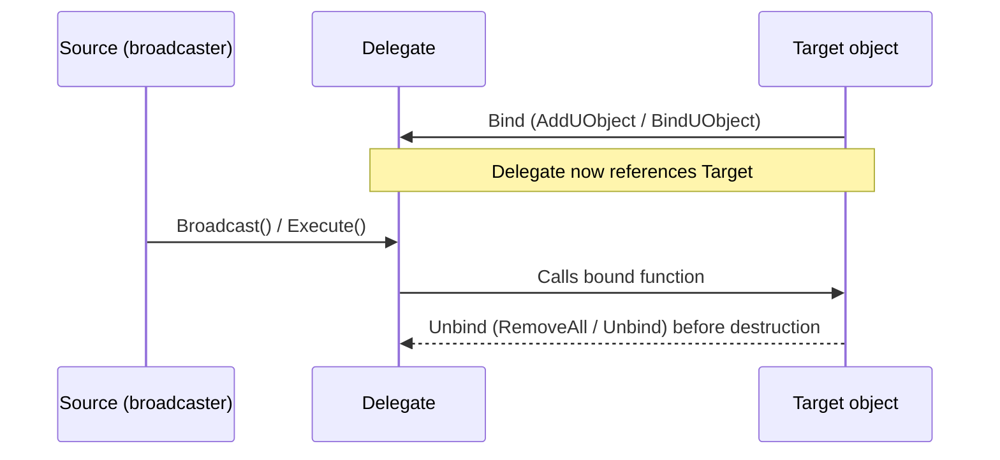

# Delegates and events

Delegates are Unreal's answer to "call this function later, without the caller knowing what type owns
it." They're how a widget notifies gameplay code of a button click, how a component broadcasts "I took
damage" without knowing who's listening, and how one system decouples from another entirely. The part
that trips people up isn't declaring a delegate — it's binding one to an object whose lifetime you
don't control, and forgetting to unbind before that object is destroyed.

## Why this matters

A bound delegate holds a reference to its target, directly or indirectly. If the target is destroyed
without the delegate being unbound or told about it, the next broadcast either crashes (raw binding to
a dead object) or silently no-ops (a weak binding that correctly detects the target is gone). Both
outcomes are bugs — one loud, one quiet — and both come from treating a delegate binding as fire-and-
forget instead of as a relationship with a lifetime.

## Mental model



If that last step — unbinding before destruction — is skipped and the binding wasn't a weak/UObject
binding that self-invalidates, the broadcast step calls into freed memory.

## The mechanics

### Three delegate flavours

| Flavour | Declares with | Listeners | Blueprint-visible |
|---|---|---|---|
| Single-cast | `DECLARE_DELEGATE...` | Exactly one bound function | No |
| Multicast | `DECLARE_MULTICAST_DELEGATE...` | Any number of bound functions | No |
| Dynamic (multicast) | `DECLARE_DYNAMIC_MULTICAST_DELEGATE...` | Any number, serializable | Yes |

```cpp title="Declaring delegate types"
// Single-cast, one parameter
DECLARE_DELEGATE_OneParam(FStringDelegate, FString);

// Multicast, C++-only listeners
DECLARE_MULTICAST_DELEGATE_OneParam(FOnScoreChanged, int32 /*NewScore*/);

// Dynamic multicast — required for Blueprint binding, needs UDELEGATE + a UFUNCTION target
DECLARE_DYNAMIC_MULTICAST_DELEGATE_TwoParams(
    FOnPlayerDamaged, float, Damage, AActor*, Instigator);
```

Dynamic delegates are the only flavour Blueprint can bind to, and they can only bind to
`UFUNCTION`-marked methods — a plain C++ member function is invisible to them, same restriction as
everything else the reflection system gates.

### Binding, and binding safely

```cpp title="Multicast delegate as a UPROPERTY member"
UCLASS()
class MYGAME_API UHealthComponent : public UActorComponent
{
    GENERATED_BODY()

public:
    UPROPERTY(BlueprintAssignable, Category = "Health")
    FOnPlayerDamaged OnPlayerDamaged;

    void ApplyDamage(float Amount, AActor* Instigator)
    {
        OnPlayerDamaged.Broadcast(Amount, Instigator);
    }
};
```

```cpp title="Binding a C++-only multicast delegate"
FOnScoreChanged OnScoreChanged;

// Binds as a weak reference to a UObject target: if ScoreWidget is
// destroyed, this binding stops firing instead of dangling.
OnScoreChanged.AddUObject(ScoreWidget, &UScoreWidget::HandleScoreChanged);
```

`AddUObject` (and the dynamic-delegate `AddDynamic`) bind against a `UObject` and are automatically
safe against that object's destruction — the delegate checks validity before invoking. Binding a raw
member-function pointer with `AddRaw` gives you none of that protection; the delegate has no way to
know the target died.

### Unbinding

```cpp title="Unbinding on teardown"
void UMyWidget::NativeDestruct()
{
    if (Source)
    {
        Source->OnScoreChanged.RemoveAll(this);
    }
    Super::NativeDestruct();
}
```

### Payload data

Every flavour except dynamic delegates supports binding extra "payload" arguments at bind time, which
get appended after the delegate's own parameters when the bound function is called — useful for
passing context the broadcaster doesn't know about.

## Gotchas

:::danger AddRaw has no destruction safety
`AddRaw` stores a plain pointer. If the bound object is destroyed and the delegate isn't explicitly
unbound first, the next broadcast calls into freed memory. Prefer `AddUObject`/`AddDynamic` for
`UObject` targets, or make certain the unbind happens in the target's teardown path.
:::

:::warning Dynamic delegates only bind UFUNCTIONs
Trying to `AddDynamic` a plain method is a compile error, not a runtime surprise — but it's a common
one the first time you reach for a dynamic delegate coming from single-cast/multicast usage.
:::

:::caution A forgotten RemoveAll is a leak, not just a dangling call risk
Even a weak/UObject-safe binding keeps the delegate's internal bookkeeping around until the object is
actually destroyed. For long-lived broadcasters and short-lived listeners, unbind explicitly rather
than relying on eventual GC.
:::

## See also

- [Smart pointers and ownership](./smart-pointers-and-ownership.md) — the same weak-vs-strong binding
  problem, for non-`UObject` code using `TSharedPtr`/`TWeakPtr`.
- [Garbage collection](./garbage-collection.md) — why a `UObject`-safe binding can detect a destroyed
  target at all.
- [Interfaces](./interfaces.md) — another mechanism for decoupling a caller from a concrete listener
  type.
- [Epic — Delegates and Lambda Functions in Unreal Engine](https://dev.epicgames.com/documentation/unreal-engine/delegates-and-lambda-functions-in-unreal-engine)
