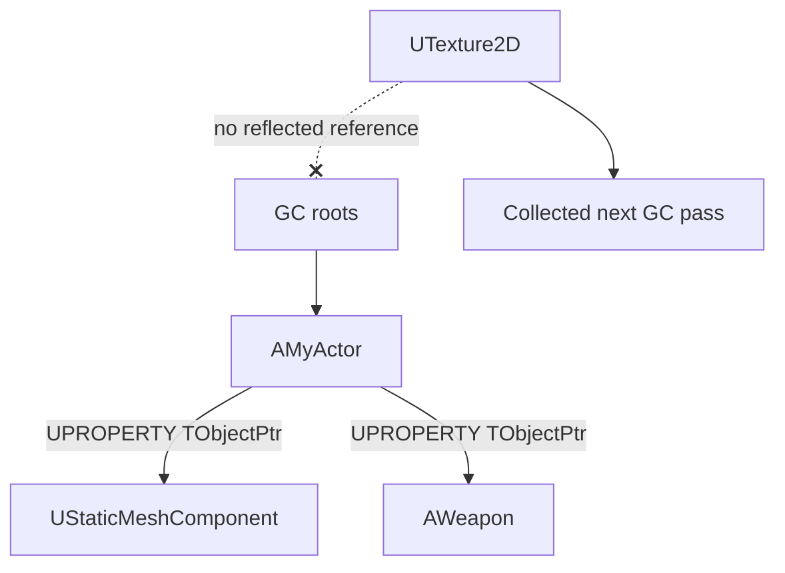

# Garbage collection and object ownership

`UObject`s are not managed with `new`/`delete` or reference counting — they're managed by a tracing
garbage collector that periodically walks every reachable reference and destroys whatever it can't
reach. That single design decision explains a whole category of Unreal bugs: objects that vanish
mid-frame, crashes from what looks like a valid pointer, and components that outlive the actor they
belonged to. Understanding what makes a reference "count" to the collector is the difference between
writing gameplay code and debugging it.

## Why this matters

C++ RAII assumes deterministic destruction: an object dies when its owner goes out of scope. Unreal's
GC assumes the opposite — an object dies when *nothing reachable* still points to it, and "reachable"
is decided periodically, not the instant the last reference disappears. A raw `UObject*` sitting in a
non-`UPROPERTY` member is invisible to that reachability walk. The object it points to can be
collected while the pointer itself still looks perfectly valid, and the next dereference is a
use-after-free.

## Mental model: reachability, not reference counting

The collector starts from a set of **roots** — object flags, the root set, and explicitly rooted
objects — and marks everything reachable from them by walking `UPROPERTY` pointer members (and
anything registered through `AddReferencedObjects`). Anything left unmarked after the walk is garbage
and gets destroyed.



A pointer only keeps its target alive if the collector can see it — which means it must be a
`UPROPERTY`-marked member (or otherwise registered), on an object the collector can itself reach.

## The mechanics: which pointer type to reach for

Unreal gives you several pointer templates for referring to `UObject`s, each with a different
relationship to garbage collection:

| Type | GC relationship | Typical use |
|---|---|---|
| `T*` (raw) | Not tracked | Local variables, function parameters, short-lived references |
| `TObjectPtr<T>` | Strong reference **when marked `UPROPERTY`** | Persistent `UObject` references on `UCLASS`/`USTRUCT` members |
| `TWeakObjectPtr<T>` | Does not keep the object alive; becomes invalid when collected | Non-owning references, caches, back-pointers |
| `TSoftObjectPtr<T>` | Not loaded/kept alive until resolved | Asset references that should load on demand |
| `TStrongObjectPtr<T>` | Strong reference, usable outside `UObject`/`UPROPERTY` | Keeping an object alive from a plain C++ class or struct |

`TObjectPtr<T>` is the default choice for a `UCLASS` member in UE5 — it's a thin wrapper around a raw
pointer that adds access tracking (for cook-time dependency analysis) and behaves like `T*` in
everyday code, but **only actually roots the object when the member is also `UPROPERTY`**:

```cpp title="AMyActor.h"
UCLASS()
class MYGAME_API AMyActor : public AActor
{
    GENERATED_BODY()

public:
    // Strong GC reference: Mesh survives as long as AMyActor does.
    UPROPERTY(VisibleAnywhere)
    TObjectPtr<UStaticMeshComponent> Mesh;

    // NOT a GC reference: no UPROPERTY. If nothing else roots the
    // target, it can be collected out from under this pointer.
    TObjectPtr<AActor> CachedTarget;
};
```

Outside `UObject` classes — a plain struct, a `TSharedPtr`-owned helper, a lambda capture — `UPROPERTY`
isn't available at all, so a `TObjectPtr` or raw pointer there is invisible to GC by construction. If
that code needs to *keep* a `UObject` alive, use `TStrongObjectPtr<T>`:

```cpp title="Non-UObject code holding a UObject alive"
class FAssetLoader
{
public:
    void SetLoaded(UTexture2D* Texture)
    {
        LoadedTexture.Reset(Texture); // now rooted until reset/destroyed
    }

private:
    TStrongObjectPtr<UTexture2D> LoadedTexture;
};
```

### Observing without owning: TWeakObjectPtr

When you need to refer to an object without keeping it alive — a cache of "last known target", a
back-reference from a child to a parent that already owns it the other way — use
`TWeakObjectPtr<T>`. It never blocks collection, and safely reports invalidity once the target is
gone:

```cpp title="Safe access through a weak pointer"
TWeakObjectPtr<AActor> LastTarget;

void UseTarget()
{
    if (AActor* Target = LastTarget.Get())
    {
        // Target is valid for the rest of this scope.
    }
}
```

### Custom references: AddReferencedObjects

Rarely, a class needs to hold `UObject` pointers the reflection system can't see (a raw array of
pointers built at runtime, for instance). Overriding `AddReferencedObjects` to report those pointers
to the collector's `FReferenceCollector` is the escape hatch — reach for `UPROPERTY` first.

## Gotchas

:::danger[A non-UPROPERTY UObject pointer is not safe against GC]
This is the single most common source of "randomly crashes after a few minutes" bugs in new Unreal
code. If a member holds a `UObject*` or `TObjectPtr<T>` and needs the object to stay alive, it must be
`UPROPERTY`. There is no warning when you get this wrong — the pointer just eventually dangles.
:::

:::warning[TWeakObjectPtr requires a validity check before use]
`Get()` returns `nullptr` once the target is collected; dereferencing without checking is the same
class of bug as skipping a null check on a raw pointer.
:::

:::caution[GC runs on a schedule, not on last-reference-drop]
Don't assume an unreferenced object is destroyed immediately, and don't assume you can safely ignore
rooting "just for one frame" — a collection pass can land inside that frame.
:::

## See also

- [UObject and reflection](./uobject-and-reflection.md) — why `UPROPERTY` is what makes a reference
  visible to GC in the first place.
- [Smart pointers and ownership](./smart-pointers-and-ownership.md) — `TSharedPtr`/`TUniquePtr` for
  non-`UObject` data, and why they must never substitute for `UPROPERTY` ownership.
- [Subsystems](./subsystems.md) — objects whose lifetime is tied to engine/game-instance/world scope
  rather than manual rooting.
- [Epic — Object Pointers in Unreal Engine](https://dev.epicgames.com/documentation/unreal-engine/object-pointers-in-unreal-engine)
