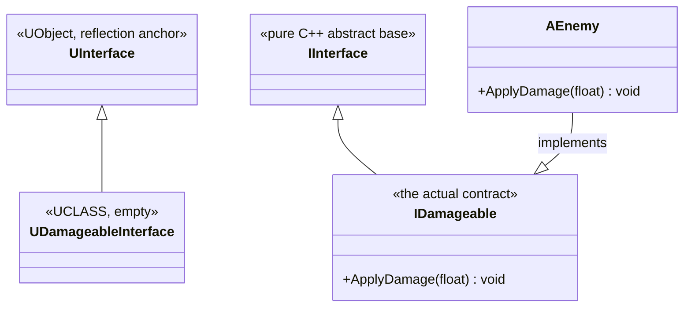

# The UInterface two-class pattern

Unreal interfaces look unlike anything in standard C++ because reflection needs a `UObject`-derived
type to hang metadata off, but the actual interface contract has to be a normal C++ abstract class so
your gameplay types can multiply-inherit from it alongside `AActor` or `UActorComponent`. The result
is that every Unreal interface is really *two* classes with related names, and confusing which one to
use where is the single most common mistake people make with them.

## Why this matters

Get the two classes backwards — inherit from the wrong one, or try to `Cast<>` to the wrong one — and
you get a compile error at best, or a silently-failing `Implements` check at worst. Interfaces are
also the mechanism that lets a function accept "anything that can take damage" without caring whether
that's an `AActor`, a `UActorComponent`, or something else entirely, so getting this pattern right
unlocks a lot of decoupled design that's otherwise awkward in Unreal.

## Mental model



`UDamageableInterface` (the `U`-prefixed class) exists purely so the reflection system has something
to register — you never instantiate it and rarely touch it directly. `IDamageable` (the `I`-prefixed
class) is the one that declares the actual virtual functions and the one your gameplay classes
inherit from.

## The mechanics

### Declaring an interface

```cpp title="Damageable.h"
UINTERFACE(BlueprintType)
class MYGAME_API UDamageableInterface : public UInterface
{
    GENERATED_BODY()
};

class MYGAME_API IDamageableInterface
{
    GENERATED_BODY()

public:
    UFUNCTION(BlueprintNativeEvent, Category = "Damage")
    void ApplyDamage(float Amount);
};
```

The macro is `UINTERFACE`, not `UCLASS`, on the `U`-prefixed half. The `I`-prefixed half is plain
C++ — no `UCLASS`/`UINTERFACE` on it — but still uses `GENERATED_BODY()` to pull in the reflection
plumbing UHT generates for its `UFUNCTION`s.

### Implementing an interface

```cpp title="Enemy.h"
UCLASS()
class MYGAME_API AEnemy : public AActor, public IDamageableInterface
{
    GENERATED_BODY()

public:
    virtual void ApplyDamage_Implementation(float Amount) override;
};
```

A class inherits from the `I`-prefixed interface (not the `U`-prefixed one) alongside its normal base
class. `BlueprintNativeEvent` functions get a `_Implementation` suffix on the override — the
declared name (`ApplyDamage`) is the one callers use; the `_Implementation` name is what you actually
define.

### Calling through an interface

Because a Blueprint-only class can implement an interface without any native `IDamageableInterface`
in its inheritance chain, you can't always `Cast<IDamageableInterface>()` — that only works for
natively-implemented interfaces. The safe way to call an interface function on an object that might be
Blueprint-implemented is the generated `Execute_` wrapper:

```cpp title="Calling safely across native/Blueprint implementations"
if (Target->GetClass()->ImplementsInterface(UDamageableInterface::StaticClass()))
{
    IDamageableInterface::Execute_ApplyDamage(Target, 25.0f);
}
```

`Execute_ApplyDamage` (generated by UHT for every `UFUNCTION` on the interface) dispatches correctly
whether `Target` implements the interface in C++ or in Blueprint — `Cast<IDamageableInterface>(Target)`
only succeeds for the native case and returns `nullptr` for a Blueprint-only implementation.

### TScriptInterface

`TScriptInterface<IDamageableInterface>` is the reflected way to store "an object that implements this
interface" as a `UPROPERTY` — a plain `IDamageableInterface*` isn't reflectable, since reflection
tracks `UObject`-derived types. Internally it keeps both the owning `UObject` pointer and the native
interface pointer side by side, which is exactly what makes it work for both native and
Blueprint-only implementers.

```cpp title="Storing an interface reference as a UPROPERTY"
UPROPERTY(EditAnywhere, Category = "Targeting")
TScriptInterface<IDamageableInterface> CurrentTarget;
```

## Gotchas

:::warning[Inherit from the I-class, not the U-class]
`class AEnemy : public AActor, public UDamageableInterface` is the classic mistake — it doesn't
compile the way you'd expect, and even where it did, `UDamageableInterface` isn't the class with the
virtual functions on it.
:::

:::warning[Cast only sees native implementations]
`Cast<IDamageableInterface>(SomeObject)` returns `nullptr` for a Blueprint-only implementer even
though `ImplementsInterface` would say true. Use the `Execute_` wrapper when the object might be
Blueprint-implemented — which, for anything that could plausibly be subclassed in Blueprint, is most
of the time.
:::

:::caution[BlueprintNativeEvent needs the _Implementation override, not the declared name]
Overriding `ApplyDamage` instead of `ApplyDamage_Implementation` either fails to compile or silently
creates an unrelated function, depending on the exact signature mismatch — always override the
`_Implementation` name for `BlueprintNativeEvent` functions.
:::

## See also

- [UObject and reflection](./uobject-and-reflection.md) — the `UINTERFACE`/`UFUNCTION` machinery this
  pattern is built from.
- [Subsystems](./subsystems.md) — another way to decouple systems, at engine/game-instance/world scope
  rather than per-object.
- [Exposing C++ to Blueprint](../04-blueprint-interop/exposing-cpp-to-blueprint.md) — `BlueprintNativeEvent`
  and `BlueprintImplementableEvent` in full.
- [Epic — UInterface API reference](https://dev.epicgames.com/documentation/unreal-engine/API/Runtime/CoreUObject)
