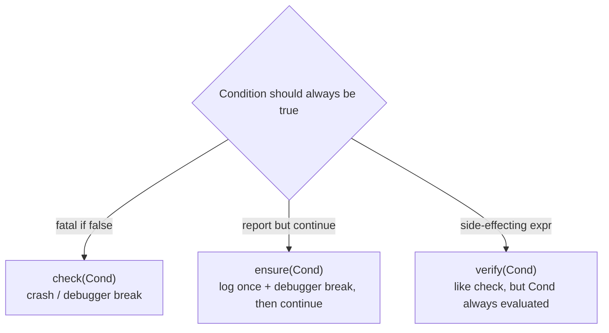

# Logging and assertions

Unreal doesn't use C++ exceptions — throwing is disabled across the engine, and Epic's own guidance is
explicit that `check()` and `ensure()` replace exception handling as the tool for "this should never
happen." Combined with `UE_LOG`'s category-based logging, these are the primary tools for finding out
what your code actually did at runtime, since there's no stack unwind and no `catch` block to fall
back on when something goes wrong.

## Why this matters

Reaching for a `throw`/`try`/`catch` pattern out of habit doesn't compile the way it would in
exception-enabled C++ — and even where the syntax happens to work in editor builds, it isn't the
idiom the rest of the engine expects. `check`/`ensure`/`verify` and `UE_LOG` are how Unreal code
reports "something is wrong" and "here's what happened," and knowing which of the three assertion
macros to use is what determines whether a bad state politely halts in the debugger or ships silently
into a Shipping build.

## Mental model



`check` is for conditions where continuing is worse than crashing — an invariant that, if false, means
downstream code is operating on garbage. `ensure` is for conditions that are wrong but survivable —
you want to know about it (in a debug session, and in logs/crash reporter for a real player) without
taking the whole game down. `verify` exists for the case where the checked expression itself has a
necessary side effect.

## The mechanics

### UE_LOG and log categories

```cpp title="Declaring and using a log category"
// Header
DECLARE_LOG_CATEGORY_EXTERN(LogMatch, Log, All);

// Source file
DEFINE_LOG_CATEGORY(LogMatch);

void UMatchDirectorSubsystem::StartMatch()
{
    UE_LOG(LogMatch, Log, TEXT("Match started, round %d"), RoundNumber);

    if (RoundNumber < 0)
    {
        UE_LOG(LogMatch, Error, TEXT("Negative round number: %d"), RoundNumber);
    }
}
```

`UE_LOG` takes a category, a verbosity (`Fatal`, `Error`, `Warning`, `Display`, `Log`, `Verbose`,
`VeryVerbose`), and a `TEXT()` format string. Categories let you filter the Output Log per-system
instead of grepping through everything the engine and every plugin also logs.

### check — fatal, unrecoverable-state assertions

```cpp title="check for an invariant that must hold"
void UInventoryComponent::RemoveItem(int32 Index)
{
    check(Items.IsValidIndex(Index));
    Items.RemoveAt(Index);
}
```

`check()` halts execution (crashing, or breaking into an attached debugger) when its condition is
false. Use it for conditions that indicate a programming error rather than a runtime/data problem —
an invalid index that should have been validated already, a pointer that should never be null at that
point in the call graph.

### ensure — report and keep running

```cpp title="ensure for a recoverable but wrong condition"
void UMatchDirectorSubsystem::AdvanceRound()
{
    if (!ensure(RoundNumber >= 0))
    {
        RoundNumber = 0; // recover instead of propagating a bad value
    }
    ++RoundNumber;
}
```

`ensure()` logs an error and breaks into the debugger if one is attached, but execution continues —
`ensure` returns the boolean result of its condition, which is why the idiomatic pattern wraps it in an
`if` to handle the failure path instead of assuming the condition held.

### verify — for conditions with a necessary side effect

```cpp title="verify keeps the side effect even when checks are compiled out"
verify(SaveGameSystem->SaveGameToSlot(SaveData, SlotName));
```

Unlike `check`, whose condition can be compiled out entirely in some build configurations, `verify`
guarantees its expression is always evaluated — so a call with a side effect you depend on (like the
save call above) still happens even where the assertion behaviour itself is stripped.

:::note
The precise per-build-configuration stripping behaviour of `check`/`checkSlow`/`verify` (which
configurations compile the condition out entirely versus evaluate-but-not-assert) was not directly
confirmed against 5.7 in the sources consulted. Treat `check` as "may be compiled out in some
configurations, so never rely on its condition running," and `verify` as "condition always runs,
assertion behaviour may not" — and verify current behaviour against your project's build configuration
if this distinction matters for correctness rather than just diagnostics.
:::

## Gotchas

:::danger[check() must never gate a required side effect]
`check(DoSomethingImportant())` is a trap: if checks are compiled out in a given configuration, the
call inside might not happen at all. Use `verify()` when the expression itself needs to run
regardless of assertion behaviour.
:::

:::warning[No exceptions means no throw/catch as your error-handling idiom]
Unreal disables C++ exception handling; error paths are expressed through return values, `Optional`
types, `ensure`/`check`, or explicit error enums — not `try`/`catch`. Code ported from a
non-Unreal C++ codebase that leans on exceptions needs its error handling redesigned, not just
recompiled.
:::

:::caution[ensure() fires once per callsite per session by default, not once per call]
Don't rely on `ensure` output volume to gauge how often a condition is failing; it's designed to avoid
spamming the log/crash reporter on a hot path, which means a very frequent failure and a rare one can
look identical in the log.
:::

## See also

- [Unreal C++ vs standard C++](./unreal-cpp-vs-standard-cpp.md) — why exceptions are off and what
  replaces them more broadly.
- [Strings and text](./strings-and-text.md) — `TEXT()` and `FString`/`FName` formatting used in every
  `UE_LOG` call.
- [Coding standard and naming](./coding-standard-and-naming.md) — Epic's broader style guidance this
  logging/assertion usage sits inside.
- [Epic — Unity to Unreal Engine FAQ: exceptions](https://dev.epicgames.com/documentation/unreal-engine/unity-to-unreal-engine-frequently-asked-questions-faq)

