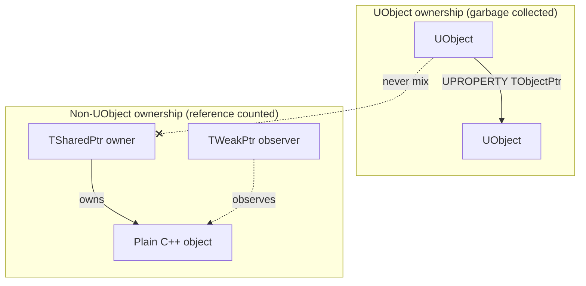

# TSharedPtr, TWeakPtr, and TUniquePtr for non-UObject data

Unreal has two entirely separate ownership systems, and they must never be mixed. `UObject`s are
owned through the reflection/garbage-collection machinery covered in
[Garbage collection](./garbage-collection.md). Everything else — plain C++ classes, editor tooling
types, Slate widgets, engine-internal helper objects — is owned through Unreal's own smart-pointer
family: `TSharedPtr`, `TWeakPtr`, and `TUniquePtr`. Putting a `UObject` inside a `TSharedPtr`, or a
plain C++ object inside a `UPROPERTY`, compiles without complaint and fails in ways that are hard to
trace back to the actual mistake.

## Why this matters

`TSharedPtr` is reference counting; `UObject` lifetime is reachability tracing. A `UObject` wrapped in
a `TSharedPtr` now has two owners disagreeing about when it should die — the garbage collector can
destroy it out from under the `TSharedPtr`, which never expects its managed object to disappear
without going through its own destructor call. This isn't a theoretical foot-gun; Epic's own 5.8
release notes flag exactly this pattern (a class holding a `TSharedPtr` to something that should have
been a weak reference) as a source of leaks that needed fixing in engine code.

## Mental model



Two independent systems, two independent sets of rules. The dividing line is simple: does the type
derive from `UObject`? If yes, ownership is `UPROPERTY`/GC. If no, ownership is
`TSharedPtr`/`TUniquePtr`.

## The mechanics

### TSharedPtr and TWeakPtr — shared, reference-counted ownership

`TSharedPtr<T>` is Unreal's analogue of `std::shared_ptr`: any number of `TSharedPtr` instances can
share ownership of an object, which is destroyed when the last one goes away. `TWeakPtr<T>` observes
without contributing to the reference count, and must be resolved with `Pin()` before use.

```cpp title="Shared ownership of a non-UObject type"
class FInventorySnapshot
{
public:
    TArray<FName> ItemIds;
};

TSharedPtr<FInventorySnapshot> Snapshot = MakeShared<FInventorySnapshot>();
TSharedPtr<FInventorySnapshot> Alias = Snapshot; // shares ownership

TWeakPtr<FInventorySnapshot> WeakSnapshot = Snapshot;

void UseSnapshot()
{
    if (TSharedPtr<FInventorySnapshot> Pinned = WeakSnapshot.Pin())
    {
        // Pinned keeps the object alive for this scope only.
    }
}
```

Prefer `MakeShared<T>()` over `TSharedPtr<T>(new T())` — like `boost::make_shared`/`std::make_shared`,
it folds the control block and the object into a single allocation.

### TUniquePtr — exclusive ownership

`TUniquePtr<T>` is Unreal's `std::unique_ptr`: exactly one owner, moved rather than copied, destroyed
when that owner goes out of scope. Use it for a helper object with a single, clear owner and no need
to share.

```cpp title="Exclusive ownership"
TUniquePtr<FNavQueryFilter> Filter = MakeUnique<FNavQueryFilter>();
Filter->SetCost(ENavCostType::Water, 5.0f);
// Filter is destroyed automatically when it goes out of scope.
```

### enable_shared_from_this equivalent

A type that needs to hand out a `TSharedPtr` to itself derives from `TSharedFromThis<T>` and calls
`AsShared()` — the same pattern as `boost::enable_shared_from_this`/`std::enable_shared_from_this`,
under a different name.

## Gotchas

:::danger Never wrap a UObject in a TSharedPtr, and never store a plain C++ object in a UPROPERTY
A `UObject` already has an owner — the reflection/GC system. Giving it a second owner via `TSharedPtr`
creates two lifetime authorities that don't know about each other. The reverse mistake — expecting
`UPROPERTY` to manage a plain, non-reflected C++ type — simply doesn't compile, which is the safer
failure mode; the `TSharedPtr<UObject>` mistake compiles and runs until it doesn't.
:::

:::warning A TSharedPtr cycle leaks exactly like a shared_ptr cycle
Two objects holding `TSharedPtr`s to each other never reach a zero reference count. Break the cycle
by making one direction a `TWeakPtr`, same as any other reference-counted smart pointer family.
:::

:::caution Pin() before use, every time
`TWeakPtr::Pin()` can return an empty `TSharedPtr` if the target was already destroyed. Treat every
`Pin()` result as something that might be null, the same way you'd treat `TWeakObjectPtr::Get()` for a
`UObject`.
:::

## See also

- [Garbage collection](./garbage-collection.md) — the parallel, GC-based ownership system for
  `UObject`s, and why the two must never mix.
- [Delegates and events](./delegates-and-events.md) — delegate binding uses this same shared/weak
  distinction to avoid calling into destroyed objects.
- [Boost shared_ptr and weak_ptr](../../../programming/boost/03-smart-pointers-and-memory/shared-ptr.md)
  — the direct ancestor of this API, if you want the fuller `std`/Boost-side treatment.
- [Epic — Object Pointers in Unreal Engine](https://dev.epicgames.com/documentation/unreal-engine/object-pointers-in-unreal-engine)
