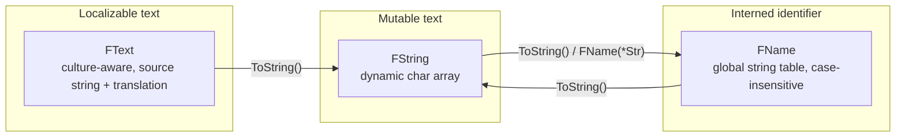

# FString, FName, and FText

Unreal doesn't use `std::string`. It has three distinct string types — `FString`, `FName`, and
`FText` — and picking the wrong one isn't just a style issue: it costs performance (hashing a
frequently-mutated identifier as `FName`), correctness (formatting user-facing text as `FString` and
losing localization), or both. Every one of these types compiles fine wherever you put it, which is
exactly why the wrong choice doesn't show up until later.

## Why this matters

The three types exist because "a string" in a game engine means three different things: text you
build and mutate at runtime (`FString`), an identifier you compare and look up constantly but rarely
construct (`FName`), and text a player actually reads, which needs localization (`FText`). Using one
type for all three either wastes cycles or breaks localization outright.

## Mental model



Conversions between the three exist, but each conversion has a cost (allocation, table lookup, or
localization resolution) — treat crossing between them as a deliberate step, not something to do in a
hot loop.

## The mechanics

### FString — general-purpose, mutable text

`FString` is a dynamic array of characters (`TArray<TCHAR>` under the hood, roughly), used for
building, parsing, and manipulating text at runtime — file paths, log messages, save-game strings you
construct programmatically.

```cpp title="Building a string"
FString Report = FString::Printf(TEXT("Player %s scored %d points"), *PlayerName, Score);
UE_LOG(LogGame, Log, TEXT("%s"), *Report);
```

Always wrap string literals in the `TEXT()` macro. It ensures the literal is the engine's native
character width instead of forcing a runtime conversion every time the line executes.

### FName — cheap identifiers, not cheap to build

`FName` represents an entry in a global, case-insensitive string table. Every unique string is stored
exactly once; an `FName` instance is really just an index into that table, so comparison is an integer
compare, not a character-by-character one. That makes `FName` excellent for socket names, tags,
row identifiers in data tables, and anything compared or looked up far more often than it's created.

```cpp title="Using FName for identifiers"
static const FName SocketName(TEXT("WeaponSocket"));

if (Mesh->DoesSocketExist(SocketName))
{
    Mesh->AttachTo(SocketName);
}
```

Constructing an `FName` from a string literal involves a table lookup (or insertion, the first time
that string is seen). That's why the Epic coding standard calls out caching `FName` construction in a
`static` rather than rebuilding it every call — building one per frame is a self-inflicted string-table
lookup you didn't need.

`FName` is also **immutable** and has no case sensitivity: `"Weapon"` and `"weapon"` are the same
`FName`. Neither of those is true of `FString`.

### FText — the only type that's safe to show a player

`FText` wraps a source string together with what's needed to resolve it to a localized, culture-aware
display string — plural rules, number/date formatting, and a live link to the localization system so
the displayed text updates if the player changes language at runtime.

```cpp title="Localizable UI text"
FText Prompt = FText::Format(
    NSLOCTEXT("MyGame", "PickupPrompt", "Press {0} to pick up {1}"),
    FText::FromString(InteractKeyName),
    ItemName
);
```

`FText` should be the type on every `UPROPERTY` and `UFUNCTION` parameter that ends up in front of a
player — widget labels, tooltips, subtitles, quest text.

## Gotchas

:::warning[FString for anything player-facing breaks localization silently]
Code compiles and works fine in English, then never gets translated because there's no `FText` to
attach a translation to. This is usually caught late, by localization QA, not by the compiler.
:::

:::warning[FName comparisons are case-insensitive]
Two `FName`s that differ only in case are equal. That's usually what you want for identifiers, but it
means `FName` is the wrong type for anything where case is meaningful data.
:::

:::caution[Don't rebuild an FName from a literal every call]
`FName(TEXT("WeaponSocket"))` inside a function that runs every frame pays a string-table lookup every
frame. Hoist it to a `static const FName` (file scope or function-local `static`) instead.
:::

:::note
Exact internal storage details of `FString` (small-buffer optimization, allocator specifics) were not
directly confirmed against 5.7 in the sources consulted — treat `FString` as "a dynamic, mutable
character buffer" rather than relying on a specific internal layout.
:::

## See also

- [Containers](./containers.md) — `TArray` is the container `FString` itself is built on.
- [Logging and assertions](./logging-and-assertions.md) — `UE_LOG` format strings expect `TEXT()` and
  `FString`/`FName` conversions, not raw `FText`.
- [Coding standard and naming](./coding-standard-and-naming.md) — the `TEXT()` and static-`FName`
  guidance in Epic's own style rules.
- [Epic — Unreal Engine Uproperties: Strings](https://dev.epicgames.com/documentation/unreal-engine/unreal-engine-uproperties)

