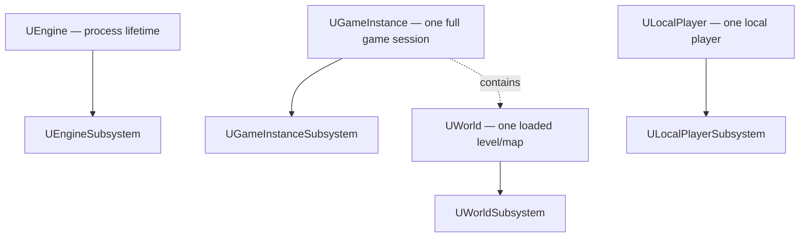

# Subsystems as Unreal's dependency-injection story

Before subsystems existed, "I need one instance of this system, reachable from anywhere" meant a
global singleton, a static `Get()`, or threading a pointer through half your codebase. Subsystems are
Unreal's built-in answer: automatically instantiated objects with a lifetime tied to a well-defined
scope — the engine process, a game instance, a world, or a local player — that you retrieve through a
typed accessor instead of a raw global.

## Why this matters

Hand-rolled singletons in Unreal are worse than in plain C++, because Unreal already has several
natural lifetime scopes (does this system live for the whole process, or reset every time a level
loads, or only exist in PIE for one of several simultaneous worlds?) and a singleton doesn't know
which one it's supposed to respect. A `static UMyManager* Instance` initialized once and never reset
will happily keep pointing at a `UWorld` that no longer exists after a level transition. Subsystems
solve this by tying instantiation and teardown to the scope you actually mean.

## Mental model



Each subsystem base class is automatically instantiated and initialized alongside its owning scope,
and destroyed when that scope ends — a `UWorldSubsystem` doesn't survive a level transition to a new
`UWorld`; a `UGameInstanceSubsystem` does, because the `UGameInstance` persists across level loads
within one play session.

## The mechanics

### Choosing a scope

| Base class | Lives as long as | Typical use |
|---|---|---|
| `UEngineSubsystem` | The engine process | Editor tooling, cross-session caches |
| `UGameInstanceSubsystem` | One game instance (a play session) | Save data, matchmaking state, persistent player progress |
| `UWorldSubsystem` | One `UWorld` | Per-level managers — spawn directors, per-map AI coordination |
| `ULocalPlayerSubsystem` | One local player | Per-player UI state, input mapping context management |

### Declaring one

```cpp title="UMatchDirectorSubsystem.h"
UCLASS()
class MYGAME_API UMatchDirectorSubsystem : public UWorldSubsystem
{
    GENERATED_BODY()

public:
    virtual void Initialize(FSubsystemCollectionBase& Collection) override;
    virtual void Deinitialize() override;

    UFUNCTION(BlueprintCallable, Category = "Match")
    void StartMatch();

private:
    UPROPERTY()
    int32 RoundNumber = 0;
};
```

`UGameInstanceSubsystem` is itself declared `UCLASS(Abstract, Within=GameInstance)` — the
`Within=GameInstance` specifier is what ties an instance to exactly one owning `UGameInstance`.
`UWorldSubsystem` is similarly `UCLASS(Abstract)`, managed per-`UWorld` by an internal subsystem
collection that calls `Initialize`/`OnWorldBeginPlay`/`Deinitialize` at the right points in that
world's lifecycle.

### Retrieving one

```cpp title="Getting a subsystem instance"
if (UGameInstance* GI = GetGameInstance())
{
    UMatchDirectorSubsystem* Director = GI->GetSubsystem<UMatchDirectorSubsystem>();
}

// From an actor, reaching a world subsystem directly:
UMatchDirectorSubsystem* Director = GetWorld()->GetSubsystem<UMatchDirectorSubsystem>();
```

No manual registration step — declaring the `UCLASS` derived from the right subsystem base is enough
for the engine to instantiate it automatically wherever its owning scope is created.

### Why this beats a singleton

A subsystem is created and destroyed with its scope, so there's no window where `Get()` returns a
stale pointer to a torn-down world, and no manual bookkeeping to reset a static on level transition.
It's also swappable in tests and PIE with multiple worlds — each `UWorld` gets its own
`UWorldSubsystem` instance, so two simultaneous PIE clients don't share state through a subsystem the
way they would through a `static`.

## Gotchas

:::warning Don't cache a subsystem pointer across a scope you don't own
Caching a `UWorldSubsystem*` in something that outlives the world (like a `UGameInstanceSubsystem`) is
exactly the stale-pointer problem subsystems are meant to avoid. Fetch it fresh, or cache it only in
something scoped at or below the subsystem's own level.
:::

:::caution Initialize/Deinitialize order across subsystems is not something to depend on
Don't assume another subsystem in the same collection is already initialized inside your own
`Initialize`. Defer cross-subsystem lookups to a point after initialization — `OnWorldBeginPlay` for
world subsystems — rather than doing them in `Initialize` itself.
:::

:::note
The exact set of subsystem base classes beyond the four listed here (there are more specialized ones
in some engine modules) was not exhaustively enumerated in the sources consulted — treat
Engine/GameInstance/World/LocalPlayer as the four you'll reach for in gameplay code, and check the 5.7
API reference before assuming a more specialized base exists for your use case.
:::

## See also

- [Garbage collection](./garbage-collection.md) — subsystems are `UObject`s and follow the same
  reflection/GC rules as everything else in this folder.
- [Interfaces](./interfaces.md) — a complementary decoupling tool at the per-object level rather than
  the per-scope level.
- [Game instance](../03-gameplay-framework/game-instance.md) — the scope a `UGameInstanceSubsystem`
  attaches to.
- [Epic — UWorldSubsystem API reference](https://dev.epicgames.com/documentation/unreal-engine/API/Runtime/Engine/UWorldSubsystem)
